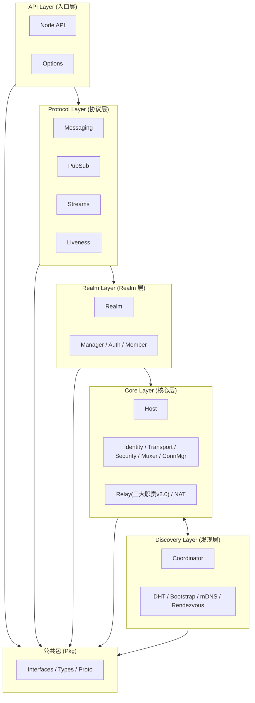

# L2: 结构设计 (Structural Design)

> **版本**: v1.1.0  
> **更新日期**: 2026-01-13  
> **层级**: L2  
> **定位**: 架构师视角：五层软件架构、依赖规则、模块划分、C4 可视化

---

## 目录结构

```
L2_structural/
├── README.md              # 本文件
├── layer_model.md         # 五层软件架构
├── dependency_rules.md    # 依赖规则
├── module_design.md       # 模块划分
├── target_structure.md    # 目标目录结构
├── implementation_order.md # 实施顺序与依赖图（新增）
└── c4/                    # C4 可视化
    ├── README.md
    ├── context.md         # 系统上下文
    ├── container.md       # 容器
    ├── component.md       # 组件
    └── code.md            # 代码结构
```

---

## 五层软件架构

DeP2P 采用**五层软件架构**，Realm 作为独立架构层突出其核心创新地位：

```
┌─────────────────────────────────────────────────────────────────────────────┐
│                      DeP2P 五层软件架构                                      │
├─────────────────────────────────────────────────────────────────────────────┤
│                                                                             │
│  1. API Layer         │ dep2p.go, node.go       │ 用户入口，配置选项       │
│  2. Protocol Layer    │ internal/protocol/      │ 用户级应用协议           │
│  3. Realm Layer       │ internal/realm/         │ 业务隔离，成员管理       │
│  4. Core Layer        │ internal/core/          │ P2P 网络核心能力         │
│  5. Discovery Layer   │ internal/discovery/     │ 节点发现服务             │
│                                                                             │
│  依赖方向：API → Protocol → Realm → Core ↔ Discovery                       │
│                                                                             │
└─────────────────────────────────────────────────────────────────────────────┘
```

---

## 架构图



---

## 层职责

| 架构层 | 代码位置 | 职责 | 协议前缀 |
|--------|----------|------|----------|
| **API Layer** | `dep2p.go`, `node.go`, `options.go` | 用户入口门面，配置选项 | - |
| **Protocol Layer** | `internal/protocol/` | 用户级应用协议 | `/dep2p/app/<realmID>/*` |
| **Realm Layer** | `internal/realm/` | 业务隔离，成员管理 | `/dep2p/realm/<realmID>/*` |
| **Core Layer** | `internal/core/` | P2P 网络核心能力 | `/dep2p/sys/*` |
| **Discovery Layer** | `internal/discovery/` | 节点发现服务 | - |
| **公共包** | `pkg/` | 公共类型、接口、协议定义 | - |

---

## 核心依赖规则

1. **层间向下依赖**：`API → Protocol → Realm → Core ↔ Discovery`
2. **同层通过接口**：同层组件通过 `pkg/interfaces/` 交互
3. **禁止循环依赖**：任何循环依赖都是架构 Bug
4. **Pkg 无内部依赖**：`pkg/` 不能依赖 `internal/`
5. **日志/指标直接使用**：使用 `log/slog` 和 `prometheus`，不抽象接口

详细依赖规则参见 [dependency_rules.md](dependency_rules.md)。

---

## 模块清单

### API Layer

| 模块 | 代码位置 | 职责 |
|------|----------|------|
| **Node** | `dep2p.go`, `node.go` | 节点入口门面 |
| **Options** | `options.go` | 配置选项 |

### Protocol Layer

| 模块 | 代码位置 | 职责 |
|------|----------|------|
| **Messaging** | `internal/protocol/messaging/` | 点对点消息 |
| **PubSub** | `internal/protocol/pubsub/` | 发布订阅 |
| **Streams** | `internal/protocol/streams/` | 双向流 |
| **Liveness** | `internal/protocol/liveness/` | 存活检测 |

### Realm Layer

| 模块 | 代码位置 | 职责 |
|------|----------|------|
| **Realm** | `internal/realm/` | 业务隔离域 |
| **Manager** | `internal/realm/manager/` | Realm 生命周期管理 |
| **Auth** | `internal/realm/auth/` | PSK 成员认证 |
| **Member** | `internal/realm/member/` | 成员管理 |

### Core Layer

| 模块 | 代码位置 | 职责 |
|------|----------|------|
| **Host** | `internal/core/host/` | 网络主机 |
| **Identity** | `internal/core/identity/` | 身份管理、NodeID |
| **Transport** | `internal/core/transport/` | QUIC/TCP 传输 |
| **Security** | `internal/core/security/` | TLS/Noise 安全 |
| **Muxer** | `internal/core/muxer/` | 多路复用 |
| **ConnMgr** | `internal/core/connmgr/` | 连接管理 |
| **★ Relay** | `internal/core/relay/` | 统一中继（三大职责 v2.0: 缓存加速+信令+保底） |
| **★ AddressBook** | `internal/core/relay/addressbook/` | 地址簿（缓存加速层，非权威目录） |
| **NAT** | `internal/core/nat/` | NAT 穿透（外部地址发现 + 打洞） |

### Discovery Layer

| 模块 | 代码位置 | 职责 |
|------|----------|------|
| **Coordinator** | `internal/discovery/coordinator/` | 发现协调 |
| **DHT** | `internal/discovery/dht/` | Kademlia DHT |
| **Bootstrap** | `internal/discovery/bootstrap/` | 引导节点发现 |
| **mDNS** | `internal/discovery/mdns/` | 局域网发现 |
| **Rendezvous** | `internal/discovery/rendezvous/` | 命名空间发现 |

---

## C4 模型

C4 模型提供四个层次的架构视图：

| 层次 | 文档 | 说明 |
|------|------|------|
| Context | [c4/context.md](c4/context.md) | 系统与外部的交互 |
| Container | [c4/container.md](c4/container.md) | 主要容器和职责 |
| Component | [c4/component.md](c4/component.md) | 内部组件结构 |
| Code | [c4/code.md](c4/code.md) | 代码级别的结构 |

---

## 相关文档

| 文档 | 说明 |
|------|------|
| [layer_model.md](layer_model.md) | 五层软件架构详解 |
| [module_design.md](module_design.md) | 模块划分 |
| [dependency_rules.md](dependency_rules.md) | 依赖规则详解 |
| [target_structure.md](target_structure.md) | 目标目录结构 |
| [implementation_order.md](implementation_order.md) | 实施顺序与依赖图 |
| [../L1_overview/](../L1_overview/) | L1 系统概览 |
| [../L3_behavioral/](../L3_behavioral/) | L3 行为设计 |

---

**最后更新**：2026-01-23
