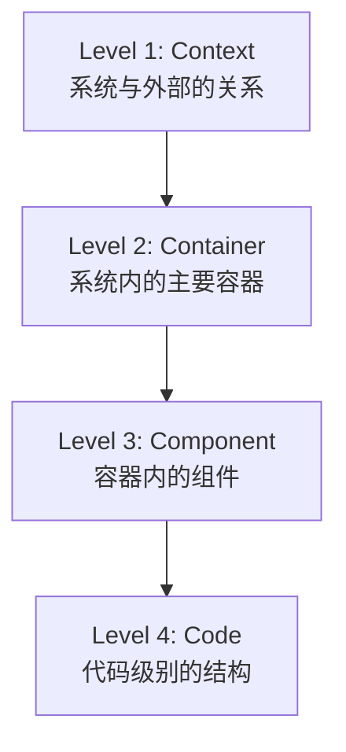
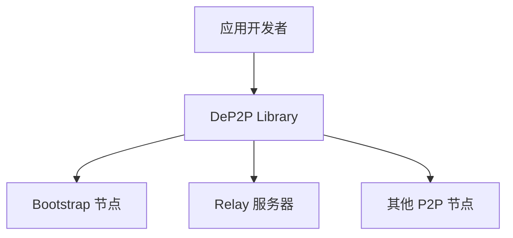
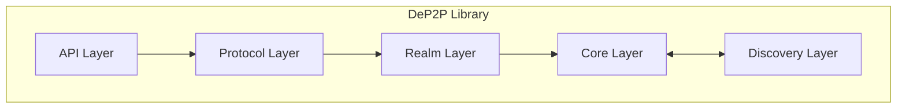
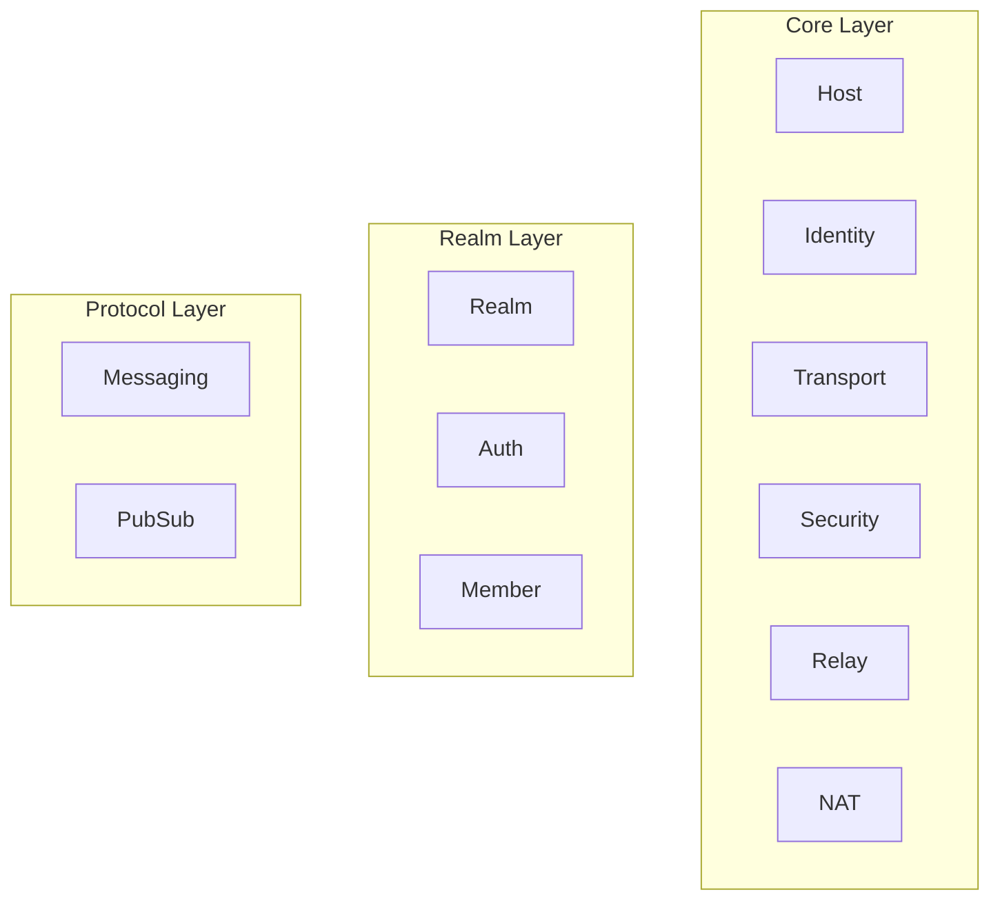

# C4 可视化 (C4 Model)

> 使用 C4 模型从四个层次可视化 DeP2P 架构

---

## C4 模型简介

C4 模型是一种软件架构可视化方法，提供四个抽象层次：



| 层次 | 视角 | 适用读者 |
|------|------|----------|
| **Context** | 系统在世界中的位置 | 管理层、业务方 |
| **Container** | 系统内的主要部分 | 架构师、技术负责人 |
| **Component** | 容器内的组件 | 开发者 |
| **Code** | 代码结构 | 模块开发者 |

---

## 文档索引

| 文档 | 层次 | 内容 |
|------|------|------|
| [context.md](context.md) | Level 1 | 系统上下文图 |
| [container.md](container.md) | Level 2 | 容器图 |
| [component.md](component.md) | Level 3 | 组件图 |
| [code.md](code.md) | Level 4 | 代码结构图 |

---

## 快速预览

### Level 1: 系统上下文



### Level 2: 容器



### Level 3: 组件



### Level 4: 代码

```
internal/realm/
├── module.go
├── interfaces/
│   └── realm.go
├── manager/
├── auth/
└── member/
```

---

## 阅读建议

| 读者角色 | 推荐阅读 |
|----------|----------|
| 管理层/业务方 | [context.md](context.md) |
| 架构师 | [container.md](container.md), [component.md](component.md) |
| 开发者 | [component.md](component.md), [code.md](code.md) |

---

## 相关文档

| 文档 | 说明 |
|------|------|
| [../layer_model.md](../layer_model.md) | 分层模型 |
| [../module_design.md](../module_design.md) | 模块划分 |
| [../../L1_overview/](../../L1_overview/) | 系统概览 |

---

**最后更新**：2026-01-13
