# C4 Level 3: 组件 (Component)

> 各域内部的组件结构和依赖关系

---

## 组件全景图

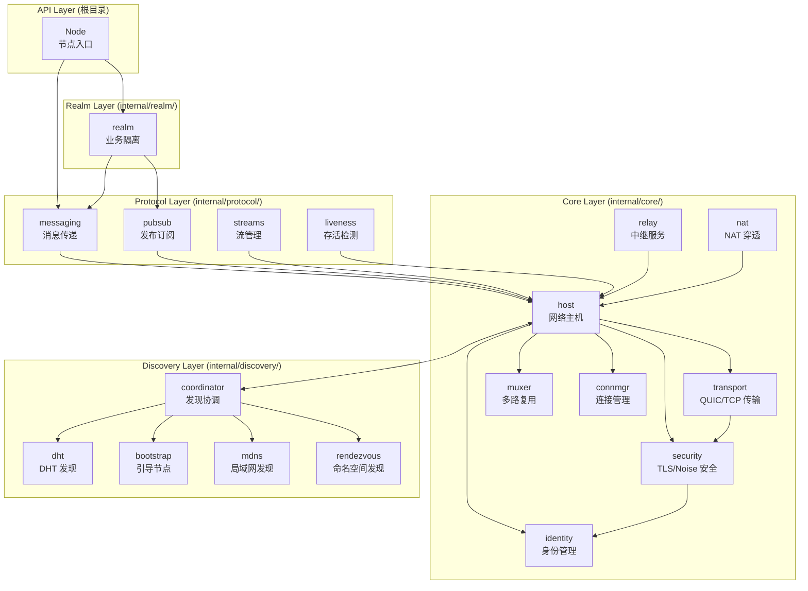

---

## Core 核心域组件

### identity - 身份管理

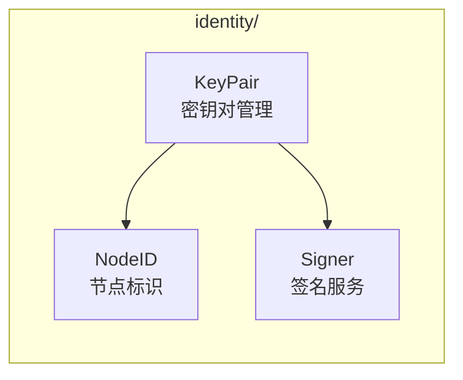

| 组件 | 职责 |
|------|------|
| **KeyPair** | Ed25519 密钥对生成和管理 |
| **NodeID** | NodeID = SHA256(公钥) |
| **Signer** | 消息签名和验证 |

### transport - 传输层

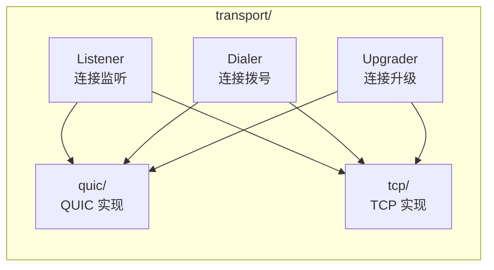

| 组件 | 职责 |
|------|------|
| **QUIC** | quic-go 封装 |
| **TCP** | TCP 传输封装 |
| **Listener** | 监听传入连接 |
| **Dialer** | 主动拨号连接 |
| **Upgrader** | 协议升级 |

### security - 安全握手

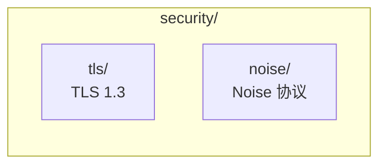

| 组件 | 职责 |
|------|------|
| **TLS** | TLS 1.3 握手，证书绑定 NodeID |
| **Noise** | Noise 协议握手 |

### muxer - 多路复用

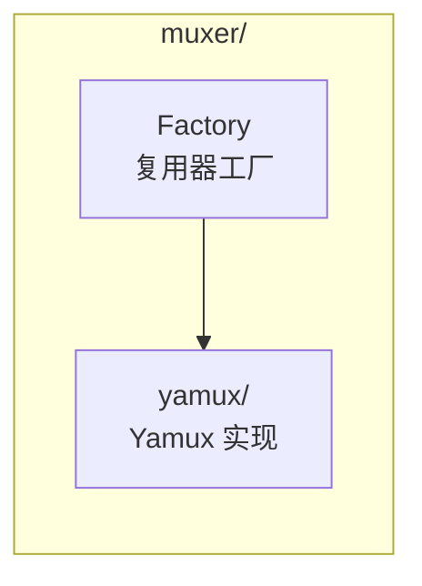

### connmgr - 连接管理

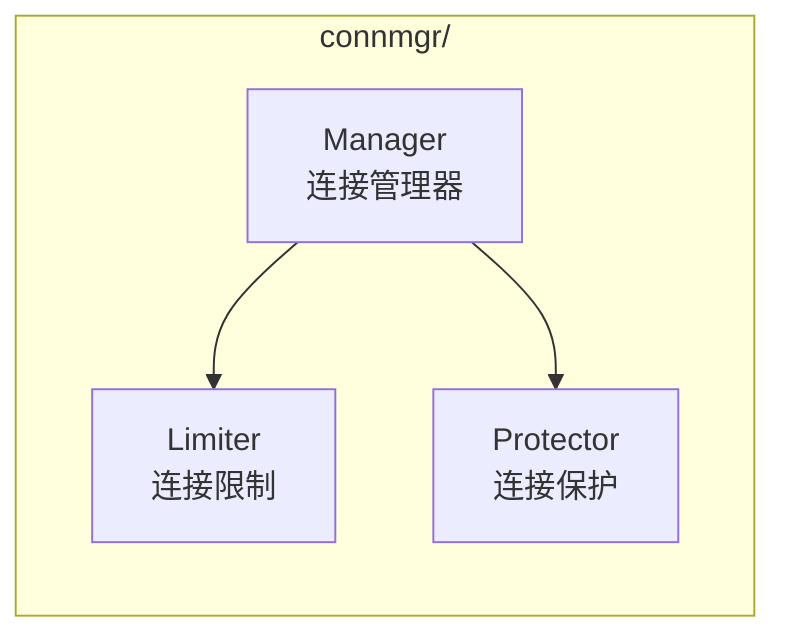

| 组件 | 职责 |
|------|------|
| **Manager** | 连接池管理 |
| **Limiter** | 连接数限制 |
| **Protector** | 连接保护（Protect/Unprotect） |

### relay - 中继服务（v2.0 更新）

> **v2.0 核心变化**：DHT 是权威目录，Relay 地址簿是缓存加速层

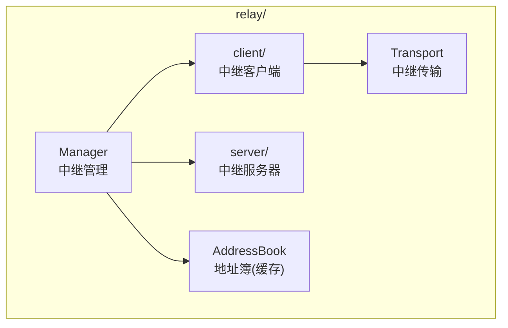

| 组件 | 职责 |
|------|------|
| **Client** | 请求中继连接 |
| **Server** | 提供中继服务 |
| **Manager** | 管理可用中继 |
| **Transport** | 中继传输封装 |
| **AddressBook** | 地址簿（缓存加速层，非权威目录） |

**Relay 三大职责 (v2.0)**：
1. **缓存加速层**：维护地址簿，作为 DHT 本地缓存（非权威）
2. **打洞协调信令**：提供打洞协调的信令通道
3. **数据通信保底**：直连/打洞失败时转发数据

### nat - NAT 穿透

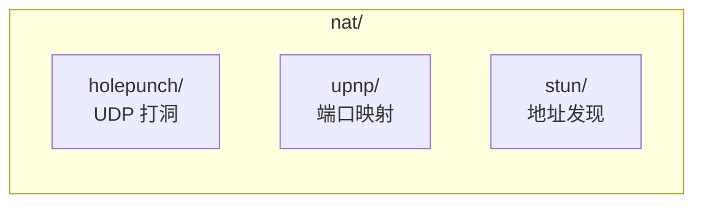

| 组件 | 职责 |
|------|------|
| **Holepunch** | UDP 打洞协调 |
| **UPnP** | UPnP/NAT-PMP 端口映射 |
| **STUN** | 公网地址发现 |

---

## Discovery 发现域组件

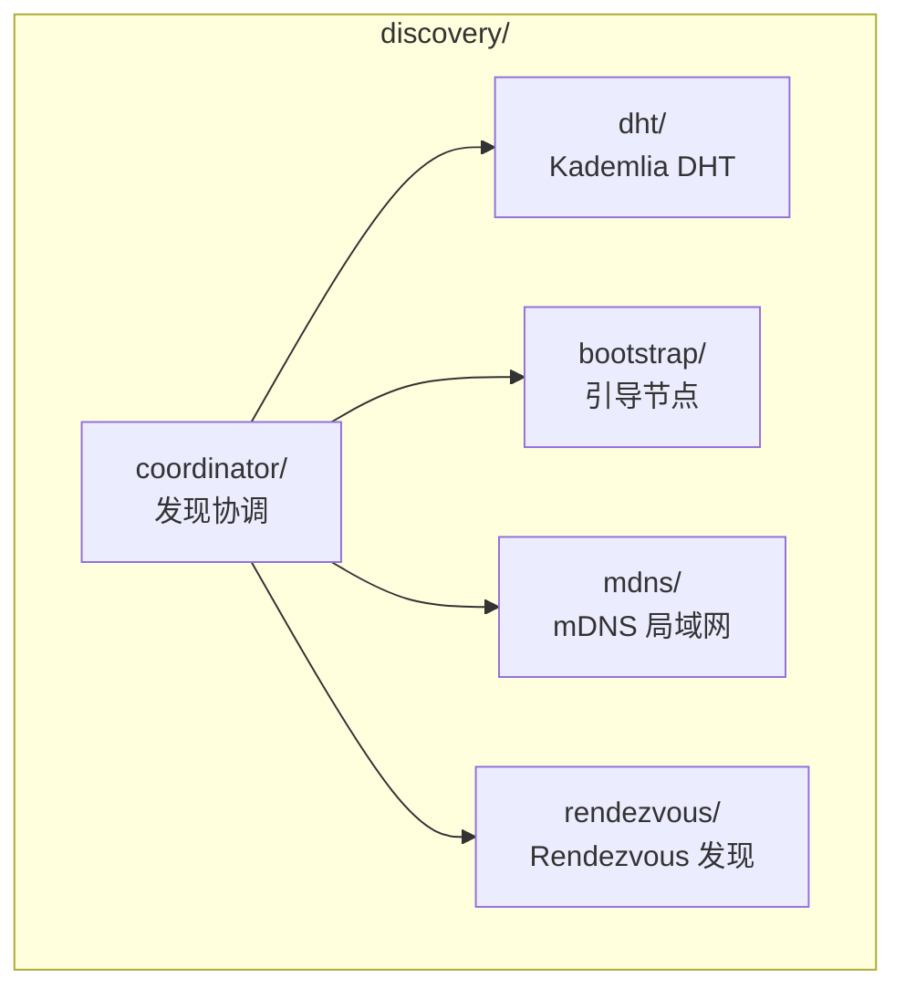

| 组件 | 职责 |
|------|------|
| **Coordinator** | 统一调度各发现方式 |
| **DHT** | Kademlia 分布式哈希表 |
| **mDNS** | 局域网多播发现 |
| **Bootstrap** | 初始节点连接 |
| **Rendezvous** | 命名空间发现 |

---

## Realm Layer 组件

### realm - Realm 管理

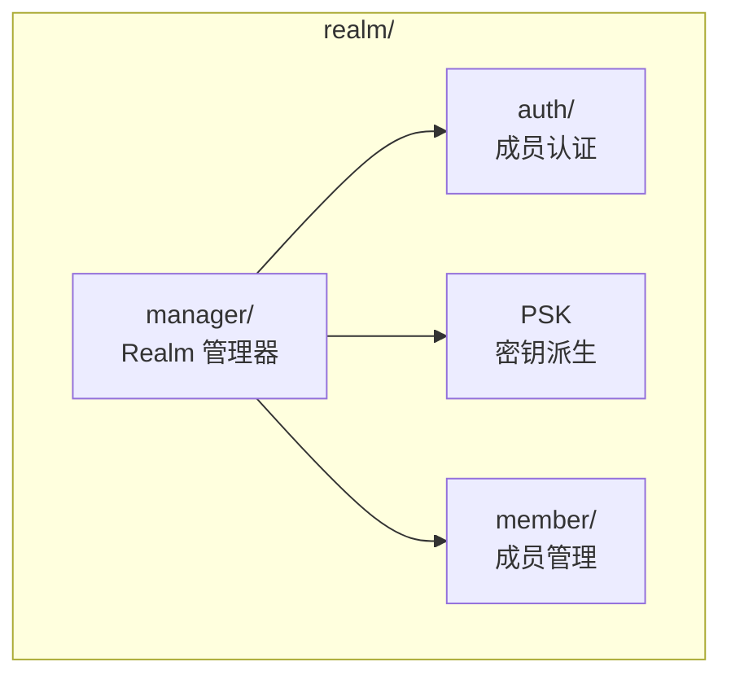

| 组件 | 职责 |
|------|------|
| **Manager** | Realm 生命周期管理 |
| **Auth** | PSK 成员认证 |
| **PSK** | RealmID 和 RealmKey 派生 |
| **Member** | 成员列表缓存 |

---

## Protocol Layer 组件

### messaging - 消息传递

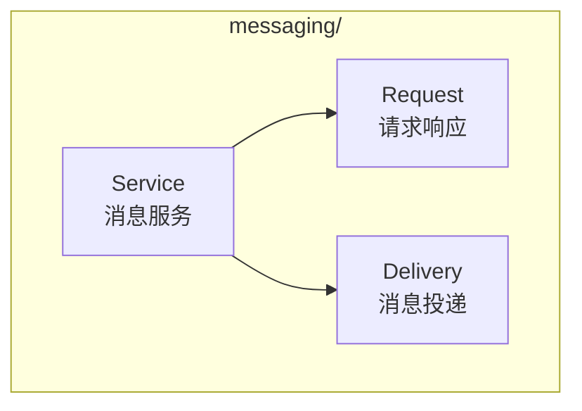

### pubsub - 发布订阅

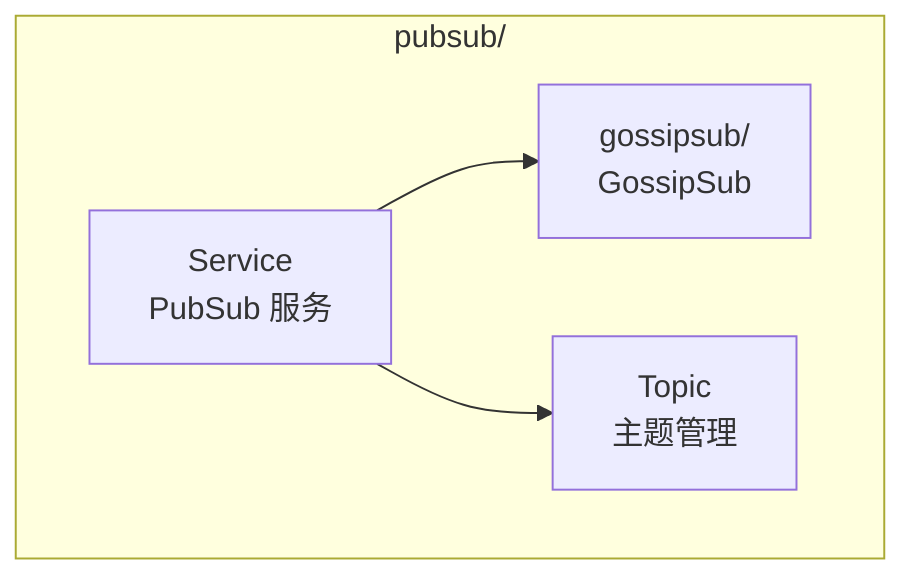

| 组件 | 职责 |
|------|------|
| **Service** | 发布订阅 API |
| **GossipSub** | GossipSub 协议实现 |
| **Topic** | 主题管理和消息投递 |

---

## 组件依赖矩阵

| 组件 | 依赖的组件 |
|------|-----------|
| **identity** | pkg/types |
| **transport** | identity, security |
| **security** | identity |
| **muxer** | - |
| **connmgr** | - |
| **host** | transport, security, muxer, connmgr, identity |
| **coordinator** | host, dht, bootstrap, mdns, rendezvous |
| **dht** | host |
| **bootstrap** | host |
| **mdns** | - |
| **rendezvous** | host |
| **relay** | host |
| **nat** | host, relay |
| **realm** | host, messaging |
| **messaging** | host |

---

## 组件通信方式

```
组件间通信原则：

  1. 通过 pkg/interfaces/ 定义的接口
  2. 通过 Fx 依赖注入
  3. 禁止直接 import 其他组件的内部包
```

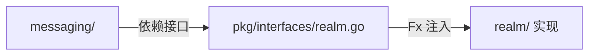

---

## 相关文档

| 文档 | 说明 |
|------|------|
| [container.md](container.md) | 容器图 |
| [code.md](code.md) | 代码结构 |
| [../module_design.md](../module_design.md) | 模块划分 |

---

**最后更新**：2026-01-24（v2.0 DHT 权威模型对齐）
