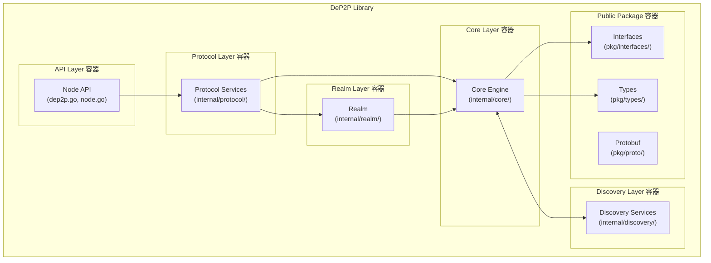
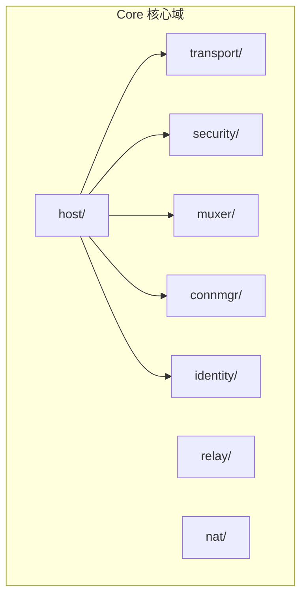
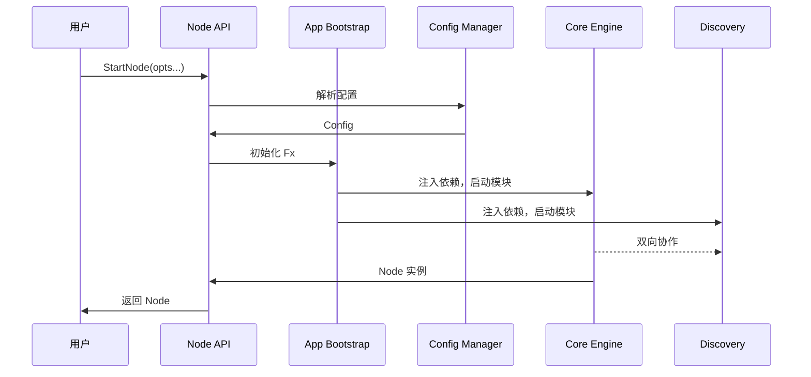
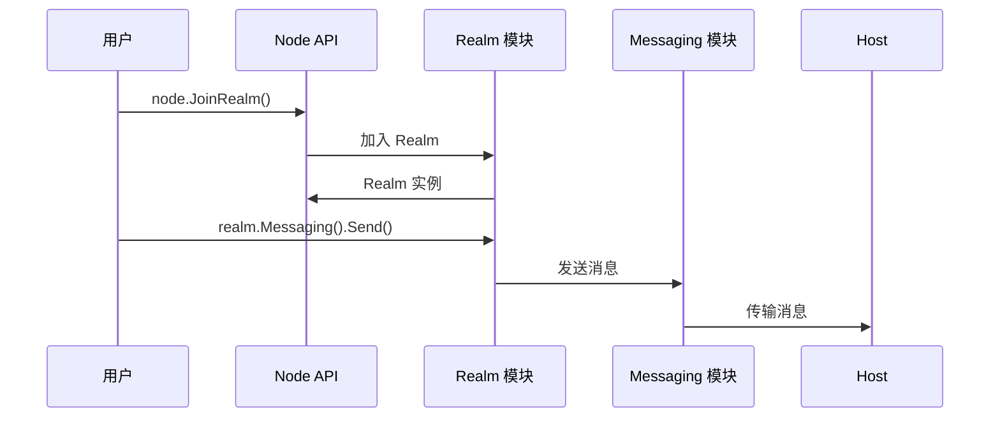

# C4 Level 2: 容器 (Container)

> DeP2P 内部的主要容器和职责划分

---

## 容器图



---

## 容器详解

### API 容器

| 属性 | 说明 |
|------|------|
| **位置** | `node.go`, `options.go`, `config.go`, `presets.go` |
| **职责** | 对外 API 入口 |
| **技术** | Go 公共 API |

```
┌─────────────────────────────────────────────────────────────────────────────┐
│                              API 容器                                        │
├─────────────────────────────────────────────────────────────────────────────┤
│                                                                             │
│  入口文件：                                                                  │
│  • node.go      - Node 结构体和方法                                         │
│  • options.go   - Option 模式配置                                           │
│  • config.go    - 配置结构定义                                              │
│  • presets.go   - 预设配置                                                  │
│  • errors.go    - 错误定义                                                  │
│                                                                             │
│  主要 API：                                                                  │
│  • StartNode(opts...) → Node                                               │
│  • Node.JoinRealm(name, psk) → Realm                                       │
│  • Realm.Messaging() → Messaging                                           │
│  • Realm.PubSub() → PubSub                                                 │
│                                                                             │
└─────────────────────────────────────────────────────────────────────────────┘
```

### Protocol Layer 容器

| 属性 | 说明 |
|------|------|
| **位置** | `internal/protocol/` |
| **职责** | 面向应用开发者的 API 层 |
| **技术** | Go 模块化设计、Fx 依赖注入 |

```
┌─────────────────────────────────────────────────────────────────────────────┐
│                        Protocol Layer 容器                                    │
├─────────────────────────────────────────────────────────────────────────────┤
│                                                                             │
│  组件：                                                                      │
│  • node/        - 节点入口门面                                               │
│  • messaging/   - 点对点消息服务                                             │
│  • pubsub/      - 发布订阅服务                                               │
│  • streams/     - 流管理                                                    │
│  • liveness/    - 存活检测                                                  │
│                                                                             │
│  职责：                                                                      │
│  • 提供用户直接使用的 API                                                    │
│  • 封装 Core 和 Biz 的复杂性                                                 │
│  • 提供简洁的编程接口                                                        │
│                                                                             │
└─────────────────────────────────────────────────────────────────────────────┘
```

### Realm Layer 容器

| 属性 | 说明 |
|------|------|
| **位置** | `internal/realm/` |
| **职责** | 业务隔离与成员管理 |
| **技术** | Go 模块化设计、Fx 依赖注入 |

```
┌─────────────────────────────────────────────────────────────────────────────┐
│                         Realm Layer 容器                                      │
├─────────────────────────────────────────────────────────────────────────────┤
│                                                                             │
│  组件：                                                                      │
│  • realm/       - Realm 管理                                                │
│    ├─ manager/    - 生命周期管理                                            │
│    ├─ auth/       - PSK 认证                                                │
│    └─ member/     - 成员管理                                                │
│                                                                             │
│  职责：                                                                      │
│  • Realm 业务隔离                                                           │
│  • PSK 成员认证                                                             │
│  • 成员管理和缓存                                                           │
│                                                                             │
└─────────────────────────────────────────────────────────────────────────────┘
```

### Core 核心域容器

| 属性 | 说明 |
|------|------|
| **位置** | `internal/core/` |
| **职责** | P2P 网络核心能力实现 |
| **技术** | Go 模块化设计、Fx 依赖注入 |



```
核心能力：

  • host/        - 网络主机（组装各协议）
  • identity/    - 密钥和 NodeID 管理
  • transport/   - QUIC/TCP 传输
  • security/    - TLS/Noise 安全
  • muxer/       - 流多路复用
  • connmgr/     - 连接管理
  • relay/       - ★ 统一中继（三大职责 v2.0: 缓存加速+信令+保底）
  • nat/         - NAT 穿透（外部地址发现 + 打洞）

★ NAT 与 Relay 职责边界：
  • NAT: 外部地址发现/打洞/映射（打洞需要信令通道）
  • Relay: 缓存加速层 + 打洞协调信令 + 数据通信保底（DHT 是权威目录）
```

### Discovery 发现域容器

| 属性 | 说明 |
|------|------|
| **位置** | `internal/discovery/` |
| **职责** | 节点发现与广播 |
| **技术** | Go 模块化设计、Fx 依赖注入 |

```
┌─────────────────────────────────────────────────────────────────────────────┐
│                       Discovery 发现域容器                                    │
├─────────────────────────────────────────────────────────────────────────────┤
│                                                                             │
│  组件：                                                                      │
│  • coordinator/  - 发现协调（统一调度）                                      │
│  • dht/          - DHT 发现（Kademlia）                                     │
│  • bootstrap/    - 引导节点发现                                              │
│  • mdns/         - 局域网发现                                               │
│  • rendezvous/   - 命名空间发现                                              │
│                                                                             │
│  职责：                                                                      │
│  • 节点发现和广播                                                            │
│  • 多种发现方式的协调                                                        │
│  • 与 Core 双向协作                                                         │
│                                                                             │
└─────────────────────────────────────────────────────────────────────────────┘
```

### Public Package 容器

| 属性 | 说明 |
|------|------|
| **位置** | `pkg/` |
| **职责** | 公共类型和接口 |
| **技术** | Go 接口、Protobuf |

```
┌─────────────────────────────────────────────────────────────────────────────┐
│                        Public Package 容器                                   │
├─────────────────────────────────────────────────────────────────────────────┤
│                                                                             │
│  Interfaces (pkg/interfaces/):                                              │
│  • 按域前缀命名（app_*.go, biz_*.go, core_*.go, discovery_*.go）            │
│                                                                             │
│  Types (pkg/types/):                                                        │
│  • NodeID, RealmID, PSK                                                    │
│  • Multiaddr, Address                                                      │
│  • 枚举和常量                                                               │
│                                                                             │
│  Proto (pkg/proto/):                                                        │
│  • gossipsub.proto                                                          │
│  • key.proto                                                                │
│  • peer.proto                                                               │
│  • rendezvous.proto                                                         │
│                                                                             │
│  ProtocolIDs (pkg/protocolids/):                                            │
│  • 系统协议 ID 常量                                                          │
│  • 应用协议 ID 生成                                                          │
│                                                                             │
└─────────────────────────────────────────────────────────────────────────────┘
```

---

## 容器交互

### 启动流程



### 运行时交互



---

## 容器职责边界

| 容器 | 负责 | 不负责 |
|------|------|--------|
| **API** | 公共接口、配置入口 | 具体实现逻辑 |
| **App** | 用户 API、服务封装 | P2P 协议细节 |
| **Biz** | 业务隔离、成员管理 | 网络传输 |
| **Core** | P2P 网络核心能力 | 配置解析、业务逻辑 |
| **Discovery** | 节点发现与广播 | 消息传递、业务隔离 |
| **Public Package** | 类型、接口定义 | 实现逻辑 |

---

## 五层架构依赖关系

```
┌─────────────────────────────────────────────────────────────────────────────┐
│                          依赖关系                                            │
├─────────────────────────────────────────────────────────────────────────────┤
│                                                                             │
│                     API                                                     │
│                     ↓                                                       │
│                  Protocol                                                   │
│                     ↓                                                       │
│                   Realm                                                     │
│                     ↓                                                       │
│                   Core  ←───→  Discovery                                    │
│                                                                             │
│  ═══════════════════════════════════════════════════════════════════════    │
│                                                                             │
│  规则：                                                                      │
│  • API → Protocol → Realm → Core（上层依赖下层）                            │
│  • Core ↔ Discovery（双向协作）                                              │
│  • 禁止 Realm → Protocol、Core → Realm 等反向依赖                           │
│  • 所有域可依赖 pkg/*（公共包）                                              │
│                                                                             │
└─────────────────────────────────────────────────────────────────────────────┘
```

---

## 相关文档

| 文档 | 说明 |
|------|------|
| [context.md](context.md) | 系统上下文 |
| [component.md](component.md) | 组件图 |
| [../layer_model.md](../layer_model.md) | 域模型 |

---

**最后更新**：2026-01-23
