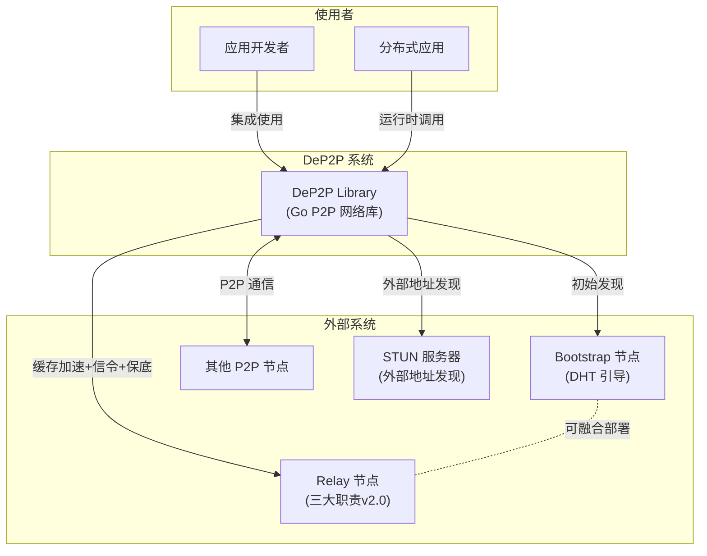
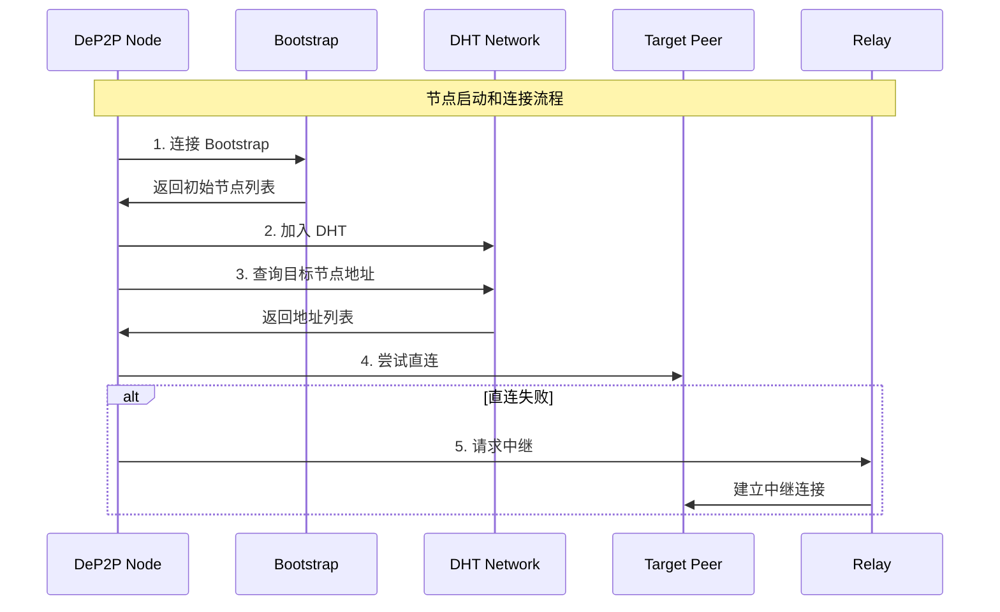

# C4 Level 1: 系统上下文 (System Context)

> DeP2P 与外部系统和用户的交互关系

---

## 系统上下文图



---

## 参与者说明

### 使用者

| 参与者 | 类型 | 说明 |
|--------|------|------|
| **应用开发者** | 人员 | 使用 DeP2P 库构建分布式应用 |
| **分布式应用** | 系统 | 集成 DeP2P 的应用程序 |

### DeP2P 系统

```
┌─────────────────────────────────────────────────────────────────────────────┐
│                              DeP2P Library                                   │
├─────────────────────────────────────────────────────────────────────────────┤
│                                                                             │
│  定位：Go 语言实现的 P2P 网络库                                              │
│                                                                             │
│  核心能力：                                                                  │
│  • 身份管理（NodeID = 公钥哈希）                                             │
│  • 安全传输（QUIC + TLS 1.3）                                               │
│  • 节点发现（DHT + mDNS + Bootstrap）                                       │
│  • NAT 穿透（打洞 + UPnP + Relay）                                          │
│  • 业务隔离（Realm + PSK）                                                  │
│  • 消息传递（Request/Response + PubSub）                                    │
│                                                                             │
└─────────────────────────────────────────────────────────────────────────────┘
```

### 外部系统

| 系统 | 类型 | 职责 | 必需性 |
|------|------|------|--------|
| **Bootstrap 节点** | 服务 | DHT 引导，初始节点发现 | 必需 |
| **Relay 节点** | 服务 | 三大职责 (v2.0): 缓存加速层 + 打洞协调信令 + 数据通信保底 | 可选 |
| **其他 P2P 节点** | 节点 | 网络中的其他参与者 | - |
| **STUN 服务器** | 服务 | 外部地址发现（知道自己在公网的地址） | 可选 |

> 注：Bootstrap 和 Relay 可融合部署到同一节点（推荐）

---

## 交互关系

### 应用开发者 → DeP2P

```
// 典型使用流程

// 1. 启动节点
node, err := dep2p.StartNode(opts...)

// 2. 加入 Realm
realm, err := node.JoinRealmWithKey("myapp", psk)

// 3. 使用服务
realm.Messaging().Send(target, data)
realm.PubSub().Publish("events", event)

// 4. 关闭
realm.Leave()
node.Close()
```

### DeP2P ↔ 外部系统



---

## 数据流

### ★ NAT 三层能力（概念区分）

```
┌─────────────────────────────────────────────────────────────────────────────┐
│  外部地址发现、打洞、中继是三个【不同目的】的能力                              │
├─────────────────────────────────────────────────────────────────────────────┤
│                                                                             │
│  1. 外部地址发现（知道自己在哪）                                              │
│     • STUN 查询、观察地址收集                                                │
│     • 知道地址 ≠ 能被连接                                                   │
│                                                                             │
│  2. 打洞（建立直连）                                                         │
│     • ★ 需要信令通道协调（通常由 Relay 连接提供）                            │
│     • 成功则获得直连通道                                                    │
│                                                                             │
│  3. 中继（兜底通信）                                                         │
│     • 直连和打洞都失败时，数据经第三方转发                                   │
│     • 确保总是可达                                                          │
│                                                                             │
└─────────────────────────────────────────────────────────────────────────────┘
```

### 连接流程（惰性中继策略）

```
  Node A ──────────────────────────────────────── Node B
           │                                  │
           │  1. 直连 ← 优先                   │
           │◄────────────────────────────────►│
           │                                  │
           │  2. 直连失败，通过 Relay 连接      │
           │     + 打洞升级（需信令通道）       │
           │                                  │
           └────► Relay ──────────────────────┘
                    │
                    │  3. 打洞成功后保留 Relay 作为备份
                    │
           ◄════════╪════════════════════════►
                 直连通道 + Relay 备份
```

### Relay 三大职责 (v2.0)

> **v2.0 核心变化**：DHT 是权威目录，Relay 地址簿是缓存加速层

```
  ★ v2.0 三层架构（DHT 权威模型）：
  Layer 1: DHT（★ 权威目录）— 存储签名 PeerRecord
  Layer 2: 缓存加速层 — Peerstore / MemberList / Relay 地址簿
  Layer 3: 连接策略 — 直连 → 打洞 → Relay 兜底

  ┌─────────────────────────────────────────────────────────────────────────┐
  │  职责一：缓存加速层（非权威目录）                                          │
  │  Alice ──[查询地址]──▶ DHT（权威）/Relay 地址簿（缓存）                   │
  │                                                                         │
  │  职责二：打洞协调信令                                                     │
  │  Alice ──[打洞请求]──▶ Relay ──[转发]──▶ Bob                            │
  │                                                                         │
  │  职责三：数据通信保底                                                     │
  │  Alice ─────────[Relay 转发]───────── Bob                               │
  └─────────────────────────────────────────────────────────────────────────┘
```

---

## 安全边界

```
┌─────────────────────────────────────────────────────────────────────────────┐
│                             安全边界                                         │
├─────────────────────────────────────────────────────────────────────────────┤
│                                                                             │
│  边界 1: 节点身份                                                            │
│  ─────────────────                                                          │
│  每个连接必须验证 NodeID（INV-001）                                          │
│                                                                             │
│  边界 2: Realm 成员                                                          │
│  ─────────────────                                                          │
│  业务 API 需要 Realm 成员资格（INV-002）                                     │
│                                                                             │
│  边界 3: 连接优先级与 Relay 保留                                             │
│  ─────────────────────────────                                              │
│  直连 → 打洞 → Relay，打洞成功后保留 Relay 作为备份（INV-003）               │
│                                                                             │
└─────────────────────────────────────────────────────────────────────────────┘
```

---

## 相关文档

| 文档 | 说明 |
|------|------|
| [container.md](container.md) | 容器图 |
| [../../L1_overview/system_boundary.md](../../L1_overview/system_boundary.md) | 系统边界详解 |
| [../../L1_overview/positioning.md](../../L1_overview/positioning.md) | 系统定位 |

---

**最后更新**：2026-01-23
