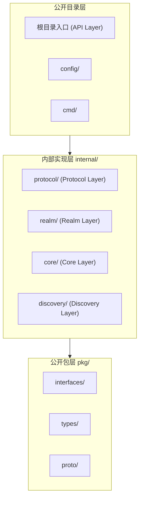
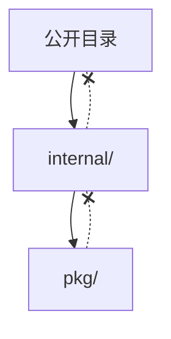
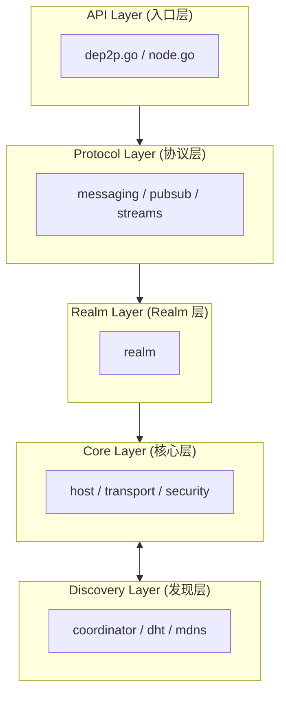
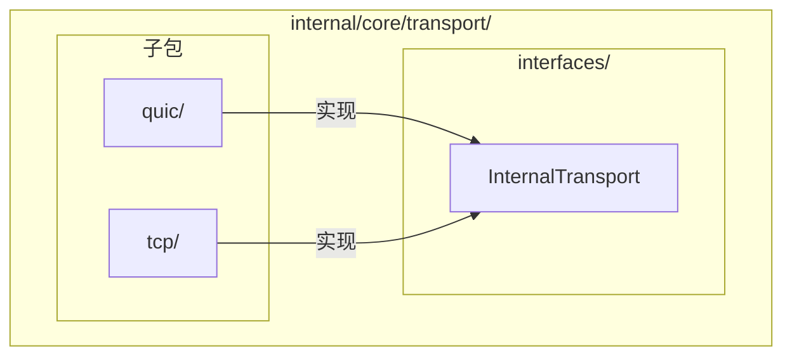
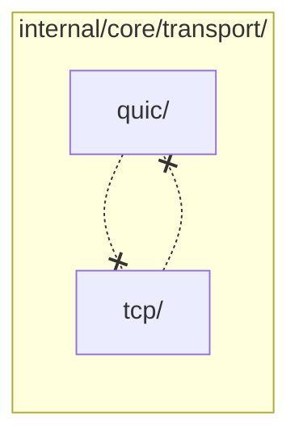
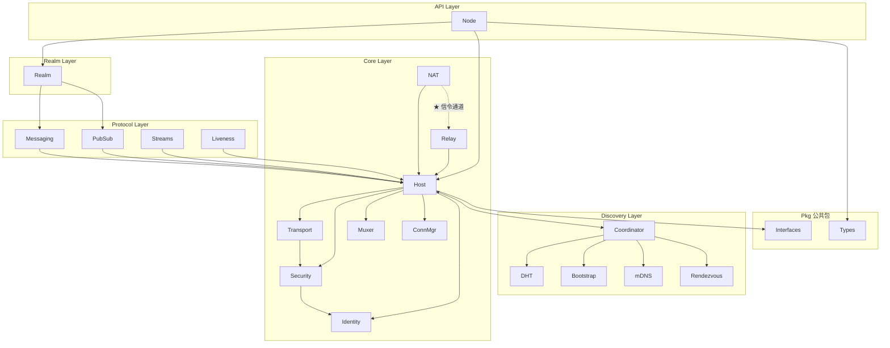

# 依赖规则 (Dependency Rules)

> **版本**: v1.2.0  
> **更新日期**: 2026-01-23  
> **定位**: DeP2P 五层架构的依赖管理规范

---

## 一、概述

本文档定义 DeP2P 的依赖规则，确保模块间的松耦合和依赖方向正确。

### 1.1 五层软件架构与依赖



| 目录层 | 包含内容 | 可见性 |
|--------|----------|--------|
| **公开目录** | 根目录入口 (API Layer)、config/、cmd/ | 用户可见 |
| **公开包** | pkg/interfaces/、pkg/types/、pkg/proto/ | 外部可导入 |
| **内部实现** | internal/protocol/、realm/、core/、discovery/ | 内部使用 |

---

## 二、9 条依赖规则

### 规则总览

| 规则 | 说明 |
|------|------|
| **R1** | 三层向下依赖：公开目录 → internal → pkg |
| **R2** | 五层依赖：API → Protocol → Realm → Core ↔ Discovery |
| **R3** | 接口隔离：组件间通过 pkg/interfaces/ 交互 |
| **R4** | Pkg 纯净：pkg/* 禁止导入 internal/* |
| **R5** | 禁止循环依赖 |
| **R6** | 日志/指标直接使用 |
| **R7** | 配置独立于五层 |
| **R8** | 组件内部子包依赖内部接口 |
| **R9** | 禁止组件内部子包直接依赖其他子包实现 |

---

### R1: 三层向下依赖

**说明**: 公开目录可以依赖内部实现，内部实现依赖公开包，禁止反向。



**正例**:
```pseudocode
// 根目录 node.go 依赖 internal
import "internal/protocol/messaging"
```

**反例**:
```pseudocode
// ❌ pkg 不能依赖 internal
// pkg/types/xxx.go
import "internal/core/host"  // 错误!
```

---

### R2: 五层依赖

**说明**: 上层可以依赖下层，Core 与 Discovery 双向协作。

```
允许的依赖方向：

  ✅ 根目录 (API Layer) → internal/protocol/
  ✅ internal/protocol/messaging/ → internal/realm/
  ✅ internal/realm/ → internal/core/host/
  ✅ internal/core/host/ → internal/discovery/coordinator/
  ✅ internal/discovery/dht/ → internal/core/host/ (双向协作)

禁止的依赖方向：

  ❌ internal/core/* → internal/realm/*
  ❌ internal/realm/* → internal/protocol/*
  ❌ internal/discovery/* → internal/protocol/*
```

**依赖方向图**:



---

### R3: 接口隔离

**说明**: 同域组件通过 pkg/interfaces/ 交互，不直接依赖实现。

```pseudocode
// ❌ 错误做法：直接依赖实现
import "internal/core/host"

struct MessagingService:
    host: host.Host  // 直接依赖实现
     
// ✅ 正确做法：依赖接口
import "pkg/interfaces"
     
struct MessagingService:
    host: interfaces.Host  // 依赖接口
```

---

### R4: Pkg 纯净

**说明**: pkg/ 目录是最底层，不能依赖 internal/。

```
pkg/ 目录约束：

  pkg/
  ├── interfaces/    # 只包含接口定义（按域前缀命名）
  ├── types/         # 只包含类型定义
  ├── proto/         # 只包含 Protobuf
  └── protocolids/   # 只包含常量

  • 无业务逻辑
  • 无 internal 依赖
  • 可被外部项目安全导入
```

---

### R5: 禁止循环依赖

**说明**: 任何模块间不得形成循环依赖。


**解决循环依赖的方案**：

| 方案 | 说明 |
|------|------|
| 提取接口 | 将公共接口提取到 pkg/interfaces/ |
| 提取类型 | 将公共类型提取到 pkg/types/ |
| 重构边界 | 调整模块边界，消除循环 |

---

### R6: 日志/指标直接使用

**说明**: 日志和指标不抽象接口，直接使用标准库和 prometheus。

```pseudocode
// ✅ 日志：直接使用标准库
import "log/slog"

slog.Info("peer connected", "peer_id", peerID)

// ✅ 指标：直接使用 prometheus
import "prometheus"

connectionsTotal = prometheus.NewCounter(...)

// 用户可通过 slog.SetDefault() 自定义日志处理
// 用户可选择是否启用指标收集
```

---

### R7: 配置独立于五层

**说明**: 配置是横切关注点，放在根目录 `config/`，不属于任何层。

```
正确的位置：
  dep2p/
  ├── config/              # ✅ 配置管理在根目录
  │   ├── config.go        # 主配置（嵌入所有子配置）
  │   ├── defaults.go      # 默认值工厂函数
  │   ├── validate.go      # 配置校验
  │   ├── identity.go      # IdentityConfig
  │   ├── transport.go     # TransportConfig
  │   ├── security.go      # SecurityConfig
  │   ├── nat.go           # NATConfig
  │   ├── relay.go         # RelayConfig
  │   ├── discovery.go     # DiscoveryConfig
  │   ├── connmgr.go       # ConnManagerConfig
  │   ├── messaging.go     # MessagingConfig
  │   └── realm.go         # RealmConfig
  └── internal/
      ├── protocol/
      ├── realm/
      ├── core/
      └── discovery/

错误的位置：
  ❌ internal/config/        # 配置不应在 internal 中
  ❌ internal/protocol/config/  # 配置不应在层内
```

---

### R8: 组件内部子包依赖内部接口

**说明**: 组件内部的子包（如 `quic/`, `tcp/`）应依赖组件的内部接口。



**正例**:
```pseudocode
// internal/core/transport/quic/transport.go

import "internal/core/transport/interfaces"

// Transport 实现内部接口
struct Transport implements interfaces.InternalTransport:
    // ...
```

---

### R9: 禁止组件内部子包直接依赖其他子包实现

**说明**: 子包之间不能直接导入，必须通过内部接口。



**反例**:
```pseudocode
// ❌ 错误：quic 直接依赖 tcp
// internal/core/transport/quic/transport.go
import "internal/core/transport/tcp"  // 错误!
```

**正例**: 通过内部接口 + Fx 依赖注入进行隔离

---

## 三、组件类型与架构规范

### 3.1 组件类型区分

DeP2P 存在两种本质不同的组件类型：

```
┌─────────────────────────────────────────────────────────────────────────────┐
│                    组件类型与架构规范映射                                       │
├─────────────────────────────────────────────────────────────────────────────┤
│                                                                             │
│  服务组件（有状态）                    纯工具包（无状态）                       │
│  ─────────────────────────           ─────────────────────────             │
│  • 需要 Fx 依赖注入                   • 直接 import 使用                     │
│  • 需要 interfaces/ 内部接口          • 接口自包含在包内                      │
│  • 需要 module.go 入口                • 无需 module.go                       │
│  • 有运行时生命周期                   • 无运行时状态                          │
│  • 适用 R8/R9                        • 不适用 R8/R9                         │
│                                                                             │
│  适用: internal/protocol/*, realm/*, core/*, discovery/*                   │
│  适用: pkg/types, pkg/proto                                                 │
│                                                                             │
└─────────────────────────────────────────────────────────────────────────────┘
```

### 3.2 服务组件规范

服务组件是有状态的运行时服务，需要依赖注入和生命周期管理。

| 组件路径 | 说明 | 必须包含 |
|----------|------|----------|
| `internal/protocol/*` | Protocol Layer 组件 | `module.go`（直接实现 `pkg/interfaces/`） |
| `internal/realm/*` | Realm Layer 组件 | `module.go`（直接实现 `pkg/interfaces/`） |
| `internal/core/*` | 核心域组件 | `module.go`（直接实现 `pkg/interfaces/`） |
| `internal/discovery/*` | 发现域组件 | `module.go`（直接实现 `pkg/interfaces/`） |

**代码目录结构**:

```
internal/{domain}/{component}/
├── module.go             # Fx 模块入口（必须）
├── doc.go                # 包文档
├── README.md             # 模块说明
├── {component}.go        # 核心实现（直接实现 pkg/interfaces/）
├── interfaces/           # 内部接口（可选，仅在需要时）
│   └── xxx.go            # 例如：transport/quic/ 和 transport/tcp/ 共享接口
└── {impl_name}/          # 具体实现目录（如 quic/, tcp/, ed25519/）
    └── xxx.go            # 直接包含代码，不嵌套 impl/
```

**注意**：
- `interfaces/` 子目录是**可选的**，大多数模块不需要
- 仅在模块内部有多个子组件需要相互依赖时使用（如 `transport/quic/` 和 `transport/tcp/`）
- 大多数模块直接实现 `pkg/interfaces/` 中的公共接口即可

**注意**: 禁止使用泛化的 `impl/` 目录，必须使用具体的实现名称。

**module.go 示例**（多实现工厂模式）:

```pseudocode
// internal/core/transport/module.go

Module = FxModule("core.transport",
    Provide(ProvideServices)
)

function ProvideServices(input: ModuleInput) -> ModuleOutput:
    var impl: InternalTransport
    
    // 工厂模式：根据配置选择具体实现
    switch input.Config.Protocol:
        case "quic":
            impl = quic.NewTransport(input.Identity)
        case "tcp":
            impl = tcp.NewTransport(input.Identity)
    
    return ModuleOutput{Transport: impl}
```

### 3.3 纯工具包规范

纯工具包是无状态的类型定义或工具函数。

| 组件路径 | 说明 | 特性 |
|----------|------|------|
| `pkg/types/` | 公共类型定义 | 纯类型，无业务逻辑 |
| `pkg/proto/` | Protobuf 定义 | 纯协议，无运行时状态 |
| `pkg/protocolids/` | 协议 ID 常量 | 纯常量 |

**使用方式**:

```pseudocode
// 直接 import 使用
import "pkg/types"

nodeID = types.NodeID{}
```

### 3.4 判断标准

```
┌─────────────────────────────────────────────────────────────────────────────┐
│                         组件类型判断流程                                      │
├─────────────────────────────────────────────────────────────────────────────┤
│                                                                             │
│  问：组件需要运行时生命周期管理吗？（Start/Stop）                               │
│       │                                                                     │
│       ├── 是 → 服务组件 → 适用 R8/R9                                        │
│       │                                                                     │
│       └── 否 → 问：组件需要持有运行时状态吗？                                  │
│                    │                                                        │
│                    ├── 是 → 服务组件 → 适用 R8/R9                            │
│                    │                                                        │
│                    └── 否 → 纯工具包 → 不适用 R8/R9                          │
│                                                                             │
└─────────────────────────────────────────────────────────────────────────────┘
```

---

## 四、依赖矩阵

### 4.1 模块群依赖

```
依赖方向: 行 → 列 (行可以依赖列)

          │ API │ Protocol │ Realm │ Core │ Discovery │ Pkg │
──────────┼─────┼──────────┼───────┼──────┼───────────┼─────┤
API       │  -  │    ✓     │   ✓   │  ✓   │     -     │  ✓  │
Protocol  │  -  │    -     │   ✓   │  ✓   │     -     │  ✓  │
Realm     │  -  │    -     │   -   │  ✓   │     -     │  ✓  │
Core      │  -  │    -     │   -   │  -   │     ✓     │  ✓  │
Discovery │  -  │    -     │   -   │  ✓   │     -     │  ✓  │
Pkg       │  -  │    -     │   -   │  -   │     -     │  -  │

Core 与 Discovery 是双向协作关系
```

### 4.2 细粒度依赖图



### 4.3 依赖规则验证表

| 依赖 | 允许 | 原因 |
|------|------|------|
| Node → Realm | ✓ | API → Realm |
| Realm → Messaging | ✓ | Realm → Protocol (通过接口) |
| Messaging → Host | ✓ | Protocol → Core (通过接口) |
| Host → Identity | ✓ | Core 内部依赖 |
| Host → Coordinator | ✓ | Core ↔ Discovery |
| DHT → Host | ✓ | Discovery ↔ Core |
| ★ NAT → Relay | ✓ | 打洞需要 Relay 连接作为信令通道 |
| Messaging → Realm | ✗ | 禁止反向依赖 |
| Types → Node | ✗ | Pkg 禁止依赖 internal |
| config/ → internal/ | ✗ | 配置不依赖五层 |

### ★ NAT 与 Relay 的依赖关系说明（v2.0 更新）

```
┌─────────────────────────────────────────────────────────────────────────────┐
│  ★ v2.0 三层架构（DHT 权威模型）                                             │
├─────────────────────────────────────────────────────────────────────────────┤
│                                                                             │
│  Layer 1: DHT（★ 权威目录）— 存储签名 PeerRecord                             │
│  Layer 2: 缓存加速层 — Peerstore / MemberList / Relay 地址簿                 │
│  Layer 3: 连接策略 — 直连 → 打洞 → Relay 兜底                                │
│                                                                             │
├─────────────────────────────────────────────────────────────────────────────┤
│  NAT 与 Relay 是并行能力，但打洞依赖 Relay 的信令通道                         │
├─────────────────────────────────────────────────────────────────────────────┤
│                                                                             │
│  NAT 负责：                                                                  │
│  • 外部地址发现（STUN/观察地址）—— 仅"知道地址"                               │
│  • 打洞建立直连 —— ★ 需要信令通道协调                                        │
│  • UPnP/NAT-PMP 映射                                                        │
│                                                                             │
│  Relay 三大职责 (v2.0)：                                                     │
│  • 缓存加速层：维护地址簿，作为 DHT 本地缓存（非权威）                        │
│  • 打洞协调信令：提供打洞协调的信令通道                                      │
│  • 数据通信保底：直连/打洞失败时转发数据                                      │
│                                                                             │
│  依赖关系：                                                                  │
│  • NAT (HolePunch) --信令通道--> Relay (Client)                             │
│  • ★ DHT 是权威目录，Relay 地址簿是缓存                                      │
│                                                                             │
└─────────────────────────────────────────────────────────────────────────────┘
```

---

## 五、禁止依赖清单

### 5.1 反向依赖禁止

| 禁止依赖 | 说明 |
|----------|------|
| `pkg/*` → `internal/*` | 公共包不依赖内部实现 |
| `internal/core/*` → `internal/realm/*` | Core 不依赖 Realm |
| `internal/realm/*` → `internal/protocol/*` | Realm 不依赖 Protocol |
| `internal/discovery/*` → `internal/protocol/*` | Discovery 不依赖 Protocol |

### 5.2 横切关注点禁止

| 禁止依赖 | 说明 |
|----------|------|
| `config/` → `internal/*` | 配置不依赖五层 |
| `internal/*` → `internal/util/` | 不应存在公共 util |
| `internal/*` → `internal/bootstrap/` | 不应存在公共 bootstrap |

---

## 六、依赖检查

### 6.1 工具检查

```bash
# 检查循环依赖
go mod graph | grep cycle

# 检查禁止的依赖
grep -r "internal/" pkg/ && echo "ERROR: pkg/ should not import internal/"
```

### 6.2 CI 检查

```yaml
# .github/workflows/arch-check.yml
- name: Check Dependencies
  run: |
    # 检查 pkg 不依赖 internal
    ! grep -r "dep2p/internal" pkg/
    
    # 检查循环依赖
    go build ./...
```

---

## 七、违规处理

| 违规类型 | 严重程度 | 处理方式 |
|----------|----------|----------|
| pkg 依赖 internal | 阻断 | CI 失败 |
| 循环依赖 | 阻断 | CI 失败 |
| 反向依赖（下层依赖上层） | 阻断 | CI 失败 |
| 存在 internal/util/ | 阻断 | 删除，就近放置 |
| 存在 internal/config/ | 阻断 | 移到根目录 |
| 缺少接口隔离 | 建议 | 技术债务 |

---

## 八、相关文档

| 文档 | 说明 |
|------|------|
| [layer_model.md](layer_model.md) | 五层软件架构 |
| [target_structure.md](target_structure.md) | 目标目录结构 |
| [module_design.md](module_design.md) | 模块划分 |
| [../L1_overview/domain_map.md](../L1_overview/domain_map.md) | 领域映射 |
| [../L4_interfaces/](../L4_interfaces/) | 接口契约 |

---

**最后更新**：2026-01-24（v2.0 DHT 权威模型对齐）
