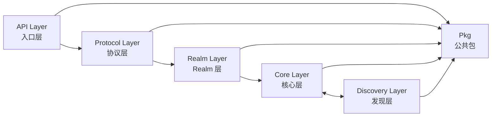

# 模块划分 (Module Design)

> **版本**: v1.3.0  
> **更新日期**: 2026-01-18  
> **定位**: DeP2P 五层架构的目标模块划分

---

## 概述

DeP2P 采用**五层软件架构**：

```mermaid
flowchart TB
    subgraph APILayer["API Layer (入口层)"]
        Node["Node"]
        Options["Options"]
    end
    
    subgraph ProtocolLayer["Protocol Layer (协议层)"]
        Messaging["Messaging"]
        PubSub["PubSub"]
        Streams["Streams"]
        Liveness["Liveness"]
    end
    
    subgraph RealmLayer["Realm Layer (Realm 层)"]
        Realm["Realm"]
        RealmManager["Manager"]
        RealmAuth["Auth"]
        RealmMember["Member"]
    end
    
    subgraph CoreLayer["Core Layer (核心层)"]
        Host["Host"]
        Identity["Identity"]
        Transport["Transport"]
        Security["Security"]
        Muxer["Muxer"]
        ConnMgr["ConnMgr"]
        Relay["Relay<br/>(三大职责v2.0)"]
        AddressBook["AddressBook<br/>(地址簿)"]
        NAT["NAT"]
        Storage["Storage<br/>(BadgerDB)"]
        Bandwidth["Bandwidth<br/>(统计)"]
        NetMon["NetMon<br/>(健康监控)"]
        PathHealth["PathHealth<br/>(路径健康)"]
        Recovery["Recovery<br/>(网络恢复)"]
    end
    
    subgraph DiscoveryLayer["Discovery Layer (发现层)"]
        Coordinator["Coordinator"]
        DHT["DHT"]
        Bootstrap["Bootstrap"]
        mDNS["mDNS"]
        Rendezvous["Rendezvous"]
    end
    
    subgraph Pkg["Pkg 公共包"]
        Types["Types"]
        Interfaces["Interfaces"]
        Proto["Proto"]
    end
    
    APILayer --> ProtocolLayer
    ProtocolLayer --> RealmLayer
    RealmLayer --> CoreLayer
    CoreLayer <--> DiscoveryLayer
    
    APILayer --> Pkg
    ProtocolLayer --> Pkg
    RealmLayer --> Pkg
    CoreLayer --> Pkg
    DiscoveryLayer --> Pkg
```



---

## API Layer (入口层)

API 层是用户的第一个接触点，提供节点创建和配置接口。

**代码位置**: `dep2p.go`, `node.go`, `options.go`

### Node

| 属性 | 说明 |
|------|------|
| **职责** | P2P 节点入口，持有身份，管理 Realm |
| **依赖** | Host, Realm |
| **产出** | Node 实例 |
| **代码位置** | `dep2p.go`, `node.go` |

```
Node 核心接口：

  • ID() NodeID              - 获取节点标识
  • ListenAddrs() []Addr     - 获取监听地址
  • JoinRealm(name, psk)     - 加入 Realm
  • CurrentRealm() Realm     - 获取当前 Realm
  • Close()                  - 关闭节点
```

---

## Protocol Layer (协议层)

协议层提供用户级应用协议，必须先加入 Realm 才能使用。

**代码位置**: `internal/protocol/`

### Messaging

| 属性 | 说明 |
|------|------|
| **职责** | 点对点消息传递 |
| **模式** | Request/Response, Send |
| **依赖** | Host, Realm |
| **代码位置** | `internal/protocol/messaging/` |

```
Messaging 核心接口：

  • Send(peer, proto, data)        - 单向发送
  • Request(peer, proto, data)     - 请求响应
  • OnMessage(proto, handler)      - 注册消息处理器
  • OnRequest(proto, handler)      - 注册请求处理器
```

### PubSub

| 属性 | 说明 |
|------|------|
| **职责** | 主题发布订阅 |
| **实现** | GossipSub |
| **依赖** | Host, Realm |
| **代码位置** | `internal/protocol/pubsub/` |

```
PubSub 核心接口（服务级，多主题支持）：

  • Join(topic) Topic              - 加入主题，返回 Topic 对象
  • ListTopics() []string          - 列出已加入的主题

Topic 核心接口（主题级）：

  • Publish(ctx, data) error       - 发布消息到此主题
  • Subscribe() Subscription       - 订阅此主题
  • Peers() []NodeID               - 获取主题中的节点
  • Close() error                  - 关闭主题（释放资源）
```

### Streams

| 属性 | 说明 |
|------|------|
| **职责** | 双向数据流管理 |
| **模式** | Bidirectional Stream |
| **依赖** | Host, Realm |
| **代码位置** | `internal/protocol/streams/` |

```
Streams 核心接口：

  • Open(peer, proto) Stream       - 打开流
  • SetHandler(proto, handler)     - 设置协议处理器
```

### Liveness

| 属性 | 说明 |
|------|------|
| **职责** | 节点存活检测 |
| **模式** | Ping/Pong |
| **依赖** | Host, Realm |
| **代码位置** | `internal/protocol/liveness/` |

```
Liveness 核心接口：

  • Ping(peer) (latency, error)    - 探测节点
  • OnPing(handler)                - 设置处理器
```

---

## Realm Layer (Realm 层)

Realm 层是 DeP2P 的核心创新，提供业务隔离能力。

**代码位置**: `internal/realm/`

### Realm

| 属性 | 说明 |
|------|------|
| **职责** | 业务隔离域，成员管理，服务入口 |
| **依赖** | Host, Protocol Services |
| **产出** | Realm 实例 |
| **代码位置** | `internal/realm/` |

```
Realm 核心接口：

  • ID() RealmID             - 获取 Realm 标识
  • Members() []NodeID       - 获取成员列表
  • IsMember(id) bool        - 检查成员资格
  • Messaging() Messaging    - 获取消息服务
  • PubSub() PubSub          - 获取发布订阅服务
  • Leave()                  - 离开 Realm
```

### Realm 子组件

| 子组件 | 职责 | 代码位置 |
|--------|------|----------|
| **Manager** | Realm 生命周期管理 | `internal/realm/manager/` |
| **Auth** | PSK 认证 | `internal/realm/auth/` |
| **Member** | 成员管理 | `internal/realm/member/` |

---

## Core Layer (核心层)

核心层提供 P2P 网络核心能力，是 DeP2P 的核心价值所在。

**代码位置**: `internal/core/`

### Host

| 属性 | 说明 |
|------|------|
| **职责** | 网络主机抽象，管理连接和流 |
| **依赖** | Transport, Security, Muxer, ConnMgr, Identity |
| **产出** | Host 实例 |
| **代码位置** | `internal/core/host/` |

```
Host 核心接口：

  • Listen(addr)                   - 监听地址
  • Connect(peer) Connection       - 连接远程节点
  • NewStream(peer, proto) Stream  - 打开新流
  • SetProtocolHandler(proto, h)   - 注册协议处理器
  • Peers() []Peer                 - 获取已知节点

Host 内部子模块（不对外暴露）：
  • address/   - 地址管理
  • dial/      - 拨号调度
  • protocol/  - 协议路由
```

### Identity

| 属性 | 说明 |
|------|------|
| **职责** | 密钥管理、NodeID 生成 |
| **实现** | Ed25519 |
| **代码位置** | `internal/core/identity/` |

```
Identity 核心接口：

  • NodeID() NodeID           - 获取节点ID
  • PublicKey() PublicKey     - 获取公钥
  • Sign(data) Signature      - 签名
  • Verify(data, sig) bool    - 验签
```

### Transport

| 属性 | 说明 |
|------|------|
| **职责** | 传输层实现 |
| **实现** | QUIC, TCP |
| **依赖** | Security |
| **代码位置** | `internal/core/transport/` |

```
Transport 子组件：
  • quic/   - QUIC 传输实现
  • tcp/    - TCP 传输实现
```

### Security

| 属性 | 说明 |
|------|------|
| **职责** | 安全握手和加密 |
| **实现** | TLS 1.3, Noise |
| **依赖** | Identity |
| **代码位置** | `internal/core/security/` |

```
Security 子组件：
  • tls/     - TLS 1.3 实现
  • noise/   - Noise 协议实现
```

### Muxer

| 属性 | 说明 |
|------|------|
| **职责** | 流多路复用 |
| **实现** | QUIC 原生 / Yamux |
| **代码位置** | `internal/core/muxer/` |

```
Muxer 子组件：
  • yamux/   - Yamux 实现
```

### ConnMgr

| 属性 | 说明 |
|------|------|
| **职责** | 连接管理、限流、保护 |
| **代码位置** | `internal/core/connmgr/` |

### Relay

| 属性 | 说明 |
|------|------|
| **职责** | 统一中继服务（三大职责 v2.0） |
| **v2.0 定位** | 缓存加速层（非权威目录）+ 打洞信令 + 数据保底 |
| **策略** | 惰性连接，配置 ≠ 连接 |
| **依赖** | Host |
| **代码位置** | `internal/core/relay/` |

```
★ v2.0 三层架构（DHT 权威模型）：

  Layer 1: DHT（★ 权威目录）— 存储签名 PeerRecord
  Layer 2: 缓存加速层 — Peerstore / MemberList / Relay 地址簿
  Layer 3: 连接策略 — 直连 → 打洞 → Relay 兜底

★ Relay 三大职责 (v2.0)：

  1. 缓存加速层：维护地址簿，作为 DHT 本地缓存（非权威）
  2. 打洞协调信令：提供打洞协调的信令通道
  3. 数据通信保底：直连/打洞失败时转发数据

Relay 设计原则：

  • P2P 优先：直连是核心，中继是辅助
  • 惰性连接：配置不立即连接，按需使用
  • 打洞成功后保留 Relay 作为备份

Relay 子组件：
  • client/       - 中继客户端
  • server/       - 中继服务端
  • addressbook/  - 地址簿（缓存加速层，非权威目录）
```

### NAT

| 属性 | 说明 |
|------|------|
| **职责** | NAT 穿透和可达性检测 |
| **实现** | STUN, UPnP, NAT-PMP, Hole Punching |
| **依赖** | Host |
| **代码位置** | `internal/core/nat/` |

```
NAT 子组件：
  • holepunch/     - 打洞
  • stun/          - STUN 探测
  • upnp/          - UPnP 映射
  • natpmp/        - NAT-PMP 映射
  • reachability/  - 可达性检测
```

### ★ Storage

| 属性 | 说明 |
|------|------|
| **职责** | 统一持久化存储基础设施 |
| **实现** | BadgerDB |
| **依赖** | 无（最底层） |
| **代码位置** | `internal/core/storage/` |

```
Storage 核心接口：

  • Get(key) (value, error)   - 获取值
  • Put(key, value) error     - 设置值
  • Delete(key) error         - 删除键
  • Has(key) (bool, error)    - 检查键是否存在
  • Close() error             - 关闭引擎

Storage 子组件：
  • engine/badger/   - BadgerDB 引擎实现
  • kv/              - KV 抽象层（前缀隔离）
```

### ★ Bandwidth

| 属性 | 说明 |
|------|------|
| **职责** | 带宽统计（按总量/Peer/Protocol） |
| **实现** | EWMA 速率计算 |
| **依赖** | 无 |
| **代码位置** | `internal/core/bandwidth/` |

```
Bandwidth 核心接口：

  • LogSentStream(size, proto, peer)    - 记录出站流量
  • LogRecvStream(size, proto, peer)    - 记录入站流量
  • GetTotals() BandwidthStats          - 获取总带宽统计
  • GetForPeer(peer) BandwidthStats     - 获取 Peer 带宽统计
  • GetForProtocol(proto) BandwidthStats - 获取协议带宽统计
  • TrimIdle(since)                      - 清理空闲条目
```

### ★ ConnectionHealthMonitor (NetMon)

| 属性 | 说明 |
|------|------|
| **职责** | 连接健康状态监控 |
| **实现** | 状态机：Healthy → Degraded → Down → Recovering |
| **依赖** | EventBus |
| **代码位置** | `internal/core/netmon/` |

```
ConnectionHealthMonitor 核心接口：

  • OnSendError(peer, err)         - 上报发送错误
  • OnSendSuccess(peer)            - 上报发送成功
  • GetState() ConnectionHealth    - 获取当前状态
  • Subscribe() <-chan Change      - 订阅状态变更
  • TriggerRecoveryState()         - 手动触发恢复
```

### ★ PathHealth

| 属性 | 说明 |
|------|------|
| **职责** | 路径健康管理（多路径 RTT 跟踪、评分、切换） |
| **实现** | EWMA RTT、路径评分算法 |
| **依赖** | 无 |
| **代码位置** | `internal/core/pathhealth/` |

```
PathHealth 核心接口：

  • ReportProbe(peer, addr, rtt, err)  - 上报探测结果
  • GetStats(peer, addr) *PathStats    - 获取路径统计
  • RankAddrs(peer, addrs) []string    - 地址排序
  • ShouldSwitch(peer, current) Decision - 切换决策
```

### ★ Recovery

| 属性 | 说明 |
|------|------|
| **职责** | 网络恢复管理 |
| **实现** | Rebind、地址重发现、关键节点重连 |
| **依赖** | ConnectionHealthMonitor, Transport, Host |
| **代码位置** | `internal/core/recovery/` |

```
Recovery 核心接口：

  • TriggerRecovery(reason) *Result  - 触发恢复
  • IsRecovering() bool              - 是否正在恢复
  • SetCriticalPeers(peers)          - 设置关键节点
  • OnRecoveryComplete(callback)     - 恢复完成回调
```

---

## Discovery Layer (发现层)

发现层提供节点发现与广播能力，与 Core 层双向协作。

**代码位置**: `internal/discovery/`

### Coordinator

| 属性 | 说明 |
|------|------|
| **职责** | 发现协调，统一调度各发现方法 |
| **依赖** | DHT, Bootstrap, mDNS, Rendezvous, Host |
| **代码位置** | `internal/discovery/coordinator/` |

```
Coordinator 核心接口：

  • FindPeers(ns) []NodeID         - 查找节点
  • Advertise(ns)                  - 公告自己
```

### DHT

| 属性 | 说明 |
|------|------|
| **职责** | 分布式哈希表发现 |
| **实现** | Kademlia |
| **依赖** | Host |
| **代码位置** | `internal/discovery/dht/` |

### Bootstrap

| 属性 | 说明 |
|------|------|
| **职责** | 引导节点发现 |
| **依赖** | Host |
| **代码位置** | `internal/discovery/bootstrap/` |

### mDNS

| 属性 | 说明 |
|------|------|
| **职责** | 局域网发现 |
| **依赖** | Host |
| **代码位置** | `internal/discovery/mdns/` |

### Rendezvous

| 属性 | 说明 |
|------|------|
| **职责** | 命名空间发现 |
| **依赖** | Host |
| **代码位置** | `internal/discovery/rendezvous/` |

---

## Pkg 公共包

Pkg 模块提供公共类型和接口，可被外部项目导入。

**代码位置**: `pkg/`

### Types

| 类型 | 说明 |
|------|------|
| **NodeID** | 节点标识 (32 bytes, SHA-256) |
| **RealmID** | Realm 标识 (32 bytes, HKDF) |
| **Multiaddr** | 多格式地址 |
| **PSK** | 预共享密钥 |

### Interfaces

模块间接口定义，用于解耦。采用扁平命名（无层级前缀）：

| 接口 | 定义位置 | 实现位置 |
|------|----------|----------|
| `Node` | `pkg/interfaces/node.go` | `dep2p.go`, `node.go` |
| `MessagingService` | `pkg/interfaces/messaging.go` | `internal/protocol/messaging/` |
| `Realm` | `pkg/interfaces/realm.go` | `internal/realm/` |
| `Host` | `pkg/interfaces/host.go` | `internal/core/host/` |
| `Identity` | `pkg/interfaces/identity.go` | `internal/core/identity/` |
| `Discovery` | `pkg/interfaces/discovery.go` | `internal/discovery/coordinator/` |
| `DHT` | `pkg/interfaces/discovery.go` | `internal/discovery/dht/` |
| `Engine` | `pkg/interfaces/storage.go` | `internal/core/storage/engine/badger/` |

### Proto

Protobuf 协议定义：

| 协议 | 用途 |
|------|------|
| `peer.proto` | 节点信息 |
| `gossipsub.proto` | GossipSub 协议 |
| `rendezvous.proto` | Rendezvous 协议 |

---

## 模块依赖矩阵

```
依赖方向: 行 → 列（行可依赖列）

          │ API │ Protocol │ Realm │ Core │ Discovery │ Pkg │
──────────┼─────┼──────────┼───────┼──────┼───────────┼─────┤
API       │  -  │    ✓     │   ✓   │  ✓   │     -     │  ✓  │
Protocol  │  -  │    -     │   ✓   │  ✓   │     -     │  ✓  │
Realm     │  -  │    -     │   -   │  ✓   │     -     │  ✓  │
Core      │  -  │    -     │   -   │  -   │     ✓     │  ✓  │
Discovery │  -  │    -     │   -   │  ✓   │     -     │  ✓  │
Pkg       │  -  │    -     │   -   │  -   │     -     │  -  │

Core 与 Discovery 是双向协作关系
```

### 依赖图



---

## 层划分原则

### Core 层判断标准

**问**：这个组件是 P2P 网络的核心能力吗？  
**问**：没有这个组件，DeP2P 还能叫 P2P 库吗？

| 组件 | 判断 | 结论 |
|------|------|------|
| Transport | 没有传输，无法通信 | ✓ Core |
| Security | 没有安全，无法加密通信 | ✓ Core |
| Muxer | 没有复用，无法多流 | ✓ Core |
| Relay | 没有中继，NAT后节点无法通信 | ✓ Core |
| NAT | 没有NAT穿透，私网节点受限 | ✓ Core |
| Host | 组装各协议，核心入口 | ✓ Core |
| Storage | 提供可选持久化，为其他组件服务 | ✓ Core |
| Identity | 节点身份，P2P基础 | ✓ Core |
| ConnMgr | 连接管理，P2P基础 | ✓ Core |

### Discovery 层判断标准

**问**：这个组件是节点发现相关的能力吗？  
**问**：需要与 Core 层双向协作吗？

| 组件 | 判断 | 结论 |
|------|------|------|
| Coordinator | 统一调度发现策略 | ✓ Discovery |
| DHT | 分布式哈希表发现 | ✓ Discovery |
| Bootstrap | 引导节点发现 | ✓ Discovery |
| mDNS | 局域网发现 | ✓ Discovery |
| Rendezvous | 命名空间发现 | ✓ Discovery |

### 日志/指标处理原则

日志和指标不作为独立模块，直接使用：

| 能力 | 处理方式 |
|------|----------|
| **Logging** | 直接使用标准库 `log/slog` |
| **Metrics** | 直接使用 `prometheus` |

用户可通过 `slog.SetDefault()` 自定义日志处理，无需抽象接口。

---

## 模块通信规范

```
┌─────────────────────────────────────────────────────────────────────────────┐
│                          模块通信规范                                         │
├─────────────────────────────────────────────────────────────────────────────┤
│                                                                             │
│  规则 1: 通过接口通信                                                        │
│  ──────────────────────                                                     │
│  模块间通过 pkg/interfaces 定义的接口通信                                    │
│  不直接依赖其他模块的内部实现                                                 │
│                                                                             │
│  规则 2: 依赖注入                                                            │
│  ────────────────                                                           │
│  服务组件通过依赖注入获取依赖                                                 │
│  构造函数接收接口类型                                                        │
│                                                                             │
│  规则 3: 层依赖规则                                                          │
│  ────────────────                                                           │
│  API → Protocol → Realm → Core ↔ Discovery                                  │
│  禁止反向依赖                                                                │
│                                                                             │
│  规则 4: 日志/指标直接使用                                                    │
│  ────────────────────────                                                   │
│  日志使用 log/slog，指标使用 prometheus                                      │
│  不需要抽象接口层                                                            │
│                                                                             │
└─────────────────────────────────────────────────────────────────────────────┘
```

---

## 相关文档

| 文档 | 说明 |
|------|------|
| [layer_model.md](layer_model.md) | 五层软件架构 |
| [target_structure.md](target_structure.md) | 目标目录结构 |
| [dependency_rules.md](dependency_rules.md) | 依赖规则 |
| [../L4_interfaces/component_interface_map.md](../L4_interfaces/component_interface_map.md) | 组件接口映射 |

---

**最后更新**：2026-01-24（v2.0 DHT 权威模型对齐）
