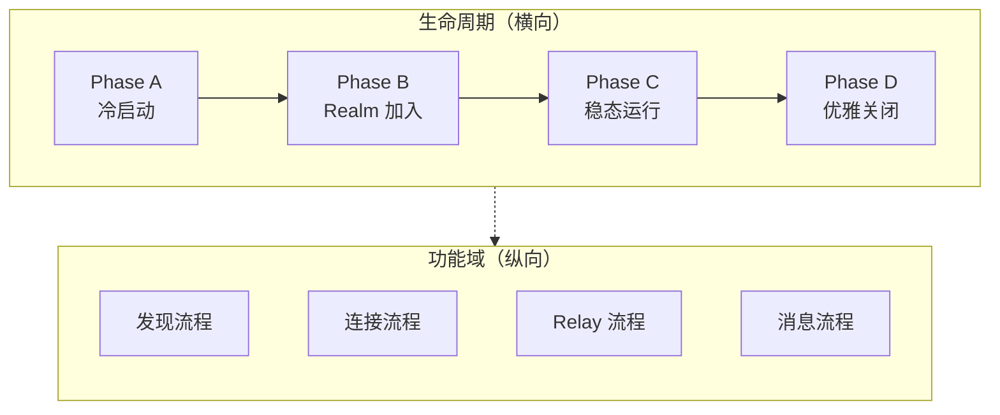
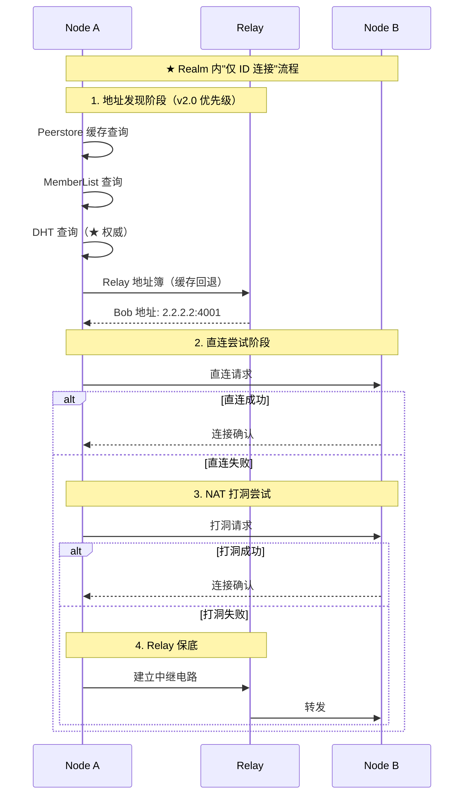

# L3: 行为设计 (Behavioral Design)

> 开发者视角：端到端流程、组件交互、状态流转

---

## 目录结构

```
L3_behavioral/
├── README.md                  # 本文件
│
│  ── 横向（生命周期视角）──
├── lifecycle_overview.md      # ★ 横切主线：节点生命周期
│
│  ── 纵向（功能域视角）──
├── discovery_flow.md          # 纵向：发现行为
├── relay_flow.md              # 纵向：Relay 行为
├── connection_flow.md         # 纵向：连接策略
├── disconnect_detection.md    # ★ 纵向：断开检测行为（v1.0.0 新增）
├── realm_flow.md              # 纵向：Realm 行为
├── messaging_flow.md          # 纵向：消息行为
└── state_machines.md          # 状态机汇总
```

---

## 文档视角说明

### 双轨结构

L3_behavioral 采用**横向 + 纵向**双轨结构，从两个互补的视角描述系统行为：

```
┌─────────────────────────────────────────────────────────────────────────────┐
│                         L3 Behavioral 双轨结构                                │
├─────────────────────────────────────────────────────────────────────────────┤
│                                                                             │
│  ★ 横向（生命周期视角）                                                     │
│  ════════════════════════                                                   │
│  回答: "节点启动时发生了什么？" "组件如何协调工作？"                         │
│  内容: 时间维度上的跨组件协调、阶段划分、依赖关系                           │
│  文档: lifecycle_overview.md                                                │
│                                                                             │
│  ──────────────────────────────────────────────────────────────────────     │
│                                                                             │
│  纵向（功能域视角）                                                         │
│  ════════════════════                                                       │
│  回答: "如何发现节点？" "如何建立连接？" "如何发送消息？"                   │
│  内容: 单一功能的完整行为、决策逻辑、异常处理                               │
│  文档: discovery_flow.md, connection_flow.md, relay_flow.md, ...           │
│                                                                             │
└─────────────────────────────────────────────────────────────────────────────┘
```

### 横向视角

[lifecycle_overview.md](lifecycle_overview.md) 作为**横切主线**，从用户操作出发，描述节点完整生命周期：

- **Phase A: 冷启动** — 身份初始化 → 传输栈启动 → 地址发现 → DHT 入网 → 地址发布
- **Phase B: Realm 加入** — PSK 认证 → DHT 发布 → 成员发现 → 协议注册
- **Phase C: 稳态运行** — 周期任务 → 地址续期 → 网络变化响应
- **Phase D: 优雅关闭** — 离开 Realm → 取消 DHT 发布 → 关闭连接

### 纵向视角

纵向文档按功能域划分，描述单一功能的完整行为：

| 文档 | 功能域 | 核心内容 |
|-----|-------|---------|
| [discovery_flow.md](discovery_flow.md) | 节点发现 | 发现来源优先级、Realm 内发现 vs 全网发现 |
| [connection_flow.md](connection_flow.md) | 连接建立 | 惰性中继策略、仅 ID 连接边界、多层保活 |
| [disconnect_detection.md](disconnect_detection.md) | **断开检测** | **多层检测架构、见证人机制、重连宽限期、震荡抑制** |
| [relay_flow.md](relay_flow.md) | Relay 中继 | Relay 三大职责、打洞协调、地址簿行为 |
| [realm_flow.md](realm_flow.md) | Realm 管理 | PSK 认证、成员发现、成员同步 |
| [messaging_flow.md](messaging_flow.md) | 消息传递 | Request-Response、PubSub、GossipSub |
| [state_machines.md](state_machines.md) | 状态机 | Connection、Relay、ReadyLevel、**ConnectionStability** 状态 |

---

## 与 L6_domains 的关系

| 层级 | 职责 | 关注点 | 示例 |
|-----|-----|-------|-----|
| **L3_behavioral** | 行为设计 | 谁在什么时候做什么 | "冷启动时先 STUN 再发布 DHT" |
| **L6_domains** | 模块设计 | 内部怎么做 | "PeerRecord 结构定义、Bootstrap 接口签名" |

**边界原则**：

- **L3 描述行为**：流程时序、组件协作、决策逻辑、状态流转
- **L6 描述实现**：接口定义、数据结构、API 签名、内部状态

**引用关系**：

- L3 文档引用 L6 获取具体实现细节
- L6 文档引用 L3 了解组件在系统中的行为

---

## 核心流程概览



### 连接建立流程概览



> 详细流程参见 [connection_flow.md](connection_flow.md) 和 [lifecycle_overview.md](lifecycle_overview.md)

---

## 状态机概览

### 连接状态

```
┌──────────┐    dial     ┌───────────┐   handshake   ┌────────────┐
│  Idle    │──────────▶  │ Connecting │──────────────▶│ Connected  │
└──────────┘              └───────────┘               └────────────┘
      ▲                         │                           │
      │                    timeout/error                close/error
      │                         │                           │
      └─────────────────────────┴───────────────────────────┘
```

### Relay 状态

```
┌──────┐  SetRelay  ┌────────────┐  connect  ┌───────────┐   ready   ┌───────────┐
│ None │──────────▶ │ Configured │──────────▶│ Connecting │─────────▶│ Connected │
└──────┘            └────────────┘           └───────────┘           └───────────┘
    ▲                     │                        │                       │
    │               RemoveRelay                timeout                  error
    │                     │                        │                       │
    └─────────────────────┴────────────────────────┴───────────────────────┘
```

### Node ReadyLevel 状态

```
┌─────────┐  start  ┌─────────┐  dht_join  ┌────────────┐  verified  ┌───────────┐  realm_join  ┌────────────┐
│ Created │────────▶│ Network │───────────▶│ Discovered │───────────▶│ Reachable │─────────────▶│ RealmReady │
└─────────┘         └─────────┘            └────────────┘            └───────────┘             └────────────┘
```

> v2.0 惰性中继策略：无后台升级，每次连接按优先级尝试（直连 → 打洞 → Relay）

> 完整状态机定义参见 [state_machines.md](state_machines.md)

---

## 相关文档

### 架构文档
- [L2: 结构设计](../L2_structural/)
- [L4: 接口契约](../L4_interfaces/)
- [L6: 模块设计](../L6_domains/)

### 约束与规范
- [协议规范](../../02_constraints/protocol/)
- [ADR-0010: 显式 Relay 配置](../../04_adr/ADR-0010_explicit_relay_config.md)

### 决策文档
- [ADR-0010: 显式 Relay 配置](../../01_context/decisions/ADR-0010-relay-explicit-config.md)
- [ADR-0012: 断开检测架构](../../01_context/decisions/ADR-0012-disconnect-detection.md)

---

**最后更新**：2026-01-28（新增 disconnect_detection.md 断开检测行为文档）
