# 连接建立流程 (Connection Flow)

> 从发起连接到建立会话的完整端到端流程

---

## 文档定位

本文档是 L3_behavioral 的**纵向流程文档**，专注于描述连接建立的完整行为。

### 与横切面的关系

连接建立贯穿节点生命周期的多个阶段，详见 [lifecycle_overview.md](lifecycle_overview.md)：

| 生命周期阶段 | 连接相关内容 | 本文档章节 |
|-------------|-------------|-----------|
| Phase A: 冷启动 | 可达性验证、地址发布 | [阶段 4: 身份验证](#阶段-4-身份验证) |
| Phase B: Realm 加入 | Realm 内连接 | [Realm 内连接流程](#-realm-内连接流程仅-id-连接) |
| Phase C: 稳态运行 | 连接保活、网络变化响应 | [多层保活策略](#-多层保活策略-v130-新增)、[网络变化处理](#网络变化处理) |

### 与 L6 的边界

| 本文档 (L3) | L6_domains |
|------------|------------|
| 惰性中继策略、连接优先级 | Connection 接口定义 |
| "仅 ID 连接"边界、网络变化响应 | ConnMgr 配置参数 |
| 多层保活策略 | Transport/Security 实现 |

> Connection/ConnMgr 接口详情参见 [L6_domains/core_swarm](../L6_domains/core_swarm/design/overview.md)

---

## 流程概述

连接建立是 DeP2P 最核心的流程，涉及地址解析、传输选择、安全握手和身份验证。

DeP2P 支持两种连接模式：
- **Realm 内连接**：支持"仅 ID 连接"，系统自动发现地址
- **节点级连接**：必须提供地址，不支持纯 NodeID

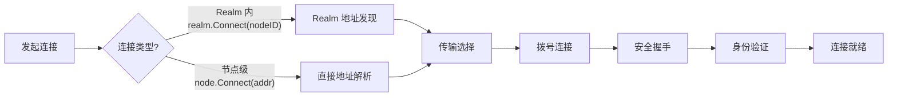

### 参与组件

| 组件 | 目录 | 职责 |
|------|------|------|
| **Host** | `internal/core/host/` | 网络主机门面（连接管理入口） |
| **Swarm** | `internal/core/swarm/` | 连接池和拨号管理 |
| **Peerstore** | `internal/core/peerstore/` | 地址簿和节点信息管理 |
| **Transport** | `internal/core/transport/quic/` | QUIC 传输 |
| **Security** | `internal/core/security/tls/` | TLS 握手 |
| **ConnMgr** | `internal/core/connmgr/` | 连接限制和管理 |

---

## ★ "仅 ID 连接"的严格边界

DeP2P 支持使用纯 NodeID 进行连接，但有**严格的边界限制**。

```
┌─────────────────────────────────────────────────────────────────────────────┐
│                    "仅 ID 连接"的严格边界（★ 核心设计）                      │
├─────────────────────────────────────────────────────────────────────────────┤
│                                                                             │
│  ★ 关键认知：Realm 是业务边界，"仅 ID 连接"严格限制在 Realm 内              │
│                                                                             │
│  ═══════════════════════════════════════════════════════════════════════   │
│  Realm 内（✅ 允许"仅 ID 连接"）                                            │
│  ═══════════════════════════════════════════════════════════════════════   │
│                                                                             │
│  realm.Connect(ctx, targetNodeID)   ← ✅ 允许                               │
│                                                                             │
│  为什么允许？                                                                │
│  • 同 Realm 成员共享 PSK，有信任基础                                       │
│  • 有 MemberList、Relay 地址簿等发现机制                                   │
│  • 有 Relay 作为保底                                                       │
│                                                                             │
│  ═══════════════════════════════════════════════════════════════════════   │
│  跨 Realm / 节点级（❌ 禁止"仅 ID 连接"）                                   │
│  ═══════════════════════════════════════════════════════════════════════   │
│                                                                             │
│  node.Connect(ctx, targetNodeID)    ← ❌ 返回 ErrAddressRequired           │
│  node.Connect(ctx, multiaddr)       ← ✅ 必须提供地址                       │
│                                                                             │
│  为什么禁止？                                                                │
│  • 不同 Realm 无信任基础                                                   │
│  • 没有共享的发现机制                                                      │
│  • 没有共享的 Relay 保底                                                   │
│                                                                             │
│  这是刻意的设计限制，体现 Realm 作为业务边界的核心理念                      │
│                                                                             │
└─────────────────────────────────────────────────────────────────────────────┘
```

### API 设计

```pseudocode
// ════════════════════════════════════════════════════════════════════════════
// Realm 级别 API：支持"仅 ID 连接"
// ════════════════════════════════════════════════════════════════════════════

realm = node.JoinRealm(ctx, "my-realm", psk)

// ✅ 使用纯 NodeID 连接 Realm 内成员
conn = realm.Connect(ctx, targetNodeID)
// 系统自动：地址发现 → 直连 → 打洞 → Relay 保底

// ✅ 也可以提供地址提示（加速连接）
conn = realm.ConnectWithHint(ctx, targetNodeID, ["/ip4/1.2.3.4/tcp/4001"])


// ════════════════════════════════════════════════════════════════════════════
// Node 级别 API：必须提供地址
// ════════════════════════════════════════════════════════════════════════════

// ❌ 禁止：纯 NodeID 跨 Realm/无 Realm 连接
node.Connect(ctx, targetNodeID)  // 返回 ErrAddressRequired

// ✅ 必须提供完整 Multiaddr
conn = node.Connect(ctx, "/ip4/1.2.3.4/tcp/4001/p2p/QmTarget...")

// ✅ 或者使用 ConnectionTicket（包含地址提示）
conn = node.Connect(ctx, "dep2p://QmTarget.../addr/1.2.3.4:4001")
```

### ★ 地址入库与传播（直连成功的关键）

连接建立后必须把地址沉淀到本地与成员同步通道，形成持续可用的直连基础。

```
┌─────────────────────────────────────────────────────────────────────────────┐
│                    地址入库与传播（Address Ingestion & Propagation）         │
├─────────────────────────────────────────────────────────────────────────────┤
│                                                                             │
│  1) 连接建立 → Identify 交换 ListenAddrs / ObservedAddr                     │
│  2) 写入 Peerstore（ConnectedAddrTTL）                                      │
│  3) MemberSync 广播 join2/sync2（携带地址）                                 │
│  4) Relay AddressBook 注册/更新（AddressRegister/Update）                   │
│                                                                             │
│  结果：后续 realm.Connect() 可直接命中地址，优先走直连                        │
│                                                                             │
└─────────────────────────────────────────────────────────────────────────────┘
```

---

## ★ Realm 内连接流程（仅 ID 连接）

Realm 内连接支持纯 NodeID，系统自动完成地址发现。

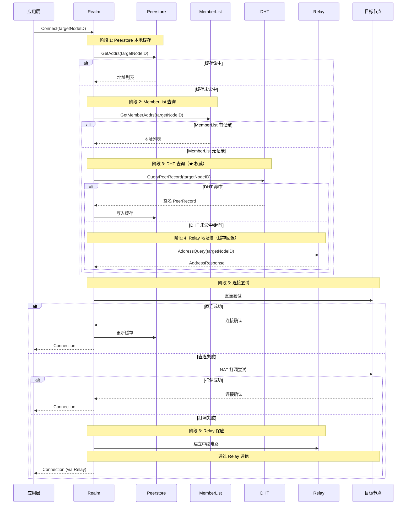

### Realm 内连接优先级（v2.0 更新）

```
┌─────────────────────────────────────────────────────────────────────────────┐
│                    Realm 内连接优先级（v2.0 DHT 权威模型）                    │
├─────────────────────────────────────────────────────────────────────────────┤
│                                                                             │
│  ★ v2.0 三层架构：                                                          │
│  Layer 1: DHT（★ 权威目录）— 存储签名 PeerRecord                             │
│  Layer 2: 缓存加速层 — Peerstore / MemberList / Relay 地址簿                 │
│  Layer 3: 连接策略 — 直连 → 打洞 → Relay 兜底                                │
│                                                                             │
│  realm.Connect(targetNodeID) 执行流程：                                     │
│                                                                             │
│  地址发现优先级：                                                            │
│  ═══════════════                                                            │
│  1. Peerstore 本地缓存（零网络开销）                                        │
│  2. MemberList 成员列表（Realm 内 Gossip 同步）                            │
│  3. DHT 查询（★ 权威来源，签名 PeerRecord）                                │
│  4. Relay 地址簿（缓存回退，非权威）                                       │
│                                                                             │
│  连接尝试优先级：                                                            │
│  ═══════════════                                                            │
│  1. 直连（基于发现的地址）                                                  │
│  2. NAT 打洞（基于 NAT 类型信息）                                          │
│  3. Relay 转发（保底，总是可达）                                           │
│                                                                             │
│  ★ 设计目标：70-80% 直连成功，Relay 不成为瓶颈                              │
│                                                                             │
└─────────────────────────────────────────────────────────────────────────────┘
```

---

## 完整连接流程（节点级）

节点级连接（`node.Connect()`）必须提供地址，不支持纯 NodeID。

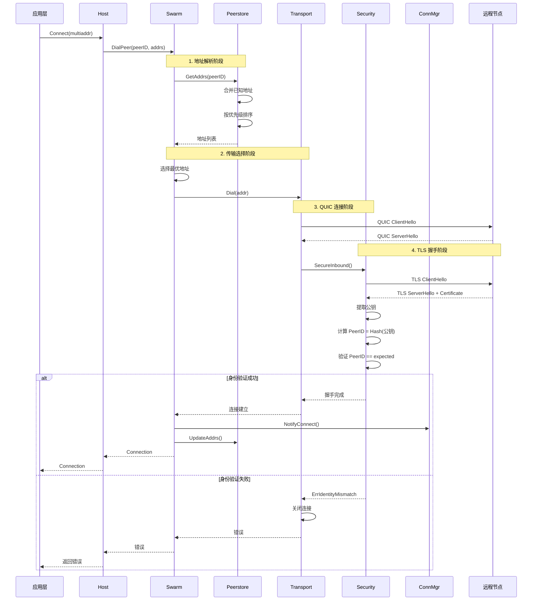

---

## 阶段详解

### 阶段 1: 地址解析

```
地址解析流程：

  输入: PeerID
  输出: 按优先级排序的地址列表

  步骤:
    1. 查询 Peerstore 地址簿
       - 来源: Identify / MemberSync(join2, sync2) / Join 返回
    2. 查询 Discovery (DHT/mDNS)（如需）
    3. 按优先级排序:
       - 直连地址 > Relay 地址
       - IPv4 > IPv6（可配置）
       - 最近成功地址优先
       - 公网地址 > 私网地址
```

```
优先级补充说明：
  • Peerstore 中来自 Identify/MemberSync/Join 的地址优先
  • Relay 地址仅作为兜底候选（仅在直连/打洞失败时使用）
  • TTL 到期会被 GC 清理，过期地址不会参与排序
  • TTL 失效后会触发重新发现（MemberSync/Relay/Discovery）
```

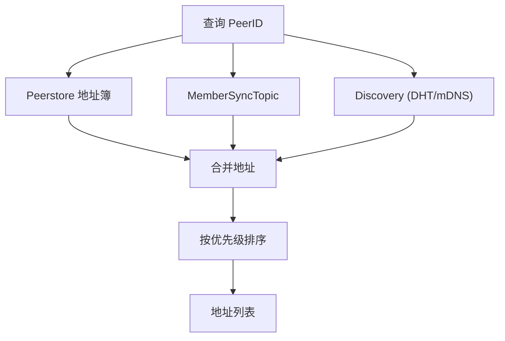

### 阶段 2: 传输选择（惰性中继策略）

```
┌─────────────────────────────────────────────────────────────────────────────┐
│                    连接优先级（惰性中继策略）                                 │
├─────────────────────────────────────────────────────────────────────────────┤
│                                                                             │
│  优先级 1: 直连                                                             │
│  • 尝试所有直连地址                                                          │
│  • 并行尝试多个地址                                                          │
│                                                                             │
│  优先级 2: NAT 打洞                                                          │
│  • 直连失败后尝试打洞                                                        │
│  • ★ 通过信令通道协调（通常为 Relay 连接，非 STUN）                         │
│  • 注意：STUN 仅用于外部地址发现，不是打洞协调通道                          │
│                                                                             │
│  优先级 3: 中继（如果配置了）                                                │
│  • 打洞也失败后使用中继                                                      │
│  • 统一 Relay（三大职责：缓存加速 + 信令通道 + 数据保底）                   │
│  • ★ DHT 是权威目录，Relay 地址簿是缓存                                     │
│  • 注意：中继是兜底，不是常态                                                │
│                                                                             │
│  核心原则：P2P 优先，中继是最后手段                                          │
│                                                                             │
└─────────────────────────────────────────────────────────────────────────────┘
```

### ★ Swarm.DialPeer 完整流程（BUG-27 澄清）

```
┌─────────────────────────────────────────────────────────────────────────────┐
│                    Swarm.DialPeer 拨号流程（★ 实现层面）                      │
├─────────────────────────────────────────────────────────────────────────────┤
│                                                                             │
│  ★ 核心理解：打洞需要信令通道，信令通道通常是 Relay 连接                     │
│  ★ Relay 连接既是信令通道，也是数据兜底                                      │
│                                                                             │
│  ┌──────────────────────────────────────────────────────────────────────┐  │
│  │                                                                      │  │
│  │   1. 直连尝试                                                        │  │
│  │   ════════════                                                       │  │
│  │   • 从 Peerstore 获取 directAddrs                                    │  │
│  │   • 如果有可用地址，尝试直接拨号                                      │  │
│  │   • 成功 → 返回直连连接                                               │  │
│  │   • 失败/无地址 → 继续步骤 2                                          │  │
│  │                                                                      │  │
│  │   2. 建立 Relay 连接（作为信令通道）                                   │  │
│  │   ══════════════════════════════════                                 │  │
│  │   • 调用 RelayDialer.DialViaRelay()                                  │  │
│  │   • Relay 连接有两个用途：                                            │  │
│  │     ① 作为打洞协商的信令通道                                          │  │
│  │     ② 作为打洞失败后的数据兜底                                        │  │
│  │   • 失败 → 跳过打洞，尝试步骤 4 的纯中继回退                          │  │
│  │                                                                      │  │
│  │   3. 打洞协商（DCUtR）                                                │  │
│  │   ════════════════════                                               │  │
│  │   • 调用 HolePuncher.DirectConnect(ctx, peerID, nil)                 │  │
│  │   • ★ BUG-27 修复：传 nil 而非 directAddrs                           │  │
│  │   • 在 Relay 连接上打开 /dep2p/holepunch 协商流                       │  │
│  │   • 交换双方的 ShareableAddrs（观测地址，非监听地址）                 │  │
│  │   • 同时向对方地址发包打洞                                            │  │
│  │   • 成功 → 返回新建立的直连连接                                       │  │
│  │   • 失败 → 返回步骤 2 建立的 Relay 连接（兜底）                       │  │
│  │                                                                      │  │
│  │   4. 纯中继回退（无 HolePuncher 或跳过打洞时）                        │  │
│  │   ═══════════════════════════════════════════                        │  │
│  │   • 如果没有配置 HolePuncher，或步骤 2 失败                           │  │
│  │   • 直接尝试 Relay 连接作为最终回退                                   │  │
│  │                                                                      │  │
│  └──────────────────────────────────────────────────────────────────────┘  │
│                                                                             │
│  ═══════════════════════════════════════════════════════════════════════   │
│  ★ 关键洞察（BUG-27 修复）：                                                │
│  ═══════════════════════════════════════════════════════════════════════   │
│                                                                             │
│  1. 打洞不依赖 Peerstore 的 directAddrs                                     │
│     • NAT 节点的 PeerRecord 只有 relay_addrs，没有 direct_addrs            │
│     • 打洞时双方通过 CONNECT 消息交换 ShareableAddrs（观测地址）           │
│                                                                             │
│  2. ShareableAddrs vs Addrs                                                 │
│     • Addrs() 返回监听地址（私网地址），不适合打洞                          │
│     • ShareableAddrs() 返回已验证的外部地址，适合打洞                       │
│                                                                             │
└─────────────────────────────────────────────────────────────────────────────┘
```

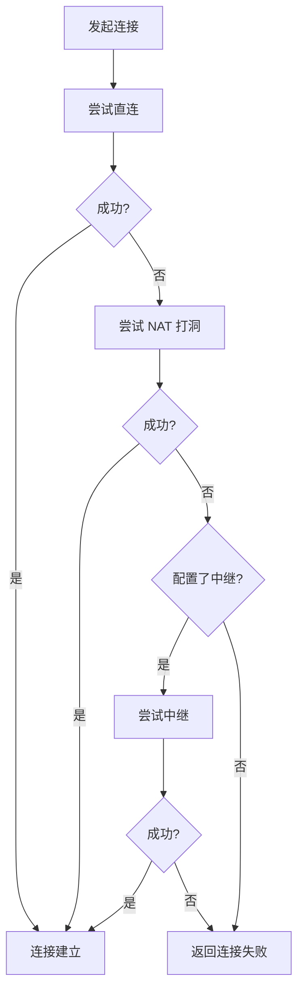

### 阶段 3: QUIC 连接

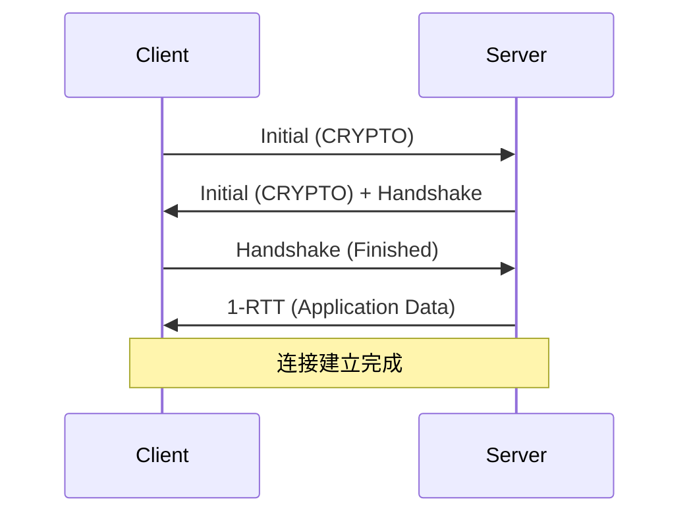

### 阶段 4: 身份验证

```
身份验证规则 (INV-001)：

  1. 每个连接必须绑定 ExpectedPeerID
  2. 从 TLS 证书提取公钥
  3. 计算 ActualPeerID = Hash(公钥)
  4. 验证 ActualPeerID == ExpectedPeerID
  5. 验证失败必须关闭连接
```

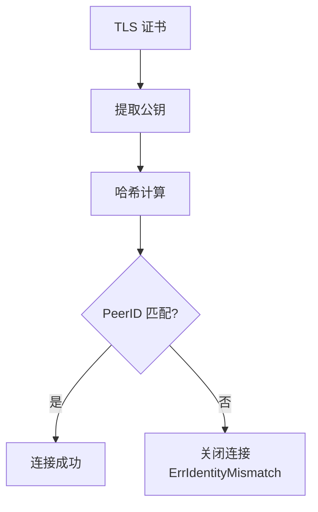

---

## 连接状态机

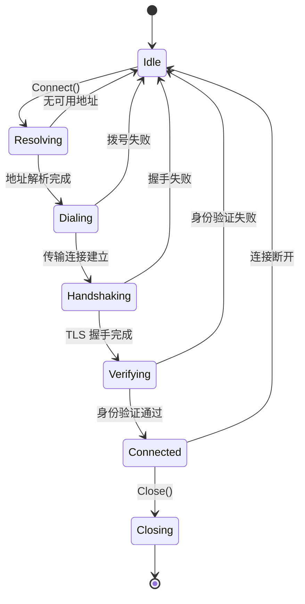

### 状态说明

| 状态 | 说明 |
|------|------|
| **Idle** | 空闲，无连接 |
| **Resolving** | 正在解析目标地址 |
| **Dialing** | 正在拨号连接 |
| **Handshaking** | 正在进行 TLS 握手 |
| **Verifying** | 正在验证身份 |
| **Connected** | 连接已建立 |
| **Closing** | 正在关闭 |

---

## 惰性中继说明

DeP2P 采用**惰性中继策略**，中继是最后手段而非优先选项：

```
┌─────────────────────────────────────────────────────────────────────────────┐
│                    惰性中继策略                                               │
├─────────────────────────────────────────────────────────────────────────────┤
│                                                                             │
│  核心原则：                                                                  │
│  • P2P 的核心是直连，中继是辅助                                             │
│  • 不需要"后台升级"机制                                                      │
│  • 每次连接都按优先级尝试：直连 → 打洞 → 中继                               │
│                                                                             │
│  与"中继优先"策略的区别：                                                    │
│  ─────────────────────────────                                              │
│  中继优先（不采用）：                                                        │
│  • 所有连接先走中继                                                          │
│  • 后台尝试升级为直连                                                        │
│  • 需要复杂的升级机制                                                        │
│                                                                             │
│  惰性中继（采用）：                                                          │
│  • 每次先尝试直连和打洞                                                      │
│  • 只有都失败才用中继                                                        │
│  • 简单、高效、符合 P2P 本质                                                │
│                                                                             │
└─────────────────────────────────────────────────────────────────────────────┘
```

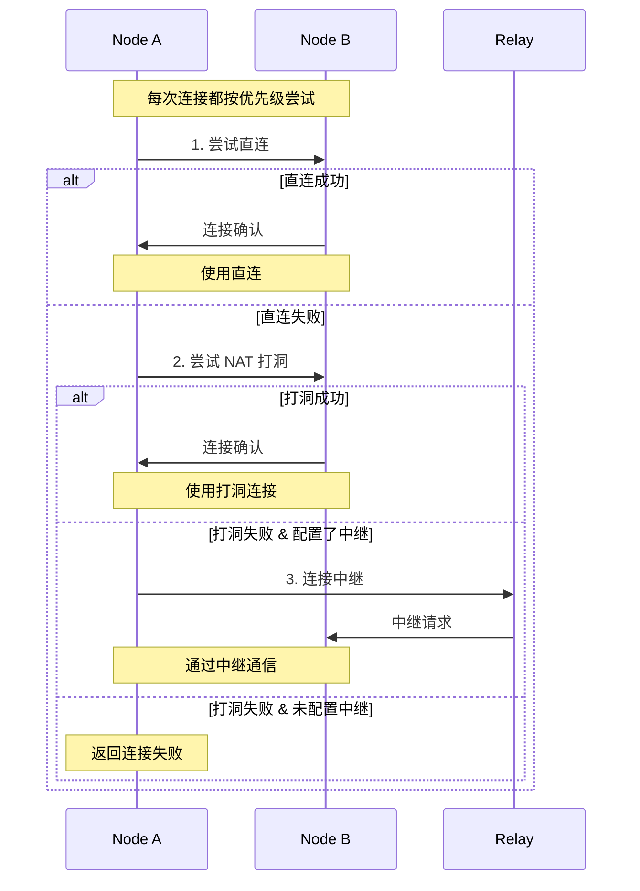

---

## 错误处理

### 错误类型

| 错误 | 原因 | 处理 |
|------|------|------|
| **ErrNoAddresses** | 无可用地址 | 触发 DHT 查询 |
| **ErrDialTimeout** | 拨号超时 | 尝试下一个地址 |
| **ErrHandshakeFailed** | TLS 握手失败 | 记录日志，尝试下一个地址 |
| **ErrIdentityMismatch** | 身份验证失败 | 关闭连接，返回错误 |
| **ErrConnectionRefused** | 连接被拒绝 | 尝试 Relay |

### 重试策略

```
重试策略：

  地址级重试:
    - 并行尝试多个地址
    - 首个成功即返回
    - 超时: 5 秒/地址
    
  传输级重试:
    - 直连失败 → Relay
    - 打洞失败 → Relay 保底
    
  连接级重试:
    - 指数退避
    - 最大间隔: 30 秒
    - 最大重试: 5 次
```

---

## 网络变化处理

### 网络变化类型

| 类型 | 触发条件 | 处理方式 |
|------|----------|----------|
| **Major Change** | 网络接口切换（4G→WiFi） | 完整重建流程 |
| **Minor Change** | IP 地址微调 | 仅重新 STUN |

### 网络变化检测流程

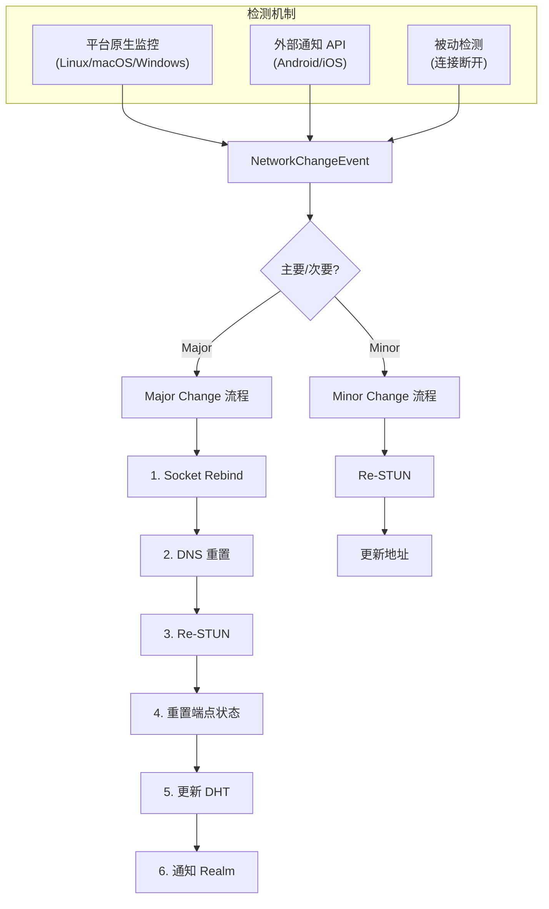

### Major Change 完整流程

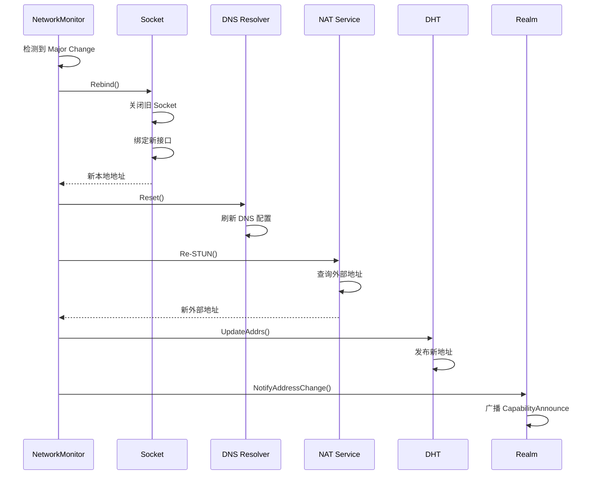

### ★ 多层保活策略 (v1.3.0 新增)

```
┌─────────────────────────────────────────────────────────────────────────────┐
│                          多层保活策略                                        │
├─────────────────────────────────────────────────────────────────────────────┤
│                                                                             │
│  Layer 1: QUIC 传输层保活 (KeepAlivePeriod) ★ 必需                          │
│  ═════════════════════════════════════════════                              │
│  • QUIC 自动发送 PING 帧，维持 NAT 映射                                      │
│  • 配置: KeepAlivePeriod = IdleTimeout / 2                                  │
│  • 无需应用层参与                                                           │
│                                                                             │
│  Layer 2: Liveness 心跳服务 (HeartbeatInterval)                             │
│  ═════════════════════════════════════════════════                          │
│  • 应用层定期 Ping 检测                                                      │
│  • 协议: /dep2p/sys/heartbeat/1.0.0                                         │
│  • 用途: 节点健康评估、RTT 测量                                              │
│                                                                             │
│  Layer 3: GossipSub 心跳 (gossipsub heartbeat)                              │
│  ═════════════════════════════════════════════                              │
│  • 1 秒间隔的 Gossip 控制消息                                                │
│  • 用途: Mesh 维护、消息传播                                                 │
│                                                                             │
│  ⚠️ 重要：KeepAlivePeriod 是必需配置，否则连接会在 IdleTimeout 后断开       │
│                                                                             │
└─────────────────────────────────────────────────────────────────────────────┘
```

**预设配置**：

| 预设 | IdleTimeout | KeepAlivePeriod | HeartbeatInterval | 适用场景 |
|------|-------------|-----------------|-------------------|----------|
| Mobile | 2 分钟 | 60 秒 | 30 秒 | 省电优先 |
| Desktop | 5 分钟 | 150 秒 | 15 秒 | 平衡 |
| Server | 10 分钟 | 300 秒 | 10 秒 | 稳定性优先 |
| Test | 30 秒 | 15 秒 | 5 秒 | 快速检测 |

### JitterTolerance 抖动容忍

```
┌─────────────────────────────────────────────────────────────────────────────┐
│                         JitterTolerance 抖动容忍                             │
├─────────────────────────────────────────────────────────────────────────────┤
│                                                                             │
│  核心思想：网络抖动是常态，短暂断连不应立即放弃                               │
│                                                                             │
│  ToleranceWindow（5秒）：                                                    │
│  • 断连后的等待窗口                                                          │
│  • 在此期间不触发重连                                                        │
│  • 如果连接自动恢复，状态保持不变                                            │
│                                                                             │
│  StateHoldTime（30秒）：                                                     │
│  • 断连后保持节点状态的时间                                                  │
│  • 包括 Peerstore 地址、Realm 成员资格等                                    │
│  • 超过此时间才真正移除节点                                                  │
│                                                                             │
│  指数退避重连：                                                              │
│  • 1s → 2s → 4s → 8s → 16s → 32s → 60s（封顶）                             │
│  • 最大尝试次数：5 次                                                        │
│                                                                             │
└─────────────────────────────────────────────────────────────────────────────┘
```

### JitterTolerance 状态机

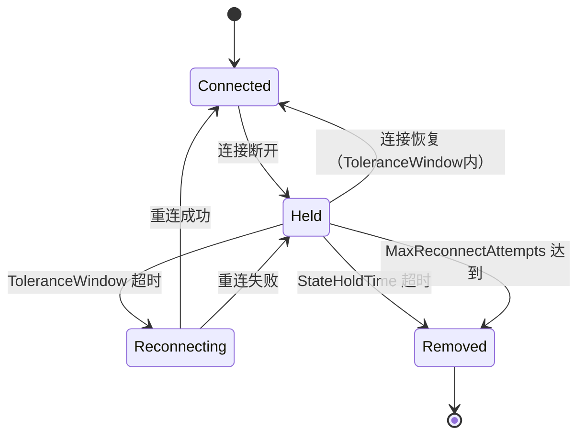

### 状态说明

| 状态 | 说明 | 持续时间 |
|------|------|----------|
| **Connected** | 正常连接状态 | 长期 |
| **Held** | 断连但保持状态 | ≤ StateHoldTime |
| **Reconnecting** | 正在重连 | 短暂 |
| **Removed** | 节点已移除 | - |

### ★ 可达性检测策略

```
┌─────────────────────────────────────────────────────────────────────────────┐
│                    可达性检测频率与策略                                       │
├─────────────────────────────────────────────────────────────────────────────┤
│                                                                             │
│  检测时机（事件驱动 + 定期检测）：                                           │
│  ═══════════════════════════════════                                        │
│                                                                             │
│  事件驱动（立即检测）：                                                      │
│  ─────────────────────                                                      │
│  • 节点启动时                                                               │
│  • 网络接口变化（4G/WiFi 切换）                                             │
│  • 本地 IP 地址变化                                                         │
│  • 连接失败且怀疑地址变化时                                                 │
│                                                                             │
│  定期检测：                                                                  │
│  ──────────                                                                 │
│  • 基础间隔：5 分钟（网络稳定时）                                           │
│  • 最小间隔：1 分钟（防止过度检测）                                         │
│  • 最大间隔：15 分钟（确保地址及时更新）                                    │
│                                                                             │
│  自适应策略：                                                                │
│  ─────────────                                                              │
│  • 地址稳定 → 逐渐延长间隔（5min → 10min → 15min）                         │
│  • 地址变化 → 缩短间隔回到 5min                                             │
│  • 连续 N 次稳定后才延长间隔（N=3）                                        │
│                                                                             │
│  检测方法优先级：                                                            │
│  ─────────────────                                                          │
│  1. STUN 探测（获取外部地址）                                              │
│  2. AutoNAT dialback（验证可达性）                                          │
│  3. 观察地址收集（作为补充验证）                                            │
│                                                                             │
│  说明：NAT 类型检测为独立流程，启动时异步触发，用于打洞策略                 │
│                                                                             │
│  资源保护：                                                                  │
│  ──────────                                                                 │
│  • 并发 STUN 请求限制：最多 3 个服务器                                      │
│  • 单次检测超时：5 秒                                                       │
│  • 检测失败不立即重试，等待下个周期                                         │
│                                                                             │
└─────────────────────────────────────────────────────────────────────────────┘
```

### ★ IPv6 环境连接策略

```
┌─────────────────────────────────────────────────────────────────────────────┐
│                    IPv6 环境连接策略                                          │
├─────────────────────────────────────────────────────────────────────────────┤
│                                                                             │
│  IPv6 与 NAT 穿透的关系：                                                   │
│  ═══════════════════════                                                    │
│  • IPv6 地址空间大，通常不需要 NAT                                          │
│  • 大多数 IPv6 地址是全球可达的                                              │
│  • 但仍可能受防火墙限制                                                      │
│                                                                             │
│  策略模式（IPv6NATMode）：                                                   │
│  ═════════════════════════                                                   │
│                                                                             │
│  ┌─────────────┬─────────────────────────────────────────────────────────┐  │
│  │ full        │ 完整 NAT 穿透逻辑（兼顾 IPv4 + IPv6 双栈环境）          │  │
│  ├─────────────┼─────────────────────────────────────────────────────────┤  │
│  │ simplified  │ ★ 推荐。跳过 NAT 类型检测，保留可达性检测 + Relay 备份   │  │
│  ├─────────────┼─────────────────────────────────────────────────────────┤  │
│  │ disabled    │ 完全跳过 NAT 穿透，仅直连（纯 IPv6 无防火墙环境）        │  │
│  └─────────────┴─────────────────────────────────────────────────────────┘  │
│                                                                             │
│  双栈环境连接策略（Happy Eyeballs 风格）：                                   │
│  ═══════════════════════════════════════                                    │
│  1. 同时探测 IPv4 和 IPv6 地址                                              │
│  2. 并行尝试连接                                                            │
│  3. 先成功者优先（通常 IPv6 更快，无需打洞）                                 │
│                                                                             │
│  配置参数：                                                                  │
│  ──────────                                                                 │
│  • IPv6NATMode: full | simplified（默认）| disabled                        │
│  • PreferIPVersion: IPv6 | IPv4 | Parallel（默认）                         │
│                                                                             │
│  ★ 为什么 simplified 是推荐？                                                │
│  ───────────────────────────                                                │
│  • IPv6 全球可达时，打洞是多余的                                            │
│  • ★ 保留可达性检测（AutoNAT/dialback）—— 检测防火墙限制                   │
│  • 保留 Relay 作为备份，应对防火墙阻断入站                                  │
│  • 减少不必要的 STUN NAT 类型探测                                           │
│                                                                             │
│  simplified 流程：直连 → 可达性检测 → Relay（失败时）                        │
│                                                                             │
└─────────────────────────────────────────────────────────────────────────────┘
```

**IPv6 环境决策流程**：

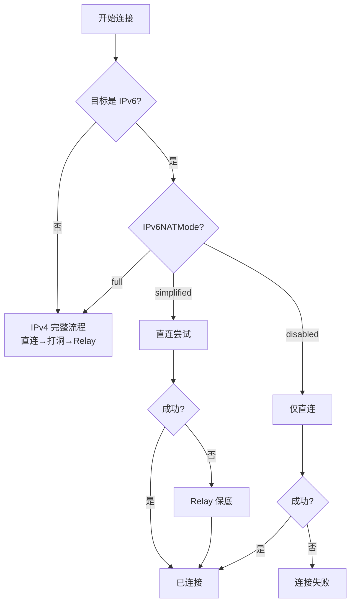

### 用户 API

```pseudocode
// 外部通知网络变化（用于 Android 等平台）
node.NetworkChange()

// 注册网络变化回调
node.OnNetworkChange((event: NetworkChangeEvent) => {
    log.Info("网络变化", "type", event.Type, "newAddrs", event.NewAddrs)
})
```

---

## 代码路径

| 阶段 | 代码路径 |
|------|----------|
| 连接入口 | `internal/core/host/host.go` |
| 拨号管理 | `internal/core/swarm/dial.go` |
| 地址簿 | `internal/core/peerstore/addrbook.go` |
| 传输层 | `internal/core/transport/quic/listener.go` |
| 安全握手 | `internal/core/security/tls/transport.go` |
| 连接管理 | `internal/core/connmgr/connmgr.go` |

---

## 相关文档

### L3 行为文档

| 文档 | 说明 |
|------|------|
| [lifecycle_overview.md](lifecycle_overview.md) | ★ 节点生命周期横切面（冷启动/Realm加入/稳态运行） |
| [disconnect_detection.md](disconnect_detection.md) | ★ 断开检测流程（多层检测、见证人机制） |
| [relay_flow.md](relay_flow.md) | Relay 中继流程（v2.0 三大职责） |
| [discovery_flow.md](discovery_flow.md) | 节点发现流程（含 Realm 内发现） |
| [realm_flow.md](realm_flow.md) | Realm 加入流程 |
| [state_machines.md](state_machines.md) | 状态机定义（含 ConnectionStability） |

### L6 模块文档

| 文档 | 说明 |
|------|------|
| [../L6_domains/core_swarm/design/overview.md](../L6_domains/core_swarm/design/overview.md) | Swarm 连接管理 |
| [../L6_domains/core_peerstore/design/overview.md](../L6_domains/core_peerstore/design/overview.md) | Peerstore TTL 与 GC 机制 |

### 约束与需求

| 文档 | 说明 |
|------|------|
| [INV-001](../../01_context/decisions/invariants/INV-001-identity-first.md) | 身份第一性 |
| [INV-003](../../01_context/decisions/invariants/INV-003-connection-membership.md) | 连接即成员不变量 |
| [REQ-NET-004](../../01_context/requirements/functional/F3_network/REQ-NET-004.md) | 网络变化处理需求 |
| [REQ-NET-005](../../01_context/requirements/functional/F3_network/REQ-NET-005.md) | 网络弹性与恢复 |
| [REQ-NET-007](../../01_context/requirements/functional/F3_network/REQ-NET-007.md) | 快速断开检测需求 |

### ADR

| 文档 | 说明 |
|------|------|
| [ADR-0011](../../01_context/decisions/ADR-0011-relay-circuit-muxer.md) | ★ 中继电路多路复用架构 |

---

**最后更新**：2026-01-28（添加断开检测关联文档引用）  
**架构版本**：v2.0.0（DHT 权威模型 + 多层保活 + 网络弹性 + RelayCircuit 多路复用 + 断开检测）
