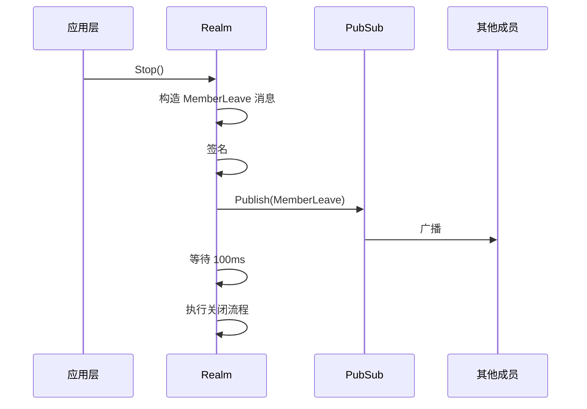

# 断开检测流程 (Disconnect Detection Flow)

> 从检测断开到成员状态更新的完整端到端流程

**创建日期**: 2026-01-28  
**版本**: v1.1.0（BUG-34.1 修正）

---

## 文档定位

本文档是 L3_behavioral 的**纵向流程文档**，专注于描述断开检测的完整行为。

### 与横切面的关系

断开检测贯穿节点生命周期的多个阶段，详见 [lifecycle_overview.md](lifecycle_overview.md)：

| 生命周期阶段 | 断开检测相关内容 | 本文档章节 |
|-------------|-----------------|-----------|
| Phase C: 稳态运行 | 连接健康监控 | [多层次检测架构](#3-多层次检测架构) |
| Phase D: 优雅关闭 | MemberLeave 广播 | [Layer 2: 应用层主动通知](#42-layer-2-应用层主动通知) |
| 异常场景 | 非优雅断开检测 | [Layer 1/3/4](#41-layer-1-传输层检测) |

### 与 L6 的边界

| 本文档 (L3) | L6_domains |
|------------|------------|
| 检测时序、层次架构、事件流 | Swarm 连接管理接口 |
| 见证人投票流程、Quorum 规则 | WitnessService 实现 |
| 重连宽限期、震荡抑制策略 | ConnectionStabilityTracker 实现 |

---

## 1. 概述

### 1.1 检测目标

| 断开类型 | 场景 | 目标检测延迟 |
|---------|------|-------------|
| 优雅断开 | 所有场景 | < 100ms |
| 非优雅断开 | 直连节点 | < 10s |
| 非优雅断开 | Relay 连接 | < 15s |
| 非优雅断开 | 非直连（需见证） | < 20s |

### 1.2 约束条件

1. **CAP 定理限制**：在分区场景下，无法同时保证一致性和可用性
2. **物理定律限制**：非优雅断开无法发送任何信号，只能通过"期望的信号未到达"推断
3. **资源限制**：检测频率越高，网络和 CPU 开销越大

### 1.3 核心原则

| 原则 | 说明 |
|------|------|
| **信任链传递** | 已认证成员广播的其他成员信息应被信任 |
| **断开即离开** | 连接断开时，成员状态必须同步更新为离线 |
| **快速失败** | 检测到连接异常立即处理，不等待超时 |
| **分层检测** | 多层机制互补，兼顾延迟与可靠性 |

> ⚠️ BUG-34.1 修正：原"连接即成员"设计过于严格，已改为"信任链传递"。

---

## 2. 断开场景分类

### 2.1 优雅断开（Graceful Disconnect）

```
┌─────────────────────────────────────────────────────────────────┐
│                       优雅断开场景                               │
├─────────────────────────────────────────────────────────────────┤
│                                                                 │
│  触发条件:                                                      │
│    • 用户主动关闭应用（Ctrl+C、点击关闭）                        │
│    • 应用调用 Node.Stop()                                       │
│    • 系统发送 SIGTERM/SIGINT                                    │
│                                                                 │
│  特征:                                                          │
│    • 应用有机会执行清理逻辑                                     │
│    • 可以发送 MemberLeave 消息                                  │
│    • QUIC/TCP 会发送 CLOSE 帧                                   │
│                                                                 │
│  检测延迟: 可实现 **瞬时** (< 100ms)                            │
│                                                                 │
└─────────────────────────────────────────────────────────────────┘
```

### 2.2 非优雅断开（Ungraceful Disconnect）

```
┌─────────────────────────────────────────────────────────────────┐
│                      非优雅断开场景                              │
├─────────────────────────────────────────────────────────────────┤
│                                                                 │
│  2.2.1 进程崩溃 (Process Crash)                                 │
│  ─────────────────────────────────────────                      │
│    • panic 未恢复                                               │
│    • OOM Killer                                                 │
│    • SIGKILL (kill -9)                                          │
│                                                                 │
│    特征: OS 可能发送 RST/CLOSE，取决于 socket 状态              │
│    检测延迟: 可能瞬时，可能需要等待超时                         │
│                                                                 │
│  2.2.2 网络中断 (Network Partition)                             │
│  ─────────────────────────────────────────                      │
│    • WiFi 断开                                                  │
│    • 4G 信号丢失                                                │
│    • 网线拔出                                                   │
│    • 路由器故障                                                 │
│                                                                 │
│    特征: 完全无信号，只能通过超时检测                           │
│    检测延迟: 必须等待超时                                       │
│                                                                 │
│  2.2.3 硬件故障 (Hardware Failure)                              │
│  ─────────────────────────────────────────                      │
│    • 断电                                                       │
│    • 硬件故障                                                   │
│    • 系统崩溃（蓝屏/内核恐慌）                                  │
│                                                                 │
│    特征: 完全无信号，只能通过超时检测                           │
│    检测延迟: 必须等待超时                                       │
│                                                                 │
└─────────────────────────────────────────────────────────────────┘
```

### 2.3 移动网络场景

```
┌─────────────────────────────────────────────────────────────────────────────┐
│                    移动网络与网络震荡场景                                     │
├─────────────────────────────────────────────────────────────────────────────┤
│                                                                             │
│  2.3.1 基站切换 (Cell Handover)                                             │
│  ─────────────────────────────────────────                                  │
│    触发: 移动设备在不同基站之间移动                                         │
│    特征:                                                                    │
│      • 短暂中断: 通常 100ms ~ 2s                                            │
│      • IP 通常保持不变                                                      │
│      • QUIC 连接可能保持（如果切换足够快）                                  │
│                                                                             │
│    ⚠️ 风险: 可能触发 QUIC Keep-Alive 超时误判                               │
│    ✓ 处理: 超时配置需要容忍短暂中断                                         │
│                                                                             │
│  2.3.2 4G/WiFi 切换 (Network Type Switch)                                   │
│  ─────────────────────────────────────────                                  │
│    触发: 设备从移动网络切换到 WiFi，或反之                                  │
│    特征:                                                                    │
│      • 中断时间: 2s ~ 10s                                                   │
│      • IP 地址变化（几乎必然）                                              │
│      • 旧连接将完全断开                                                     │
│                                                                             │
│    ⚠️ 风险: 被误判为永久离线                                                │
│    ✓ 处理: 重连宽限期 + QUIC 连接迁移                                       │
│                                                                             │
│  2.3.3 网络震荡 (Network Flapping)                                          │
│  ─────────────────────────────────────────                                  │
│    触发: 弱信号区域、网络拥塞、设备休眠唤醒                                 │
│    特征: 短时间内多次断开/重连                                              │
│                                                                             │
│    ⚠️ 风险: 见证风暴、成员列表频繁变化                                      │
│    ✓ 处理: 抖动抑制 + 震荡检测                                              │
│                                                                             │
└─────────────────────────────────────────────────────────────────────────────┘
```

---

## 3. 多层次检测架构

### 3.1 架构总览

```
┌─────────────────────────────────────────────────────────────────────────────┐
│                          多层次离线检测架构                                  │
├─────────────────────────────────────────────────────────────────────────────┤
│                                                                             │
│  ┌─────────────────────────────────────────────────────────────────────┐   │
│  │ Layer 1: 传输层检测 (Transport Layer)                                │   │
│  │ ──────────────────────────────────────────────────────────────────── │   │
│  │ • QUIC CLOSE 帧检测（优雅断开）                                      │   │
│  │ • QUIC Keep-Alive（非优雅断开）                                      │   │
│  │ • 延迟: 瞬时 ~ 10s                                                   │   │
│  └─────────────────────────────────────────────────────────────────────┘   │
│                                    ↓                                        │
│  ┌─────────────────────────────────────────────────────────────────────┐   │
│  │ Layer 2: 应用层主动通知 (Application Layer Notification)            │   │
│  │ ──────────────────────────────────────────────────────────────────── │   │
│  │ • MemberLeave 广播（优雅断开时主动发送）                             │   │
│  │ • 延迟: 瞬时                                                         │   │
│  └─────────────────────────────────────────────────────────────────────┘   │
│                                    ↓                                        │
│  ┌─────────────────────────────────────────────────────────────────────┐   │
│  │ Layer 3: 见证人网络 (Witness Network)                                │   │
│  │ ──────────────────────────────────────────────────────────────────── │   │
│  │ • 最快检测到离线的节点广播 WitnessReport                             │   │
│  │ • 多数见证确认机制                                                   │   │
│  │ • 延迟: 1-5s                                                         │   │
│  └─────────────────────────────────────────────────────────────────────┘   │
│                                    ↓                                        │
│  ┌─────────────────────────────────────────────────────────────────────┐   │
│  │ Layer 4: 应用层心跳 (Application Layer Heartbeat)                    │   │
│  │ ──────────────────────────────────────────────────────────────────── │   │
│  │ • Liveness Ping 定期检测                                             │   │
│  │ • 兜底机制                                                           │   │
│  │ • 延迟: 配置周期（默认 30s）                                         │   │
│  └─────────────────────────────────────────────────────────────────────┘   │
│                                                                             │
│  事件流:                                                                    │
│    任一层检测到断开 → EvtPeerDisconnected → MemberManager.Remove()         │
│                                                                             │
└─────────────────────────────────────────────────────────────────────────────┘
```

### 3.2 各层职责

| 层级 | 职责 | 触发条件 | 延迟 | 可靠性 |
|-----|------|---------|------|--------|
| L1 传输层 | 底层连接状态监控 | 协议事件 | 瞬时~10s | 高 |
| L2 应用通知 | 优雅断开预通知 | 应用主动发送 | 瞬时 | 中（仅优雅断开） |
| L3 见证人 | 快速传播离线信息 | 见证人报告 | 1-5s | 中（需多数确认） |
| L4 应用心跳 | 兜底检测 | 定时器 | 30s | 高 |

---

## 4. 各层检测机制

### 4.1 Layer 1: 传输层检测

#### 4.1.1 QUIC Keep-Alive 配置

```
配置推荐值：

┌──────────────┬─────────────────┬────────────────┬───────────────┐
│ 场景         │ KeepAlivePeriod │ MaxIdleTimeout │ 最长检测延迟   │
├──────────────┼─────────────────┼────────────────┼───────────────┤
│ 实时性优先   │ 2s              │ 4s             │ ~6s           │
│ 平衡配置     │ 3s              │ 6s             │ ~9s           │
│ 资源节省     │ 5s              │ 10s            │ ~15s          │
└──────────────┴─────────────────┴────────────────┴───────────────┘

检测延迟计算：
  延迟 ≈ KeepAlivePeriod + (2~3) × PTO
  PTO (Probe Timeout) 通常为 1-2s
```

#### 4.1.2 网络开销分析

```
QUIC Keep-Alive 包大小: ~20 bytes (PING frame + header)

场景：100 个连接，3s 间隔
每秒流量 = 100 × 20 bytes / 3s ≈ 667 bytes/s ≈ 5.3 kbps

结论：网络开销可忽略不计
```

### 4.2 Layer 2: 应用层主动通知

#### 4.2.1 MemberLeave 协议

```
MemberLeave 消息格式:

┌────────────┬──────────┬────────────┬──────────────┬───────────┐
│ peer_id    │ realm_id │ reason     │ timestamp    │ signature │
│ (string)   │ (string) │ (enum)     │ (int64)      │ (bytes)   │
└────────────┴──────────┴────────────┴──────────────┴───────────┘

LeaveReason 枚举:
  GRACEFUL = 1     // 主动关闭
  KICKED = 2       // 被踢出
  WITNESS = 3      // 见证人报告
```

#### 4.2.2 发送时序



#### 4.2.3 接收处理

1. **签名验证**：验证消息签名有效性
2. **时间戳检查**：拒绝超过 30s 的过期消息（防重放）
3. **成员移除**：调用 MemberManager.Remove()

### 4.3 Layer 3: 见证人机制

#### 4.3.1 核心思想

```
┌─────────────────────────────────────────────────────────────────────────────┐
│                          见证人机制核心思想                                  │
├─────────────────────────────────────────────────────────────────────────────┤
│                                                                             │
│  问题：                                                                     │
│    节点 A 断开时，与 A 直连的节点能立即感知，但与 A 非直连的节点需要更长     │
│    时间才能检测到。                                                          │
│                                                                             │
│  解决：                                                                     │
│    让"最先知道"的节点作为"见证人"，广播离线信息给其他节点。                 │
│                                                                             │
│  挑战：                                                                     │
│    1. 如何防止恶意节点伪造离线报告？→ 多数确认                              │
│    2. 如何处理网络分区导致的"误判"？→ 自适应 Quorum                         │
│    3. 如何避免"见证人风暴"？→ 延迟广播                                      │
│                                                                             │
└─────────────────────────────────────────────────────────────────────────────┘
```

#### 4.3.2 WitnessReport 协议

```
WitnessReport 消息格式:

┌─────────────┬───────────┬───────────┬────────────┬─────────────┬───────────┐
│ witness_id  │ target_id │ realm_id  │ method     │ detected_at │ signature │
│ (string)    │ (string)  │ (string)  │ (enum)     │ (int64)     │ (bytes)   │
└─────────────┴───────────┴───────────┴────────────┴─────────────┴───────────┘

DetectionMethod 枚举:

  高可信（明确关闭信号）:
    QUIC_CLOSE = 1        // QUIC CONNECTION_CLOSE 帧
    TCP_RST = 5           // TCP RST（连接重置）
    GRACEFUL_SHUTDOWN = 7 // 应用层优雅关闭

  低可信（可能因网络问题触发）:
    QUIC_TIMEOUT = 2      // QUIC 超时（⚠️ 不用于快速路径）
    PING_FAILED = 3       // Ping 失败
    RELAY_TIMEOUT = 8     // Relay Circuit 超时
```

#### 4.3.3 见证人选举

```
┌─────────────────────────────────────────────────────────────────────────────┐
│                          见证人选举机制                                      │
├─────────────────────────────────────────────────────────────────────────────┤
│                                                                             │
│  规则：与断开节点有 **直连** 的节点才有资格成为见证人                        │
│                                                                             │
│  延迟广播策略（避免见证人风暴）：                                           │
│  ─────────────────────────────────────────────────                          │
│  检测到断开后，计算广播延迟：                                               │
│                                                                             │
│    delay = hash(witness_id + target_id + timestamp) % MAX_DELAY             │
│    MAX_DELAY = 500ms                                                        │
│                                                                             │
│  - 每个见证人延迟不同                                                       │
│  - 第一个广播的见证人"获胜"                                                 │
│  - 其他见证人收到报告后取消自己的广播                                       │
│                                                                             │
└─────────────────────────────────────────────────────────────────────────────┘
```

#### 4.3.4 多数确认机制（Quorum）

```
┌─────────────────────────────────────────────────────────────────────────────┐
│                        多数确认机制 (Quorum)                                 │
├─────────────────────────────────────────────────────────────────────────────┤
│                                                                             │
│  WitnessConfirmation 消息:                                                  │
│  ─────────────────────────                                                  │
│  ┌─────────────┬───────────┬───────────┬──────────────┬───────────┐        │
│  │ confirmer_id│ target_id │ type      │ timestamp    │ signature │        │
│  │ (string)    │ (string)  │ (enum)    │ (int64)      │ (bytes)   │        │
│  └─────────────┴───────────┴───────────┴──────────────┴───────────┘        │
│                                                                             │
│  ConfirmationType:                                                          │
│    AGREE = 1      // 同意（我也检测到离线）                                 │
│    DISAGREE = 2   // 不同意（我仍能连接到目标）                             │
│    ABSTAIN = 3    // 弃权（我与目标无连接）                                 │
│                                                                             │
│  确认流程：                                                                 │
│  ──────────                                                                 │
│  1. 收到 WitnessReport                                                      │
│  2. 如果与目标有连接：尝试 Ping                                             │
│     - Ping 成功 → DISAGREE                                                 │
│     - Ping 失败 → AGREE                                                    │
│  3. 如果无连接：                                                            │
│     - 通过 Relay 代理探测 → AGREE/DISAGREE                                 │
│     - 无法探测 → ABSTAIN                                                   │
│  4. 发送 WitnessConfirmation                                                │
│                                                                             │
│  投票规则：                                                                 │
│  ──────────                                                                 │
│  有效票数 = AGREE + DISAGREE （排除 ABSTAIN）                               │
│  同意比例 = AGREE / 有效票数                                                │
│                                                                             │
│  确认条件（满足任一）：                                                     │
│  1. 有效票数 >= 2 且 同意比例 > 50%                                         │
│  2. 单票高可信见证人（快速路径）                                            │
│                                                                             │
│  确认超时: 2s                                                               │
│                                                                             │
└─────────────────────────────────────────────────────────────────────────────┘
```

#### 4.3.5 快速路径优化

```
┌─────────────────────────────────────────────────────────────────────────────┐
│                          快速路径优化                                        │
├─────────────────────────────────────────────────────────────────────────────┤
│                                                                             │
│  适用场景：小型 Realm（< 10 个成员）                                        │
│                                                                             │
│  条件（必须全部满足）：                                                     │
│    1. Realm 成员数 < FastPathThreshold (默认 10)                            │
│    2. 见证人是受信任节点（Bootstrap、Relay、或管理员指定）                  │
│    3. 检测方式是**明确关闭信号**：                                          │
│       - QUIC_CLOSE                                                          │
│       - TCP_RST / TCP_FIN                                                   │
│       - GRACEFUL_SHUTDOWN                                                   │
│                                                                             │
│    ⚠️ QUIC_TIMEOUT **不属于高可信检测**                                     │
│       超时可能由网络拥塞、临时丢包、分区引起，不能作为快速路径条件          │
│                                                                             │
│  流程：                                                                     │
│    见证人报告 → 立即接受 → 移除成员                                        │
│    （跳过多数确认）                                                         │
│                                                                             │
└─────────────────────────────────────────────────────────────────────────────┘
```

### 4.4 Layer 4: 应用层心跳

#### 4.4.1 Liveness Ping

```
作用：兜底检测机制，确保没有遗漏的断开

配置：
  ConnHealthInterval: 30s    // 检测间隔
  ConnHealthTimeout:  10s    // 单次超时

流程：
  1. 定时器触发
  2. 遍历所有连接
  3. 并发发送 Ping
  4. 超时或失败 → EvtPeerDisconnected
```

---

## 5. 重连宽限期机制

### 5.1 设计目的

防止移动网络切换（如 4G 切 WiFi）导致的短暂断开被误判为永久离线。

### 5.2 状态转换

```
成员连接状态转换：

    CONNECTED ─(断开)─▶ DISCONNECTING ─(宽限期超时)─▶ DISCONNECTED
                              │
                              └─(重连成功)─▶ CONNECTED
```

### 5.3 时序图

```
    节点 A (4G切WiFi)              其他节点
         │                            │
    T+0s │ QUIC 连接断开              │ 检测到断开
         │                            │
         │                            │ 启动宽限期定时器 (15s)
         │                            │ 标记状态: DISCONNECTING
         │                            │
    T+3s │ WiFi 连接建立              │
         │ 重新连接 ─────────────────▶│ 取消宽限期定时器
         │                            │ 恢复状态: CONNECTED
         │                            │
         │       [未移除成员，连接恢复]
```

### 5.4 配置参数

| 参数 | 默认值 | 说明 |
|-----|-------|------|
| ReconnectGracePeriod | 15s | 宽限期时长 |
| MaxGracePeriodExtensions | 2 | 最多延长次数 |

---

## 6. 震荡检测与抖动抑制

### 6.1 震荡定义

```
震荡判定：T 时间内发生 N 次以上的断开/重连
默认阈值：60s 内 >= 3 次断开/重连 → 判定为震荡
```

### 6.2 ConnectionStability 状态机

```
┌─────────┐                    ┌───────────┐                    ┌───────────┐
│ Stable  │─(1次断开/重连)────▶│ Unstable  │─(达到阈值)────────▶│ Flapping  │
│         │◀─(5分钟无震荡)────│           │◀─(恢复中)─────────│           │
└─────────┘                    └───────────┘                    └───────────┘
```

### 6.3 震荡处理策略

| 状态 | 见证报告处理 | 成员状态 |
|------|-------------|---------|
| Stable | 正常流程 | 正常更新 |
| Unstable | 延迟广播 (debounce 5s) | 保持不变 |
| Flapping | 不广播，本地记录 | 标记为不稳定 |

### 6.4 抖动抑制（Debounce）

```
断开事件 ─▶ 启动 debounce 定时器 (5s)
                 │
                 ├─ 5s 内重连 ─▶ 取消，不触发见证报告
                 │
                 └─ 5s 后仍断开 ─▶ 触发见证报告
```

### 6.5 震荡恢复

```
连续 5 分钟无震荡 → 状态从 Flapping 恢复到 Stable
```

---

## 7. 成员状态与连接状态同步

### 7.1 不变量：信任链传递

```
核心原则（v1.1 修正）：

  成员可见性 = (有活跃连接 ∨ 由可信成员广播) ∧ 通过认证
  成员离线状态 = 连接断开 ∧ 断开保护期过期

⚠️ BUG-34.1 修正：原"有连接才能是成员"设计过于严格，
   阻止了正常的 PubSub 成员同步，已移除"必须有活跃连接"检查。
   详见 INV-003-connection-membership.md
```

### 7.2 断开保护期

```
目的：防止 PubSub/DHT 缓存数据导致刚断开的成员被重新添加

机制：
  1. 检测到断开时，记录 peerID 到 recentlyDisconnected 列表
  2. Add() 时检查是否在保护期内
  3. 保护期内的 Add() 被静默忽略
  4. 保护期默认 30s，超时后自动清理

代码逻辑：
  func (m *Manager) Add(memberInfo) {
      // 检查防误判机制（震荡检测、宽限期）
      if antiFalsePositive.ShouldRejectAdd(memberInfo.PeerID) {
          return nil  // 静默忽略
      }
      
      // 检查断开保护期
      if disconnectTime, ok := recentlyDisconnected[memberInfo.PeerID]; ok {
          if time.Since(disconnectTime) < DisconnectProtection {
              return nil  // 静默忽略
          }
      }
      
      // ★ BUG-34.1 修正：移除"必须有活跃连接"检查
      // 成员同步基于信任链传递，由以下保护机制保障：
      //   1. 断开保护期 - 已断开的成员在保护期内不会被重新添加
      //   2. 防误判机制 - 震荡检测 + 宽限期
      //   3. PubSub 验证 - 只接受来自已知成员的广播
      
      // 正常添加
      ...
  }
```

---

## 8. 分区场景处理

### 8.1 分区类型

```
┌─────────────────────────────────────────────────────────────────────────────┐
│                          网络分区类型                                        │
├─────────────────────────────────────────────────────────────────────────────┤
│                                                                             │
│  1. 对称分区                                                                │
│  ────────────                                                               │
│     A ← ✗ → B    双向都不可达                                               │
│     结果：双方都会判定对方离线                                              │
│                                                                             │
│  2. 非对称分区                                                              │
│  ────────────                                                               │
│     A → B (可达)                                                            │
│     A ← B (不可达)                                                          │
│     结果：B 判定 A 离线，A 认为 B 在线                                       │
│                                                                             │
│  3. 部分分区                                                                │
│  ────────────                                                               │
│     A ← ✗ → B                                                               │
│     A ← ─ → C                                                               │
│     B ← ─ → C                                                               │
│     结果：A 和 B 无法通信，但都能通过 C 间接通信                            │
│                                                                             │
└─────────────────────────────────────────────────────────────────────────────┘
```

### 8.2 误判规避策略

```
┌─────────────────────────────────────────────────────────────────────────────┐
│                          误判规避策略                                        │
├─────────────────────────────────────────────────────────────────────────────┤
│                                                                             │
│  1. 多路径探测                                                              │
│  ────────────────                                                           │
│     收到见证报告后，不仅尝试直连 Ping，还通过：                              │
│     - Relay 代理探测                                                        │
│     - Bootstrap 节点中转探测                                                │
│     - 其他已知路径探测                                                      │
│                                                                             │
│  2. 延迟确认                                                                │
│  ────────────                                                               │
│     低可信检测方式（TIMEOUT）需要更长确认时间和更多确认票数                 │
│                                                                             │
│  3. 分区模式检测                                                            │
│  ────────────────                                                           │
│     如果短时间内收到大量不同目标的见证报告，可能是分区而非真实离线          │
│     此时进入"分区模式"，提高确认阈值                                        │
│                                                                             │
│  4. 重连优先                                                                │
│  ────────────                                                               │
│     即使被判定为离线，节点重连时仍可重新加入                                │
│     分区恢复后，系统能自动恢复一致状态                                       │
│                                                                             │
└─────────────────────────────────────────────────────────────────────────────┘
```

---

## 9. 完整时序图

### 9.1 优雅断开

```
┌──────────┐         ┌──────────┐         ┌──────────┐
│  节点 A   │         │  Relay   │         │  节点 B   │
│(即将关闭) │         │          │         │          │
└────┬─────┘         └────┬─────┘         └────┬─────┘
     │                    │                    │
     │ 1. BroadcastMemberLeave ───────────────▶│
     │                    │                    │
     │                    │                    │ 2. 收到离线通知
     │                    │                    │    更新成员列表
     │                    │                    │
     │ 3. QUIC CLOSE ─────┼───────────────────▶│
     │                    │                    │
     │ 4. Stop()          │                    │ 5. EvtPeerDisconnected
     │                    │                    │    (已提前处理)
     ▼                    │                    ▼
  [已关闭]                 │               [A 已移除]
                          │
          总延迟: < 100ms
```

### 9.2 非优雅断开（使用见证人）

```
┌──────────┐         ┌──────────┐         ┌──────────┐
│  节点 A   │         │  节点 B   │         │  节点 C   │
│ (断网)   │         │(见证人)   │         │          │
└────┬─────┘         └────┬─────┘         └────┬─────┘
     │                    │                    │
     ✗ (网络中断)         │                    │
     │                    │                    │
     │                    │ 1. QUIC Keep-Alive │
     │                    │    超时检测到断开   │
     │                    │                    │
     │                    │ 2. WitnessReport ─▶│
     │                    │    (延迟后广播)     │
     │                    │                    │
     │                    │                    │ 3. 收到报告
     │                    │                    │    尝试 Ping A
     │                    │                    │
     │                    │◀─ Confirmation ───│ 4. Ping 失败
     │                    │    AGREE           │    发送 AGREE
     │                    │                    │
     │                    │ 5. 收集到多数确认   │
     │                    │    广播确认结果     │
     │                    │                    │
     │                    │                    │ 6. 更新成员列表
     ▼                    ▼                    ▼
  [已断开]            [A 已移除]           [A 已移除]

          总延迟: 9s (QUIC超时) + 2s (确认) ≈ 11s
```

---

## 10. 配置参考

```yaml
# 断开检测完整配置
disconnect_detection:

  # Layer 1: QUIC Keep-Alive
  quic:
    keep_alive_period: 3s      # 心跳间隔
    max_idle_timeout: 6s       # 空闲超时
    allow_connection_migration: true

  # Layer 2: MemberLeave 广播
  member_leave:
    enabled: true
    wait_before_close: 100ms   # 关闭前等待消息传播

  # Layer 3: 见证人机制
  witness:
    enabled: true
    max_broadcast_delay: 500ms # 最大广播延迟
    confirmation_timeout: 2s   # 确认收集超时
    fast_path_threshold: 10    # 快速路径成员数阈值
    trusted_witnesses: []      # 受信任见证人列表

  # Layer 4: 应用层心跳
  liveness:
    interval: 30s
    timeout: 10s

  # 重连宽限期
  reconnect_grace_period: 15s
  max_grace_extensions: 2

  # 震荡检测
  flap_detection:
    enabled: true
    window_duration: 60s       # 检测窗口
    threshold: 3               # 触发阈值
    recovery_duration: 300s    # 恢复时间

  # 抖动抑制
  debounce:
    disconnect_delay: 5s
    reconnect_cancel: true

  # 断开保护期
  disconnect_protection: 30s
```

---

## 11. 关联文档

| 类型 | 文档 | 说明 |
|------|------|------|
| 行为设计 | [connection_flow.md](connection_flow.md) | 连接建立流程 |
| 行为设计 | [realm_flow.md](realm_flow.md) | 成员管理流程 |
| 行为设计 | [lifecycle_overview.md](lifecycle_overview.md) | 节点生命周期 |
| 状态机 | [state_machines.md](state_machines.md) | ConnectionStability 状态机 |
| 协议约束 | [../../02_constraints/protocol/L4_application/liveness.md](../../02_constraints/protocol/L4_application/liveness.md) | 存活检测协议 |
| 协议约束 | [../../02_constraints/protocol/L2_transport/quic.md](../../02_constraints/protocol/L2_transport/quic.md) | QUIC 传输协议 |
| 需求 | [../../01_context/requirements/functional/F3_network/REQ-NET-007.md](../../01_context/requirements/functional/F3_network/REQ-NET-007.md) | 快速断开检测需求 |
| 决策 | [../../01_context/decisions/ADR-0012-disconnect-detection.md](../../01_context/decisions/ADR-0012-disconnect-detection.md) | 架构决策 |

---

**最后更新**: 2026-01-29（BUG-34.1 修正：信任链传递设计）
