# 节点发现流程 (Discovery Flow)

> 节点发现、地址更新和传播的端到端流程

---

## 文档定位

本文档是 L3_behavioral 的**纵向流程文档**，专注于描述节点发现的完整行为。

### 与横切面的关系

节点发现贯穿多个生命周期阶段，详见 [lifecycle_overview.md](lifecycle_overview.md)：

| 生命周期阶段 | 发现相关内容 | 本文档章节 |
|-------------|-------------|-----------|
| Phase A: 冷启动 | Bootstrap 连接、DHT 入网 | [Bootstrap 发现流程](#bootstrap-发现流程) |
| Phase A: 冷启动 | DHT 发布 | [DHT 发现流程](#dht-发现流程) |
| Phase B: Realm 加入 | 成员发现、DHT 发布 | [Realm 内发现优先级](#realm-内发现优先级v20-更新) |
| Phase C: 稳态运行 | 地址续期、K-Bucket 刷新 | [发现状态机](#发现状态机) |

### 与 L6 的边界

| 本文档 (L3) | L6_domains |
|------------|------------|
| 发现优先级、发现行为 | Bootstrap 接口定义 |
| Bootstrap 连接流程 | DHT 数据结构 |
| "仅 ID 连接"边界 | Peerstore API |

> Bootstrap/DHT 接口详情参见 [L6_domains/discovery_coordinator](../L6_domains/discovery_coordinator/design/overview.md)

---

## 流程概述

节点发现是 P2P 网络的核心能力，DeP2P 支持多种发现机制，并针对 **Realm 架构** 进行了专门优化。

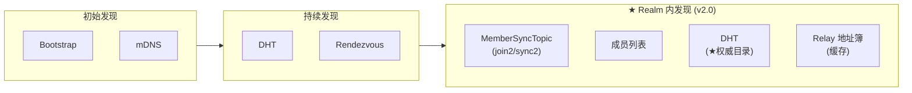

### 发现机制

| 机制 | 适用场景 | 发现范围 | 独立开关 |
|------|----------|----------|:--------:|
| **Bootstrap** | 节点启动（广域网） | 初始 DHT 入口 | ✓ |
| **mDNS** | 局域网发现 | 同网段节点 | ✓ |
| **DHT** | 全网发现 | 任意 NodeID | - |
| **Rendezvous** | 命名空间 | Realm 成员 | - |
| **★ MemberSyncTopic** | 成员地址同步 | 同 Realm 成员 | - |
| **★ MemberList** | Realm 成员发现 | 同 Realm 成员 | - |
| **★ DHT** | Realm 地址查询（★ 权威目录） | 同 Realm 成员 | - |
| **★ Relay 地址簿** | Realm 地址缓存（非权威） | 同 Realm 成员 | - |

### 参与组件

| 组件 | 目录 | 职责 |
|------|------|------|
| **Coordinator** | `internal/discovery/coordinator/` | 发现协调（统一调度） |
| **Bootstrap** | `internal/discovery/bootstrap/` | 初始节点连接 |
| **DHT** | `internal/discovery/dht/` | Kademlia DHT |
| **mDNS** | `internal/discovery/mdns/` | 局域网发现 |
| **Rendezvous** | `internal/discovery/rendezvous/` | 命名空间发现 |
| **Peerstore** | `internal/core/peerstore/` | 地址簿管理 |

### Discovery 域架构

```
┌─────────────────────────────────────────────────────────────────────────────┐
│                         Discovery 域架构                                     │
├─────────────────────────────────────────────────────────────────────────────┤
│                                                                             │
│  internal/discovery/                                                         │
│  ─────────────────────────────────────────                                  │
│                                                                             │
│  ┌───────────────────────┐                                                  │
│  │     coordinator/      │  ←── 发现协调器（统一调度）                        │
│  │                       │                                                  │
│  │  • FindPeers()        │                                                  │
│  │  • Advertise()        │                                                  │
│  └─────────┬─────────────┘                                                  │
│            │                                                                │
│            ├────────────┬────────────┬────────────┐                         │
│            ↓            ↓            ↓            ↓                         │
│  ┌─────────────┐ ┌──────────┐ ┌───────────┐ ┌─────────────┐                │
│  │   dht/      │ │bootstrap/│ │   mdns/   │ │ rendezvous/ │                │
│  │ (Kademlia)  │ │(引导节点) │ │ (局域网)  │ │ (命名空间)  │                │
│  └─────────────┘ └──────────┘ └───────────┘ └─────────────┘                │
│                                                                             │
│  Core ↔ Discovery 双向协作                                                   │
│                                                                             │
└─────────────────────────────────────────────────────────────────────────────┘
```

---

## ★ Realm 内"仅 ID 连接"发现流程

DeP2P 支持在 **Realm 内** 使用纯 NodeID 进行连接，无需预先知道目标地址。

### 核心设计原则

```
┌─────────────────────────────────────────────────────────────────────────────┐
│                    "仅 ID 连接"的严格边界                                    │
├─────────────────────────────────────────────────────────────────────────────┤
│                                                                             │
│  ★ 关键认知：Realm 是业务边界，"仅 ID 连接"严格限制在 Realm 内              │
│                                                                             │
│  Realm 内（允许）：                                                          │
│  ═══════════════════                                                        │
│  realm.Connect(nodeID)  ← ✅ 允许，系统自动发现地址                         │
│                                                                             │
│  • 同 Realm 成员共享 PSK，有信任基础                                       │
│  • 可通过 MemberList、Relay 地址簿发现地址                                 │
│  • 最终可通过 Relay 保底                                                   │
│                                                                             │
│  跨 Realm（禁止）：                                                          │
│  ═══════════════════                                                        │
│  node.Connect(nodeID)   ← ❌ 禁止，必须提供地址                             │
│  node.Connect(multiaddr) ← ✅ 必须明确提供地址                              │
│                                                                             │
│  • 不同 Realm 无信任基础                                                   │
│  • 没有共享的发现机制                                                      │
│  • 没有共享的 Relay 保底                                                   │
│                                                                             │
│  这是刻意的设计限制，不是功能缺失                                           │
│                                                                             │
└─────────────────────────────────────────────────────────────────────────────┘
```

### Realm 内发现优先级（v2.0 更新）

```
┌─────────────────────────────────────────────────────────────────────────────┐
│                    Realm 内地址发现优先级（v2.0 DHT 权威模型）               │
├─────────────────────────────────────────────────────────────────────────────┤
│                                                                             │
│  ★ v2.0 三层架构：                                                          │
│  Layer 1: DHT（★ 权威目录）— 存储签名 PeerRecord                             │
│  Layer 2: 缓存加速层 — Peerstore / MemberList / Relay 地址簿                 │
│  Layer 3: 连接策略 — 直连 → 打洞 → Relay 兜底                                │
│                                                                             │
│  realm.Connect(targetNodeID) 触发以下发现流程：                             │
│                                                                             │
│  优先级 1: Peerstore 本地缓存                                               │
│  ════════════════════════════                                               │
│  • 最近连接过的地址                                                        │
│  • 零网络开销，最快                                                        │
│  • TTL 管理，避免使用过期地址                                              │
│                                                                             │
│  优先级 2: MemberList 成员列表                                              │
│  ═══════════════════════════════                                            │
│  • Realm 成员加入时交换的地址信息                                          │
│  • 通过 Gossip 协议保持同步                                                │
│  • 相对实时，但可能不完整                                                  │
│  • 来源：MemberSync(join2/sync2) + Join                                    │
│                                                                             │
│  优先级 3: DHT 查询（★ 权威来源）                                           │
│  ═════════════════════════════════════════                                  │
│  • 查询 DHT（Key = /dep2p/v2/realm/<H(RealmID)>/peer/<NodeID>）            │
│  • 返回签名 PeerRecord（防投毒、防伪造）                                   │
│  • ★ DHT 是权威目录，其他来源是缓存                                        │
│                                                                             │
│  优先级 4: Relay 地址簿（缓存回退）                                         │
│  ═══════════════════════════════════                                        │
│  • 向 Relay 查询目标地址（作为 DHT 本地缓存）                              │
│  • ★ Relay 地址簿是缓存，不是权威目录                                      │
│  • DHT 失败时作为回退                                                      │
│                                                                             │
└─────────────────────────────────────────────────────────────────────────────┘
```

### ★ 地址传播闭环（直连前提）

Realm 内“仅 ID 连接”依赖**地址传播闭环**把地址沉淀到 Peerstore/MemberList/Relay：

```
┌─────────────────────────────────────────────────────────────────────────────┐
│                    地址传播闭环（Address Propagation Loop）                  │
├─────────────────────────────────────────────────────────────────────────────┤
│                                                                             │
│  1) 连接建立后 Identify 交换地址                                             │
│     - ListenAddrs / ObservedAddr                                             │
│                                                                             │
│  2) 写入 Peerstore（ConnectedAddrTTL）                                       │
│                                                                             │
│  3) MemberSync 传播（join2/sync2 携带地址）                                  │
│     - 其他成员入库 Peerstore                                                 │
│                                                                             │
│  4) Relay AddressBook 注册/查询                                              │
│     - 作为地址发现最后一层兜底                                                │
│                                                                             │
│  结果：外部节点可获取目标地址并优先尝试直连                                  │
│                                                                             │
└─────────────────────────────────────────────────────────────────────────────┘
```

### 地址传播闭环时序

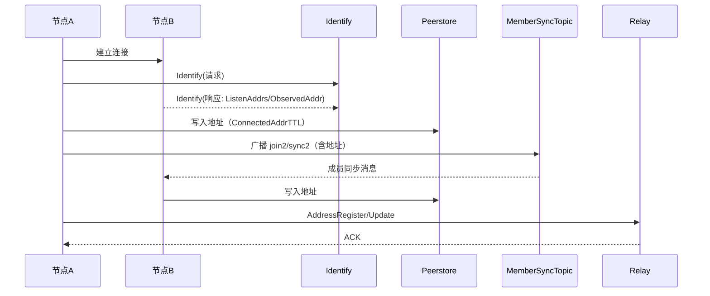

### ★ 地址验证策略（v1.2 架构优化）

发现过程中涉及的地址有不同的验证级别和优先级：

```
┌─────────────────────────────────────────────────────────────────────────────┐
│                    地址验证策略（v1.2 架构优化）                              │
├─────────────────────────────────────────────────────────────────────────────┤
│                                                                             │
│  ★ v1.2 关键变更：STUN 即验证                                               │
│  ═══════════════════════════════                                            │
│  旧架构问题（v1.1）：                                                       │
│    STUN 地址 → candidateAddrs → 等待 dial-back 验证 → 无协助节点            │
│                                                        → 永远无法发布！      │
│                                                                             │
│  新架构（v1.2）：                                                           │
│    STUN 地址 → 直接标记为已验证 → 可立即发布到 DHT                          │
│                                                                             │
│  原理：STUN 协议本身就是第三方验证机制，无需额外 dial-back                  │
│                                                                             │
│  ★ 地址优先级体系                                                           │
│  ═══════════════════                                                        │
│                                                                             │
│  优先级    类型                      验证方式                可发布？       │
│  ──────────────────────────────────────────────────────────────────────    │
│  150      ConfiguredAdvertise       用户配置                 ✅             │
│  100      VerifiedDirect            dial-back 验证           ✅             │
│  75       ★ STUNDiscovered          STUN 协议验证            ✅ ← v1.2新增   │
│  50       RelayGuarantee            Relay 连接               ✅             │
│  10       LocalListen               无验证                   ⚠️ 仅局域网     │
│  0        Unverified                待验证                   ❌             │
│                                                                             │
│  ★ 关键约束（保持不变）：                                                   │
│  ═══════════════════════════════════════════════════════════════════════   │
│  DHT/Relay 地址簿只能发布 优先级 >= 50 的地址                               │
│  • 75 (STUNDiscovered) ≥ 50 ✅ 可发布                                       │
│  • 0 (Unverified) < 50 ❌ 不可发布                                          │
│                                                                             │
│  不可达节点的发布策略（保持不变）：                                          │
│  ─────────────────────────────────                                          │
│  如果 STUN 失败且无直连验证，则发布 Relay 地址而非直连地址                  │
│  这确保其他节点总是能通过 Relay 找到并连接该节点                            │
│                                                                             │
└─────────────────────────────────────────────────────────────────────────────┘
```

### 地址状态流转（v1.2 更新）

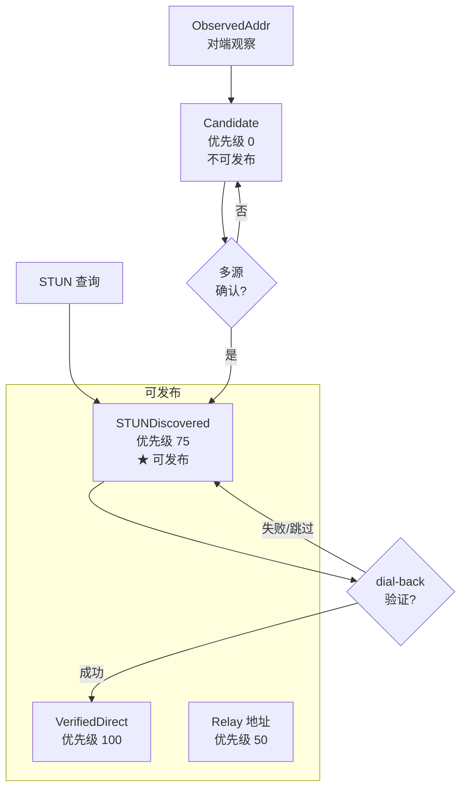

### ★ ObservedAddr 使用警告

```
┌─────────────────────────────────────────────────────────────────────────────┐
│                    ObservedAddr 使用警告（来源不可靠）                       │
├─────────────────────────────────────────────────────────────────────────────┤
│                                                                             │
│  Identify 协议返回的 ObservedAddr 存在以下风险：                            │
│                                                                             │
│  1. 对端可能恶意伪造地址                                                    │
│  2. NAT 映射可能已过期                                                      │
│  3. 可能返回内网地址（对方在同一 NAT 后）                                   │
│                                                                             │
│  正确使用方式：                                                              │
│  ─────────────                                                              │
│  • ObservedAddr 必须标记为 Candidate 状态                                   │
│  • 需要多源验证（多个对端报告相同地址）                                     │
│  • 最终需要 Reachability 验证才能发布                                       │
│                                                                             │
└─────────────────────────────────────────────────────────────────────────────┘
```

### Realm 内连接完整流程

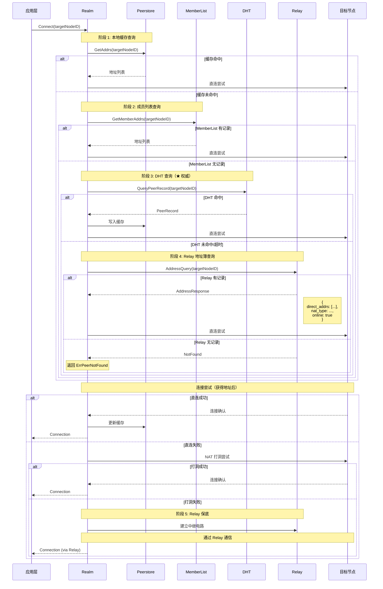

### "仅 ID 连接"的 API 设计

```pseudocode
// ════════════════════════════════════════════════════════════════════════════
// Realm 内：允许"仅 ID 连接"
// ════════════════════════════════════════════════════════════════════════════

realm = node.JoinRealm(ctx, "my-realm", psk)

// ✅ 允许：Realm 内使用纯 NodeID
realm.Connect(ctx, targetNodeID)
// 系统自动：Peerstore → MemberList → DHT（权威）→ Relay 地址簿（缓存）→ 直连 → 打洞 → Relay 保底

// ✅ 允许：也可以提供地址提示
realm.ConnectWithHint(ctx, targetNodeID, ["/ip4/1.2.3.4/tcp/4001"])


// ════════════════════════════════════════════════════════════════════════════
// 跨 Realm / 节点级：必须提供地址
// ════════════════════════════════════════════════════════════════════════════

// ❌ 禁止：跨 Realm 不允许纯 NodeID
node.Connect(ctx, targetNodeID)  // 返回 ErrAddressRequired

// ✅ 必须：提供完整地址
node.Connect(ctx, "/ip4/1.2.3.4/tcp/4001/p2p/QmTarget...")

// ✅ 或者：使用 ConnectionTicket（包含地址提示）
node.Connect(ctx, "dep2p://QmTarget.../addr/1.2.3.4:4001")
```

### 为什么这样设计？

```
┌─────────────────────────────────────────────────────────────────────────────┐
│                    "仅 ID 连接"边界设计的理由                                │
├─────────────────────────────────────────────────────────────────────────────┤
│                                                                             │
│  1. 信任边界                                                                │
│     • Realm 内：共享 PSK，互相信任                                         │
│     • 跨 Realm：无信任基础，需要明确授权                                   │
│                                                                             │
│  2. 发现可行性                                                              │
│     • Realm 内：有 MemberList、Relay 地址簿，发现有保障                    │
│     • 跨 Realm：没有共享的发现机制，发现不可靠                             │
│                                                                             │
│  3. 保底机制                                                                │
│     • Realm 内：有 Relay 保底，总是可达                                    │
│     • 跨 Realm：没有共享的 Relay，无法保底                                 │
│                                                                             │
│  4. 安全考虑                                                                │
│     • 限制"仅 ID 连接"范围，避免被滥用                                     │
│     • 跨 Realm 需要明确意图，防止误连                                      │
│                                                                             │
│  结论：这是刻意的设计限制，体现了 Realm 作为业务边界的核心理念              │
│                                                                             │
└─────────────────────────────────────────────────────────────────────────────┘
```

---

## Bootstrap 设计原则

```
┌─────────────────────────────────────────────────────────────────────────────┐
│                    Bootstrap 设计原则                                        │
├─────────────────────────────────────────────────────────────────────────────┤
│                                                                             │
│  定位：                                                                      │
│  • Bootstrap 是【冷启动】问题的解决方案                                      │
│  • 是广域网入口，被动兜底能力                                                │
│  • 如果已知目标地址，可以不使用 Bootstrap                                   │
│                                                                             │
│  分层设计：                                                                  │
│  • 只需要 System Bootstrap（DHT 入口）                                      │
│  • 不需要 Realm Bootstrap（Realm 是私有隔离域）                             │
│                                                                             │
│  与 mDNS 独立：                                                              │
│  • Bootstrap 用于广域网，mDNS 用于局域网                                    │
│  • 两者可以独立开关，互不依赖                                                │
│                                                                             │
│  连接策略：                                                                  │
│  • 全部并行连接，DeP2P 内部管理                                             │
│  • 用户只需配置地址列表                                                      │
│                                                                             │
└─────────────────────────────────────────────────────────────────────────────┘
```

### Bootstrap 节点特殊能力

Bootstrap 节点与普通节点不同，具备以下**特殊能力**：

```
┌─────────────────────────────────────────────────────────────────────────────┐
│                    Bootstrap 节点特殊能力                                    │
├─────────────────────────────────────────────────────────────────────────────┤
│                                                                             │
│  普通节点 vs Bootstrap 节点：                                               │
│  ─────────────────────────                                                  │
│  • 普通节点：只需维持 K 个活跃连接（K-bucket）                              │
│  • Bootstrap：存储尽可能多的节点（数千甚至数万）                            │
│                                                                             │
│  特殊能力 1：大容量节点存储                                                 │
│  ─────────────────────────                                                  │
│  • 不受 K-bucket 限制                                                       │
│  • 持久化存储，重启后恢复                                                   │
│                                                                             │
│  特殊能力 2：节点存活探测（Liveness Probe）                                 │
│  ─────────────────────────────────────────                                  │
│  • 定期探测已知节点                                                         │
│  • 记录存活状态和最后响应时间                                               │
│  • 优先返回最近活跃的节点                                                   │
│  • 剔除长期离线的节点                                                       │
│                                                                             │
│  特殊能力 3：主动发现                                                       │
│  ───────────────────                                                        │
│  • 通过 FIND_NODE 主动发现新节点                                            │
│  • 定期随机探索（Random Walk）                                              │
│                                                                             │
│  为什么需要这些能力：                                                       │
│  ───────────────────                                                        │
│  • Bootstrap 是新节点的唯一入口                                             │
│  • 如果知道的节点太少 → 新节点难以入网                                      │
│  • 如果返回的节点都离线 → 新节点无法加入 DHT                               │
│                                                                             │
│                                                                             │
│                                                                             │
└─────────────────────────────────────────────────────────────────────────────┘
```

### 启用 Bootstrap 能力（极简配置）

详见 [ADR-0009: Bootstrap 极简配置](../../01_context/decisions/ADR-0009-bootstrap-simplified.md)

```pseudocode
// ════════════════════════════════════════════════════════════════════════════
// 极简配置：用户只需一个开关
// ════════════════════════════════════════════════════════════════════════════

// 启动时配置
node = NewNode(ctx, EnableBootstrap: true)

// 或配置文件
// { "bootstrap": true }

// 运行时启用/禁用
node.EnableBootstrap(ctx)   // 启用（无参数）
node.DisableBootstrap(ctx)  // 禁用

// 查询状态
if node.IsBootstrapEnabled():
    stats = node.BootstrapStats()
    print("Known: {stats.KnownNodes}, Active: {stats.ActiveNodes}")
```

### 内置默认值（用户不可配置）

| 参数 | 默认值 | 说明 |
|------|--------|------|
| MaxNodes | 50000 | 最大存储节点数 |
| PersistPath | `${DataDir}/bootstrap.db` | 持久化路径 |
| ProbeInterval | 5 分钟 | 存活探测间隔 |
| DiscoveryInterval | 10 分钟 | 主动发现间隔 |
| NodeExpireTime | 24 小时 | 节点过期时间 |
| ResponseK | 20 | FIND_NODE 返回节点数 |

### 前置条件

| 条件 | 类型 | 说明 |
|------|------|------|
| 公网可达 | 硬性 | 必须有公网 IP 或域名 |

```pseudocode
function Node.EnableBootstrap(ctx: Context) -> error:
    // 唯一硬性条件
    if not n.isPubliclyReachable():
        return ErrNotPubliclyReachable
    // ...内部使用内置默认值初始化
```

---

## Bootstrap 发现流程

### 配置方式

```
// 启动时配置（通过 Option）
node, _ := dep2p.NewNode(ctx,
    dep2p.EnableBootstrap(true),                    // 启用 Bootstrap
    dep2p.WithBootstrapPeers(                       // 自定义节点
        "/dnsaddr/bootstrap1.dep2p.io/p2p/Qm...",
        "/dnsaddr/bootstrap2.dep2p.io/p2p/Qm...",
    ),
)

// 或使用默认 Bootstrap
node, _ := dep2p.NewNode(ctx,
    dep2p.EnableBootstrap(true),  // 使用默认节点
)

// 运行时添加
node.AddBootstrapPeer("/ip4/1.2.3.4/tcp/4001/p2p/Qm...")

// 手动触发
node.Bootstrap(ctx)
```

### 连接流程

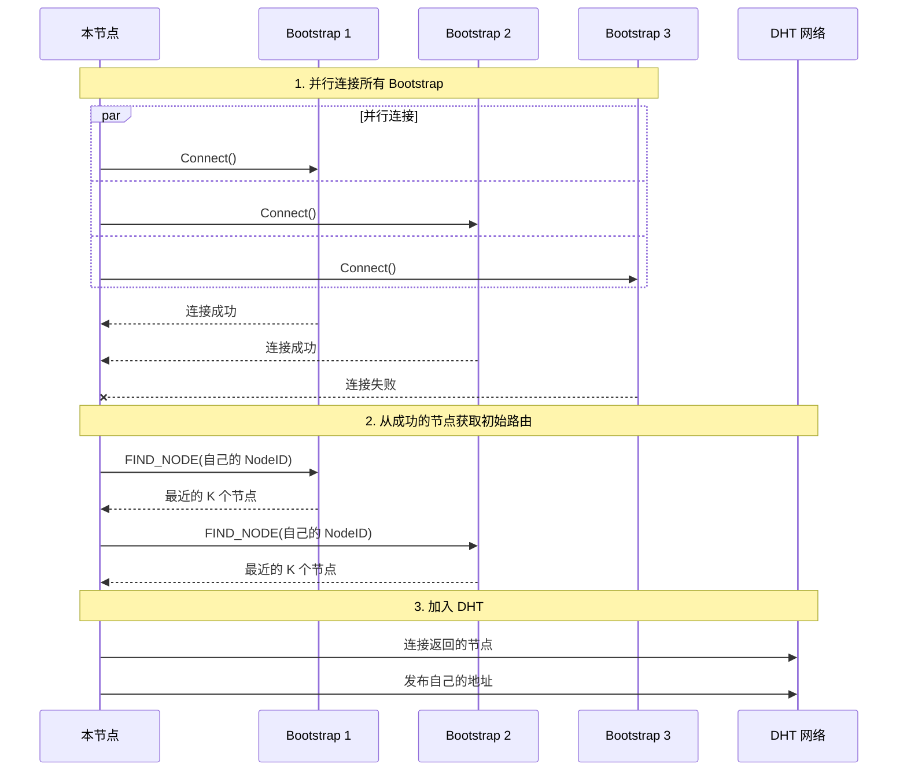

### 自身过滤

```
func (n *node) AddBootstrapPeer(addr Multiaddr) error {
    peerID := extractNodeID(addr)
    
    // 自身过滤 - 静默忽略（方便批量配置）
    if peerID == n.ID() {
        return nil
    }
    
    n.bootstrapPeers = append(n.bootstrapPeers, addr)
    return nil
}
```

### Bootstrap 配置

```
┌─────────────────────────────────────────────────────────────────────────────┐
│                    Bootstrap 配置                                            │
├─────────────────────────────────────────────────────────────────────────────┤
│                                                                             │
│  默认节点（项目方提供）:                                                     │
│    - /dnsaddr/bootstrap1.dep2p.io/p2p/Qm...                                │
│    - /dnsaddr/bootstrap2.dep2p.io/p2p/Qm...                                │
│                                                                             │
│  连接策略:                                                                   │
│    - 并行连接所有配置的节点                                                  │
│    - 保持 N 个活跃连接（例如 2 个）                                         │
│    - 失败自动切换备份                                                        │
│    - 定期健康检查                                                            │
│                                                                             │
│  用户不需要关心:                                                             │
│    - 选择哪个 Bootstrap                                                      │
│    - 连接几个                                                                │
│    - 故障切换                                                                │
│                                                                             │
└─────────────────────────────────────────────────────────────────────────────┘
```

---

## Bootstrap 与 mDNS 独立性

```
┌─────────────────────────────────────────────────────────────────────────────┐
│                    发现机制独立性                                             │
├─────────────────────────────────────────────────────────────────────────────┤
│                                                                             │
│  mDNS（局域网发现）              Bootstrap（广域网入口）                    │
│  ──────────────────              ────────────────────────                   │
│  范围：局域网                    范围：互联网                               │
│  依赖：本地广播                  依赖：预配置地址                           │
│  场景：同一网络内                场景：跨网络                               │
│                                                                             │
│  独立开关组合：                                                              │
│  ─────────────────                                                          │
│  • 只开 mDNS：局域网内纯 P2P，不连外网                                      │
│  • 只开 Bootstrap：广域网，不关心局域网                                     │
│  • 都开：局域网优先，广域网兜底（推荐）                                     │
│  • 都关：必须手动指定地址                                                    │
│                                                                             │
└─────────────────────────────────────────────────────────────────────────────┘
```

### 配置示例

```
// 场景 1：纯局域网应用
dep2p.NewNode(ctx,
    dep2p.EnableMDNS(true),
    dep2p.EnableBootstrap(false),
)

// 场景 2：纯广域网应用
dep2p.NewNode(ctx,
    dep2p.EnableMDNS(false),
    dep2p.EnableBootstrap(true),
)

// 场景 3：混合应用（推荐）
dep2p.NewNode(ctx,
    dep2p.EnableMDNS(true),
    dep2p.EnableBootstrap(true),
)

// 场景 4：私有网络
dep2p.NewNode(ctx,
    dep2p.EnableMDNS(false),
    dep2p.EnableBootstrap(false),
)
// 然后手动连接: node.Connect(ctx, knownPeerAddr)
```

---

## ★ 已知节点直连（v1.1 新增）

在某些场景下，Bootstrap 节点不可用或不适合（如私有云服务器集群），可以使用**已知节点直连**功能。

> 详见 [20260128-systematic-connectivity-fix.md](../../_discussions/20260128-systematic-connectivity-fix.md)

### 使用场景

```
┌─────────────────────────────────────────────────────────────────────────────┐
│                    已知节点直连使用场景                                       │
├─────────────────────────────────────────────────────────────────────────────┤
│                                                                             │
│  场景 1：私有云服务器集群                                                    │
│  ═══════════════════════════                                                │
│  • 两台云服务器需要直接通信                                                 │
│  • 没有公共 Bootstrap 节点                                                  │
│  • 服务器 IP 已知且稳定                                                     │
│                                                                             │
│  场景 2：混合部署                                                            │
│  ═════════════════                                                          │
│  • 本地节点需要连接特定的云服务器                                           │
│  • 不希望依赖 Bootstrap 延迟                                                │
│  • 需要确保关键节点始终连接                                                 │
│                                                                             │
│  场景 3：开发测试                                                            │
│  ═══════════════                                                            │
│  • 测试环境中已知所有节点地址                                               │
│  • 不需要 DHT/Bootstrap 的开销                                              │
│                                                                             │
└─────────────────────────────────────────────────────────────────────────────┘
```

### 配置方式

```go
// 方式 1：启动时配置
node, _ := dep2p.NewNode(ctx,
    dep2p.WithKnownPeers(
        KnownPeer{
            PeerID: "12D3KooWxxxxxxxxxxxxxxxxxxxxxxxxxxxxxxxxxxxxxxx",
            Addrs:  []string{"/ip4/1.2.3.4/udp/4001/quic-v1"},
        },
        KnownPeer{
            PeerID: "12D3KooWyyyyyyyyyyyyyyyyyyyyyyyyyyyyyyyyyyyyyyy",
            Addrs:  []string{"/ip4/5.6.7.8/udp/4001/quic-v1"},
        },
    ),
)

// 方式 2：配置文件
// {
//   "known_peers": [
//     {
//       "peer_id": "12D3KooW...",
//       "addrs": ["/ip4/1.2.3.4/udp/4001/quic-v1"]
//     }
//   ]
// }
```

### 连接流程

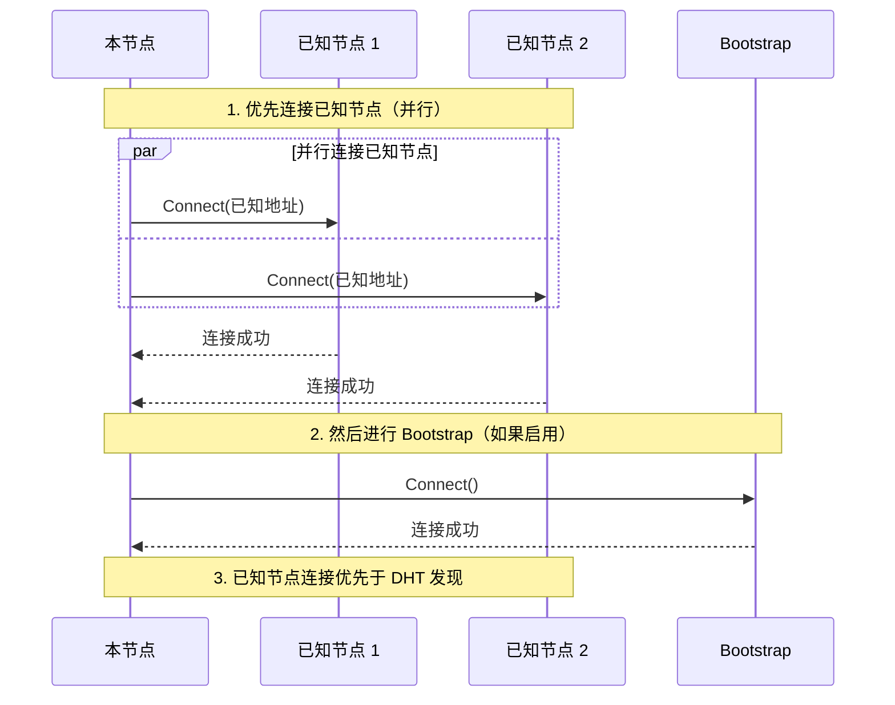

### 与其他发现机制的关系

```
┌─────────────────────────────────────────────────────────────────────────────┐
│                    发现优先级（完整版）                                       │
├─────────────────────────────────────────────────────────────────────────────┤
│                                                                             │
│  优先级 0: ★ 已知节点（KnownPeers）— v1.1 新增                              │
│  ═══════════════════════════════════════════════                            │
│  • 启动时立即连接，无需等待                                                 │
│  • 直接使用配置的地址，不经过任何发现流程                                   │
│  • 适用于确定性连接场景                                                     │
│                                                                             │
│  优先级 1: Peerstore 本地缓存                                               │
│  ═══════════════════════════════                                            │
│  • 最近成功连接的地址                                                       │
│  • 零网络开销                                                               │
│                                                                             │
│  优先级 2: mDNS（局域网）                                                   │
│  ═══════════════════════                                                    │
│  • 同网段节点发现                                                           │
│  • 低延迟                                                                   │
│                                                                             │
│  优先级 3: Bootstrap/DHT                                                    │
│  ═══════════════════════                                                    │
│  • 全网发现                                                                 │
│  • 标准入网流程                                                             │
│                                                                             │
└─────────────────────────────────────────────────────────────────────────────┘
```

### ★ STUN 地址验证策略（v1.2 架构优化）

**v1.2 关键变更**：STUN 地址默认即为已验证，无需等待 dial-back。

```
┌─────────────────────────────────────────────────────────────────────────────┐
│                    STUN 验证策略（v1.2 架构优化）                             │
├─────────────────────────────────────────────────────────────────────────────┤
│                                                                             │
│  ★ 核心认知：STUN 协议本身就是第三方验证机制                                │
│  ════════════════════════════════════════════                               │
│  • STUN 服务器返回的是节点的真实外部地址                                    │
│  • 这已经是一种验证（STUN 服务器是公正第三方）                              │
│  • 无需额外的 dial-back 验证（那是过度设计）                                │
│                                                                             │
│  v1.1 问题（"鸡和蛋"）：                                                   │
│  ──────────────────────                                                     │
│  STUN 地址 → 候选 → 等待 dial-back → 无协助节点 → 永远无法发布             │
│                                                                             │
│  v1.2 解决方案：                                                            │
│  ────────────────                                                           │
│  STUN 地址 → STUNDiscovered(75) → 直接可发布                               │
│                                                                             │
│  TrustSTUNAddresses 配置（可选增强）：                                      │
│  ═════════════════════════════════════                                      │
│  • false（默认）：STUN 地址优先级 75，已足够大多数场景                      │
│  • true（增强）：STUN 地址升级为优先级 100，与 dial-back 验证同等           │
│                                                                             │
└─────────────────────────────────────────────────────────────────────────────┘
```

```go
// 默认模式：STUN 地址使用 PrioritySTUNDiscovered(75)
node, _ := dep2p.NewNode(ctx,
    dep2p.WithKnownPeers(...),
)

// 增强模式：STUN 地址升级为 PriorityVerifiedDirect(100)
node, _ := dep2p.NewNode(ctx,
    dep2p.WithKnownPeers(...),
    dep2p.TrustSTUNAddresses(true),  // 云服务器推荐
)
```

---

## 为什么不需要 Realm Bootstrap？

```
┌─────────────────────────────────────────────────────────────────────────────┐
│                    Realm 成员发现方式                                        │
├─────────────────────────────────────────────────────────────────────────────┤
│                                                                             │
│  Realm 是私有隔离域：                                                        │
│  • 如果有公开的 Realm Bootstrap → 破坏隔离性                                │
│  • 用户加入 Realm 时应该已知至少一个成员地址                                │
│                                                                             │
│  场景分析：                                                                  │
│  ─────────────                                                              │
│  1. 用户 A 创建 Realm                                                        │
│     → A 就是第一个成员，不需要 Bootstrap                                    │
│                                                                             │
│  2. 用户 B 想加入 Realm                                                      │
│     → B 必须知道 PSK（否则无法加入）                                        │
│     → B 获得 PSK 的渠道，应该同时获得至少一个成员地址                       │
│     → 例如：PSK 和地址通过同一个邀请链接传递                                │
│                                                                             │
│  3. 进入 Realm 后                                                            │
│     → 通过 Rendezvous 或成员列表交换发现更多成员                            │
│     → 不需要额外的 Realm Bootstrap                                          │
│                                                                             │
│  Realm 成员发现方式：                                                        │
│  • 方式 1：用户手动指定已知成员地址（推荐）                                 │
│  • 方式 2：通过 Rendezvous 发现（成员注册到命名空间）                       │
│  • 方式 3：成员间交换已知成员列表                                            │
│                                                                             │
└─────────────────────────────────────────────────────────────────────────────┘
```

---

## DHT 发现流程

Kademlia DHT 用于全网节点发现：

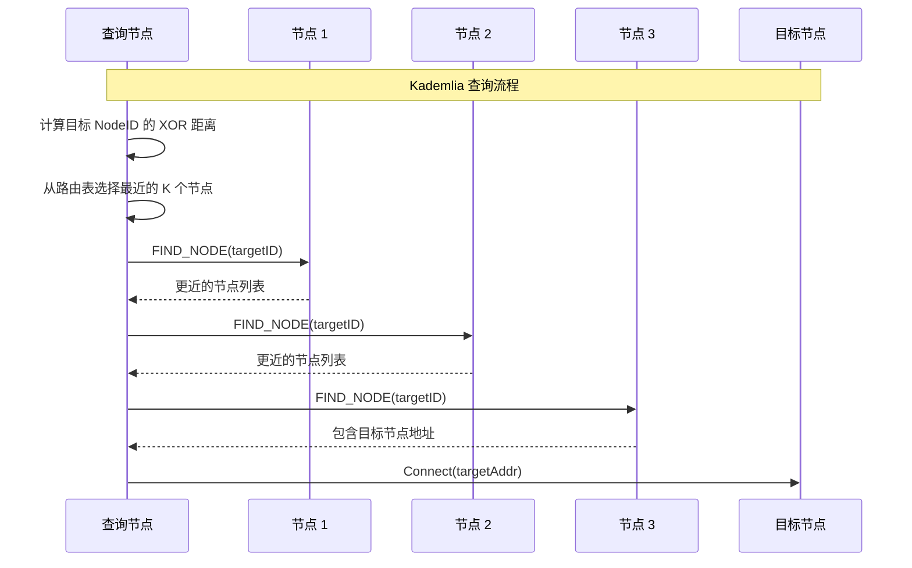

### DHT 路由表

```
Kademlia 路由表结构：

  K = 20 (桶大小)
  
  ┌─────────────────────────────────────────────────┐
  │ Bucket 0 (距离 2^0 ~ 2^1)  │ 最多 K 个节点     │
  ├─────────────────────────────────────────────────┤
  │ Bucket 1 (距离 2^1 ~ 2^2)  │ 最多 K 个节点     │
  ├─────────────────────────────────────────────────┤
  │ ...                                             │
  ├─────────────────────────────────────────────────┤
  │ Bucket 255 (距离 2^255 ~ 2^256) │ 最多 K 个节点 │
  └─────────────────────────────────────────────────┘
```

---

## mDNS 局域网发现

mDNS 用于局域网内无需 Bootstrap 的发现：

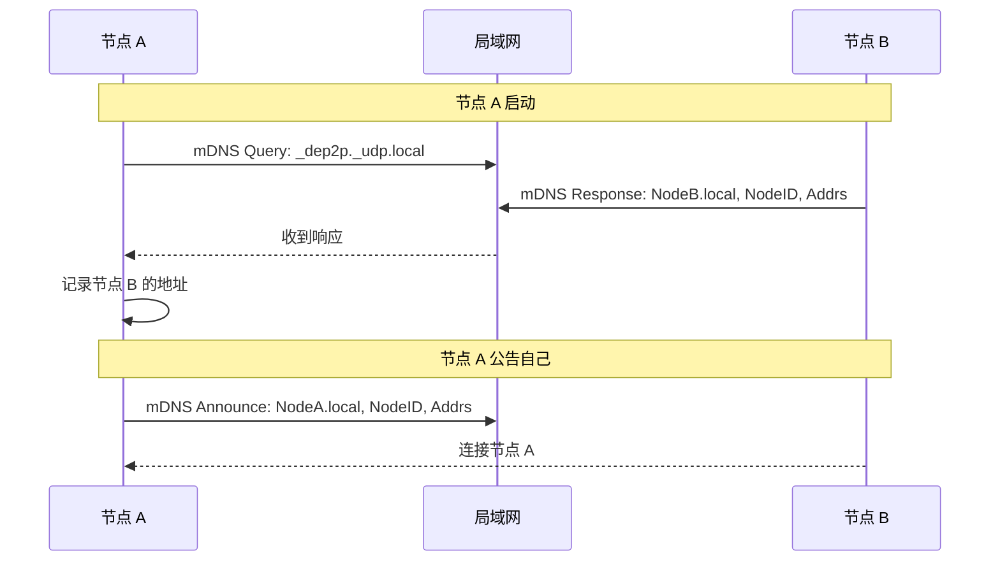

### mDNS 服务名

```
mDNS 服务发现：

  服务名: _dep2p._udp.local
  
  TXT 记录:
    - nodeid=<Base58 encoded NodeID>
    - addrs=<multiaddr list>
```

---

## Rendezvous 发现流程

Rendezvous 用于命名空间内的节点发现（如 Realm 成员）：

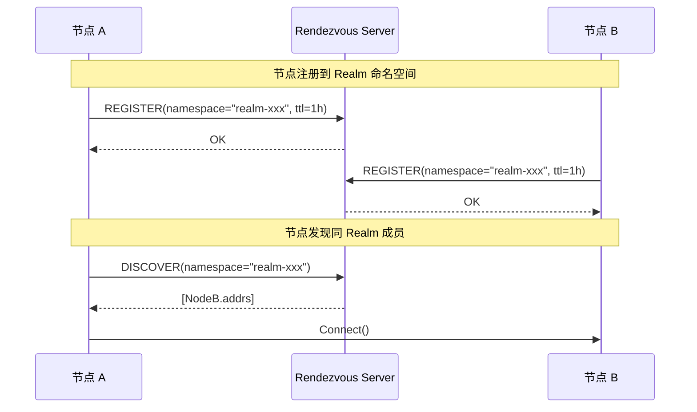

---

## 发现优先级

```
┌─────────────────────────────────────────────────────────────────────────────┐
│                    发现来源优先级（分场景）                                   │
├─────────────────────────────────────────────────────────────────────────────┤
│                                                                             │
│  ★ Realm 内发现优先级（v2.0 地址发现阶段）：                                │
│  ═══════════════════════════════════════════                                │
│  1. Peerstore 本地缓存（最近成功连接）                                     │
│  2. MemberList 成员列表（Realm 内 Gossip 同步）                            │
│  3. DHT 查询（★ 权威来源，签名 PeerRecord）                                │
│  4. Relay 地址簿（缓存回退，非权威）                                       │
│                                                                             │
│  ★ 连接阶段（获取地址后）：                                                 │
│  ═══════════════════════════                                                │
│  1. 直连尝试（使用发现的地址）                                             │
│  2. 打洞尝试（使用 Relay 作为信令通道，需显式配置 Relay）                  │
│  3. Relay 转发（连接兜底，不是发现机制）                                   │
│                                                                             │
│  ⚠️ 注意："Relay 保底"是连接阶段的兜底，不是发现阶段的一部分               │
│                                                                             │
│  全网发现优先级：                                                            │
│  ═══════════════                                                            │
│  1. Peerstore 本地缓存（最近成功连接）                                     │
│  2. mDNS（局域网，低延迟）                                                 │
│  3. Rendezvous（命名空间精确）                                             │
│  4. DHT（全网，可能过期）                                                  │
│  5. Bootstrap（初始，可能过载）                                            │
│                                                                             │
└─────────────────────────────────────────────────────────────────────────────┘
```

---

## 发现状态机

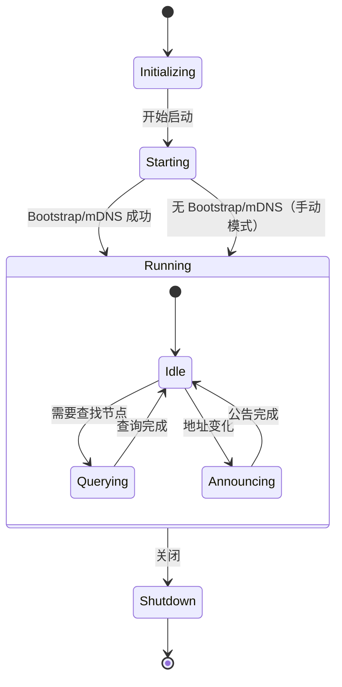

---

## 错误处理

### 错误类型

| 错误 | 原因 | 处理 |
|------|------|------|
| **ErrBootstrapFailed** | 所有 Bootstrap 节点不可达 | 重试或使用 mDNS |
| **ErrDHTQueryTimeout** | DHT 查询超时 | 返回已有结果 |
| **ErrNoProviders** | 无节点提供该 key | 返回空 |
| **ErrRendezvousFull** | Rendezvous 命名空间已满 | 选择其他服务器 |

### 重试策略

```
Bootstrap 重试:
  - 并行尝试所有节点
  - 部分成功即可继续
  - 指数退避重试失败节点
  - 后台持续重试

DHT 查询:
  - 并行查询 α = 3 个节点
  - 单次超时: 5 秒
  - 总超时: 30 秒

Rendezvous:
  - 续约间隔: TTL / 2
  - 失败重试: 指数退避
```

---

## 代码路径

| 阶段 | 代码路径 | 说明 |
|------|----------|------|
| Coordinator | `internal/discovery/coordinator/` | 发现协调（统一调度） |
| Bootstrap | `internal/discovery/bootstrap/` | 引导节点发现 |
| DHT | `internal/discovery/dht/` | DHT 发现 |
| mDNS | `internal/discovery/mdns/` | 局域网发现 |
| Rendezvous | `internal/discovery/rendezvous/` | 命名空间发现 |
| 地址管理 | `internal/core/host/address/` | 地址管理 |

---

## 协调器调度流程

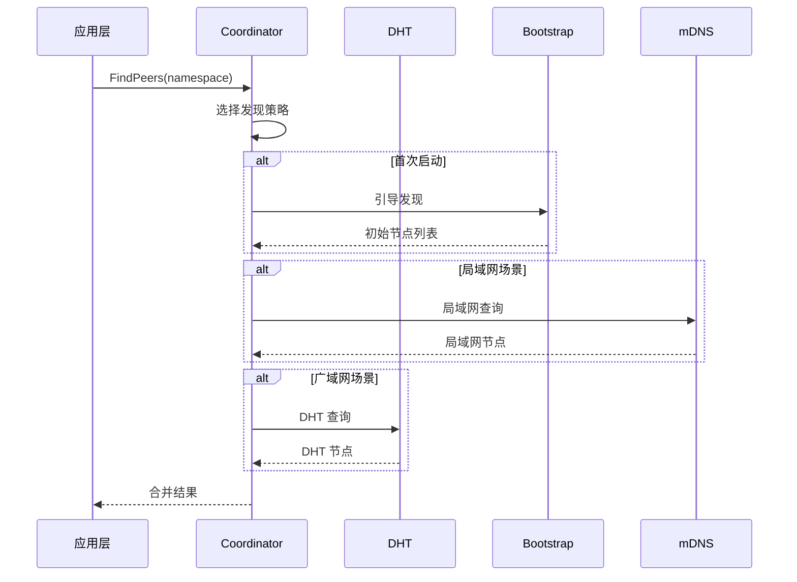

---

## 相关文档

### L3 行为文档

| 文档 | 说明 |
|------|------|
| [lifecycle_overview.md](lifecycle_overview.md) | ★ 节点生命周期横切面（冷启动/Realm加入/稳态运行） |
| [connection_flow.md](connection_flow.md) | 连接建立流程（含"仅 ID 连接"边界） |
| [realm_flow.md](realm_flow.md) | Realm 加入流程 |
| [relay_flow.md](relay_flow.md) | 中继流程（含 Relay 地址簿） |
| [state_machines.md](state_machines.md) | 状态机定义 |

### L6 模块文档

| 文档 | 说明 |
|------|------|
| [../L6_domains/discovery_coordinator/design/overview.md](../L6_domains/discovery_coordinator/design/overview.md) | 发现协调器接口与实现 |
| [../L6_domains/core_peerstore/design/overview.md](../L6_domains/core_peerstore/design/overview.md) | Peerstore TTL 与 GC 机制 |
| [../L6_domains/core_netreport/README.md](../L6_domains/core_netreport/README.md) | NetReport/STUN 诊断 |

### 其他

| 文档 | 说明 |
|------|------|
| [../L2_structural/layer_model.md](../L2_structural/layer_model.md) | 五层软件架构 |
| [ADR-0009](../../01_context/decisions/ADR-0009-bootstrap-simplified.md) | Bootstrap 极简配置 |

---

**最后更新**：2026-01-29（v1.2 架构优化：STUN 即验证，ADR-0013）
