# 节点生命周期横切面

> 横向视角：从用户操作出发，描述节点从启动到关闭的完整生命周期，以及跨组件的协调机制

---

## 1. 概述

### 1.1 横切面视角的价值

L3_behavioral 的纵向文档按功能域划分（发现、连接、中继、消息等），各自独立描述组件行为。然而，从用户视角，启动一个节点是一个**静默的、系统性的工程**：

```
用户操作：
═════════
  node := dep2p.Start(ctx, opts...)    // 一行代码

系统静默执行（横跨多个组件、可能跨周期）：
══════════════════════════════════════════
  • Bootstrap → 获取 DHT 入口                     ← discovery
  • STUN → 获取外部地址                           ← NAT / network
  • NAT 类型检测 → 确定打洞策略                   ← NAT
  • UPnP/NAT-PMP → 端口映射                       ← NAT
  • 可达性验证 → 确认地址可用                     ← connection
  • DHT → 发布 PeerRecord                         ← discovery / DHT
  • Relay → 注册地址簿                            ← relay
  • 定时器 → 周期性续期/刷新                      ← 跨所有组件
```

横切面视角关注的是**时间维度上的跨组件协调**，回答"节点启动时发生了什么"、"组件如何协调工作"。

### 1.2 与纵向流程文档的关系

| 文档类型 | 关注点 | 示例问题 |
|---------|-------|---------|
| **横向（本文档）** | 生命周期阶段、跨组件协调 | "节点启动时发生了什么？" |
| **纵向（功能域）** | 单一功能的完整行为 | "如何发现节点？""如何建立连接？" |

本文档作为横切主线，串联各纵向流程，并在适当位置引用具体的纵向文档：
- [discovery_flow.md](discovery_flow.md) — 发现行为详情
- [connection_flow.md](connection_flow.md) — 连接策略详情
- [disconnect_detection.md](disconnect_detection.md) — **断开检测详情**
- [relay_flow.md](relay_flow.md) — Relay 行为详情
- [realm_flow.md](realm_flow.md) — Realm 行为详情

### 1.3 与 L6_domains 的边界

| 层级 | 职责 | 示例内容 |
|-----|-----|---------|
| **L3_behavioral** | 行为、流程、时序、决策逻辑 | "冷启动时先 STUN 再发布 DHT" |
| **L6_domains** | 组件细节、API、数据结构 | "PeerRecord 结构定义、Bootstrap 接口签名" |

**边界原则**：L3 描述"谁在什么时候做什么"，L6 描述"内部怎么做"。

---

## 2. DHT 架构（v2.0）

> 详见 [DHT-Realm 架构重构方案](../../_discussions/20260126-dht-realm-architecture-redesign.md)

DeP2P 采用**单一 DHT 网络**，通过 Key 前缀（命名空间）实现逻辑隔离：

### 2.1 DHT Key 设计

```
/dep2p/v2/node/<NodeID>
├── 存储: SignedPeerRecord
├── 内容: { addrs, nat_type, capabilities }
└── 用途: 节点基础地址发现

/dep2p/v2/realm/<H(RealmID)>/members
├── 存储: Provider Record（ADD_PROVIDER 操作）
├── 内容: 该 Realm 的成员 NodeID 列表
└── 用途: 发现同 Realm 的其他成员
└── 关键: 无需先 Join，直接发布

/dep2p/v2/realm/<H(RealmID)>/peer/<NodeID>
├── 存储: SignedRealmPeerRecord
├── 内容: { realm_id, addrs }
└── 用途: 查询特定 Realm 成员的地址
```

### 2.2 PeerRecord 结构

```
SignedPeerRecord {
    node_id:      "12D3Koo...",
    relay_addrs:  [...],         // Relay 地址（稳定，始终发布）
    direct_addrs: [...],         // 直连地址（可达时发布）
    nat_type:     "...",
    reachability: "...",
    capabilities: ["relay", "bootstrap", ...],
    seq:          N,
    signature:    "..."
}
```

### 2.3 Realm 隔离保障

**问**: 单一 DHT 是否破坏了 Realm 隔离?  
**答**: 否。隔离通过认证而非 DHT 分离实现。

| 方面 | 说明 |
|------|------|
| **DHT 可见性** | 任意节点可查询 DHT Key，但无 PSK 无法认证 |
| **成员发现** | 通过 Provider Record 发现成员，连接后需 PSK 双向认证 |
| **安全边界** | DHT 只暴露 NodeID + 地址，不暴露 PSK，认证失败无法通信 |

---

## 3. Phase A: 冷启动

**触发**: `dep2p.Start(ctx, opts...)`  
**目标**: 建立基础网络能力，加入 P2P 网络  
**耗时**: 通常 2-10 秒（取决于网络环境）

### 3.1 身份初始化

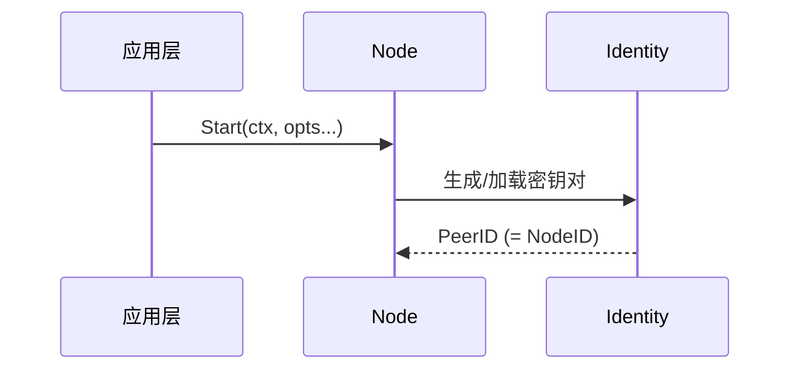

- 从配置加载现有密钥对，或生成新的 Ed25519/ECDSA 密钥
- 派生 NodeID（= PeerID，`Base58(SHA256(pubKey))`）
- NodeID/PeerID 是节点在 P2P 网络中的唯一标识，用于路由和身份统一表示

### 3.2 传输栈启动

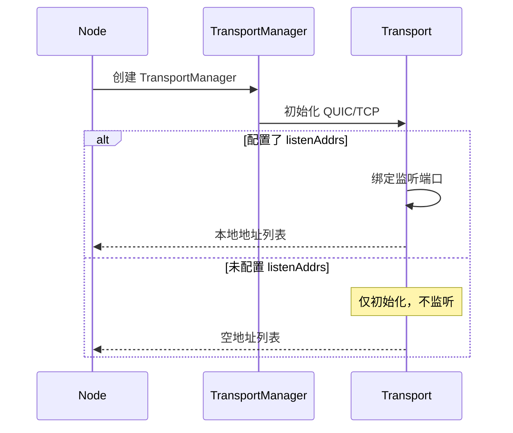

- 初始化 QUIC（默认）和 TCP（备选）传输层
- **监听由配置驱动**：仅当配置了 `listenAddrs` 时才绑定端口
- 未配置监听地址时，仅初始化传输层，不自动监听（仅能发起出站连接）
- 收集本地监听地址（可能包含多个网络接口）

> **注意**: QUIC 自带 TLS 1.3 加密和流多路复用；TCP 需要 Upgrader 进行安全握手（TLS/Noise）和多路复用设置（yamux）。

### 3.3 地址发现（STUN/UPnP 并行）

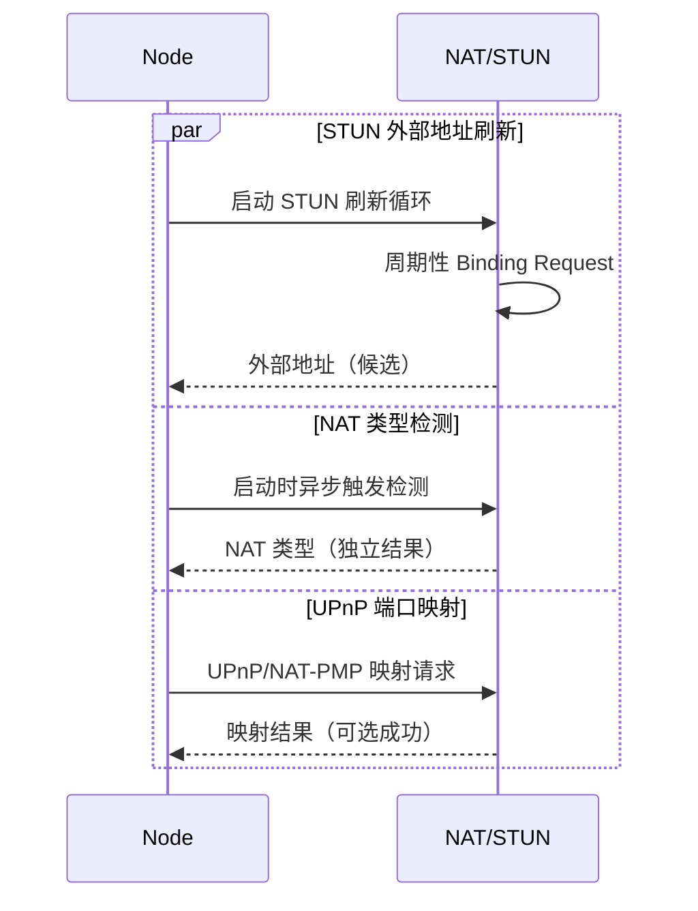

**地址收集与分类**：

```
输入源（并行工作）：
  ┌───────────────┐   ┌───────────────┐   ┌───────────────┐
  │ 本地接口枚举   │   │    STUN       │   │  UPnP/NAT-PMP │
  │  私有地址     │   │  公网地址     │   │   映射地址    │
  └───────┬───────┘   └───────┬───────┘   └───────┬───────┘
          │                   │                   │
          └───────────────────┴───────────────────┘
                              │
                              ▼
           候选地址 (Candidate Addresses)
  ┌─────────────┬─────────────┬─────────────┬─────────────┐
  │ 127.0.0.1   │ 192.168.x.x │ 1.2.3.4     │ UPnP 地址   │
  │  本地回环   │   私有地址   │  STUN 地址  │   映射地址  │
  └─────────────┴─────────────┴─────────────┴─────────────┘
```

> 详细的 NAT 检测算法参见 [L6_domains/core_nat/design/overview.md](../L6_domains/core_nat/design/overview.md)

> **候选地址 vs 已验证地址**：
> - STUN/UPnP/NAT-PMP 发现的地址均为**候选地址**（未验证）
> - 候选地址需要经过 **Reachability 验证**（dial-back/AutoNAT）后才能发布到 DHT
> - 直接发布候选地址会导致"不可达地址泛滥"
> - 详见 [core_reachability](../L6_domains/core_reachability/) 和 [core_nat/internals](../L6_domains/core_nat/design/internals.md)

> **★ STUN 信任模式**（v1.1 新增）：
> - 云服务器场景下，可启用 `TrustSTUNAddresses` 跳过入站验证
> - STUN 探测到的公网地址直接标记为已验证，立即发布到 DHT
> - 仅在确认服务器有真实公网 IP 且入站流量可达时启用
> - 详见 [discovery_flow.md](discovery_flow.md#-stun-信任模式云服务器优化)

### 3.4 已知节点连接（v1.1 新增）

如果配置了已知节点，在 DHT 入网前优先连接：

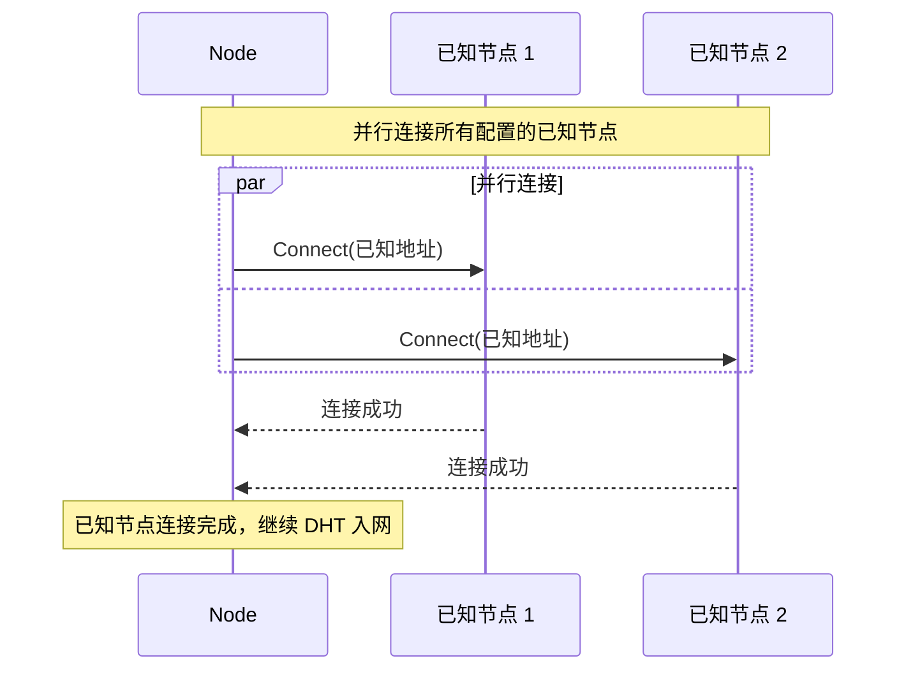

- 已知节点使用配置的地址直连，不经过任何发现流程
- 适用于私有集群、混合部署、开发测试等确定性连接场景
- 已知节点连接失败不阻塞后续流程

> 已知节点配置详情参见 [discovery_flow.md](discovery_flow.md#-已知节点直连v11-新增)

### 3.5 DHT 入网

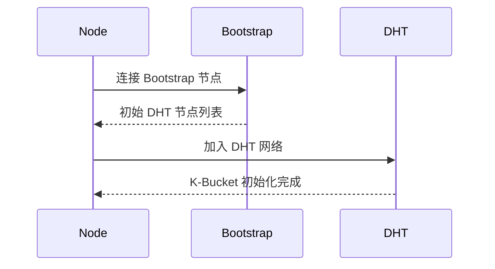

- 连接预配置的 Bootstrap 节点
- 获取初始 DHT 邻居列表
- 执行 Kademlia FIND_NODE 自查询以填充 K-Bucket
- **此时节点能够发现其他节点，但尚未被发现**

> Bootstrap 连接详情参见 [discovery_flow.md](discovery_flow.md)

### 3.6 Node 级地址发布

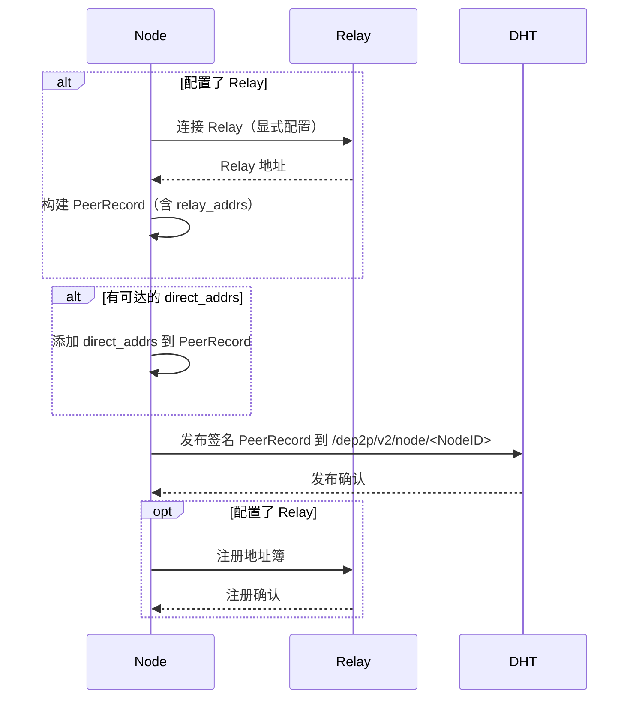

**发布后**: Node 可被任意 DeP2P 节点发现

### 3.7 Relay 预留（按需）

根据 [ADR-0010](../../04_adr/ADR-0010_explicit_relay_config.md)，Relay 地址采用显式配置，不自动发现。

**Relay 职责**（v2.0）：
1. **地址簿缓存** — 缓存 Realm 成员地址，加速首次连接
2. **打洞协调** — 为 NAT 后节点提供打洞信令中转
3. **通信保底** — 打洞失败时作为数据中继

> Relay 行为详情参见 [relay_flow.md](relay_flow.md)

### 3.8 就绪级别与降级策略

**就绪级别定义**：

| 级别 | 名称 | 含义 | 能力 |
|-----|-----|-----|-----|
| Level 0 | Created | Node 对象已创建，未启动 | 无 |
| Level 1 | Network | 本地传输层就绪 | 能发起出站连接 |
| Level 2 | Discovered | DHT 入网成功 | 能发现其他节点 |
| Level 3 | Reachable | 可达性验证完成 | 能被其他节点发现 |
| Level 4 | RealmReady | Realm 加入完成 | Realm 成员可达 |

**`node.Start()` 返回的最低标准**: Level 1 (Network)
- Identity 初始化成功
- 至少一个 Transport 绑定成功
- 能发起出站连接

**降级策略**：

| 失败点 | 影响 | 降级策略 |
|-------|------|---------|
| Bootstrap 失败 | DHT 无法冷启动 | 退避重试 + mDNS 局域网降级 |
| STUN 失败 | 无法获取外部地址 | 仅发布 relay_addrs + Reachability=Unknown |
| Relay 失败 | 无保底通信能力 | 警告日志 + 继续运行 + ReadyLevel 受限 |
| DHT 发布失败 | 无法被远程发现 | 退避重试 + 降级到仅 Relay 可达 |

---

## 4. Phase B: Realm 加入

**触发**: `node.JoinRealm(ctx, psk)`  
**目标**: 加入业务域，获取通信能力  
**耗时**: 通常 1-3 秒

### 4.1 PSK 认证与 RealmID 派生

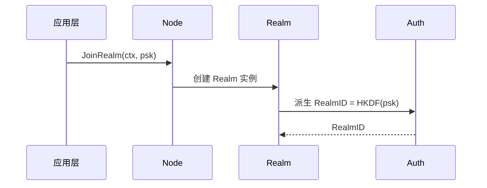

- PSK (Pre-Shared Key) 是 Realm 的认证凭证
- RealmID 通过 HKDF 从 PSK 派生，保证同 PSK 的节点得到相同 RealmID

> PSK 认证详情参见 [realm_flow.md](realm_flow.md)

### 4.2 成员发现（Join 协议 / Rendezvous）

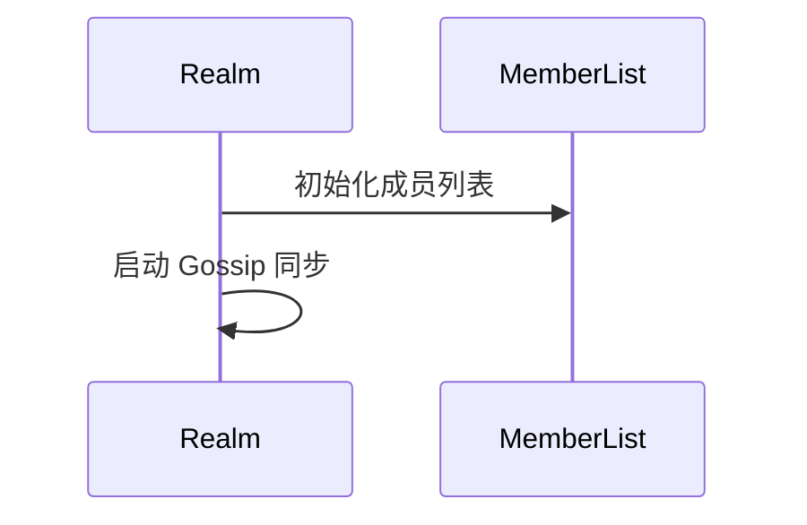

**成员发现来源优先级**：
1. **Peerstore** — 本地缓存
2. **MemberList** — Gossip 同步
3. **DHT** — 权威目录（Provider + PeerRecord）
4. **Relay 地址簿** — 缓存回退

### 4.3 DHT 发布

采用"先发布后发现"模式：

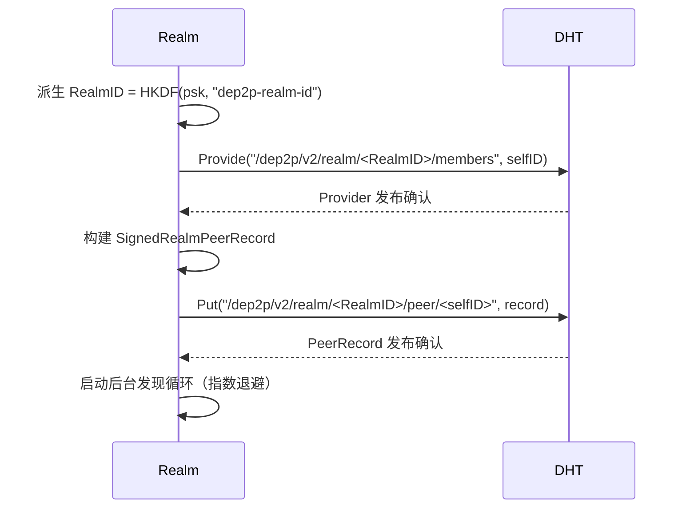

**发布后**: Node 可被同 Realm 成员发现，无需预先知道入口节点

### 4.4 协议注册

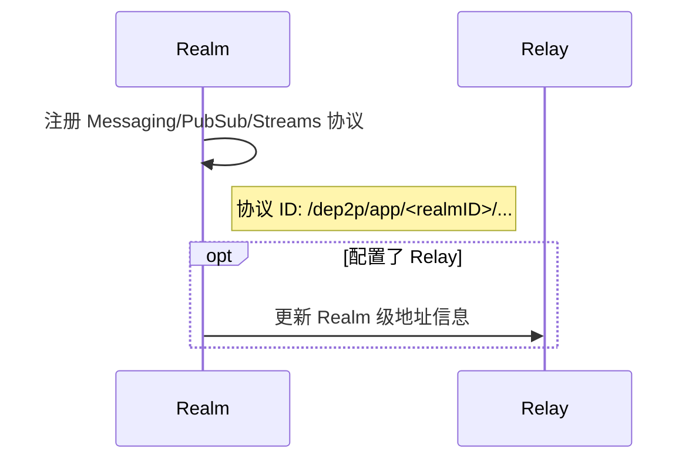

**协议注册完成后**: Realm 对象可用于通信

---

## 5. Phase C: 稳态运行

**触发**: Phase B 完成后自动进入  
**目标**: 维护网络状态，响应变化  
**持续时间**: 应用运行期间

### 5.1 周期任务矩阵

| 任务 | 周期 | 触发条件 | 涉及组件 |
|-----|------|---------|---------|
| DHT 续期 | TTL/2 (~30min) | 定时器到期 | DHT |
| Relay 心跳 | 30s | 定时器 | Relay, Connection |
| Liveness 心跳 | 配置值 (默认 15s) | 定时器 | Liveness, Connection |
| STUN 刷新 | 5min 或网络事件 | 定时器/事件 | NAT, Network |
| 连接健康检查 | 1min | 定时器 | Connection, Swarm |
| K-Bucket 刷新 | 10min 或路由变化 | 定时器/事件 | DHT |
| MemberList 同步 | Gossip 周期 | 事件驱动 | Member, PubSub |

### 5.2 地址续期协调

多个组件有独立的续期定时器，需要统一协调以避免不一致：

```
当前状态（各自独立定时器）：
  DHT Node PeerRecord:    TTL=1小时，续期=30分钟
  DHT Realm PeerRecord:   TTL=1小时，续期=30分钟
  Relay Reservation:      TTL=1小时，续租=30分钟
  Relay 地址簿:           TTL=1小时，续期=30分钟
  STUN Refresh:           5-15分钟
  MemberSync Heartbeat:   配置值

问题：
  • 网络变化时，需要"同时"触发多个更新
  • 各自独立的定时器可能导致不一致状态
  • 例如：地址变了，Node PeerRecord 更新了，但 Realm PeerRecord 还没更新

建议：统一的地址变化响应器
  ┌───────────────────────────────────────────────────────────────────┐
  │                    AddressChangeCoordinator                       │
  │                                                                   │
  │   地址变化事件 ───▶ ┌─────────────────────────────────────────┐  │
  │                     │ 1. 更新 Peerstore                        │  │
  │                     │ 2. 更新 DHT Node PeerRecord (seq+1)      │  │
  │                     │ 3. 更新 DHT Realm PeerRecord (seq+1)     │  │
  │                     │ 4. 通知 Relay 地址簿                     │  │
  │                     │ 5. 广播给 MemberList                     │  │
  │                     └─────────────────────────────────────────┘  │
  │                                                                   │
  │   ★ 原子性更新，避免不一致窗口                                    │
  └───────────────────────────────────────────────────────────────────┘
```

### 5.3 网络变化响应

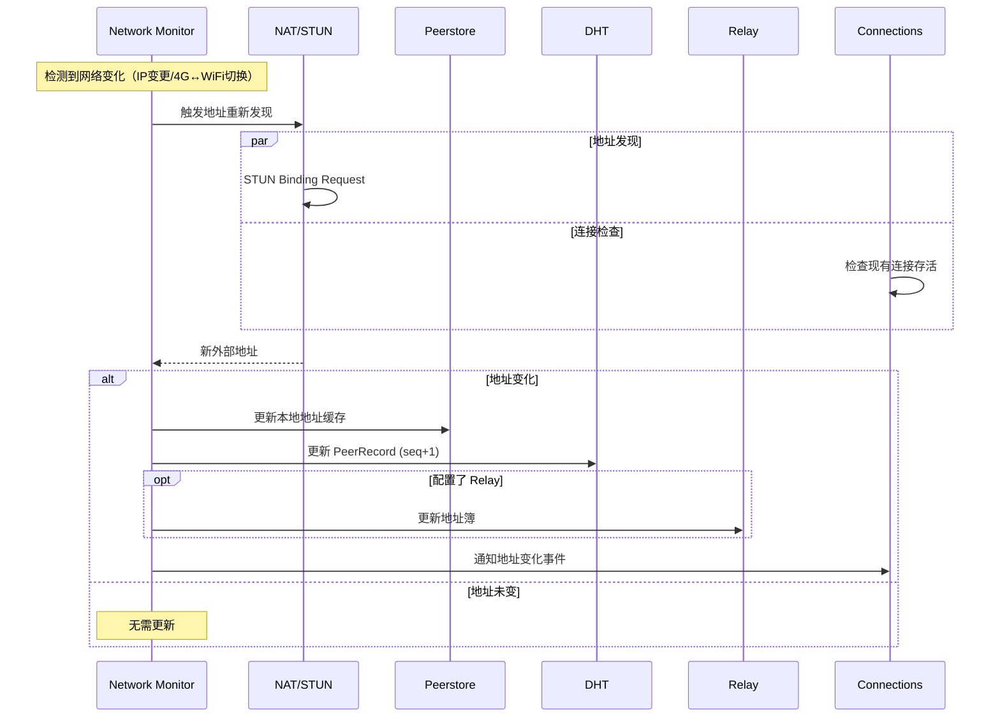

**网络变化触发条件**：
- IP 地址变更
- 网络接口上线/下线
- 4G ↔ WiFi 切换
- VPN 连接/断开

---

## 6. Phase D: 优雅关闭

**触发**: `node.Close()` 或 context 取消  
**目标**: 清理资源，通知网络

### 6.1 离开 Realm

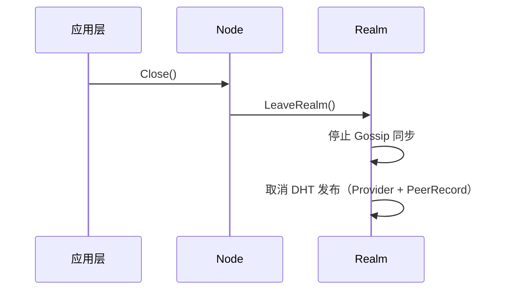

### 6.2 取消 DHT 发布

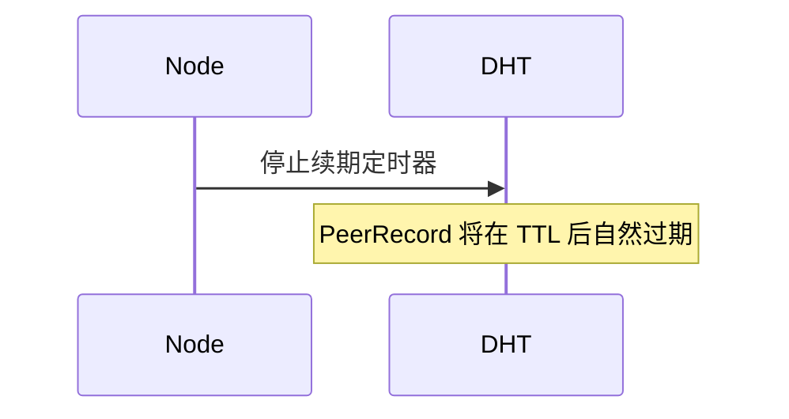

**注意**: DHT 记录通常依赖 TTL 自然过期，而非主动删除。

### 6.3 关闭连接与释放资源

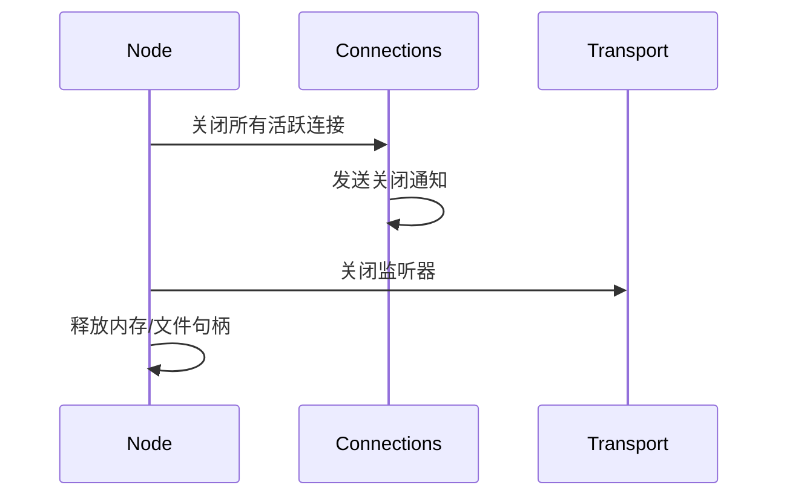

---

## 7. 就绪状态 API 设计

### 7.1 ReadyLevel 定义

```go
type ReadyLevel int

const (
    ReadyLevelCreated    ReadyLevel = 0  // Node 对象已创建，未启动
    ReadyLevelNetwork    ReadyLevel = 1  // 本地传输层就绪，能发起出站连接
    ReadyLevelDiscovered ReadyLevel = 2  // DHT 入网成功，能发现其他节点
    ReadyLevelReachable  ReadyLevel = 3  // 可达性验证完成，能被其他节点发现
    ReadyLevelRealmReady ReadyLevel = 4  // Realm 加入完成，Realm 成员可达
)
```

### 7.2 Node 级别就绪

```go
// 等待到达指定就绪级别
err := node.WaitReady(ctx, dep2p.ReadyLevelReachable)

// 订阅就绪级别变化
node.OnReadyLevelChange(func(level ReadyLevel) {
    log.Printf("Node ready level: %v", level)
})

// 查询当前就绪级别
level := node.ReadyLevel()
```

### 7.3 Realm 级别就绪

```go
realm, err := node.JoinRealm(ctx, psk)

// 等待 Realm 就绪（成员发现完成，DHT 发布完成）
err = realm.WaitReady(ctx)

// 现在可以安全地 Connect
conn, err := realm.Connect(ctx, targetNodeID)
```

---

## 8. 与纵向文档的引用关系

| 生命周期阶段 | 相关纵向文档 | 引用内容 |
|-------------|-------------|---------|
| 冷启动 - 地址发现 | [discovery_flow.md](discovery_flow.md) | Bootstrap 连接、DHT 入网 |
| 冷启动 - Relay 预留 | [relay_flow.md](relay_flow.md) | Relay 三大职责、地址簿注册、RelayCircuit 架构 |
| Realm 加入 | [realm_flow.md](realm_flow.md) | PSK 认证、成员发现 |
| 稳态运行 - 连接建立 | [connection_flow.md](connection_flow.md) | 惰性中继、连接优先级 |
| 稳态运行 - 断开检测 | [disconnect_detection.md](disconnect_detection.md) | **多层检测、见证人机制、重连宽限期** |
| 稳态运行 - 消息通信 | [messaging_flow.md](messaging_flow.md) | Request-Response、PubSub |
| 优雅关闭 | [disconnect_detection.md](disconnect_detection.md) | **MemberLeave 广播** |
| 状态机 | [state_machines.md](state_machines.md) | ReadyLevel、Connection、Relay、RelayCircuit、**ConnectionStability** 状态 |

### ADR 引用

| ADR | 说明 |
|-----|------|
| [ADR-0011](../../01_context/decisions/ADR-0011-relay-circuit-muxer.md) | ★ 中继电路多路复用架构（RelayCircuit + Muxer） |
| [ADR-0012](../../01_context/decisions/ADR-0012-disconnect-detection.md) | ★ 多层次断开检测架构 |

### 不变量引用

| 不变量 | 说明 |
|--------|------|
| [INV-003](../../01_context/decisions/invariants/INV-003-connection-membership.md) | 连接即成员（断开检测核心约束） |

---

**最后更新**：2026-01-29（v1.1 新增：已知节点连接、STUN 信任模式）
