# 消息传递流程 (Messaging Flow)

> 消息传递、PubSub 的端到端流程

---

## 文档定位

本文档是 L3_behavioral 的**纵向流程文档**，专注于描述消息传递的完整行为。

### 与横切面的关系

消息传递发生在节点的 Phase C（稳态运行）阶段，详见 [lifecycle_overview.md](lifecycle_overview.md)：

| 生命周期阶段 | 消息相关内容 | 本文档章节 |
|-------------|-------------|-----------|
| Phase C: 稳态运行 | Request-Response 通信 | [请求-响应流程](#请求-响应流程) |
| Phase C: 稳态运行 | PubSub 广播 | [PubSub 流程](#pubsub-流程) |
| Phase C: 稳态运行 | MemberList Gossip 同步 | [GossipSub](#gossipsub-配置) |

---

## 流程概述

DeP2P 提供多种消息传递模式，满足不同场景需求。

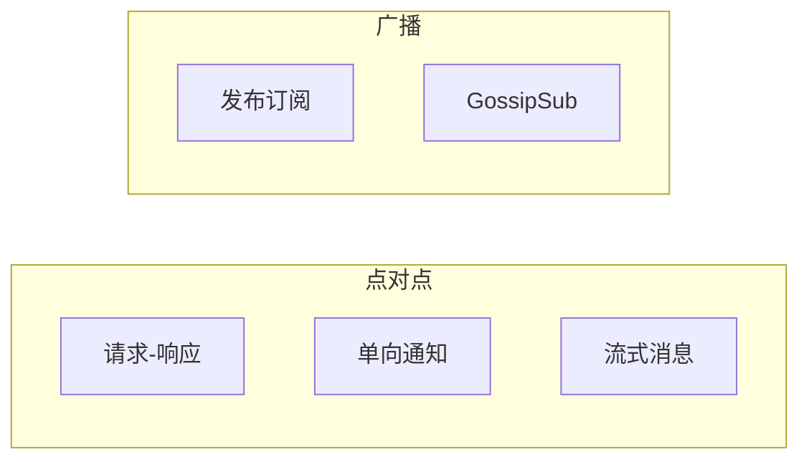

### 消息模式

| 模式 | 适用场景 | 特点 |
|------|----------|------|
| **请求-响应** | RPC、数据请求 | 同步等待响应 |
| **单向通知** | 私聊、命令 | 无需响应 |
| **流式** | 文件传输、批量同步 | 双向流 |
| **PubSub** | 群聊、广播 | 一对多 |

### 参与组件

| 组件 | 目录 | 职责 |
|------|------|------|
| **MessagingService** | `core/messaging/service.go` | 消息服务入口 |
| **RequestHandler** | `core/messaging/request.go` | 请求响应 |
| **PubSub** | `core/messaging/pubsub.go` | 发布订阅 |
| **GossipSub** | `core/messaging/gossipsub/` | Gossip 路由 |
| **Delivery** | `core/messaging/delivery/` | 消息投递 |

---

## 请求-响应流程

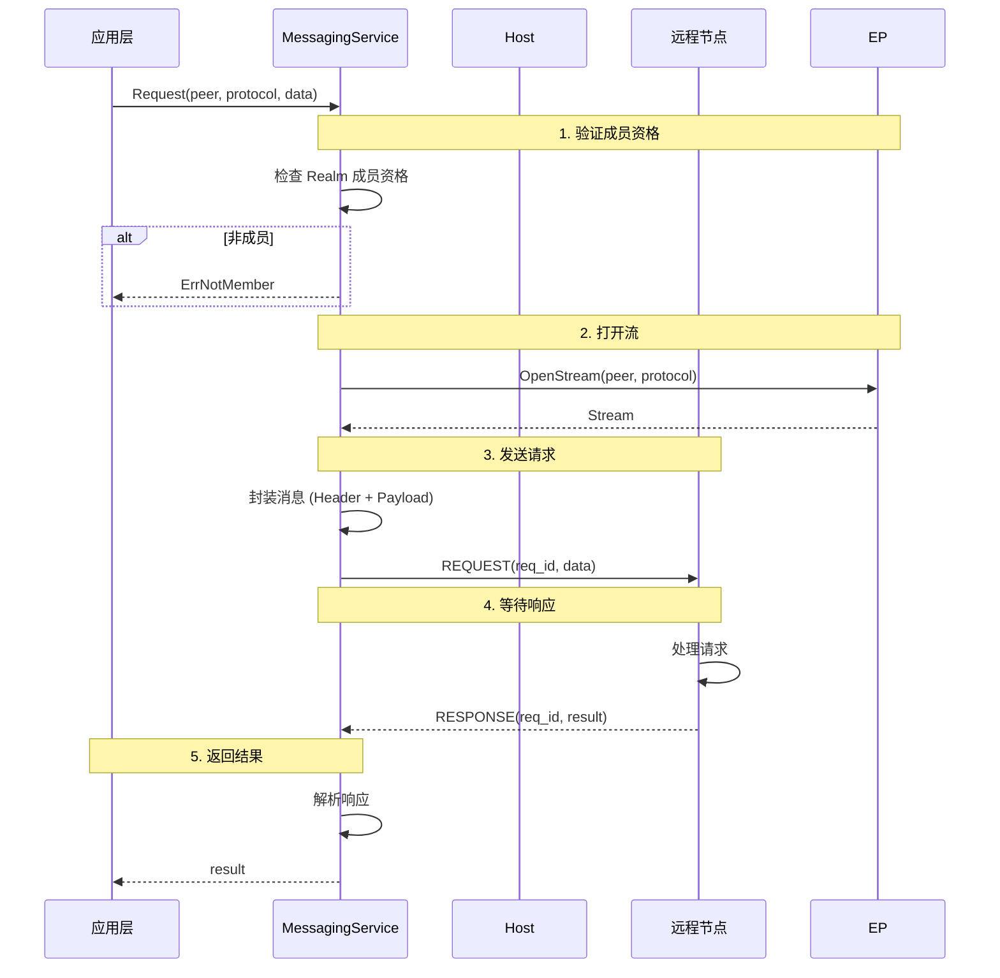

### 请求消息格式

```
请求消息：

  ┌──────────────────────────────────────────────────────┐
  │  Header (12 bytes)                                    │
  ├──────────────────────────────────────────────────────┤
  │  Version (1)  │  Type (1)  │  Flags (2)  │  ReqID (4)│
  │  Length (4)                                           │
  ├──────────────────────────────────────────────────────┤
  │  Payload (变长)                                        │
  └──────────────────────────────────────────────────────┘

  Type:
    REQUEST     = 0x01
    RESPONSE    = 0x02
    ERROR       = 0x06
```

---

## 单向通知流程

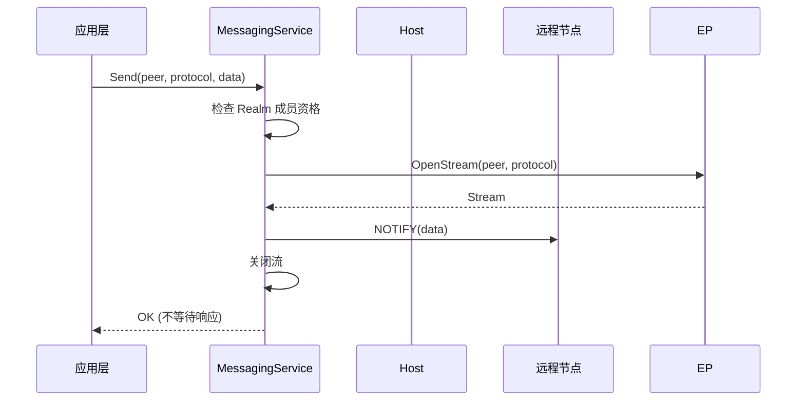

---

## 流式消息流程

### 服务端流

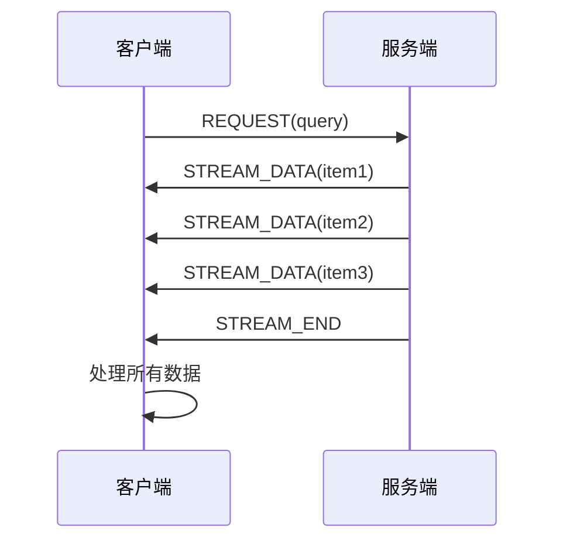

### 双向流

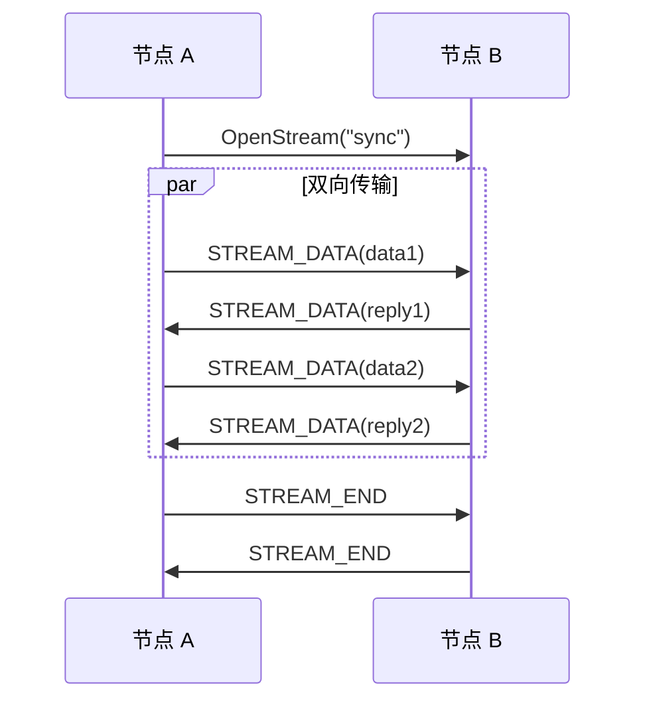

---

## PubSub 发布订阅流程

### 订阅流程

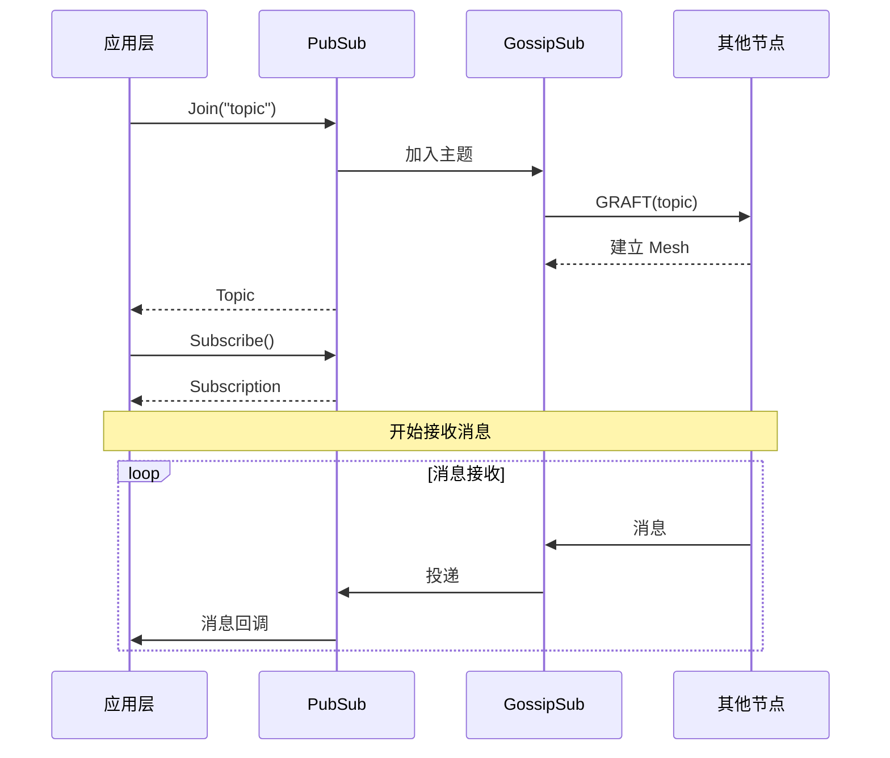

### 发布流程

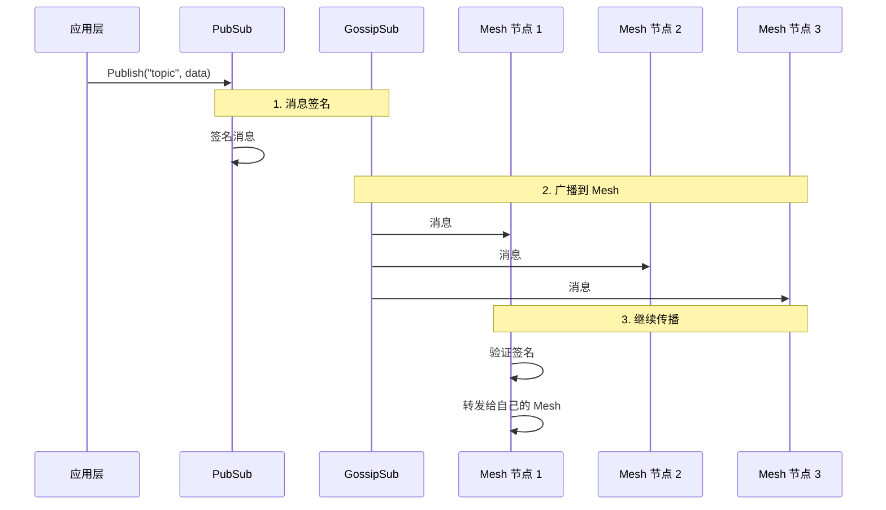

---

## GossipSub 详细流程

### Mesh 管理

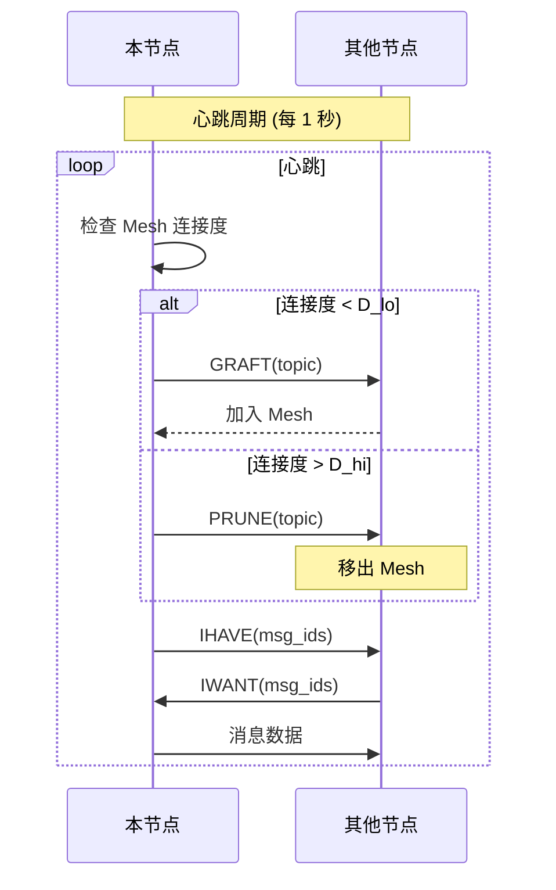

### 消息验证

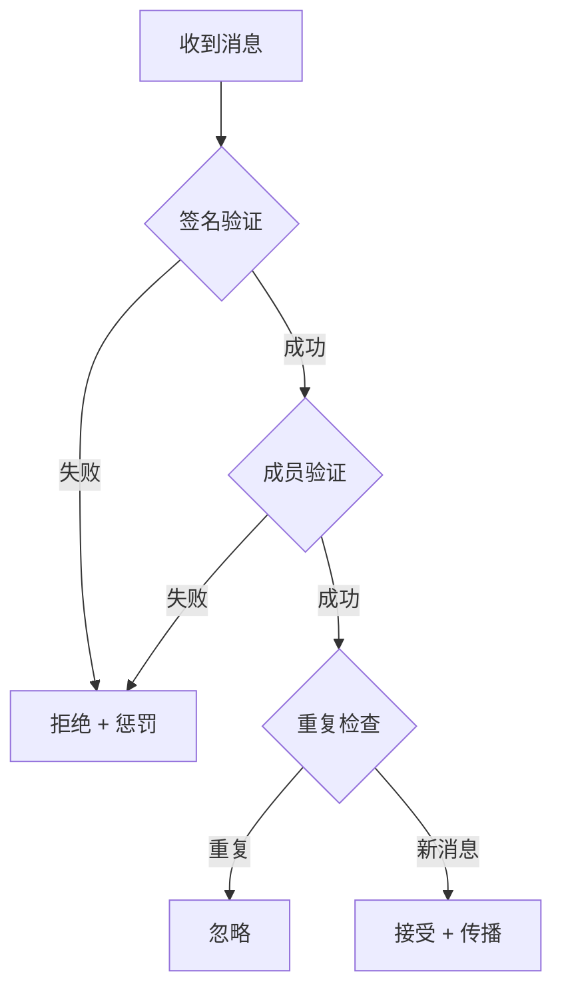

### GossipSub 参数

```
GossipSub 核心参数：

  连接度:
    D = 6       (目标连接度)
    D_lo = 4    (最低连接度)
    D_hi = 12   (最高连接度)
    D_lazy = 6  (lazy push 度)
    
  时间:
    heartbeat_interval = 1s   (心跳间隔)
    fanout_ttl = 60s          (fanout 超时)
    
  缓存:
    mcache_len = 5            (消息缓存长度)
    mcache_gossip = 3         (gossip 窗口)
```

---

## 消息投递确认

对于需要可靠投递的场景：

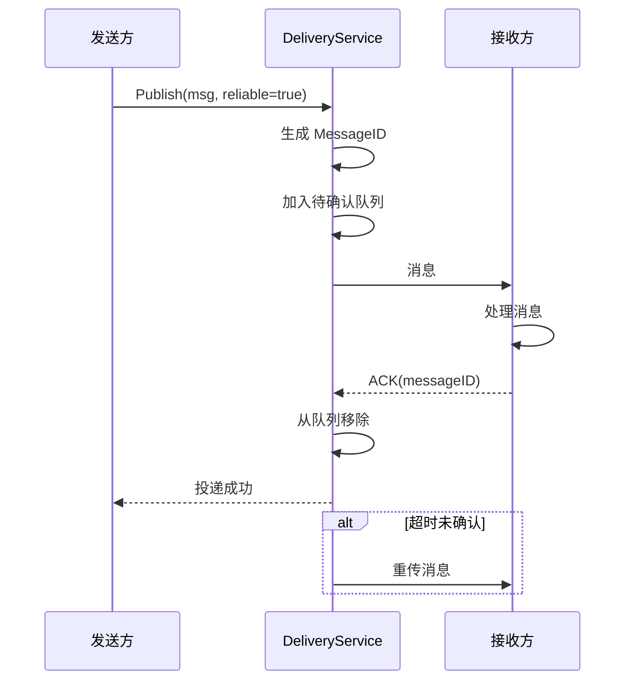

---

## 消息路由

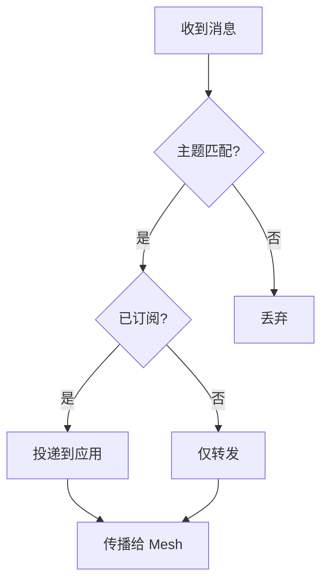

---

## 消息状态机

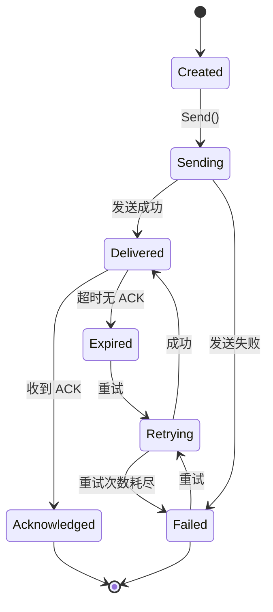

---

## 错误处理

### 错误类型

| 错误 | 原因 | 处理 |
|------|------|------|
| **ErrNotMember** | 未加入 Realm | 返回错误 |
| **ErrPeerNotFound** | 目标节点不可达 | 重试或返回错误 |
| **ErrStreamClosed** | 流被关闭 | 重新打开流 |
| **ErrTimeout** | 请求超时 | 重试或返回错误 |
| **ErrTopicNotFound** | 主题不存在 | 自动创建或返回错误 |
| **ErrMessageTooLarge** | 消息过大 | 返回错误 |
| **ErrRateLimited** | 速率限制 | 等待后重试 |

### 重试策略

```
请求重试:
  - 指数退避
  - 初始间隔: 100ms
  - 最大间隔: 30s
  - 最大重试: 5 次

消息投递重试:
  - 固定间隔: 5s
  - 最大重试: 3 次
  - 超时后标记失败
```

---

## 流量控制

```
速率限制：

  发布速率: 100 消息/秒
  消息大小: 1 MB
  订阅数: 100 主题/节点

背压处理：

  队列满:
    - 丢弃旧消息 (可配置)
    - 或暂停接收
```

---

## 代码路径

| 阶段 | 代码路径 |
|------|----------|
| 消息服务 | `internal/protocol/messaging/` |
| 请求响应 | `internal/protocol/messaging/request.go` |
| PubSub | `internal/protocol/pubsub/` |
| GossipSub | `internal/protocol/pubsub/gossipsub/` |
| 消息投递 | `internal/protocol/messaging/delivery/` |
| 消息编解码 | `internal/protocol/messaging/codec.go` |

---

## ★ 可靠消息投递 (v1.3.0 计划中)

> 相关需求：[REQ-PROTO-004](../../01_context/requirements/functional/F6_protocol/REQ-PROTO-004.md)

对于关键消息，支持可靠投递机制：

### 架构设计

```
┌─────────────────────────────────────────────────────────────────────────────┐
│                          ReliablePublisher 架构                              │
├─────────────────────────────────────────────────────────────────────────────┤
│                                                                             │
│  ┌─────────────┐    ┌─────────────┐    ┌─────────────┐                     │
│  │ Application │───▶│  Publisher  │───▶│MessageQueue │                     │
│  └─────────────┘    └─────────────┘    └─────────────┘                     │
│                                               │                             │
│                                               ▼                             │
│                     ┌─────────────┐    ┌─────────────┐                     │
│                     │  ACK处理器  │◀───│   Sender    │                     │
│                     └─────────────┘    └─────────────┘                     │
│                            │                  │                             │
│                            ▼                  ▼                             │
│                     ┌─────────────┐    ┌─────────────┐                     │
│                     │ PendingAcks │    │   Network   │                     │
│                     └─────────────┘    └─────────────┘                     │
│                                                                             │
└─────────────────────────────────────────────────────────────────────────────┘
```

### 投递流程

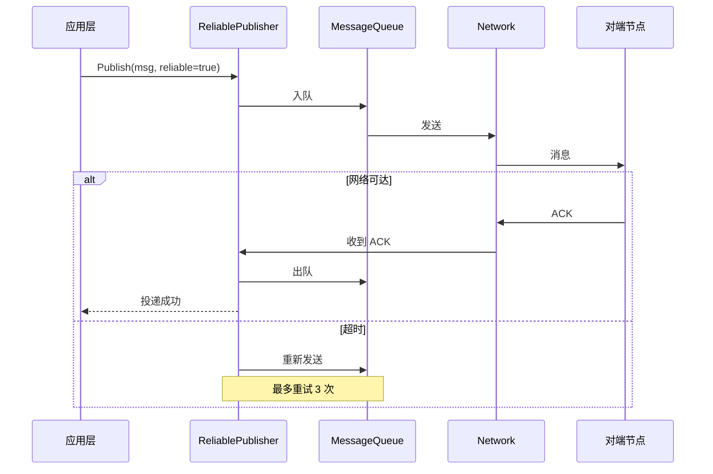

### 关键配置

| 参数 | 默认值 | 说明 |
|------|--------|------|
| QueueSize | 1000 | 消息队列大小 |
| MessageMaxAge | 5 分钟 | 消息最大保留时间 |
| AckTimeout | 5 秒 | ACK 等待超时 |
| MaxRetries | 3 | 最大重试次数 |
| CriticalPeers | [] | 关键节点列表（必须 ACK） |

---

## 相关文档

### L3 行为文档

| 文档 | 说明 |
|------|------|
| [lifecycle_overview.md](lifecycle_overview.md) | ★ 节点生命周期横切面（Phase C: 稳态运行） |
| [realm_flow.md](realm_flow.md) | Realm 加入流程 |
| [connection_flow.md](connection_flow.md) | 连接建立流程 |
| [state_machines.md](state_machines.md) | 状态机定义 |

### 协议规范与需求

| 文档 | 说明 |
|------|------|
| [Messaging 协议规范](../../02_constraints/protocol/L4_application/messaging.md) | 协议详情 |
| [PubSub 协议规范](../../02_constraints/protocol/L4_application/pubsub.md) | 协议详情 |
| [REQ-PROTO-004](../../01_context/requirements/functional/F6_protocol/REQ-PROTO-004.md) | 可靠消息投递需求 |

---

**最后更新**：2026-01-25（添加 lifecycle_overview.md 引用关系）
