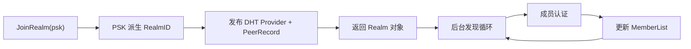
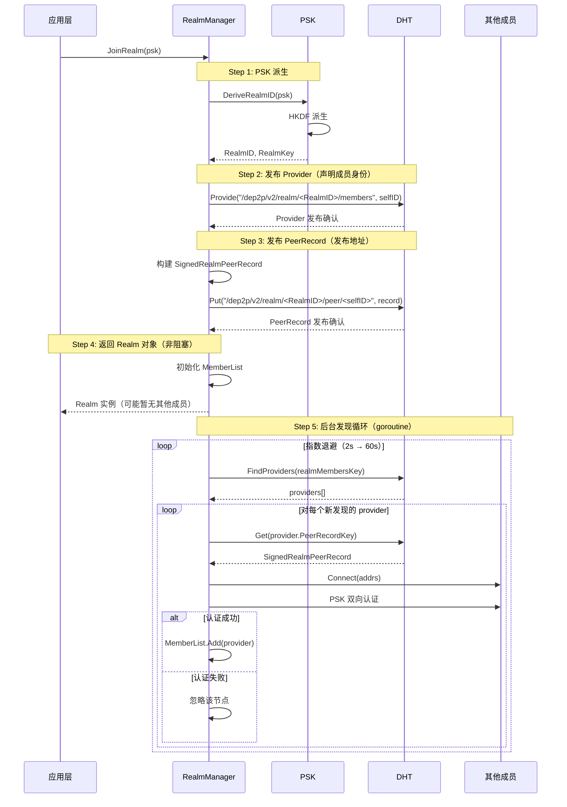
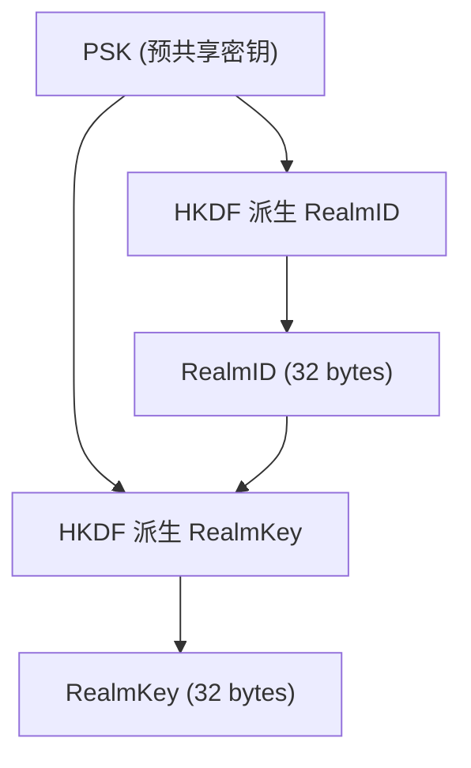
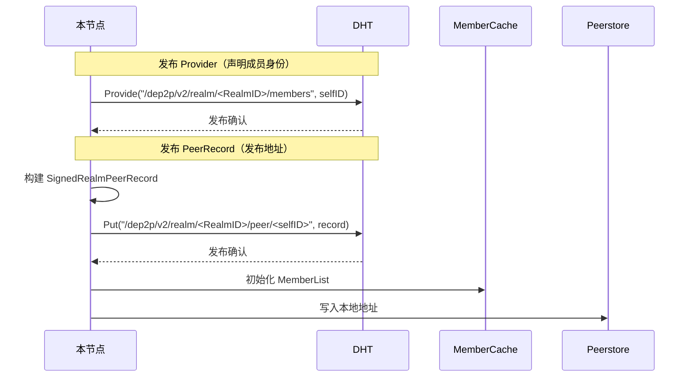
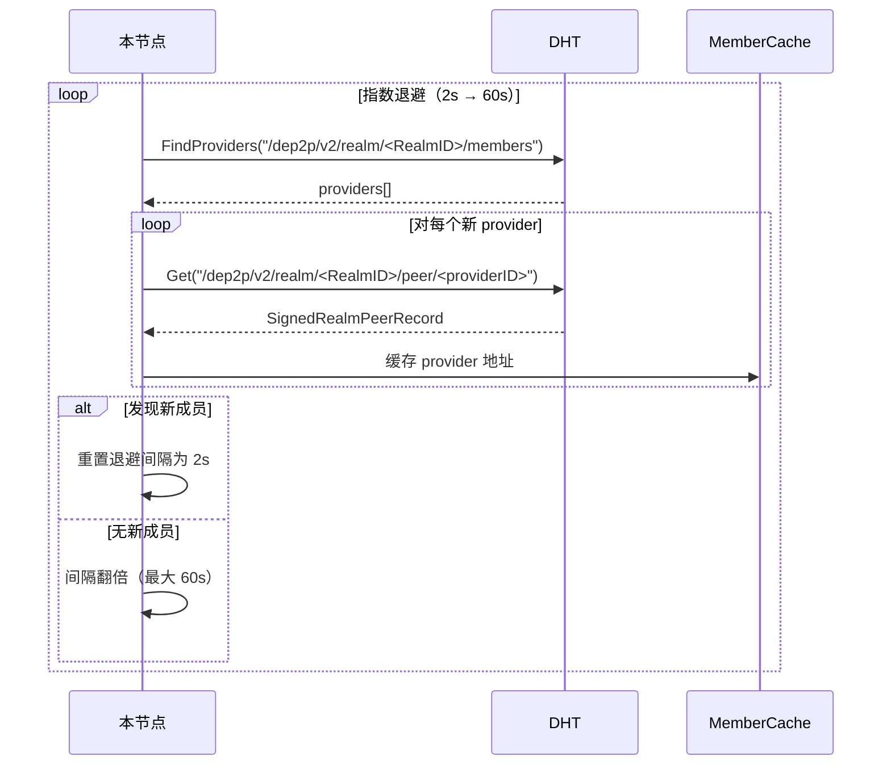
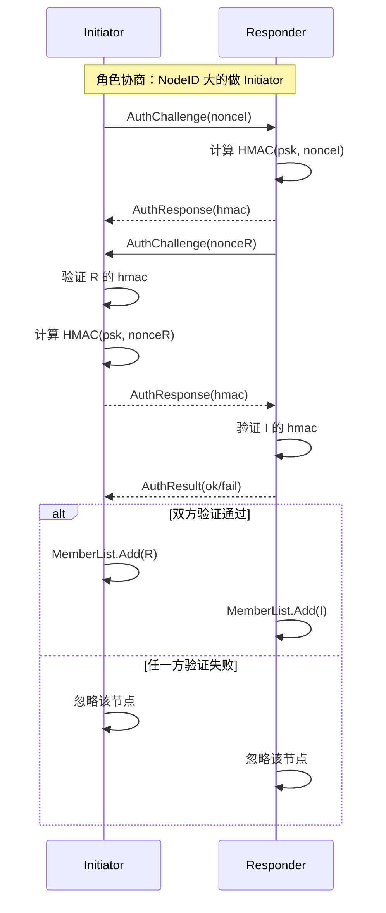
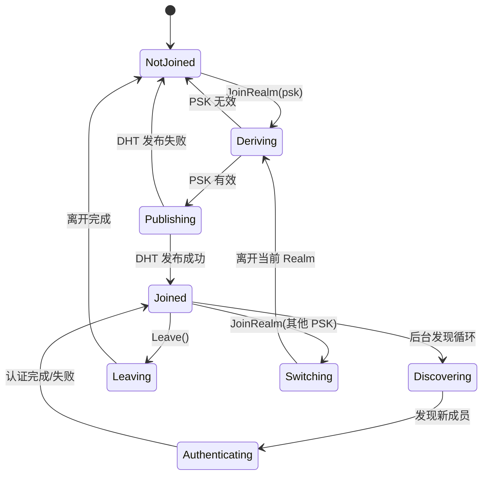
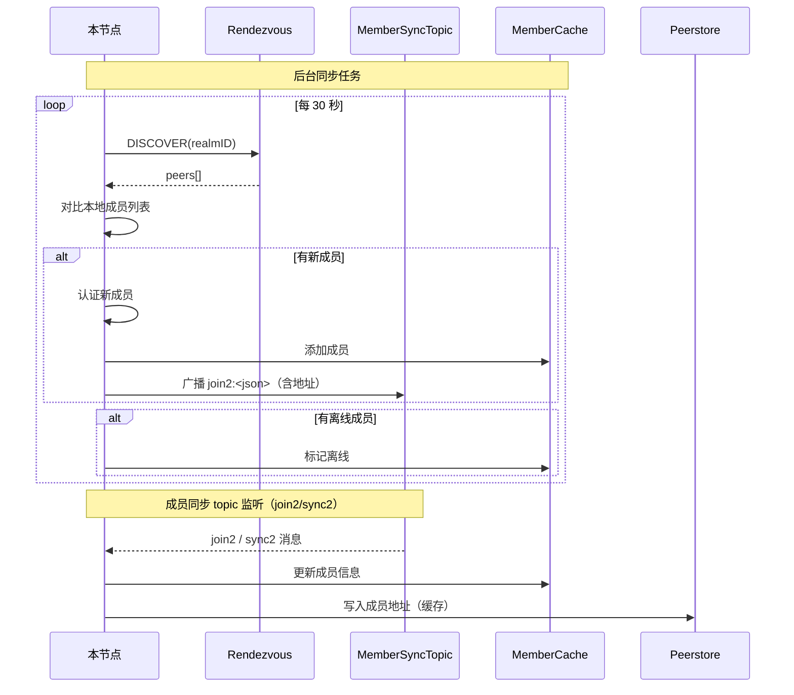
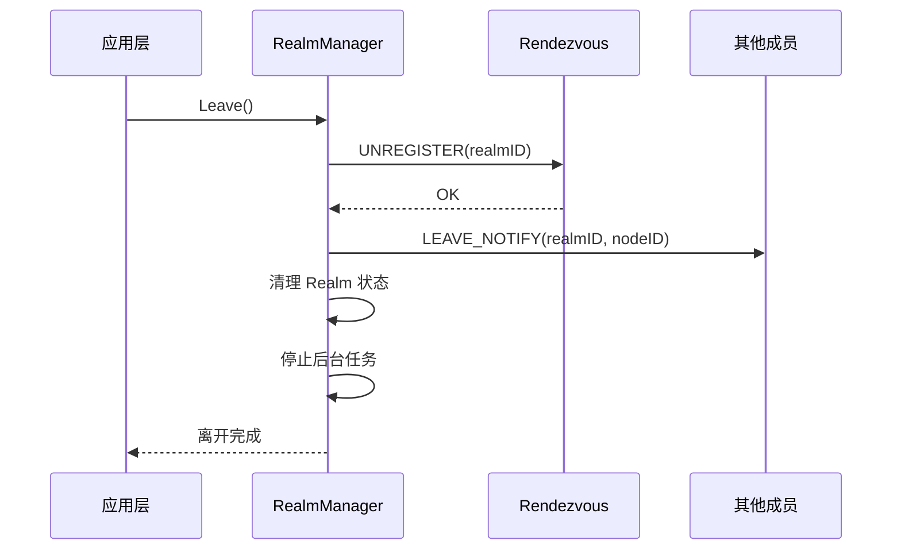
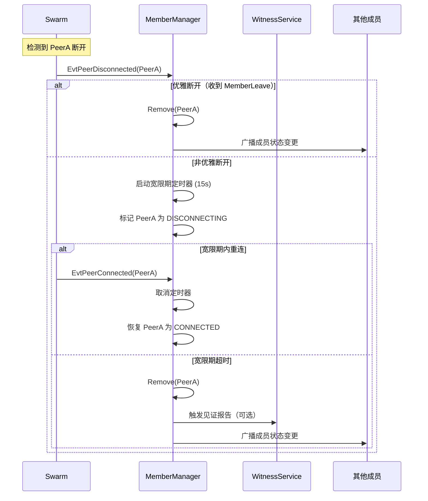

# Realm 加入流程 (Realm Flow)

> Realm 认证、加入、成员管理的端到端流程

---

## 文档定位

本文档是 L3_behavioral 的**纵向流程文档**，专注于描述 Realm 加入与管理的完整行为。

### 与横切面的关系

Realm 加入是节点生命周期的 Phase B 阶段，详见 [lifecycle_overview.md](lifecycle_overview.md)：

| 生命周期阶段 | Realm 相关内容 | 本文档章节 |
|-------------|---------------|-----------|
| Phase B: Realm 加入 | PSK 认证与 RealmID 派生 | [PSK 派生流程](#psk-派生) |
| Phase B: Realm 加入 | DHT 发布与成员发现 | [完整加入流程](#完整加入流程) |
| Phase B: Realm 加入 | 成员同步（Gossip） | [成员同步流程](#成员同步流程) |

---

## 流程概述

> 详见 [DHT-Realm 架构重构方案](../../_discussions/20260126-dht-realm-architecture-redesign.md)

Realm 是 DeP2P 的业务隔离域，加入 Realm 需要 PSK 认证。



### 参与组件

| 组件 | 目录 | 职责 |
|------|------|------|
| **RealmManager** | `internal/realm/manager/` | Realm 生命周期管理 |
| **RealmAuth** | `internal/realm/auth/` | 成员认证（PSK 双向认证） |
| **PSK** | `internal/realm/auth/` | 密钥派生 |
| **DHT** | `internal/discovery/dht/` | Provider + PeerRecord 发布与查询 |
| **MemberSyncTopic** | `internal/realm/` | 成员列表 Gossip 同步 |
| **Peerstore** | `internal/core/peerstore/` | 地址与成员信息缓存 |

---

## 完整加入流程

采用"先发布后发现"模式：



---

## 阶段详解

### 阶段 1: PSK 派生

```
PSK 派生流程：

  输入: PSK (用户提供的预共享密钥)
  输出: RealmID, RealmKey

  步骤:
    1. RealmID = HKDF(
         salt: "dep2p-realm-id-v1",
         ikm: PSK,
         info: SHA256(PSK),
         length: 32
       )
       
    2. RealmKey = HKDF(
         salt: RealmID,
         ikm: PSK,
         info: "dep2p realm key",
         length: 32
       )
```



### 阶段 2: DHT 发布

直接发布到 DHT（先发布后发现）：



### 阶段 3: 成员发现（后台循环）

> 发现循环在后台持续运行，使用指数退避策略。



### 阶段 4: 成员认证（PSK 双向认证）

> **角色协商**：NodeID 字节序大的做发起方（Initiator）



> **注**：连接层加密由底层（libp2p TLS/Noise）处理，此处只做身份确认。

---

## Realm 状态机



### 状态说明

| 状态 | 说明 |
|------|------|
| **NotJoined** | 未加入任何 Realm |
| **Deriving** | 正在派生 RealmID/RealmKey |
| **Publishing** | 正在发布 DHT Provider + PeerRecord |
| **Joined** | 已加入 Realm（可能暂无其他成员） |
| **Discovering** | 后台发现循环运行中 |
| **Authenticating** | 正在对新发现的成员进行 PSK 双向认证 |
| **Leaving** | 正在离开 Realm |
| **Switching** | 正在切换 Realm |

---

## 成员同步流程

加入 Realm 后，需要持续同步成员列表，并同步成员地址（V2 消息包含地址）：



---

## 离开 Realm 流程



---

## 成员离线检测（v1.1 新增）

> 详见 [disconnect_detection.md](disconnect_detection.md) 完整断开检测流程

### 离线检测与成员状态同步

```
核心原则: 连接即成员（INV-003）

  成员在线状态 = 有活跃连接 ∧ 通过认证
  
  检测到断开 → 更新 MemberList → 广播状态变更
```

### 成员离线处理流程



### 断开保护期

```
目的: 防止竞态条件导致刚断开的成员被重新添加

机制:
  1. Remove() 时记录 peerID 到 recentlyDisconnected
  2. Add() 时检查保护期（默认 30s）
  3. 保护期内的 Add() 被静默忽略
```

### 震荡处理

```
目的: 避免网络抖动导致的成员状态频繁变更

震荡判定: 60s 内 >= 3 次断开/重连

处理策略:
  - 震荡中的成员不触发见证报告
  - 状态变更延迟广播（5s debounce）
  - 成员列表标记为"不稳定"
```

---

## 错误处理

### 错误类型

| 错误 | 原因 | 处理 |
|------|------|------|
| **ErrInvalidPSK** | PSK 格式无效 | 返回错误 |
| **ErrRendezvousFailed** | Rendezvous 注册失败 | 重试或返回错误 |
| **ErrAuthFailed** | 成员认证失败 | 忽略该节点 |
| **ErrAlreadyJoined** | 已加入该 Realm | 返回当前 Realm |
| **ErrNotMember** | 未加入 Realm 调用业务 API | 返回错误 |

### 重试策略

```
Rendezvous 重试:
  - 指数退避
  - 初始间隔: 1 秒
  - 最大间隔: 30 秒
  - 最大重试: 5 次

成员认证重试:
  - 单个成员失败不影响整体
  - 后台定期重试
```

---

## 代码路径

| 阶段 | 代码路径 |
|------|----------|
| Realm 管理 | `internal/realm/manager/` |
| PSK 派生 | `internal/realm/auth/` |
| 成员认证（PSK 双向） | `internal/realm/auth/` |
| 成员管理 | `internal/realm/member/` |
| 发现循环 | `internal/realm/discovery.go` |
| 成员同步 | `internal/realm/realm.go` |
| DHT 发布 | `internal/discovery/dht/` |

---

## 相关文档

### L3 行为文档

| 文档 | 说明 |
|------|------|
| [lifecycle_overview.md](lifecycle_overview.md) | ★ 节点生命周期横切面（Phase B: Realm 加入） |
| [disconnect_detection.md](disconnect_detection.md) | ★ 断开检测流程（成员离线检测） |
| [discovery_flow.md](discovery_flow.md) | 节点发现流程 |
| [messaging_flow.md](messaging_flow.md) | 消息传递流程 |
| [relay_flow.md](relay_flow.md) | 中继流程 |
| [state_machines.md](state_machines.md) | 状态机定义 |

### 约束与 ADR

| 文档 | 说明 |
|------|------|
| [INV-002](../../01_context/decisions/invariants/INV-002-realm-membership.md) | Realm 成员资格 |
| [INV-003](../../01_context/decisions/invariants/INV-003-connection-membership.md) | 连接即成员不变量 |
| [ADR-0010](../../01_context/decisions/ADR-0010-relay-explicit-config.md) | Relay 明确配置 |
| [ADR-0012](../../01_context/decisions/ADR-0012-disconnect-detection.md) | 断开检测架构 |
| [Realm 协议规范](../../02_constraints/protocol/L4_application/realm.md) | 协议详情 |
| [存活检测协议](../../02_constraints/protocol/L4_application/liveness.md) | MemberLeave/Witness 协议 |

---

**最后更新**：2026-01-28（新增成员离线检测章节）
