# Relay 中继流程 (Relay Flow)

> Relay 配置、按需连接、中继通信的端到端流程

---

## 文档定位

本文档是 L3_behavioral 的**纵向流程文档**，专注于描述 Relay 中继的完整行为。

### 与横切面的关系

Relay 在节点生命周期的多个阶段发挥作用，详见 [lifecycle_overview.md](lifecycle_overview.md)：

| 生命周期阶段 | Relay 相关内容 | 本文档章节 |
|-------------|---------------|-----------|
| Phase A: 冷启动 | Relay 预留（显式配置） | [Relay 配置方式](#-relay-配置方式显式配置) |
| Phase A: 冷启动 | 地址簿注册 | [地址注册流程](#地址注册流程含后续更新) |
| Phase C: 稳态运行 | 打洞协调、数据转发 | [打洞协调详细流程](#-打洞协调详细流程) |
| Phase C: 稳态运行 | 地址更新 | [AddressUpdate 触发条件](#addressupdate-触发条件) |

### 与 L6 的边界

| 本文档 (L3) | L6_domains |
|------------|------------|
| Relay 三大职责、惰性中继策略 | AddressBook 数据结构 |
| 打洞协调时序、连接优先级 | Relay 协议消息定义 |
| 地址簿行为描述 | RelayManager 接口 |

> AddressBook 数据结构详情参见 [L6_domains/core_relay](../L6_domains/core_relay/design/overview.md)

---

## 流程概述

Relay 是 DeP2P 的核心基础设施，具有**三大职责 (v2.0)**：

1. **缓存加速层**：维护地址簿，作为 DHT 本地缓存（非权威）
2. **打洞协调信令**：打洞协调的必要前提
3. **数据通信保底**：直连/打洞失败时作为数据转发通道

### ★ v2.0 三层架构（DHT 权威模型）

```
┌─────────────────────────────────────────────────────────────────────────────┐
│                    v2.0 三层架构（★ DHT 权威模型）                           │
├─────────────────────────────────────────────────────────────────────────────┤
│                                                                             │
│  ★ DHT 是权威目录，Relay 是缓存/信令/保底                                   │
│                                                                             │
│  Layer 1: DHT（★ 权威目录）— 存储签名 PeerRecord                             │
│  Layer 2: 缓存加速层 — Peerstore / MemberList / Relay 地址簿                 │
│  Layer 3: 连接策略 — 直连 → 打洞 → Relay 兜底                                │
│                                                                             │
│  ═══════════════════════════════════════════════════════════════════════   │
│  Relay 职责一：缓存加速层（非权威目录）                                      │
│  ═══════════════════════════════════════════════════════════════════════   │
│                                                                             │
│  场景：Alice 想连接 Bob，DHT 查询较慢时可先查 Relay 缓存                    │
│                                                                             │
│  Alice ──[查询地址]──▶ DHT（权威）/ Relay 地址簿（缓存）                    │
│                                                                             │
│  • Relay 维护连接成员的地址信息（作为 DHT 本地缓存）                       │
│  • ★ Relay 地址簿是缓存，DHT 才是权威目录                                   │
│  • 获取地址后，优先尝试直连                                                │
│                                                                             │
│  ═══════════════════════════════════════════════════════════════════════   │
│  Relay 职责二：打洞协调信令（Signaling Channel）                             │
│  ═══════════════════════════════════════════════════════════════════════   │
│                                                                             │
│  场景：Alice 和 Bob 都在 NAT 后，需要打洞建立直连                           │
│                                                                             │
│  Alice ──[打洞请求]──▶ Relay ──[转发]──▶ Bob                               │
│                                                                             │
│  • Relay 连接作为打洞协调的信令通道（交换候选地址）                        │
│  • ★ 信令通道来自显式配置的 Relay 连接（ADR-0010）                         │
│  • 没有可用信令通道时，跳过打洞阶段                                        │
│                                                                             │
│  ═══════════════════════════════════════════════════════════════════════   │
│  Relay 职责三：数据通信保底（Data Relay Fallback）                           │
│  ═══════════════════════════════════════════════════════════════════════   │
│                                                                             │
│  场景：Alice 获得了 Bob 地址，但直连和打洞都失败                            │
│                                                                             │
│  Alice ─────────[Relay 转发]───────── Bob                                  │
│                                                                             │
│  • 只有直连和打洞都失败时才使用 Relay 转发数据                             │
│  • 确保总是可达（真正的保底）                                              │
│                                                                             │
│  ★ 设计目标：70-80% 直连，Relay 不成为瓶颈                                  │
│                                                                             │
└─────────────────────────────────────────────────────────────────────────────┘
```

### 核心理念：中继 = 系统能力

```
┌─────────────────────────────────────────────────────────────────────────────┐
│                    中继是"系统能力"，不是"地址类型"                          │
├─────────────────────────────────────────────────────────────────────────────┤
│                                                                             │
│  用户视角：                                                                  │
│  ──────────                                                                 │
│  • 用户调用: realm.Connect(ctx, targetNodeID)                              │
│  • 用户不知道底层走的是直连还是中继                                         │
│  • 中继对用户完全透明                                                       │
│                                                                             │
│  系统视角：                                                                  │
│  ──────────                                                                 │
│  • 自动检测网络环境（公网/NAT）                                             │
│  • 使用明确配置的中继地址（无自动发现）                                     │
│  • 自动选择最优连接路径（直连 → 打洞 → 中继）                              │
│  • 自动建立中继电路（如需要）                                               │
│                                                                             │
└─────────────────────────────────────────────────────────────────────────────┘
```

### 核心原则

```
┌─────────────────────────────────────────────────────────────────────────────┐
│                         惰性中继策略                                         │
├─────────────────────────────────────────────────────────────────────────────┤
│                                                                             │
│  1. P2P 优先：直连是核心，中继是辅助                                        │
│  2. 按需使用：直连失败 → 打洞失败 → 才使用中继                              │
│  3. 明确配置：中继地址由项目方/业务方明确提供（无自动发现）                 │
│  4. 透明连接：中继建立对用户完全透明                                        │
│                                                                             │
└─────────────────────────────────────────────────────────────────────────────┘
```

详见 [ADR-0010: Relay 明确配置](../../01_context/decisions/ADR-0010-relay-explicit-config.md)

### ★ 统一 Relay 概念

> **重要变更**：不再区分控制面/数据面中继，统一为单一的 Relay 概念。

| 职责 | 能力 | 说明 |
|--------|------|------|
| 职责一 | **缓存加速层** | 维护地址簿，作为 DHT 本地缓存（非权威目录） |
| 职责二 | **打洞协调信令** | 打洞协调的必要前提（交换候选地址） |
| 职责三 | **数据通信保底** | 直连/打洞失败时转发数据 |

> ★ **v2.0 核心原则**：DHT 是权威目录，Relay 地址簿是缓存加速层
> ★ **显式配置原则（ADR-0010）**：Relay 地址需要显式配置，不支持自动发现

### 配置方式（极简开关）

```pseudocode
// ════════════════════════════════════════════════════════════════════════════
// Relay 配置（统一）
// ════════════════════════════════════════════════════════════════════════════

// 作为 Relay 服务器
node = NewNode(ctx, EnableRelay: true)
node.EnableRelay(ctx)   // 运行时启用
node.DisableRelay(ctx)  // 运行时禁用

// 作为 Relay 客户端
node = NewNode(ctx,
    WithRelayAddr: "/ip4/relay.dep2p.io/tcp/4001/p2p/Qm..."
)

// 查询
if addr = node.Relay(); addr != nil:
    print("Relay:", addr)
```

### 流程总览

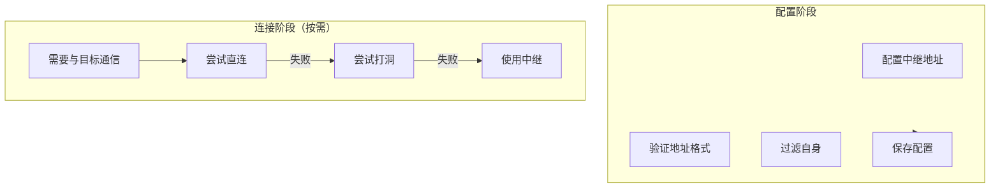
```mermaid
flowchart TB
    subgraph Config["配置阶段"]
        SetRelay["配置中继地址"]
        Validate["验证地址格式"]
        FilterSelf["过滤自身"]
        Save["保存配置"]
    end
    
    subgraph Connect["连接阶段（按需）"]
        Need["需要与目标通信"]
        Direct["尝试直连"]
        Hole["尝试打洞"]
        UseRelay["使用中继"]
    end
    
    Config --> Save
    Need --> Direct
    Direct -->|失败| Hole
    Hole -->|失败| UseRelay
```

---

## 连接优先级流程

### 完整连接流程

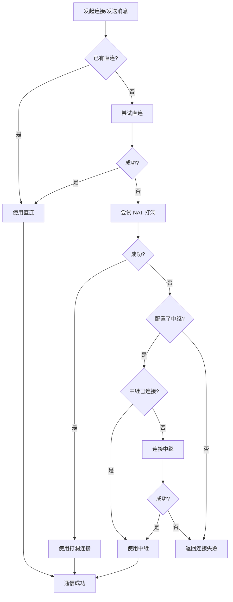
```mermaid
flowchart TB
    Start[发起连接/发送消息] --> CheckDirect{已有直连?}
    CheckDirect -->|是| UseDirect[使用直连]
    CheckDirect -->|否| TryDirect[尝试直连]
    
    TryDirect --> DirectOK{成功?}
    DirectOK -->|是| UseDirect
    DirectOK -->|否| TryHole[尝试 NAT 打洞]
    
    TryHole --> HoleOK{成功?}
    HoleOK -->|是| UseHole[使用打洞连接]
    HoleOK -->|否| CheckRelay{配置了中继?}
    
    CheckRelay -->|是| CheckRelayConn{中继已连接?}
    CheckRelay -->|否| Fail[返回连接失败]
    
    CheckRelayConn -->|是| UseRelay[使用中继]
    CheckRelayConn -->|否| ConnectRelay[连接中继]
    
    ConnectRelay --> RelayOK{成功?}
    RelayOK -->|是| UseRelay
    RelayOK -->|否| Fail
    
    UseDirect --> Done[通信成功]
    UseHole --> Done
    UseRelay --> Done
```

### 时序图

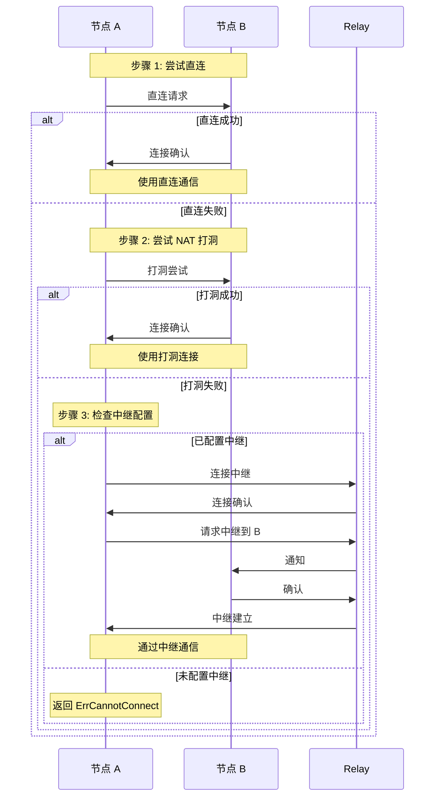
```mermaid
sequenceDiagram
    participant A as 节点 A
    participant B as 节点 B
    participant R as Relay
    
    Note over A,B: 步骤 1: 尝试直连
    A->>B: 直连请求
    
    alt 直连成功
        B->>A: 连接确认
        Note over A,B: 使用直连通信
    else 直连失败
        Note over A,B: 步骤 2: 尝试 NAT 打洞
        A->>B: 打洞尝试
        
        alt 打洞成功
            B->>A: 连接确认
            Note over A,B: 使用打洞连接
        else 打洞失败
            Note over A: 步骤 3: 检查中继配置
            
            alt 已配置中继
                A->>R: 连接中继
                R->>A: 连接确认
                A->>R: 请求中继到 B
                R->>B: 通知
                B->>R: 确认
                R->>A: 中继建立
                Note over A,B: 通过中继通信
            else 未配置中继
                Note over A: 返回 ErrCannotConnect
            end
        end
    end
```

---

## Relay 地址簿功能

Relay 维护一个**成员地址簿**，记录所有连接成员的地址信息。

### 地址簿数据结构

```
┌─────────────────────────────────────────────────────────────────────────────┐
│                    Relay 地址簿数据结构                                      │
├─────────────────────────────────────────────────────────────────────────────┤
│                                                                             │
│  type MemberAddressBook struct {                                            │
│      entries map[string]*MemberEntry  // NodeID → Entry                    │
│  }                                                                          │
│                                                                             │
│  type MemberEntry struct {                                                  │
│      NodeID       string        // 成员身份（公钥派生）                    │
│      DirectAddrs  []string      // 直连地址（公网可达）                    │
│      NATType      NATType       // NAT 类型（用于打洞决策）                │
│      Capabilities []string      // 能力标签（如"可做 Relay"）             │
│      Online       bool          // 在线状态                                │
│      LastSeen     time.Time     // 最后活跃时间                            │
│      LastUpdate   time.Time     // 地址最后更新时间                        │
│  }                                                                          │
│                                                                             │
│  type NATType int                                                           │
│  const (                                                                    │
│      NATTypeUnknown    NATType = iota  // 未知                             │
│      NATTypeNone                        // 公网直连                         │
│      NATTypeFullCone                    // 完全锥形（易打洞）               │
│      NATTypeRestricted                  // 受限锥形                         │
│      NATTypeSymmetric                   // 对称 NAT（难打洞）               │
│  )                                                                          │
│                                                                             │
└─────────────────────────────────────────────────────────────────────────────┘
```

### ★ 打洞地址适用条件

```
┌─────────────────────────────────────────────────────────────────────────────┐
│                    打洞地址的适用条件与限制                                  │
├─────────────────────────────────────────────────────────────────────────────┤
│                                                                             │
│  ⚠️ 观察地址不一定适合打洞，需要满足以下条件：                              │
│                                                                             │
│  适用条件：                                                                  │
│  ──────────                                                                 │
│  ✅ NAT 类型为 Cone NAT（Full/Restricted/Port Restricted）                  │
│  ✅ 观察地址与打洞使用相同协议（UDP/UDP 或 TCP/TCP）                        │
│  ✅ 观察地址在打洞窗口内仍然有效                                            │
│                                                                             │
│  不适用情况：                                                                │
│  ──────────────                                                             │
│  ❌ Symmetric NAT：每个连接分配不同端口，观察地址对其他目标无效             │
│  ❌ 协议不匹配：TCP 连接获取的地址不能用于 UDP 打洞                         │
│  ❌ 地址已过期：NAT 映射超时后地址失效                                      │
│  ❌ 端口复用场景：多个应用共享端口时可能冲突                                │
│                                                                             │
│  打洞决策矩阵：                                                              │
│  ┌──────────────────────────────────────────────────────────────────────┐   │
│  │  发起方 ╲ 目标方   Full Cone   Restricted   Symmetric                │   │
│  ├──────────────────────────────────────────────────────────────────────┤   │
│  │  Full Cone          直连优先    打洞优先     打洞尝试                 │   │
│  │  Restricted         打洞优先    打洞尝试     Relay                    │   │
│  │  Symmetric          打洞尝试    Relay        Relay ★                 │   │
│  └──────────────────────────────────────────────────────────────────────┘   │
│  ★ 双方都是 Symmetric NAT 时，直接使用 Relay，不浪费时间打洞              │
│                                                                             │
│  最佳实践：                                                                  │
│  ──────────                                                                 │
│  • 打洞前重新获取最新的外部地址                                              │
│  • 结合 NAT 类型检测判断打洞可行性                                          │
│  • Symmetric NAT 应跳过打洞直接使用 Relay                                   │
│                                                                             │
└─────────────────────────────────────────────────────────────────────────────┘
```

### ★ 打洞协调详细流程

打洞需要信令通道来协调双方同时发包。Relay 连接是最常见的信令通道。

```
┌─────────────────────────────────────────────────────────────────────────────┐
│                    打洞协调详细流程（★ BUG-27 澄清）                          │
├─────────────────────────────────────────────────────────────────────────────┤
│                                                                             │
│  前提条件：                                                                  │
│  ══════════                                                                 │
│  • 双方已有信令通道（通常是 Relay 连接）                                    │
│  • 至少一方不是 Symmetric NAT（否则直接使用 Relay）                         │
│  • ★ 双方的 ShareableAddrs 可用（不依赖 Peerstore directAddrs）            │
│                                                                             │
│  协调流程：                                                                  │
│  ══════════                                                                 │
│                                                                             │
│  1. 发起方决策                                                              │
│     ──────────                                                              │
│     • 查询双方 NAT 类型                                                     │
│     • 根据决策矩阵判断是否打洞                                              │
│     • 如果双方都是 Symmetric → 跳过，直接使用 Relay                         │
│                                                                             │
│  2. 地址交换（通过信令通道）                                                 │
│     ────────────────────────                                                │
│     • ★ BUG-27 修复：使用 ShareableAddrs 而非 Addrs                        │
│     • 发起方发送: CONNECT { obsAddrs: [ShareableAddrs] }                    │
│     • 目标方响应: CONNECT { obsAddrs: [ShareableAddrs] }                    │
│                                                                             │
│     ★ ShareableAddrs 包含：                                                 │
│       - STUN 观测地址（公网 IP:Port）                                       │
│       - Relay 地址（/p2p-circuit/...）                                     │
│       - 已验证的公网直连地址                                                │
│                                                                             │
│     ❌ 不使用 Addrs()（返回私网监听地址）                                    │
│                                                                             │
│  3. 同步打洞                                                                 │
│     ──────────                                                              │
│     • 发送 SYNC 消息同步时机                                                │
│     • 双方同时向对方的观测地址发送 UDP 包                                   │
│     • 超时设置：5 秒                                                        │
│                                                                             │
│  4. 连接建立                                                                 │
│     ──────────                                                              │
│     • 打洞成功 → 建立直连                                                   │
│     • 打洞失败 → 回退到 Relay                                               │
│     • ★ 无论成功与否，保留 Relay 连接作为备份                               │
│                                                                             │
└─────────────────────────────────────────────────────────────────────────────┘
```

### ★ 打洞地址来源（BUG-27 修复说明）

```
┌─────────────────────────────────────────────────────────────────────────────┐
│                    打洞地址来源（★ 关键设计）                                 │
├─────────────────────────────────────────────────────────────────────────────┤
│                                                                             │
│  ★ 打洞不依赖 Peerstore 的 directAddrs                                      │
│                                                                             │
│  原因：                                                                      │
│  ──────                                                                     │
│  • NAT 节点在 DHT 发布的 PeerRecord 只有 relay_addrs，没有 direct_addrs    │
│  • 因此 Peerstore 中该 Peer 的 directAddrs 为空                            │
│  • 如果依赖 directAddrs，NAT 节点永远无法打洞                               │
│                                                                             │
│  正确做法：                                                                  │
│  ──────────                                                                 │
│  • 打洞协议通过 CONNECT 消息**动态交换**双方当前的观测地址                  │
│  • 观测地址来自 Host.ShareableAddrs()，不是 Peerstore                      │
│                                                                             │
│  地址获取优先级（getObservedAddrs）：                                        │
│  ═══════════════════════════════════                                        │
│  1. ShareableAddrs() - 已验证的外部地址（★ 推荐）                           │
│  2. AdvertisedAddrs() - 宣告地址（包含 Relay）                              │
│  3. Addrs() - 监听地址（私网，最后回退）                                    │
│                                                                             │
│  ┌─────────────────────────────────────────────────────────────────────┐   │
│  │   方法               返回内容                 适合打洞？             │   │
│  ├─────────────────────────────────────────────────────────────────────┤   │
│  │   Addrs()           监听地址（私网）          ❌ 不适合              │   │
│  │   AdvertisedAddrs() 宣告地址（含 Relay）      ⚠️ 部分适合            │   │
│  │   ShareableAddrs()  已验证的外部地址          ✅ 推荐                │   │
│  └─────────────────────────────────────────────────────────────────────┘   │
│                                                                             │
└─────────────────────────────────────────────────────────────────────────────┘
```

**打洞协调时序图**：

```mermaid
sequenceDiagram
    participant A as 节点 A
    participant R as Relay (信令通道)
    participant B as 节点 B
    
    Note over A,B: 前提：双方已连接到 Relay
    
    A->>A: 1. 查询 NAT 类型<br/>(A: Restricted, B: FullCone)
    A->>A: 2. 决策：可以打洞
    
    Note over A,R,B: 地址交换（通过 Relay）
    A->>R: CONNECT_REQUEST {addrs: [A的外部地址], nonce}
    R->>B: 转发 CONNECT_REQUEST
    B->>R: CONNECT_RESPONSE {addrs: [B的外部地址], nonce}
    R->>A: 转发 CONNECT_RESPONSE
    
    Note over A,B: 同步打洞
    par 双方同时发包
        A->>B: UDP Punch (尝试打洞)
        B->>A: UDP Punch (尝试打洞)
    end
    
    alt 打洞成功
        A->>B: 直连建立
        Note over A,B: ★ 保留 Relay 连接作为备份
    else 打洞失败（超时）
        Note over A,R,B: 继续使用 Relay 通信
    end
```

**信令通道来源优先级**：

| 优先级 | 信令通道 | 说明 |
|--------|---------|------|
| 1 | Relay 连接 | ★ 最常见，双方 NAT 后首先建立的连接 |
| 2 | 已有连接 | 如果已有其他直连，可复用 |
| 3 | 外部信令服务 | 应用层自定义（不推荐） |

> **★ 信令通道说明（与 ADR-0010 一致）**：
> - 虽然 Relay 连接是最常见的选择，但**不是唯一选择**
> - 如果已有其他连接（如之前的直连），也可以复用作为信令通道
> - **当前版本（ADR-0010）要求显式配置 Relay**，所以在实践中通常使用 Relay 连接
> - 未来版本可能支持更灵活的信令通道选择

### 地址簿更新来源

```
┌─────────────────────────────────────────────────────────────────────────────┐
│                    AddressBook 数据来源                                      │
├─────────────────────────────────────────────────────────────────────────────┤
│                                                                             │
│  1) 成员连接 Relay 时 AddressRegister（直连地址 + NAT 类型）                 │
│  2) 地址变化时 AddressUpdate（网络切换 / STUN 变化）                         │
│  3) Join / MemberSync（join2/sync2）提供成员地址线索                          │
│  4) Identify 交换 ListenAddrs / ObservedAddr（提升准确性）                   │
│                                                                             │
└─────────────────────────────────────────────────────────────────────────────┘
```

### 地址发布/查询协议

协议 ID：`/dep2p/realm/<realmID>/addressbook/1.0.0`

```
┌─────────────────────────────────────────────────────────────────────────────┐
│                    地址发布/查询协议消息                                     │
├─────────────────────────────────────────────────────────────────────────────┤
│                                                                             │
│  1. AddressRegister（成员 → Relay）                                         │
│  ─────────────────────────────────                                          │
│  成员连接 Relay 时自动发送，注册自己的地址                                  │
│                                                                             │
│  message AddressRegister {                                                  │
│      string   node_id       = 1;  // 注册者身份                            │
│      repeated string direct_addrs = 2;  // 直连地址列表                    │
│      NATType  nat_type      = 3;  // NAT 类型                              │
│      int64    timestamp     = 4;  // 时间戳                                │
│      bytes    signature     = 5;  // 签名（防伪造）                        │
│  }                                                                          │
│                                                                             │
│  2. AddressQuery（成员 → Relay）                                            │
│  ────────────────────────────────                                           │
│  查询其他成员的地址                                                         │
│                                                                             │
│  message AddressQuery {                                                     │
│      string target_node_id = 1;  // 目标节点 ID                            │
│  }                                                                          │
│                                                                             │
│  3. AddressResponse（Relay → 成员）                                         │
│  ──────────────────────────────────                                         │
│  返回目标成员的地址信息                                                     │
│                                                                             │
│  message AddressResponse {                                                  │
│      string   node_id       = 1;  // 目标节点 ID                           │
│      repeated string direct_addrs = 2;  // 直连地址                        │
│      NATType  nat_type      = 3;  // NAT 类型（用于打洞决策）              │
│      bool     online        = 4;  // 是否在线                              │
│      int64    last_seen     = 5;  // 最后活跃时间                          │
│  }                                                                          │
│                                                                             │
│  4. AddressUpdate（成员 → Relay）                                           │
│  ────────────────────────────────                                           │
│  地址变化时主动更新                                                         │
│                                                                             │
│  message AddressUpdate {                                                    │
│      repeated string direct_addrs = 1;  // 新地址列表                      │
│      int64    timestamp     = 2;  // 时间戳                                │
│  }                                                                          │
│                                                                             │
└─────────────────────────────────────────────────────────────────────────────┘
```

### 地址注册流程（含后续更新）

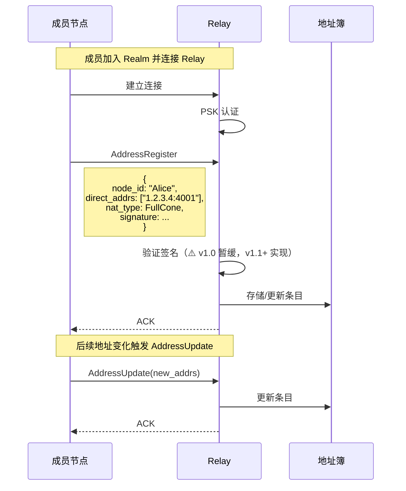
```mermaid
sequenceDiagram
    participant Member as 成员节点
    participant Relay as Relay
    participant Book as 地址簿
    
    Note over Member,Relay: 成员加入 Realm 并连接 Relay
    
    Member->>Relay: 建立连接
    Relay->>Relay: PSK 认证
    
    Member->>Relay: AddressRegister
    Note right of Member: {<br/>  node_id: "Alice",<br/>  direct_addrs: ["1.2.3.4:4001"],<br/>  nat_type: FullCone,<br/>  signature: ...<br/>}
    
    Relay->>Relay: 验证签名（⚠️ v1.0 暂缓，v1.1+ 实现）
    Relay->>Book: 存储/更新条目
    
    Relay-->>Member: ACK

    Note over Member,Relay: 后续地址变化触发 AddressUpdate
    Member->>Relay: AddressUpdate(new_addrs)
    Relay->>Book: 更新条目
    Relay-->>Member: ACK
```

### AddressUpdate 触发条件

```
┌─────────────────────────────────────────────────────────────────────────────┐
│                    AddressUpdate 触发条件                                    │
├─────────────────────────────────────────────────────────────────────────────┤
│                                                                             │
│  1) 网络变化（4G/WiFi 切换、IP 变更）                                        │
│  2) STUN/NetReport 结果变化（公网地址/端口变化）                             │
│  3) Identify 观测地址变化（ObservedAddr 变更）                              │
│  4) ListenAddrs 变更（本地监听地址更新）                                    │
│                                                                             │
│  触发后: AddressUpdate → Relay AddressBook 更新                              │
│                                                                             │
└─────────────────────────────────────────────────────────────────────────────┘
```

> 相关模块：`core_network`（网络变化检测）、`core_netreport`（STUN/公网地址诊断）

### AddressUpdate 更新流程

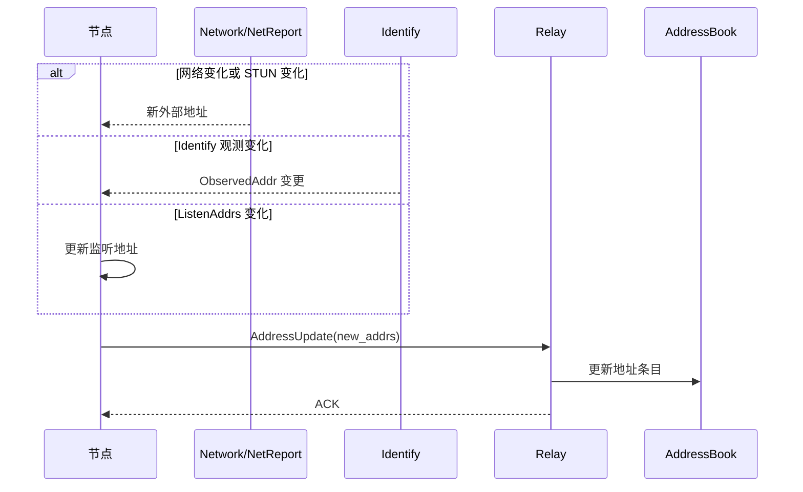
```mermaid
sequenceDiagram
    participant Node as 节点
    participant Net as Network/NetReport
    participant Id as Identify
    participant Relay as Relay
    participant Book as AddressBook

    alt 网络变化或 STUN 变化
        Net-->>Node: 新外部地址
    else Identify 观测变化
        Id-->>Node: ObservedAddr 变更
    else ListenAddrs 变化
        Node->>Node: 更新监听地址
    end

    Node->>Relay: AddressUpdate(new_addrs)
    Relay->>Book: 更新地址条目
    Relay-->>Node: ACK
```

### AddressUpdate 失败与重试

```
┌─────────────────────────────────────────────────────────────────────────────┐
│                    AddressUpdate 失败与重试策略                              │
├─────────────────────────────────────────────────────────────────────────────┤
│                                                                             │
│  失败场景：                                                                  │
│  • Relay 不可达 / 连接断开                                                  │
│  • 认证失败 / 非成员                                                        │
│  • 超时                                                                      │
│                                                                             │
│  处理策略：                                                                  │
│  • 本地缓存新地址                                                            │
│  • 后台重试（指数退避 + 抖动）                                              │
│  • 下次连接 Relay 时自动补发                                                │
│                                                                             │
│  ★ 指数退避参数（精确值）：                                                 │
│  ══════════════════════════                                                 │
│  • 初始间隔（InitialInterval）：1 秒                                        │
│  • 退避因子（Multiplier）：2                                                │
│  • 最大间隔（MaxInterval）：30 秒                                           │
│  • 最大重试次数（MaxRetries）：5 次                                         │
│  • 抖动因子（Jitter）：±20%                                                 │
│                                                                             │
│  重试序列示例：                                                              │
│  ────────────────                                                           │
│  第 1 次：1s   × (1 ± 0.2) = 0.8s ~ 1.2s                                   │
│  第 2 次：2s   × (1 ± 0.2) = 1.6s ~ 2.4s                                   │
│  第 3 次：4s   × (1 ± 0.2) = 3.2s ~ 4.8s                                   │
│  第 4 次：8s   × (1 ± 0.2) = 6.4s ~ 9.6s                                   │
│  第 5 次：16s  × (1 ± 0.2) = 12.8s ~ 19.2s                                 │
│  （最大 30s 封顶）                                                          │
│                                                                             │
│  计算公式：                                                                  │
│  ──────────                                                                 │
│  interval = min(InitialInterval × (Multiplier ^ attempt), MaxInterval)     │
│  actualInterval = interval × (1 + random(-Jitter, +Jitter))                │
│                                                                             │
│  失败后处理：                                                                │
│  ─────────────                                                              │
│  • 达到最大重试次数后，等待下个检测周期                                     │
│  • 记录错误日志，供诊断使用                                                 │
│  • 如果是 Relay 续租失败，尝试重新建立预留                                  │
│                                                                             │
└─────────────────────────────────────────────────────────────────────────────┘
```

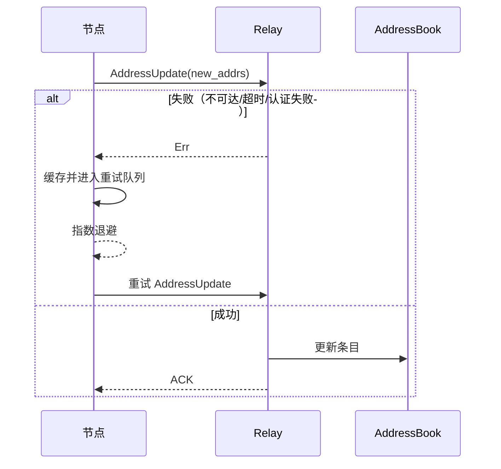
```mermaid
sequenceDiagram
    participant Node as 节点
    participant Relay as Relay
    participant Book as AddressBook

    Node->>Relay: AddressUpdate(new_addrs)
    alt 失败（不可达/超时/认证失败）
        Relay-->>Node: Err
        Node->>Node: 缓存并进入重试队列
        Node-->>Node: 指数退避
        Node->>Relay: 重试 AddressUpdate
    else 成功
        Relay->>Book: 更新条目
        Relay-->>Node: ACK
    end
```

### 地址查询流程

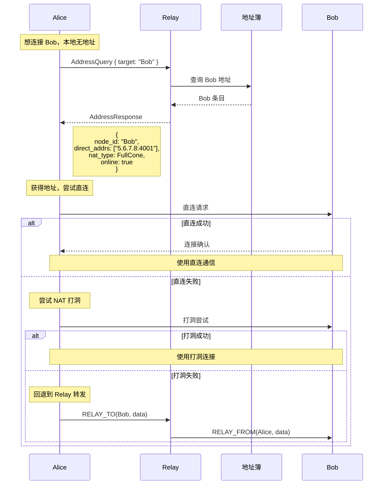
```mermaid
sequenceDiagram
    participant Alice as Alice
    participant Relay as Relay
    participant Book as 地址簿
    participant Bob as Bob
    
    Note over Alice: 想连接 Bob，本地无地址
    
    Alice->>Relay: AddressQuery { target: "Bob" }
    Relay->>Book: 查询 Bob 地址
    Book-->>Relay: Bob 条目
    
    Relay-->>Alice: AddressResponse
    Note left of Relay: {<br/>  node_id: "Bob",<br/>  direct_addrs: ["5.6.7.8:4001"],<br/>  nat_type: FullCone,<br/>  online: true<br/>}
    
    Note over Alice: 获得地址，尝试直连
    Alice->>Bob: 直连请求
    
    alt 直连成功
        Bob-->>Alice: 连接确认
        Note over Alice,Bob: 使用直连通信
    else 直连失败
        Note over Alice: 尝试 NAT 打洞
        Alice->>Bob: 打洞尝试
        
        alt 打洞成功
            Note over Alice,Bob: 使用打洞连接
        else 打洞失败
            Note over Alice: 回退到 Relay 转发
            Alice->>Relay: RELAY_TO(Bob, data)
            Relay->>Bob: RELAY_FROM(Alice, data)
        end
    end
```

### 地址簿持久化

```
┌─────────────────────────────────────────────────────────────────────────────┐
│                    地址簿持久化设计                                          │
├─────────────────────────────────────────────────────────────────────────────┤
│                                                                             │
│  是否需要持久化？                                                            │
│  • Relay 重启 → 成员需要重新注册地址                                       │
│  • 如果有持久化 → 重启后可立即提供地址查询服务                             │
│  • 如果无持久化 → 需要等待成员重新连接                                     │
│                                                                             │
│  建议：可选持久化（由 Relay 运营者配置）                                    │
│                                                                             │
│  type AddressBookStore interface {                                          │
│      Save(entry *MemberEntry) error                                         │
│      Load(nodeID string) (*MemberEntry, error)                             │
│      LoadAll() ([]*MemberEntry, error)                                     │
│      Delete(nodeID string) error                                           │
│      Cleanup(maxAge time.Duration) error  // 清理过期条目                  │
│  }                                                                          │
│                                                                             │
│  实现选项：                                                                  │
│  • MemoryStore - 仅内存（默认，简单）                                      │
│  • BadgerStore - BadgerDB 持久化（推荐）                                   │
│  • BoltStore   - BoltDB 持久化                                             │
│                                                                             │
└─────────────────────────────────────────────────────────────────────────────┘
```

### 安全考虑

| 风险 | 措施 |
|------|------|
| **身份伪造** | AddressRegister 需要签名，Relay 验证后才存储 |
| **未授权访问** | 只有通过 PSK 认证的 Realm 成员才能注册/查询 |
| **地址泄露** | 地址信息仅在 Realm 内共享，不对外暴露 |
| **DoS 攻击** | 限制单个成员的查询频率和注册频率 |

---

## ★ 统一 Relay 流程

### 配置（Node 级别）

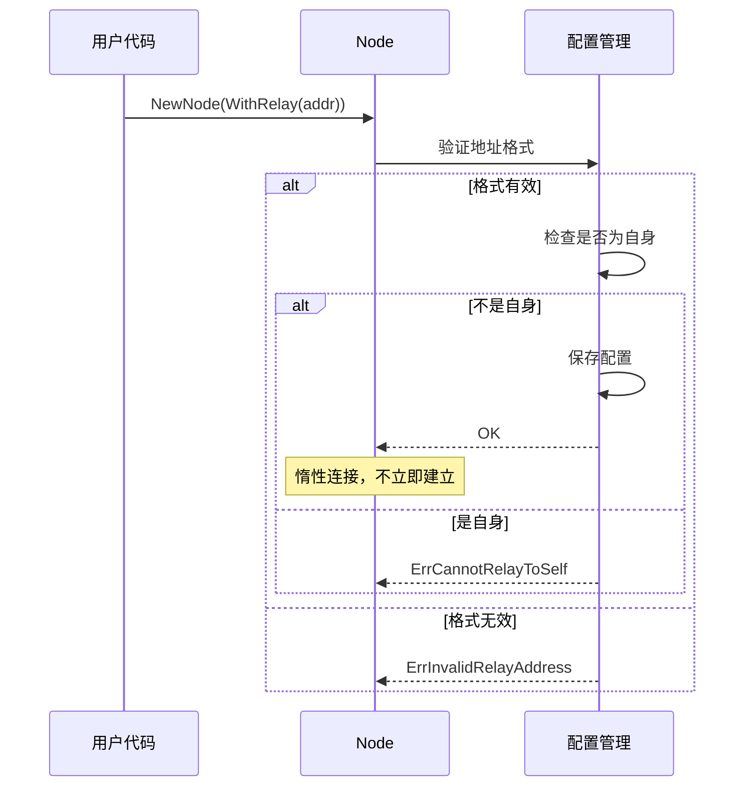
```mermaid
sequenceDiagram
    participant User as 用户代码
    participant Node as Node
    participant Config as 配置管理
    
    User->>Node: NewNode(WithRelay(addr))
    Node->>Config: 验证地址格式
    
    alt 格式有效
        Config->>Config: 检查是否为自身
        
        alt 不是自身
            Config->>Config: 保存配置
            Config-->>Node: OK
            Note over Node: 惰性连接，不立即建立
        else 是自身
            Config-->>Node: ErrCannotRelayToSelf
        end
    else 格式无效
        Config-->>Node: ErrInvalidRelayAddress
    end
```

### 运行时管理

```
// 启动时配置
node, _ := dep2p.NewNode(ctx,
    dep2p.WithRelay("/ip4/relay.dep2p.io/tcp/4001/p2p/QmRelay..."),
)

// 运行时修改
node.SetRelay("/ip4/new-relay.dep2p.io/tcp/4001/p2p/QmNewRelay...")

// 移除
node.RemoveRelay()

// 查询
if addr, ok := node.Relay(); ok {
    fmt.Println("Relay:", addr)
}
```

### Relay 能力与连接优先级（v2.0 统一模型）

```
┌─────────────────────────────────────────────────────────────────────────────┐
│                    Relay 能力与连接优先级（v2.0 统一模型）                    │
├─────────────────────────────────────────────────────────────────────────────┤
│                                                                             │
│  Relay 三大职责 (v2.0):                                                      │
│    • 缓存加速层：维护地址簿，作为 DHT 本地缓存（非权威目录）                  │
│    • 信令通道：打洞协调的必要前提（来自显式配置的 Relay）                    │
│    • 数据通信保底：直连/打洞失败时转发数据                                   │
│                                                                             │
│  连接优先级:                                                                  │
│    1. 直连 ← 优先                                                           │
│    2. 打洞 ← 需要信令通道（通常来自 Relay 连接）                             │
│    3. Relay ← 保底                                                          │
│                                                                             │
│  ★ 打洞成功后保留 Relay:                                                     │
│    • 打洞成功后不断开 Relay 连接                                             │
│    • Relay 作为备份，直连断开时可快速切换                                    │
│                                                                             │
│  资源限制:                                                                   │
│    • 惰性连接：配置 ≠ 立即连接，按需建立                                     │
│    • 保留策略：打洞成功后保留，定期心跳维持                                   │
│                                                                             │
└─────────────────────────────────────────────────────────────────────────────┘
```

---

## Relay 流程详解

### ★ Relay 配置方式（显式配置）

> **当前版本基线（ADR-0010）**：Relay 地址需要**显式配置**，不支持自动发现。

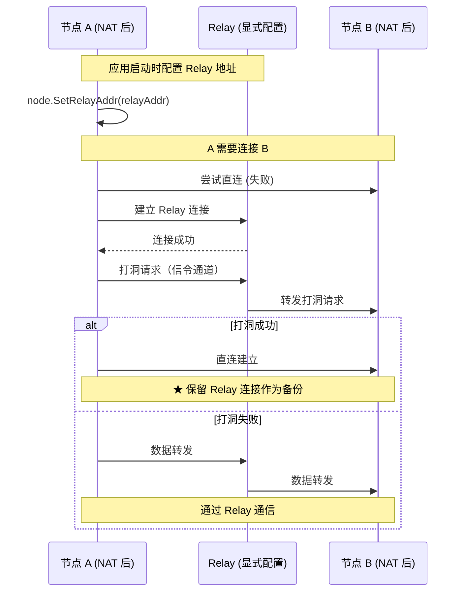
```mermaid
sequenceDiagram
    participant A as 节点 A (NAT 后)
    participant R as Relay (显式配置)
    participant B as 节点 B (NAT 后)
    
    Note over A,R: 应用启动时配置 Relay 地址
    A->>A: node.SetRelayAddr(relayAddr)
    
    Note over A,B: A 需要连接 B
    A->>B: 尝试直连 (失败)
    A->>R: 建立 Relay 连接
    R-->>A: 连接成功
    A->>R: 打洞请求（信令通道）
    R->>B: 转发打洞请求
    
    alt 打洞成功
        A->>B: 直连建立
        Note over A,B: ★ 保留 Relay 连接作为备份
    else 打洞失败
        A->>R: 数据转发
        R->>B: 数据转发
        Note over A,B: 通过 Relay 通信
    end
```

### Relay 配置流程

```
┌─────────────────────────────────────────────────────────────────────────────┐
│                    Relay 显式配置流程（ADR-0010）                            │
├─────────────────────────────────────────────────────────────────────────────┤
│                                                                             │
│  ★ 当前设计：显式配置为主，不支持自动发现                                   │
│                                                                             │
│  配置阶段：                                                                  │
│  ═══════════                                                                │
│  1. 应用/项目方提供 Relay 地址                                              │
│  2. 节点启动时通过 WithRelayAddr 配置                                       │
│  3. 或运行时通过 node.SetRelayAddr() 设置                                   │
│                                                                             │
│  使用阶段（按需连接）：                                                      │
│  ═══════════════════════                                                    │
│  1. 直连失败时，检查是否配置了 Relay                                        │
│  2. 如果已配置 → 建立 Relay 连接                                            │
│  3. 尝试打洞（使用 Relay 作为信令通道）                                     │
│  4. 打洞失败 → 使用 Relay 转发数据                                          │
│                                                                             │
│  ★ 无 Relay 配置时的行为：                                                  │
│  ───────────────────────                                                    │
│  • 直连失败后，跳过打洞阶段（无信令通道）                                   │
│  • 返回连接失败错误                                                         │
│  • 这是预期行为，不是错误                                                   │
│                                                                             │
└─────────────────────────────────────────────────────────────────────────────┘
```

### Relay 配置 API

```pseudocode
// ════════════════════════════════════════════════════════════════════════════
// Relay 配置（显式配置，ADR-0010）
// ════════════════════════════════════════════════════════════════════════════

// 方式 1: 创建时配置
node = NewNode(ctx,
    WithRelayAddr: "/ip4/relay.dep2p.io/tcp/4001/p2p/Qm..."
)

// 方式 2: 运行时配置
node.SetRelayAddr("/ip4/relay.dep2p.io/tcp/4001/p2p/Qm...")

// 移除 Relay 配置
node.RemoveRelay()

// 查询当前 Relay 状态
if addr = node.Relay(); addr != nil:
    print("已配置 Relay:", addr)
```

### Relay 数量策略

```
┌─────────────────────────────────────────────────────────────────────────────┐
│                    Relay 数量策略                                            │
├─────────────────────────────────────────────────────────────────────────────┤
│                                                                             │
│  当前版本：支持配置多个 Relay（与 L5 relay_model 一致）                     │
│                                                                             │
│  多 Relay 的使用场景：                                                      │
│  ═══════════════════════                                                    │
│  • 不同地理区域的 Relay（就近选择）                                        │
│  • 主备 Relay（故障转移）                                                  │
│  • 不同 Realm 使用不同 Relay                                               │
│                                                                             │
│  选择策略：                                                                  │
│  ═══════════                                                                │
│  • 根据延迟选择最优 Relay                                                  │
│  • 故障时自动切换到备用 Relay                                              │
│  • "用哪个 Relay 连接，就用哪个 Relay 发布"原则                            │
│                                                                             │
│  API 设计：                                                                  │
│  ═══════════                                                                │
│  • SetRelayAddr(addr) - 添加/更新 Relay                                    │
│  • SetRelayAddrs(addrs) - 设置多个 Relay                                   │
│  • RemoveRelay(addr) - 移除指定 Relay                                      │
│  • Relays() - 获取所有配置的 Relay                                         │
│                                                                             │
└─────────────────────────────────────────────────────────────────────────────┘
```

---

## 未来扩展：自动中继发现（规划中）

> **⚠️ 以下内容为未来扩展能力，当前版本不实现**

```
┌─────────────────────────────────────────────────────────────────────────────┐
│                    未来扩展：自动中继发现（规划中）                           │
├─────────────────────────────────────────────────────────────────────────────┤
│                                                                             │
│  ⚠️ 此功能为未来可选扩展，当前版本（v1.x）不实现                            │
│                                                                             │
│  设计思路（仅供参考）：                                                      │
│  ═══════════════════════                                                    │
│  1. Realm 内公网可达节点自动成为"中继候选"                                 │
│  2. 系统自动发现和选择最优中继                                              │
│  3. 用户无需配置 Relay 地址                                                │
│                                                                             │
│  实现前提条件：                                                              │
│  ═══════════════                                                            │
│  • 需要可靠的公网可达性检测机制                                            │
│  • 需要中继候选的负载均衡策略                                              │
│  • 需要解决"恶意节点成为中继"的安全问题                                    │
│                                                                             │
│  当前策略（ADR-0010）：                                                     │
│  ═══════════════════════                                                    │
│  • 显式配置 Relay 地址                                                     │
│  • 由项目方/运维团队管理 Relay 基础设施                                    │
│  • 简单、可控、可审计                                                      │
│                                                                             │
└─────────────────────────────────────────────────────────────────────────────┘
```

### Relay 使用流程

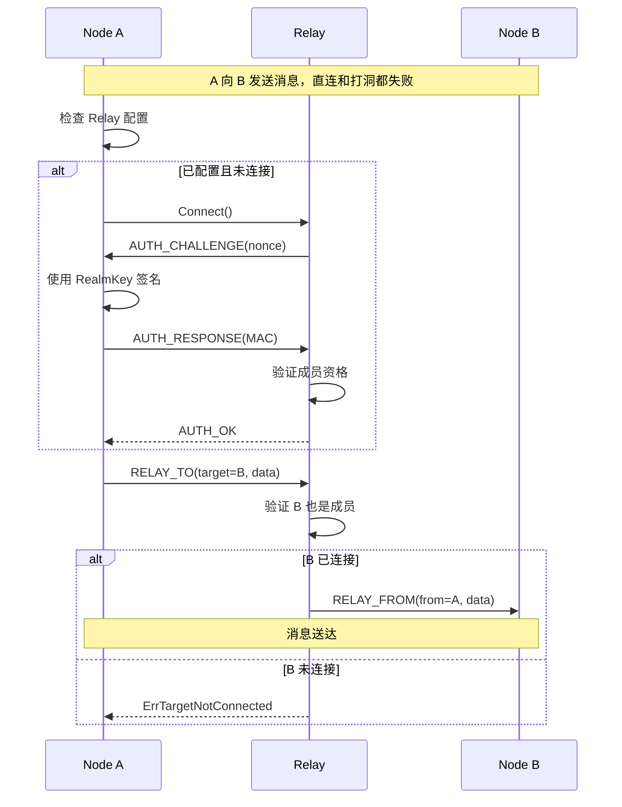
```mermaid
sequenceDiagram
    participant A as Node A
    participant RR as Relay
    participant B as Node B
    
    Note over A,B: A 向 B 发送消息，直连和打洞都失败
    
    A->>A: 检查 Relay 配置
    
    alt 已配置且未连接
        A->>RR: Connect()
        RR->>A: AUTH_CHALLENGE(nonce)
        A->>A: 使用 RealmKey 签名
        A->>RR: AUTH_RESPONSE(MAC)
        RR->>RR: 验证成员资格
        RR-->>A: AUTH_OK
    end
    
    A->>RR: RELAY_TO(target=B, data)
    RR->>RR: 验证 B 也是成员
    
    alt B 已连接
        RR->>B: RELAY_FROM(from=A, data)
        Note over A,B: 消息送达
    else B 未连接
        RR-->>A: ErrTargetNotConnected
    end
```

---

## ★ 中继电路多路复用架构 (v0.2.26)

> 根据 [ADR-0011](../../01_context/decisions/ADR-0011-relay-circuit-muxer.md) 定义的中继电路架构

### 问题背景

旧实现存在**设计意图与实际实现的鸿沟**：

| 方面 | 设计意图 | 旧实现 |
|------|---------|--------|
| 隧道语义 | "透明双向隧道，支持多次协议协商" | 单流连接，协议协商后流关闭 |
| 流生命周期 | 流独立于电路 | 流关闭导致"电路"失效 |
| 复用能力 | 可在同一电路上打开多个流 | 每次通信需重建电路 |

### 正确架构：RelayCircuit + Muxer

```
┌───────────────────────────────────────────────────────────────────────────┐
│                     RelayCircuit（多路复用架构）                           │
│                                                                            │
│  ┌─────────────────────────────────────────────────────────────────────┐  │
│  │  Control Channel (控制通道)                                          │  │
│  │  • STOP 握手完成后保持    • KeepAlive 心跳    • 电路状态同步        │  │
│  └─────────────────────────────────────────────────────────────────────┘  │
│                                                                            │
│  ┌─────────────────────────────────────────────────────────────────────┐  │
│  │  Data Channel (数据通道) - 通过 yamux Muxer 实现                     │  │
│  │                                                                      │  │
│  │  ┌────────────┐ ┌────────────┐ ┌────────────┐                       │  │
│  │  │  Stream 1  │ │  Stream 2  │ │  Stream N  │  ← 独立生命周期        │  │
│  │  │  (chat)    │ │  (pubsub)  │ │  (dht)     │                       │  │
│  │  └────────────┘ └────────────┘ └────────────┘                       │  │
│  │                                                                      │  │
│  │  • 每个流可以独立 CloseWrite/CloseRead                               │  │
│  │  • 流关闭不影响电路                                                  │  │
│  │  • 可以随时 OpenStream() 创建新流                                    │  │
│  └─────────────────────────────────────────────────────────────────────┘  │
│                                                                            │
│  ┌─────────────────────────────────────────────────────────────────────┐  │
│  │  Circuit State Machine (状态机)                                      │  │
│  │                                                                      │  │
│  │   ┌────────┐   STOP OK   ┌────────┐   心跳超时   ┌────────┐         │  │
│  │   │Creating│ ─────────→ │ Active │ ─────────→  │ Stale  │         │  │
│  │   └────────┘             └────────┘             └────────┘         │  │
│  │                               │                      │              │  │
│  │                               │ 配额耗尽/主动关闭     │ 重连成功     │  │
│  │                               ▼                      │              │  │
│  │                          ┌────────┐                  │              │  │
│  │                          │ Closed │ ←────────────────┘              │  │
│  │                          └────────┘   重连失败                       │  │
│  └─────────────────────────────────────────────────────────────────────┘  │
└───────────────────────────────────────────────────────────────────────────┘
```

### 流与电路的语义不变量

| 操作 | 影响范围 | 电路状态 |
|------|---------|---------|
| `stream.CloseWrite()` | 只影响该流 | 不变，其他流不受影响 |
| `stream.Close()` | 只影响该流 | 不变，可继续 `OpenStream()` |
| `circuit.Close()` | 关闭所有流 | 电路从 Swarm 移除 |

### 电路关闭条件

电路只有在以下情况才关闭：
- 显式调用 `circuit.Close()`
- 配额耗尽（MaxBytes/MaxDuration）
- 心跳超时（连续 N 次无响应）
- Relay Server 主动关闭
- 底层网络故障

### Swarm 集成

```
Swarm 管理直连和中继电路：

  ConnsToPeer(peerID) → []Connection
    ├── 直连：conns[peerID]
    └── 中继：circuits[peerID] (过滤 Active 状态)

  NewStream(ctx, peerID, proto)
    ├── 优先使用直连
    └── 回退到中继电路
```

### 修复清单状态

| Phase | 任务 | 状态 |
|-------|------|------|
| 1.1 | 修复 MaxCircuitsPerPeer=0 导致 CONNECT 全部失败 | ✅ |
| 1.2 | 定义 RelayCircuit 结构 | ✅ |
| 1.3 | Client.Connect 返回 RelayCircuit | ✅ |
| 1.4 | Server 端 HandleStopConnect 创建 RelayCircuit | ✅ |
| 1.5 | Swarm 管理 RelayCircuit | □ |
| 2.x | 生命周期管理（心跳、配额） | □ |

详见 [ADR-0011](../../01_context/decisions/ADR-0011-relay-circuit-muxer.md)。

---

## Relay 状态机

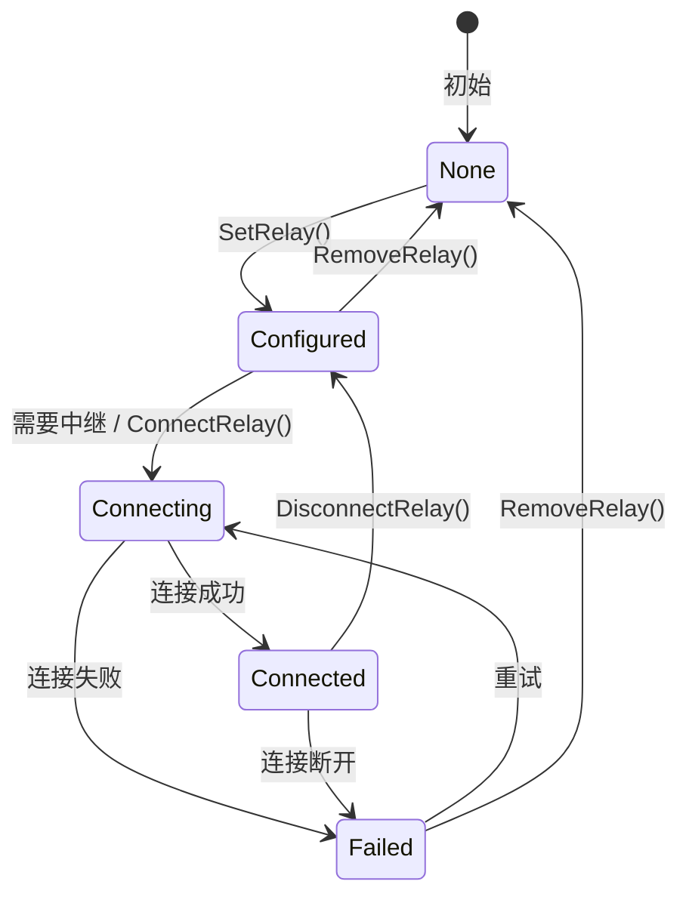
```mermaid
stateDiagram-v2
    [*] --> None: 初始
    
    None --> Configured: SetRelay()
    Configured --> None: RemoveRelay()
    
    Configured --> Connecting: 需要中继 / ConnectRelay()
    Connecting --> Connected: 连接成功
    Connecting --> Failed: 连接失败
    
    Connected --> Configured: DisconnectRelay()
    Connected --> Failed: 连接断开
    
    Failed --> Connecting: 重试
    Failed --> None: RemoveRelay()
```

### 状态说明

| 状态 | 说明 | 触发条件 |
|------|------|----------|
| **None** | 未配置中继 | 初始状态 / RemoveRelay() |
| **Configured** | 已配置，未连接 | SetRelay() / DisconnectRelay() |
| **Connecting** | 正在连接 | 按需连接 / ConnectRelay() |
| **Connected** | 已连接 | 连接成功 |
| **Failed** | 连接失败 | 连接错误 / 断开 |

```
type RelayState int

const (
    RelayStateNone        RelayState = iota  // 未配置
    RelayStateConfigured                      // 已配置，未连接
    RelayStateConnecting                      // 正在连接
    RelayStateConnected                       // 已连接
    RelayStateFailed                          // 连接失败
)
```

---

## 自身过滤逻辑

```
┌─────────────────────────────────────────────────────────────────────────────┐
│                    自身过滤规则                                              │
├─────────────────────────────────────────────────────────────────────────────┤
│                                                                             │
│  场景                              处理方式                                  │
│  ────                              ────────                                  │
│  设置自己为 Relay                  返回 ErrCannotRelayToSelf                 │
│                                                                             │
│  特殊情况：                                                                  │
│  • 节点启用了 EnableRelay()                                                 │
│    → 此时可以作为其他节点的中继                                             │
│    → 但不能配置自己连接自己                                                 │
│                                                                             │
└─────────────────────────────────────────────────────────────────────────────┘
```

### 实现逻辑

```pseudocode
function node.SetRelayAddr(addr: Multiaddr) -> error:
    relayID = extractNodeID(addr)
    
    // 验证地址格式
    if relayID == "":
        return ErrInvalidRelayAddress
    
    // 过滤自身
    if relayID == node.ID():
        return ErrCannotRelayToSelf
    
    // 保存配置（不连接）
    node.relayAddr = addr
    node.relayState = RelayStateConfigured
    return nil
```

---

## 成为中继节点

### 成为 Relay 服务端

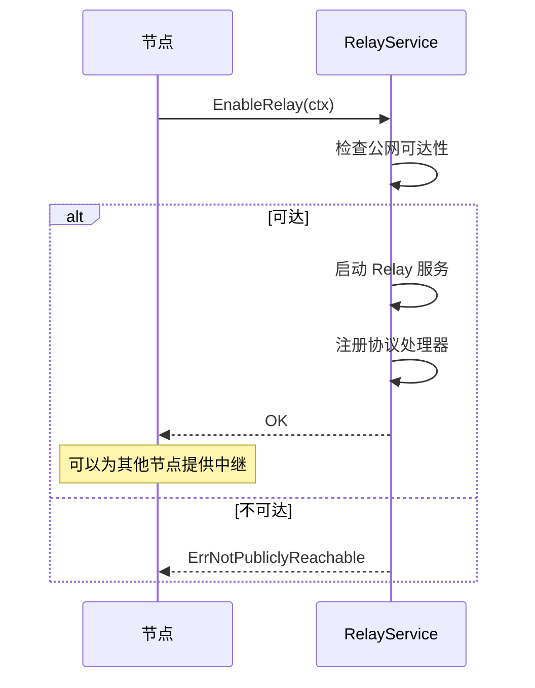
```mermaid
sequenceDiagram
    participant Node as 节点
    participant RS as RelayService
    
    Node->>RS: EnableRelay(ctx)
    RS->>RS: 检查公网可达性
    
    alt 可达
        RS->>RS: 启动 Relay 服务
        RS->>RS: 注册协议处理器
        RS-->>Node: OK
        Note over Node: 可以为其他节点提供中继
    else 不可达
        RS-->>Node: ErrNotPubliclyReachable
    end
```

### Relay 服务端能力

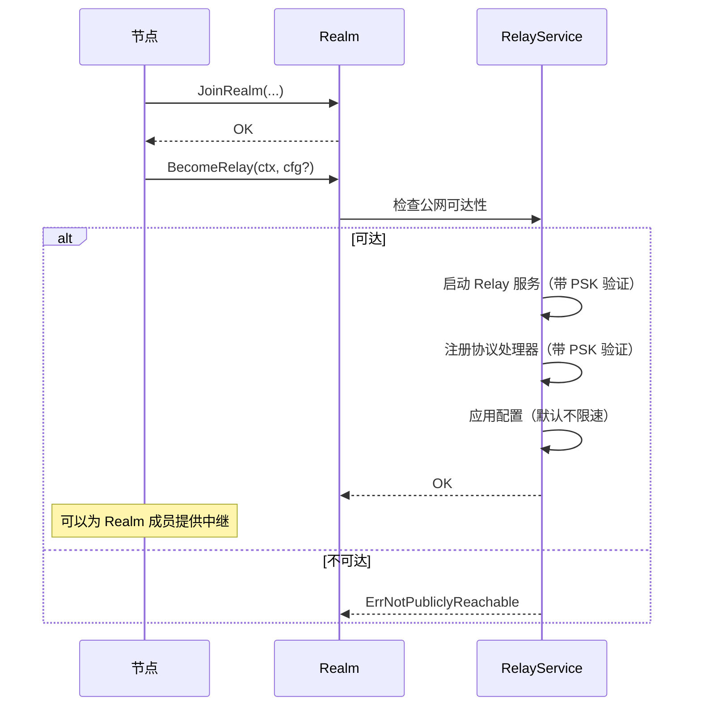
```mermaid
sequenceDiagram
    participant Node as 节点
    participant Realm as Realm
    participant RS as RelayService
    
    Node->>Realm: JoinRealm(...)
    Realm-->>Node: OK
    
    Node->>Realm: BecomeRelay(ctx, cfg?)
    Realm->>RS: 检查公网可达性
    
    alt 可达
        RS->>RS: 启动 Relay 服务（带 PSK 验证）
        RS->>RS: 注册协议处理器（带 PSK 验证）
        RS->>RS: 应用配置（默认不限速）
        RS-->>Realm: OK
        Note over Node: 可以为 Realm 成员提供中继
    else 不可达
        RS-->>Realm: ErrNotPubliclyReachable
    end
```

### Relay 流量设计

```
┌─────────────────────────────────────────────────────────────────────────────┐
│                    Relay 默认不限制                                          │
├─────────────────────────────────────────────────────────────────────────────┤
│                                                                             │
│  设计原则：                                                                  │
│  • 中继的职责是【尽可能转发】，不是【限制流量】                              │
│  • 让提供者的物理带宽成为自然上限                                            │
│  • 业务限制是业务层面的事，不是中继层面的事                                  │
│                                                                             │
│  为什么默认不限制：                                                          │
│  • Relay 要服务整个网络，需要高吞吐                                         │
│  • 如果用业务节点的限制 → 成为瓶颈                                          │
│  • 中继不知道业务流量模式，不应该假设                                        │
│                                                                             │
│  可选配置（由提供者决定）：                                                  │
│  • 带宽: 0 = 不限（默认），> 0 = 限制                                       │
│  • 并发: 0 = 不限（默认），> 0 = 限制                                       │
│                                                                             │
│                                                                             │
│                                                                             │
└─────────────────────────────────────────────────────────────────────────────┘
```

```pseudocode
// 默认使用（不限速）
node.EnableRelay(ctx)

// 如果提供者想设置限制（可选）
node.EnableRelay(ctx, RelayConfig{
    MaxBandwidth:   100 * 1024 * 1024,  // 100 MB/s
    MaxReservations: 1000,               // 最多 1000 预留
})
```

---

## 故障处理

### 中继连接失败

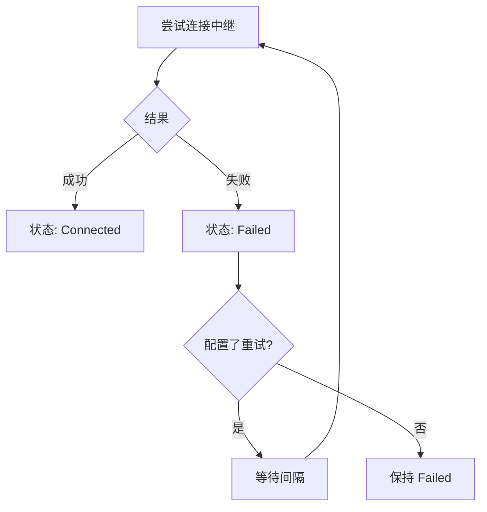
```mermaid
flowchart TB
    Try[尝试连接中继] --> Result{结果}
    
    Result -->|成功| Connected[状态: Connected]
    Result -->|失败| Failed[状态: Failed]
    
    Failed --> CheckRetry{配置了重试?}
    CheckRetry -->|是| Wait[等待间隔]
    CheckRetry -->|否| StayFailed[保持 Failed]
    
    Wait --> Try
```

### 中继断开处理

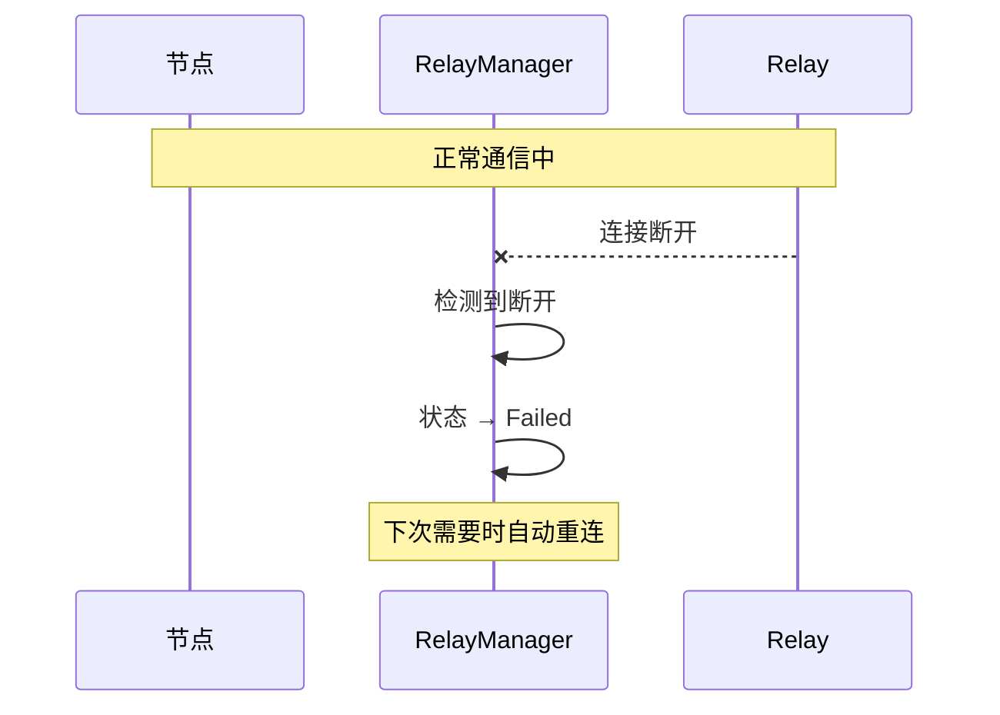
```mermaid
sequenceDiagram
    participant Node as 节点
    participant RM as RelayManager
    participant Relay as Relay
    
    Note over Node,Relay: 正常通信中
    
    Relay--xRM: 连接断开
    RM->>RM: 检测到断开
    RM->>RM: 状态 → Failed
    
    Note over RM: 下次需要时自动重连
```

---

## 错误定义

```
var (
    // 配置错误
    ErrCannotRelayToSelf     = errors.New("cannot set self as relay")
    ErrInvalidRelayAddress   = errors.New("invalid relay address")
    
    // 连接错误
    ErrRelayNotConfigured    = errors.New("relay not configured")
    ErrRelayConnectionFailed = errors.New("failed to connect relay")
    ErrRelayUnavailable      = errors.New("relay unavailable")
    ErrTargetNotConnected    = errors.New("target not connected to relay")
    
    // 协议错误
    ErrProtocolNotAllowed    = errors.New("protocol not allowed on this relay")
    ErrNotRealmMember        = errors.New("not a realm member")
    
    // 状态错误
    ErrAlreadyRelay          = errors.New("already acting as relay")
)
```

---

## 代码路径

| 组件 | 代码路径 | 职责 |
|------|----------|------|
| **RelayManager** | `internal/core/relay/manager.go` | 中继管理 |
| **RelayServer** | `internal/core/relay/server/server.go` | Relay 服务端实现 |
| **AddressBook** | `internal/core/relay/addressbook/addressbook.go` | 地址簿实现 |
| **RelayClient** | `internal/core/relay/client.go` | 中继客户端 |
| **RelayServer** | `internal/core/relay/server.go` | 中继服务端 |

---

## 相关文档

### L3 行为文档

| 文档 | 说明 |
|------|------|
| [lifecycle_overview.md](lifecycle_overview.md) | ★ 节点生命周期横切面（冷启动/Realm加入/稳态运行） |
| [connection_flow.md](connection_flow.md) | 连接建立流程（含"仅 ID 连接"） |
| [discovery_flow.md](discovery_flow.md) | 节点发现流程（含 Relay 地址发现） |
| [realm_flow.md](realm_flow.md) | Realm 加入流程 |
| [state_machines.md](state_machines.md) | 状态机定义 |

### L6 模块文档

| 文档 | 说明 |
|------|------|
| [../L6_domains/core_relay/design/overview.md](../L6_domains/core_relay/design/overview.md) | Relay 模块设计（AddressBook 数据结构） |
| [../L6_domains/core_network/README.md](../L6_domains/core_network/README.md) | 网络变化检测 |
| [../L6_domains/core_netreport/README.md](../L6_domains/core_netreport/README.md) | NetReport/STUN 诊断 |

### ADR

| 文档 | 说明 |
|------|------|
| [ADR-0003](../../01_context/decisions/ADR-0003-relay-first-connect.md) | 惰性中继策略 |
| [ADR-0010](../../01_context/decisions/ADR-0010-relay-explicit-config.md) | Relay 明确配置 |
| [ADR-0011](../../01_context/decisions/ADR-0011-relay-circuit-muxer.md) | ★ 中继电路多路复用架构 |
| ~~[INV-003](../../01_context/decisions/invariants/INV-003-control-data-separation.md)~~ | ~~控制面/数据面分离~~ — **v2.0 已废弃**，统一 Relay 架构 |

---

**最后更新**：2026-01-27（添加中继电路多路复用架构章节）
