# 状态机汇总 (State Machines)

> DeP2P 核心组件的状态机定义

---

## 文档定位

本文档汇总 DeP2P 所有核心组件的状态机定义，是 L3_behavioral 的**纵向流程文档**的补充。

### 与横切面的关系

状态机定义与节点生命周期紧密相关，详见 [lifecycle_overview.md](lifecycle_overview.md)：

| 状态机 | 生命周期阶段 |
|-------|-------------|
| Node ReadyLevel | Phase A 冷启动 → Phase B Realm 加入 |
| AddressLifecycle | Phase A 冷启动（地址发现与发布）、Phase C 稳态运行（地址续期） |
| Connection | Phase C 稳态运行（连接管理） |
| Realm | Phase B Realm 加入 |
| Relay | Phase A 冷启动（Relay 配置）、Phase C 稳态运行（Relay 保持） |

---

## 概述

本文档汇总 DeP2P 所有核心组件的状态机定义，作为行为设计的基础。

---

## ★ Node ReadyLevel 状态机 (v2.0 新增)

节点启动就绪级别的状态机，用于跟踪节点启动进度。

> 相关内容：[lifecycle_overview.md §7 就绪状态 API 设计](lifecycle_overview.md#7-就绪状态-api-设计)

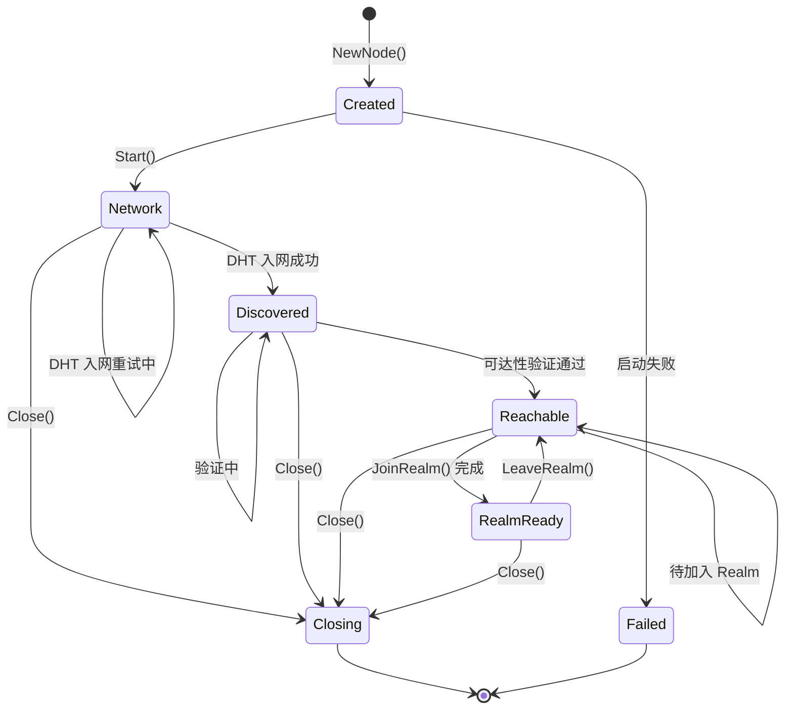

### 状态说明

| 级别 | 状态 | 说明 | 能力 |
|-----|------|------|-----|
| Level 0 | **Created** | Node 对象已创建，未启动 | 无 |
| Level 1 | **Network** | 本地传输层就绪 | 能发起出站连接 |
| Level 2 | **Discovered** | DHT 入网成功 | 能发现其他节点 |
| Level 3 | **Reachable** | 可达性验证完成 | 能被其他节点发现 |
| Level 4 | **RealmReady** | Realm 加入完成 | Realm 成员可达 |

### API 示例

```go
type ReadyLevel int

const (
    ReadyLevelCreated    ReadyLevel = 0
    ReadyLevelNetwork    ReadyLevel = 1
    ReadyLevelDiscovered ReadyLevel = 2
    ReadyLevelReachable  ReadyLevel = 3
    ReadyLevelRealmReady ReadyLevel = 4
)

// 等待到达指定就绪级别
err := node.WaitReady(ctx, dep2p.ReadyLevelReachable)

// 订阅就绪级别变化
node.OnReadyLevelChange(func(level ReadyLevel) {
    log.Printf("Node ready level: %v", level)
})

// 查询当前就绪级别
level := node.ReadyLevel()
```

### `node.Start()` 返回的最低标准

- **Level 1 (Network)** 是 `node.Start()` 返回成功的最低要求
- Identity 初始化成功
- 至少一个 Transport 绑定成功
- 能发起出站连接

---

## ★ AddressLifecycle 状态机 (v2.0 新增)

地址生命周期的状态机，用于跟踪地址从发现到发布的过程。

> 相关内容：[lifecycle_overview.md §3.3 地址发现](lifecycle_overview.md#33-地址发现stunupnp-并行)

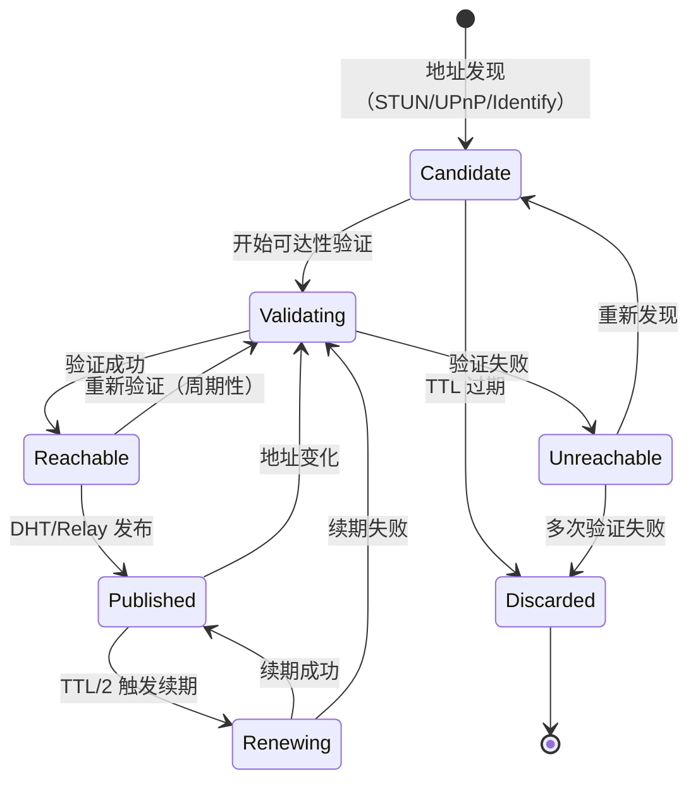

### 状态说明

| 状态 | 说明 | 来源 |
|------|------|------|
| **Candidate** | 候选地址（未验证） | STUN、UPnP、Identify ObservedAddr |
| **Validating** | 正在验证可达性 | AutoNAT、dialback |
| **Reachable** | 已验证可达 | 验证成功 |
| **Unreachable** | 验证不可达 | 验证失败 |
| **Published** | 已发布到 DHT/Relay | 发布成功 |
| **Renewing** | 正在续期 | TTL/2 触发 |
| **Discarded** | 已丢弃 | TTL 过期、多次验证失败 |

### 关键约束

```
┌─────────────────────────────────────────────────────────────────────────────┐
│                    地址状态流转约束                                           │
├─────────────────────────────────────────────────────────────────────────────┤
│                                                                             │
│  ★ 关键约束：DHT/Relay 地址簿只能发布可达地址                               │
│                                                                             │
│  [Candidate] ──验证──→ [Reachable] ──发布──→ [Published]                   │
│       │                                                                     │
│       └──验证失败──→ [Unreachable] ──重试──→ [Candidate]                    │
│                            │                                                │
│                            └──多次失败──→ [Discarded]                       │
│                                                                             │
│  Symmetric NAT 特殊处理：                                                   │
│  ─────────────────────────                                                  │
│  • STUN 返回的地址对其他目标可能无效                                         │
│  • 优先发布 Relay 地址                                                      │
│  • direct_addrs 需要额外验证后才发布                                        │
│                                                                             │
└─────────────────────────────────────────────────────────────────────────────┘
```

---

## Connection 状态机

连接的生命周期状态。

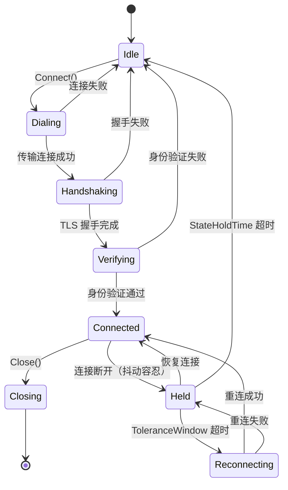

> **v2.0 说明**：惰性中继策略下，每次 `Connect()` 按优先级尝试（直连 → 打洞 → Relay），
> 不存在"后台升级"机制。打洞成功后保留 Relay 连接作为备份，但这不体现在状态机中。

### 状态说明

| 状态 | 说明 | 持续时间 |
|------|------|----------|
| **Idle** | 空闲，无连接 | - |
| **Dialing** | 正在拨号 | < 5s |
| **Handshaking** | TLS 握手中 | < 3s |
| **Verifying** | 验证 NodeID | < 1s |
| **Connected** | 连接已建立 | 长期 |
| **Held** | 断连但保持状态（抖动容忍） | ≤ 30s |
| **Reconnecting** | 正在尝试重连 | 短暂 |
| **Closing** | 正在关闭 | < 1s |

### 转换条件

| 转换 | 触发条件 | 约束 |
|------|----------|------|
| Idle → Dialing | `Connect()` 调用 | - |
| Verifying → Connected | `RemotePeer == ExpectedPeer` | INV-001 |
| Verifying → Idle | 身份不匹配 | 必须关闭连接 |
| Connected → Held | 连接断开 | JitterTolerance 启用 |
| Held → Connected | 连接恢复 | ToleranceWindow 内 |
| Held → Reconnecting | ToleranceWindow 超时 | ReconnectEnabled |
| Reconnecting → Held | 重连失败 | 计算退避时间 |
| Held → Idle | MaxReconnectAttempts 达到 | 清理状态 |

---

## JitterTolerance 状态机

网络抖动容忍的详细状态机。

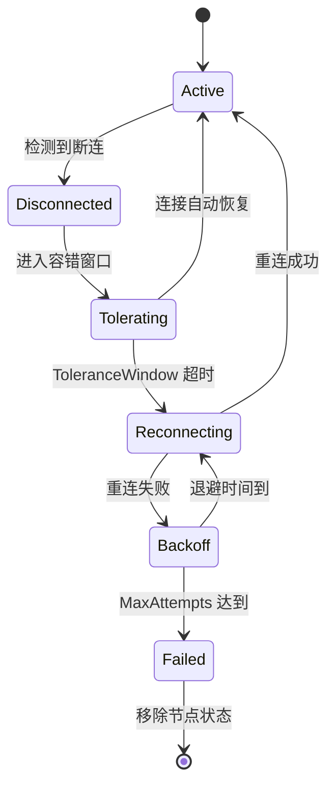

### 状态说明

| 状态 | 说明 | 参数 |
|------|------|------|
| **Active** | 连接活跃 | - |
| **Disconnected** | 检测到断连 | 记录断连时间 |
| **Tolerating** | 容错等待中 | ToleranceWindow = 5s |
| **Reconnecting** | 正在重连 | 当前尝试次数 |
| **Backoff** | 退避等待 | delay = 1s * 2^(n-1) |
| **Failed** | 重连失败 | MaxAttempts = 5 |

### 退避时间计算

```
退避时间 = min(InitialDelay * Multiplier^(attempt-1), MaxDelay)

示例（默认配置）：
  attempt 1: 1s
  attempt 2: 2s
  attempt 3: 4s
  attempt 4: 8s
  attempt 5: 16s
  ...
  max: 60s
```

---

## Realm 状态机

Realm 成员资格的状态。

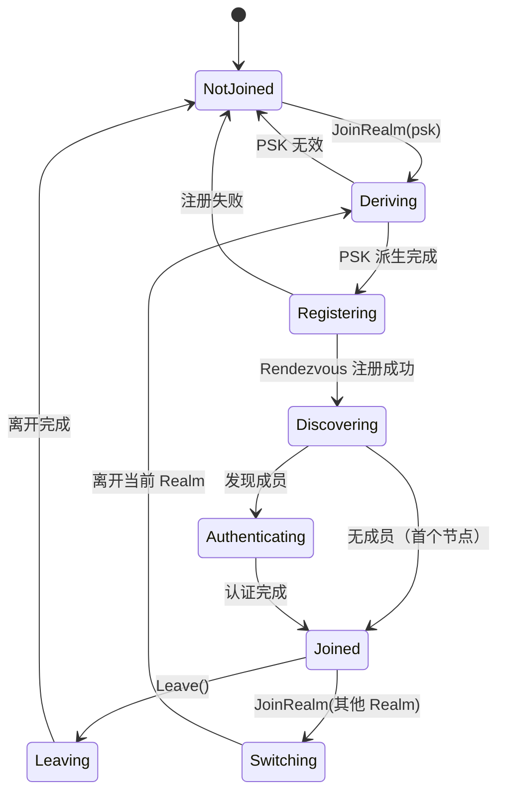

### 状态说明

| 状态 | 说明 | 用户可调用 API |
|------|------|---------------|
| **NotJoined** | 未加入任何 Realm | `JoinRealm()` |
| **Deriving** | PSK 派生中 | - |
| **Registering** | Rendezvous 注册中 | - |
| **Discovering** | 发现成员中 | - |
| **Authenticating** | 认证成员中 | - |
| **Joined** | 已加入 Realm | 所有业务 API |
| **Leaving** | 离开中 | - |
| **Switching** | 切换 Realm 中 | - |

### 约束

- **INV-002**：只有在 `Joined` 状态才能调用业务 API
- 一个 Node 同时只能处于一个 Realm

---

## Relay 状态机

Relay 连接的状态。

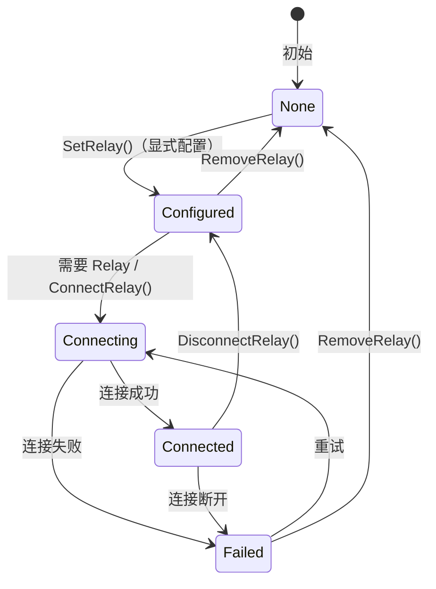

> **v2.0 说明**：惰性中继策略下，不存在"后台升级"机制。每次 `Connect()` 按优先级尝试
> （直连 → 打洞 → Relay）。打洞成功后**保留** Relay 连接作为备份，但不会"升级"断开。
> ADR-0010 要求 Relay 地址显式配置，不支持自动发现。

### 状态说明

| 状态 | 说明 | 数据通道 |
|------|------|----------|
| **None** | 未配置 Relay | 无 |
| **Configured** | 已配置，未连接（ADR-0010 显式配置） | 无 |
| **Connecting** | 连接 Relay 中 | 无 |
| **Connected** | Relay 连接活跃 | 通过 Relay |
| **Failed** | 连接失败 | 无 |

### Relay 三大职责（v2.0）

> **v2.0 核心变化**：DHT 是权威目录，Relay 地址簿是缓存加速层

| Relay 职责 | 说明 |
|------------|------|
| 缓存加速层 | 维护地址簿，作为 DHT 本地缓存（非权威目录） |
| 打洞协调信令 | 打洞协调的必要前提 |
| 数据通信保底 | 直连/打洞失败时转发数据 |

---

## ★ RelayCircuit 状态机 (v0.2.26 新增)

中继电路的生命周期状态。根据 [ADR-0011](../../01_context/decisions/ADR-0011-relay-circuit-muxer.md) 定义。

> **核心架构**：RelayCircuit 在 STOP 流上叠加 yamux Muxer，实现多路复用。
> 流的生命周期独立于电路的生命周期。

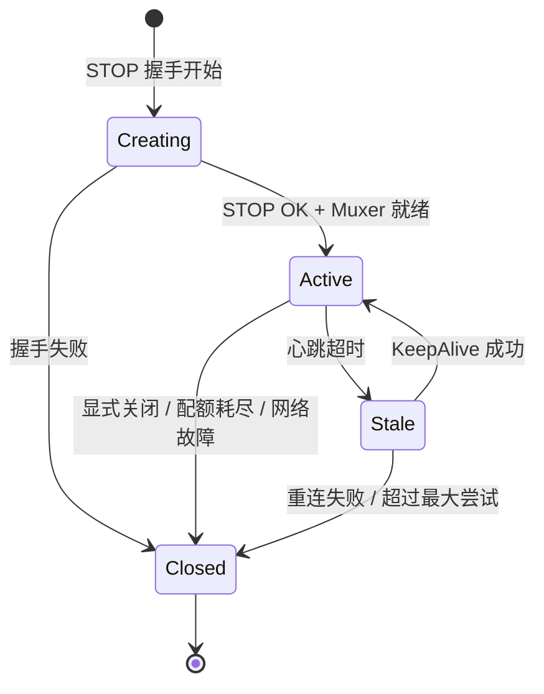

### 状态说明

| 状态 | 说明 | 允许操作 |
|------|------|---------|
| **Creating** | STOP 握手中，正在创建 Muxer | 取消 |
| **Active** | 电路活跃，可以打开流 | OpenStream, Close |
| **Stale** | 心跳超时，等待恢复 | KeepAlive, Close |
| **Closed** | 电路已关闭 | 无 |

### 流与电路的语义

```
┌─────────────────────────────────────────────────────────────────────────────────┐
│                    流与电路的正确语义                                             │
├─────────────────────────────────────────────────────────────────────────────────┤
│                                                                                 │
│  1. stream.CloseWrite() → 只影响该流，电路不变                                  │
│  2. stream.Close() → 只影响该流，可继续 OpenStream()                            │
│  3. circuit.Close() → 关闭所有流，从 Swarm 移除                                 │
│                                                                                 │
│  电路关闭条件：                                                                  │
│  • 显式调用 circuit.Close()                                                     │
│  • 配额耗尽（MaxBytes/MaxDuration）                                             │
│  • 心跳超时（连续 N 次无响应）                                                  │
│  • Relay Server 主动关闭 / 底层网络故障                                         │
│                                                                                 │
└─────────────────────────────────────────────────────────────────────────────────┘
```

### 状态转换约束

| 转换 | 触发条件 | 约束 |
|------|----------|------|
| Creating → Active | STOP OK + Muxer 创建成功 | 必须启动 KeepAlive |
| Active → Stale | 心跳超时（默认 30s） | 不关闭底层流 |
| Stale → Active | KeepAlive 响应 | 重置心跳计时器 |
| Active → Closed | 配额耗尽 | 发送 GoAway |
| Any → Closed | 网络故障 | 清理所有资源 |

---

## Message 状态机

消息的生命周期状态。

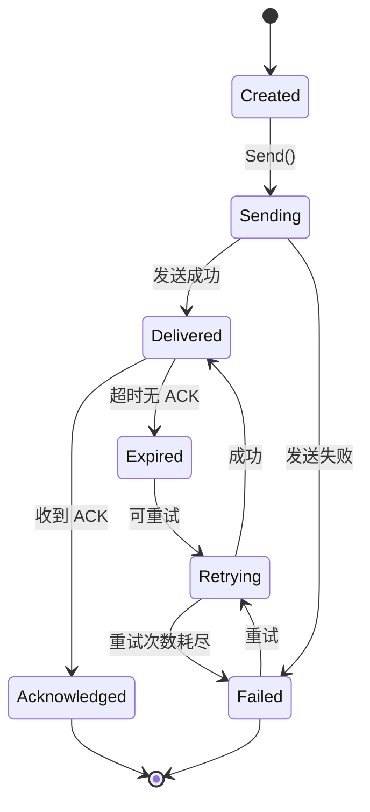

### 状态说明

| 状态 | 说明 | 下一步 |
|------|------|--------|
| **Created** | 消息已创建 | 发送 |
| **Sending** | 发送中 | 等待结果 |
| **Delivered** | 已投递 | 等待 ACK |
| **Acknowledged** | 已确认 | 完成 |
| **Failed** | 发送失败 | 重试或放弃 |
| **Retrying** | 重试中 | 等待结果 |
| **Expired** | 超时 | 重试或放弃 |

---

## Node 状态机

Node 的生命周期状态。

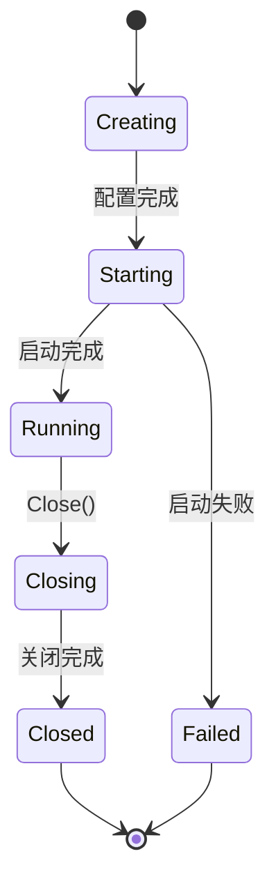

### 状态说明

| 状态 | 说明 | 可用操作 |
|------|------|----------|
| **Creating** | 创建中 | - |
| **Starting** | 启动中 | - |
| **Running** | 运行中 | 所有 API |
| **Closing** | 关闭中 | - |
| **Closed** | 已关闭 | - |
| **Failed** | 启动失败 | - |

### Starting 状态内部细节

Starting 状态内部包含多个初始化阶段。

```
Starting 状态内部：
  InitIdentity → InitTransport → InitSwarm → InitHost → InitDiscovery → Running

可选组件失败处理：
  • Discovery 失败：记录警告，继续运行（降级模式）
  • Relay 失败：记录警告，继续运行（无中继能力）
  • NAT 失败：记录警告，继续运行（无穿透能力）
```

---

## Stream 状态机

流的生命周期状态。

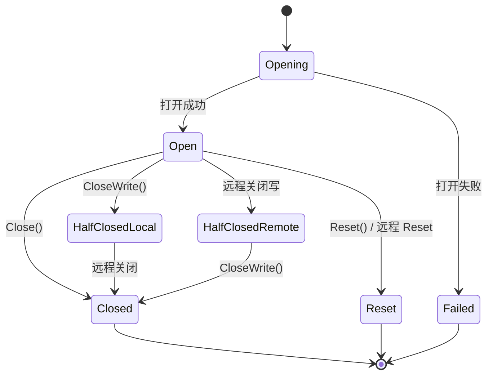

### 状态说明

| 状态 | 说明 | 可读 | 可写 |
|------|------|------|------|
| **Opening** | 打开中 | 否 | 否 |
| **Open** | 已打开 | 是 | 是 |
| **HalfClosedLocal** | 本地关闭写 | 是 | 否 |
| **HalfClosedRemote** | 远程关闭写 | 否 | 是 |
| **Closed** | 已关闭 | 否 | 否 |
| **Reset** | 已重置 | 否 | 否 |

---

## Topic 状态机

PubSub 主题的生命周期状态。

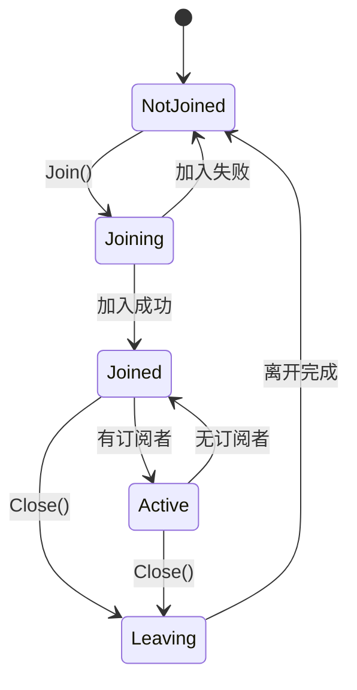

### 状态说明

| 状态 | 说明 | 可用操作 |
|------|------|----------|
| **NotJoined** | 未加入主题 | `Join()` |
| **Joining** | 加入中 | - |
| **Joined** | 已加入（无订阅） | `Publish()`, `Subscribe()`, `Close()` |
| **Active** | 活跃（有订阅） | `Publish()`, `Subscribe()`, `Close()` |
| **Leaving** | 离开中 | - |

---

## Subscription 状态机

订阅句柄的生命周期状态。

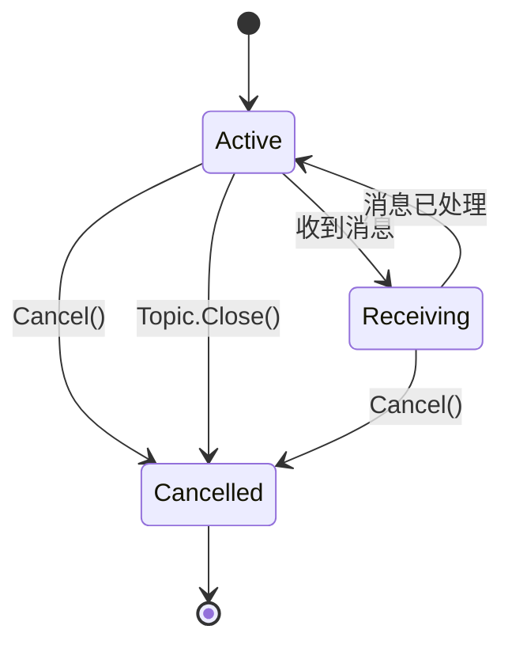

### 状态说明

| 状态 | 说明 | 可用操作 |
|------|------|----------|
| **Active** | 活跃 | `Next()`, `Cancel()` |
| **Receiving** | 接收消息中 | `Cancel()` |
| **Cancelled** | 已取消 | - |

---

## ★ NetworkHealth 状态机 (v1.3.0 新增)

网络健康监控的状态机，用于检测和恢复网络问题。

> 相关需求：[REQ-NET-005](../../01_context/requirements/functional/F3_network/REQ-NET-005.md)

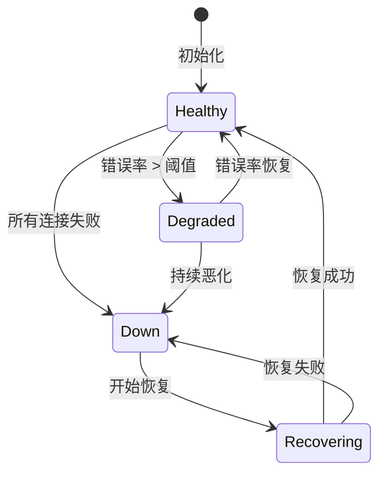

### 状态说明

| 状态 | 说明 | 触发条件 |
|------|------|----------|
| **Healthy** | 网络健康 | 错误率 < 5% |
| **Degraded** | 网络降级 | 错误率 > 20% |
| **Down** | 网络中断 | 所有连接失败 |
| **Recovering** | 恢复中 | 触发自动恢复 |

### 恢复流程

```
恢复流程（Down → Recovering）：

  1. Socket Rebind（重建 UDP Socket）
  2. 地址重新发现（STUN 查询）
  3. 关键节点重连
  4. 更新 DHT 地址
```

### 状态转换阈值

| 参数 | 默认值 | 说明 |
|------|--------|------|
| DegradeThreshold | 20% | 错误率触发降级 |
| RecoverThreshold | 5% | 错误率恢复健康 |
| DownThreshold | 100% | 所有连接失败 |
| RecoveryTimeout | 30s | 恢复超时 |

---

## ★ ReliableMessage 状态机 (v1.3.0 新增)

可靠消息投递的状态机，支持 ACK 确认和自动重试。

> 相关需求：[REQ-PROTO-004](../../01_context/requirements/functional/F6_protocol/REQ-PROTO-004.md)

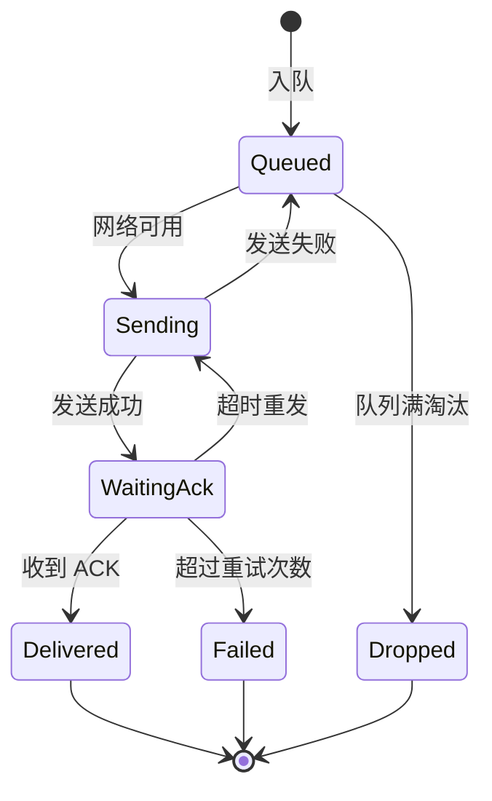

### 状态说明

| 状态 | 说明 | 超时 |
|------|------|------|
| **Queued** | 在消息队列中 | MaxAge (5分钟) |
| **Sending** | 正在发送 | SendTimeout (5秒) |
| **WaitingAck** | 等待确认 | AckTimeout (5秒) |
| **Delivered** | 投递成功 | - |
| **Failed** | 投递失败 | - |
| **Dropped** | 被淘汰 | - |

### 重试策略

| 参数 | 默认值 | 说明 |
|------|--------|------|
| MaxRetries | 3 | 最大重试次数 |
| AckTimeout | 5s | ACK 等待超时 |
| RetryBackoff | 指数退避 | 1s, 2s, 4s |

---

## ★ ConnectionStability 状态机 (v1.1 新增)

连接稳定性跟踪状态机，用于检测网络震荡。

> 详见 [disconnect_detection.md](disconnect_detection.md) 震荡检测与抖动抑制

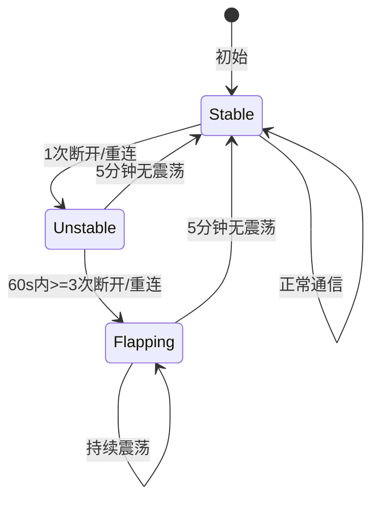

### 状态说明

| 状态 | 说明 | 见证报告处理 | 成员状态 |
|------|------|-------------|---------|
| **Stable** | 连接稳定 | 正常流程 | 正常更新 |
| **Unstable** | 连接不稳定 | 延迟广播 (debounce 5s) | 保持不变 |
| **Flapping** | 震荡中 | 不广播，本地记录 | 标记为不稳定 |

### 配置参数

| 参数 | 默认值 | 说明 |
|------|--------|------|
| WindowDuration | 60s | 震荡检测窗口 |
| FlapThreshold | 3 | 触发震荡的断开/重连次数 |
| RecoveryDuration | 300s | 恢复到 Stable 所需时间 |

### 实现要点

```
type ConnectionStabilityTracker struct {
    peerID          string
    events          []ConnectionEvent  // 滑动窗口
    windowDuration  time.Duration      // 默认 60s
    flapThreshold   int                // 默认 3
    state           StabilityState
}
```

---

## ★ MemberConnectionState 状态机 (v1.1 新增)

成员连接状态机，用于管理成员在线状态与宽限期。

> 详见 [disconnect_detection.md](disconnect_detection.md) 重连宽限期机制

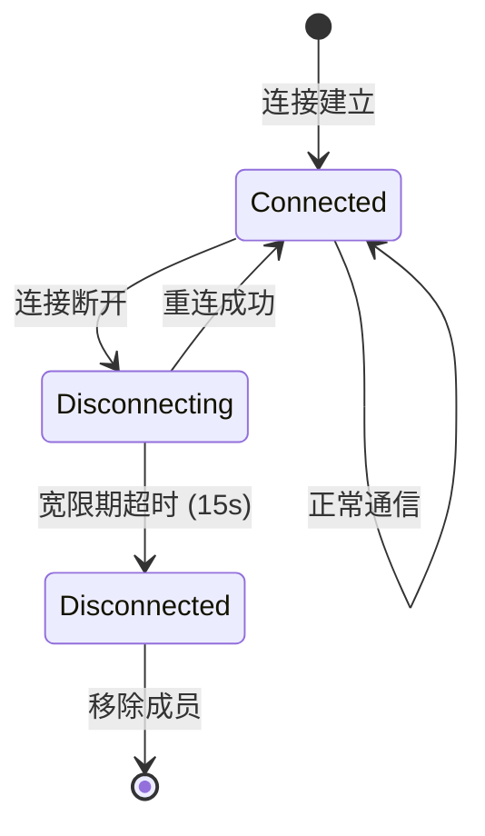

### 状态说明

| 状态 | 说明 | 成员列表状态 | 允许操作 |
|------|------|-------------|---------|
| **Connected** | 已连接 | 在线 | 所有通信 |
| **Disconnecting** | 断开中（宽限期） | 在线（待确认） | 等待重连 |
| **Disconnected** | 已断开 | 离线 | 移除成员 |

### 配置参数

| 参数 | 默认值 | 说明 |
|------|--------|------|
| ReconnectGracePeriod | 15s | 宽限期时长 |
| MaxGracePeriodExtensions | 2 | 最多延长次数 |
| DisconnectProtection | 30s | 断开保护期 |

### 约束

- **INV-003**：连接即成员，成员在线状态与连接状态绑定
- 宽限期内成员仍被视为"在线"，允许重连恢复
- 保护期内的 Add() 请求被静默忽略，防止竞态重新添加

---

## 状态机使用规范

```
┌─────────────────────────────────────────────────────────────────────────────┐
│                          状态机使用规范                                       │
├─────────────────────────────────────────────────────────────────────────────┤
│                                                                             │
│  规则 1: 状态转换必须原子                                                     │
│  ────────────────────────                                                   │
│  状态转换操作必须是原子的，使用锁或 CAS                                        │
│                                                                             │
│  规则 2: 状态决定可用操作                                                     │
│  ────────────────────────                                                   │
│  在错误状态调用操作应返回明确错误                                              │
│  如 Realm 未 Joined 时调用业务 API 返回 ErrNotMember                         │
│                                                                             │
│  规则 3: 状态变化可观察                                                       │
│  ────────────────────                                                       │
│  提供状态变化通知机制（回调或 Channel）                                        │
│                                                                             │
│  规则 4: 超时状态自动转换                                                     │
│  ──────────────────────                                                     │
│  中间状态（如 Connecting）必须有超时                                          │
│  超时后自动转换到失败状态                                                     │
│                                                                             │
└─────────────────────────────────────────────────────────────────────────────┘
```

---

## 相关文档

### L3 行为文档

| 文档 | 说明 |
|------|------|
| [lifecycle_overview.md](lifecycle_overview.md) | ★ 节点生命周期横切面（ReadyLevel、AddressLifecycle 相关） |
| [disconnect_detection.md](disconnect_detection.md) | ★ 断开检测流程（ConnectionStability、MemberConnectionState 相关） |
| [connection_flow.md](connection_flow.md) | 连接流程 |
| [realm_flow.md](realm_flow.md) | Realm 流程 |
| [relay_flow.md](relay_flow.md) | Relay 流程 |
| [messaging_flow.md](messaging_flow.md) | 消息流程 |
| [discovery_flow.md](discovery_flow.md) | 发现流程 |

### 需求与约束文档

| 文档 | 说明 |
|------|------|
| [REQ-NET-005 网络弹性与恢复](../../01_context/requirements/functional/F3_network/REQ-NET-005.md) | NetworkHealth 状态机需求 |
| [REQ-NET-007 快速断开检测](../../01_context/requirements/functional/F3_network/REQ-NET-007.md) | ConnectionStability/MemberConnectionState 需求 |
| [REQ-PROTO-004 可靠消息投递](../../01_context/requirements/functional/F6_protocol/REQ-PROTO-004.md) | ReliableMessage 状态机需求 |
| [INV-003 连接即成员](../../01_context/decisions/invariants/INV-003-connection-membership.md) | MemberConnectionState 约束 |

---

**最后更新**：2026-01-28（新增 ConnectionStability、MemberConnectionState 状态机）
