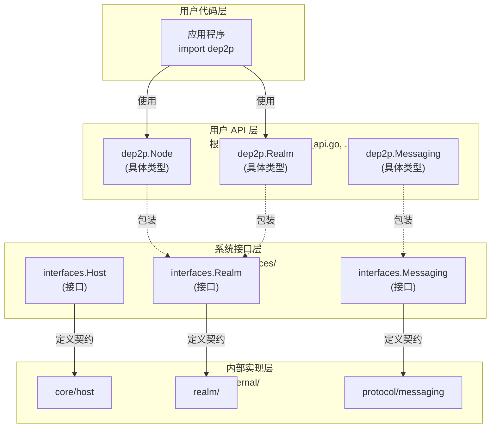

# L4: 接口契约 (Interface Contracts)

> **版本**: v1.1.0  
> **更新日期**: 2026-01-23  
> **定位**: 开发者视角：五层软件架构接口设计、依赖注入、API 规范

---

## 目录结构

```
L4_interfaces/
├── README.md                    # 本文件 - 接口总览
├── public_interfaces.md         # 公共接口设计（pkg/interfaces/）
├── internal_interfaces.md       # 内部接口设计（internal/*/interfaces/）
├── component_interface_map.md   # 组件-接口全景图
└── fx_lifecycle.md              # Fx + Lifecycle 模式
```

---

## 五层软件架构接口分布

```
┌─────────────────────────────────────────────────────────────────────────────┐
│                     DeP2P 五层软件架构接口设计                                │
├─────────────────────────────────────────────────────────────────────────────┤
│                                                                             │
│  ┌─────────────────────────────────────────────────────────────────────┐   │
│  │                    API Layer (入口层)                                 │   │
│  │  ┌─────────┐                                                        │   │
│  │  │  Node   │                                                        │   │
│  │  └────┬────┘                                                        │   │
│  │       │                                                             │   │
│  └───────┼─────────────────────────────────────────────────────────────┘   │
│          │                                                                 │
│  ┌───────▼─────────────────────────────────────────────────────────────┐   │
│  │                    Protocol Layer (协议层)                           │   │
│  │  ┌─────────┐  ┌───────────┐  ┌─────────┐  ┌─────────┐              │   │
│  │  │Messaging│  │  PubSub   │  │ Streams │  │Liveness │              │   │
│  │  └────┬────┘  └─────┬─────┘  └────┬────┘  └────┬────┘              │   │
│  └───────┼─────────────┼─────────────┼─────────────┼───────────────────┘   │
│          │             │             │             │                       │
│  ┌───────▼─────────────▼─────────────▼─────────────▼───────────────────┐   │
│  │                    Realm Layer (Realm 层)                            │   │
│  │  ┌─────────────────────────────────────────────────────────────────┐│   │
│  │  │  Realm (Manager / Auth / Member)                                ││   │
│  │  └─────────────────────────────────┬───────────────────────────────┘│   │
│  └────────────────────────────────────┼────────────────────────────────┘   │
│                                       │                                    │
│  ┌────────────────────────────────────▼────────────────────────────────┐   │
│  │                    Core Layer (核心层)                               │   │
│  │  ┌─────────┐  ┌───────────┐  ┌──────────┐  ┌─────────┐  ┌─────────┐│   │
│  │  │  Host   │  │ Transport │  │ Security │  │  Muxer  │  │ConnMgr  ││   │
│  │  ├─────────┤  ├───────────┤  ├──────────┤  ├─────────┤  ├─────────┤│   │
│  │  │Identity │  │   Relay   │  │   NAT    │  │         │  │         ││   │
│  │  └────┬────┘  └─────┬─────┘  └────┬─────┘  └────┬────┘  └────┬────┘│   │
│  └───────┼─────────────┼─────────────┼─────────────┼─────────────┼─────┘   │
│          │             │             │             │             │         │
│                                  ↕ 双向协作                                 │
│          │             │             │             │             │         │
│  ┌───────▼─────────────▼─────────────▼─────────────▼─────────────▼─────┐   │
│  │                    Discovery Layer (发现层)                          │   │
│  │  ┌───────────┐  ┌───────────┐  ┌───────────┐  ┌───────────┐        │   │
│  │  │Coordinator│  │    DHT    │  │ Bootstrap │  │   mDNS    │        │   │
│  │  └───────────┘  └───────────┘  └───────────┘  └───────────┘        │   │
│  │  ┌───────────┐                                                      │   │
│  │  │Rendezvous │                                                      │   │
│  │  └───────────┘                                                      │   │
│  └─────────────────────────────────────────────────────────────────────┘   │
│                                                                             │
└─────────────────────────────────────────────────────────────────────────────┘
```

---

## 公共接口 vs 内部接口

### 设计原则

```
┌─────────────────────────────────────────────────────────────────────────────┐
│                     公共接口 vs 内部接口                                      │
├─────────────────────────────────────────────────────────────────────────────┤
│                                                                             │
│  公共接口 (pkg/interfaces/)                                                  │
│  ─────────────────────────────                                              │
│  • 位置：pkg/interfaces/                                                    │
│  • 可见性：对外暴露，可被外部项目导入                                        │
│  • 稳定性：高，遵循语义化版本                                                │
│  • 变更：需要版本兼容考虑                                                    │
│  • 文档：每个方法必须有完整文档                                              │
│                                                                             │
│  内部接口 (internal/*/interfaces/) - 可选                                   │
│  ──────────────────────                                                     │
│  • 位置：internal/<layer>/<component>/interfaces/（可选）                   │
│  • 可见性：仅内部使用，外部不可导入                                          │
│  • 稳定性：可自由演进                                                        │
│  • 变更：只需更新内部依赖方                                                  │
│  • 设计：**继承对应的公共接口，添加内部方法**                                │
│  • **注意**：大多数模块不需要内部接口，直接实现公共接口即可                  │
│  • **使用场景**：仅在模块内部有多个子组件需要相互依赖时使用                  │
│                                                                             │
└─────────────────────────────────────────────────────────────────────────────┘
```

---

## 系统接口 vs 用户 API（三层接口设计）

### 设计原则

DeP2P 采用**三层接口设计**，明确区分系统内部的技术接口和对外暴露的用户 API。



### 三层职责划分

| 层级 | 位置 | 职责 | 可见性 | 特点 |
|------|------|------|--------|------|
| **用户 API** | 根目录（`dep2p.go`, `realm_api.go`, ...） | 用户可见的简洁 API | 公开导出 | 最小暴露，具体类型，符合用户心智模型 |
| **系统接口** | `pkg/interfaces/` | 模块间契约，技术完备性 | 公开导出（供内部使用） | 包含所有内部方法，支持模块间解耦 |
| **内部实现** | `internal/` | 具体实现 | 不可导出 | 实现系统接口 |

### 设计要点

```
┌─────────────────────────────────────────────────────────────────────────────┐
│                         三层接口设计要点                                      │
├─────────────────────────────────────────────────────────────────────────────┤
│                                                                             │
│  用户 API 层（根目录）                                                       │
│  ═══════════════════════                                                    │
│  • 返回具体类型（*Node, *Realm），不是接口                                  │
│  • 只暴露设计文档定义的方法（如 Realm 的 12 个方法）                         │
│  • 隐藏内部细节（Router, Gateway, PSK, Authenticate）                       │
│  • 包装系统接口，提供更好的用户体验                                          │
│  • 示例：dep2p.Realm.Messaging() 返回 *dep2p.Messaging                      │
│                                                                             │
│  系统接口层（pkg/interfaces/）                                               │
│  ════════════════════════════════                                           │
│  • 定义为 interface 类型                                                    │
│  • 追求技术完备性，包含所有内部方法                                          │
│  • 供 internal/ 实现，供模块间依赖注入                                       │
│  • 可自由演进内部方法，不影响用户 API                                        │
│  • 示例：interfaces.Realm 包含 Router(), Gateway() 等内部方法               │
│                                                                             │
│  为什么这样设计？                                                            │
│  ────────────────                                                           │
│  1. 关注点分离：系统设计 vs 用户体验                                         │
│  2. 独立演进：内部重构不破坏用户代码                                         │
│  3. 安全隐藏：敏感方法（PSK）和内部方法（Router）被正确隐藏                  │
│  4. 符合 Go 惯例：接受接口，返回具体类型                                     │
│                                                                             │
└─────────────────────────────────────────────────────────────────────────────┘
```

### 示例对比

**用户视角（使用用户 API）**：

```
// 用户代码示例（伪代码）

node = dep2p.Start(ctx, Desktop)
realm = node.JoinRealm(ctx, psk)    // 返回 Realm 具体类型

// 只能调用公开的方法
realm.ID()          // ✅ 可调用
realm.Members()     // ✅ 可调用
realm.Messaging()   // ✅ 可调用

// 以下方法不存在（编译错误）
// realm.Router()   // ❌ 方法不存在
// realm.PSK()      // ❌ 方法不存在
// realm.Gateway()  // ❌ 方法不存在
```

**系统视角（内部模块使用系统接口）**：

```
// 内部模块示例（伪代码）
// 位置：internal/protocol/messaging/service.go

struct Service {
    realm: interfaces.Realm    // 使用系统接口
}

function Service.Send(ctx, peer, protocol, data) → error:
    // 可以调用所有方法，包括内部方法
    router = realm.Router()     // ✅ 系统接口包含此方法
    gateway = realm.Gateway()   // ✅ 系统接口包含此方法
    psk = realm.PSK()           // ✅ 系统接口包含此方法
    
    // 内部模块间协作
    route = router.FindRoute(ctx, peer)
    // ...
```

---

## 公共接口目录 (pkg/interfaces/)

### 按架构层组织

```
pkg/interfaces/
│
│  # ═══════════ API Layer 接口 ═══════════
├── node.go                      # Node 入口
│
│  # ═══════════ Protocol Layer 接口 ═══════════
├── messaging.go                 # 点对点消息
├── pubsub.go                    # 发布订阅
├── streams.go                   # 流管理
├── liveness.go                  # 存活检测
│
│  # ═══════════ Realm Layer 接口 ═══════════
├── realm.go                     # Realm 管理
│
│  # ═══════════ Core Layer 接口 ═══════════
├── host.go                      # 网络主机（核心门面）
├── transport.go                 # 传输层
├── security.go                  # 安全层
├── muxer.go                     # 流复用
├── connmgr.go                   # 连接管理
├── identity.go                  # 身份管理
├── peerstore.go                 # 节点存储
├── swarm.go                     # 连接群
├── protocol.go                  # 协议路由
├── upgrader.go                  # 连接升级
├── resource.go                  # 资源管理
├── eventbus.go                  # 事件总线
├── metrics.go                   # 指标接口
│
│  # ═══════════ Discovery Layer 接口 ═══════════
├── discovery.go                 # 发现协调器和 DHT
│
│  # ═══════════ 可观测性接口 ═══════════
└── health.go                    # 健康检查
```

---

## 接口依赖规则

### 依赖方向

```
┌─────────────────────────────────────────────────────────────────────────────┐
│                          接口依赖规则                                         │
├─────────────────────────────────────────────────────────────────────────────┤
│                                                                             │
│  依赖方向：上层 → 下层（单向依赖），Core ↔ Discovery（双向协作）             │
│                                                                             │
│     API           可依赖 → Protocol, Realm, Core, Discovery                 │
│       │                                                                     │
│       ↓                                                                     │
│    Protocol       可依赖 → Realm, Core                                      │
│       │                                                                     │
│       ↓                                                                     │
│     Realm         可依赖 → Core                                             │
│       │                                                                     │
│       ↓                                                                     │
│     Core          可依赖 → Discovery（双向协作）                            │
│       ↕                                                                     │
│   Discovery       可依赖 → Core（双向协作）                                 │
│                                                                             │
│  禁止：                                                                      │
│  • 下层依赖上层（Discovery 依赖 Realm, Protocol 依赖 API 等）              │
│  • 同层循环依赖（使用事件/回调解耦）                                          │
│                                                                             │
└─────────────────────────────────────────────────────────────────────────────┘
```

### 层次间接口

| 架构层 | 提供的公共接口 | 依赖的公共接口 |
|----|---------------|---------------|
| **API** | `Node` | `Realm`, `Host`, Protocol 全部 |
| **Protocol** | `Messaging`, `PubSub`, `Streams`, `Liveness` | `Realm`, `Host` |
| **Realm** | `Realm` | `Host`, `Discovery` |
| **Core** | `Host`, `Transport`, `Security`, `Muxer`, `ConnMgr`, `Identity`, `Relay`, `NAT`, `Reachability` | `Discovery` |
| **Discovery** | `Coordinator`, `DHT`, `Bootstrap`, `mDNS`, `Rendezvous` | `Host`, `Reachability` |

### ★ 关键接口职责边界

```
┌─────────────────────────────────────────────────────────────────────────────┐
│                     关键接口职责边界（NAT / Relay / Discovery）               │
├─────────────────────────────────────────────────────────────────────────────┤
│                                                                             │
│  Relay（Core 层）— v2.0 三大职责                                            │
│  ─────────────────────────────────                                          │
│  • 三大职责：缓存加速层 + 打洞协调信令 + 数据通信保底                        │
│  • ★ AddressBook：Relay 是缓存加速层（非权威目录），DHT 是权威目录           │
│  • Discovery 优先查 DHT（权威），Relay.AddressBook 仅作缓存回退              │
│                                                                             │
│  NAT（Core 层）                                                             │
│  ─────────────                                                               │
│  • GetExternalAddr() 返回的是"候选地址"（非可发布地址）                      │
│  • ★ 打洞需要信令通道（通常通过 Relay 连接提供）                             │
│  • 打洞失败自动降级到 Relay 兜底                                            │
│                                                                             │
│  Reachability（Core 层）                                                    │
│  ─────────────────────                                                       │
│  • ★ 验证候选地址是否真实可达                                                │
│  • 仅可达地址才能发布到 DHT                                                 │
│  • Discovery 必须使用 Reachability 输出                                     │
│                                                                             │
│  Discovery（Discovery 层）                                                  │
│  ──────────────────────                                                      │
│  • DHT 发布前必须调用 Reachability 验证                                     │
│  • ★ v2.0 地址发现优先级：Peerstore → MemberList → DHT（权威）→ Relay（缓存）│
│                                                                             │
│  接口依赖链：                                                                │
│  NAT.GetExternalAddr() → Reachability.Verify() → DHT.Publish()             │
│  HolePunch ← Relay.SignalingChannel                                         │
│                                                                             │
└─────────────────────────────────────────────────────────────────────────────┘
```

---

## 日志与指标说明

日志和指标**不抽象接口**，直接使用标准库：

| 能力 | 处理方式 |
|------|----------|
| **Logging** | 直接使用标准库 `log/slog` |
| **Metrics** | 直接使用 `prometheus` |

用户可通过 `slog.SetDefault()` 自定义日志处理，无需接口抽象。

---

## 接口设计原则

```
┌─────────────────────────────────────────────────────────────────────────────┐
│                          接口设计原则                                         │
├─────────────────────────────────────────────────────────────────────────────┤
│                                                                             │
│  原则 1: 最小接口（Interface Segregation）                                  │
│  ─────────────────────────────────────────                                  │
│  • 公共接口应该小而专注                                                      │
│  • 每个接口只包含必要的方法                                                  │
│                                                                             │
│  原则 2: 依赖抽象（Dependency Inversion）                                   │
│  ───────────────────────────────────────                                    │
│  • 依赖接口而非具体实现                                                      │
│  • 构造函数参数使用接口类型                                                  │
│                                                                             │
│  原则 3: Context 优先                                                       │
│  ────────────────────                                                       │
│  • 所有可能阻塞的方法第一个参数是 Context                                    │
│                                                                             │
│  原则 4: 错误明确                                                            │
│  ────────────────                                                           │
│  • 使用 sentinel error 或自定义 error 类型                                  │
│                                                                             │
└─────────────────────────────────────────────────────────────────────────────┘
```

---

## 相关文档

| 文档 | 说明 |
|------|------|
| [public_interfaces.md](public_interfaces.md) | 公共接口详细设计 |
| [internal_interfaces.md](internal_interfaces.md) | 内部接口详细设计 |
| [component_interface_map.md](component_interface_map.md) | 组件-接口全景图 |
| [fx_lifecycle.md](fx_lifecycle.md) | Fx + Lifecycle 模式 |
| [../L2_structural/module_design.md](../L2_structural/module_design.md) | 模块划分 |
| [../L3_behavioral/](../L3_behavioral/) | 行为设计 |

---

**最后更新**：2026-01-24（v2.0 DHT 权威模型对齐）
