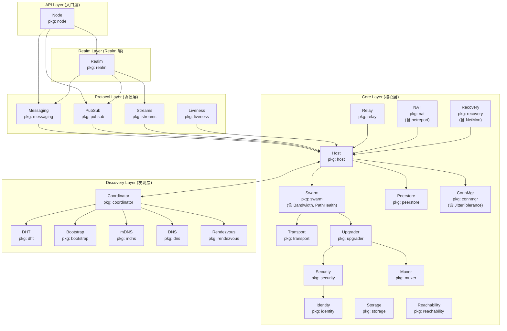
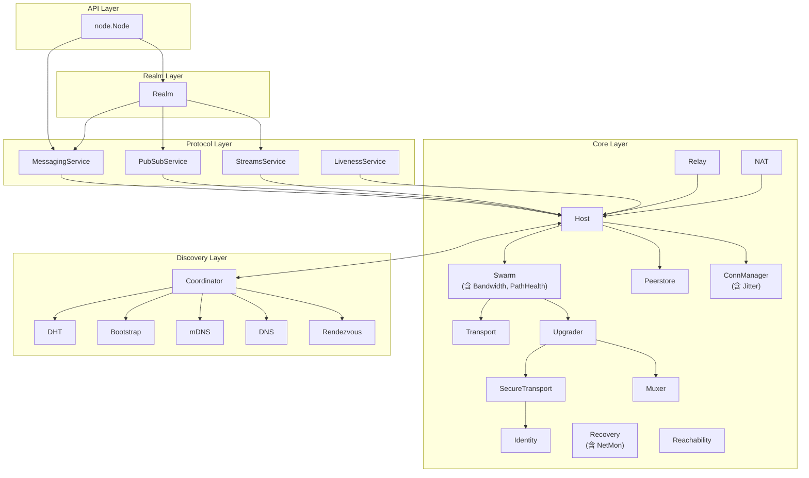
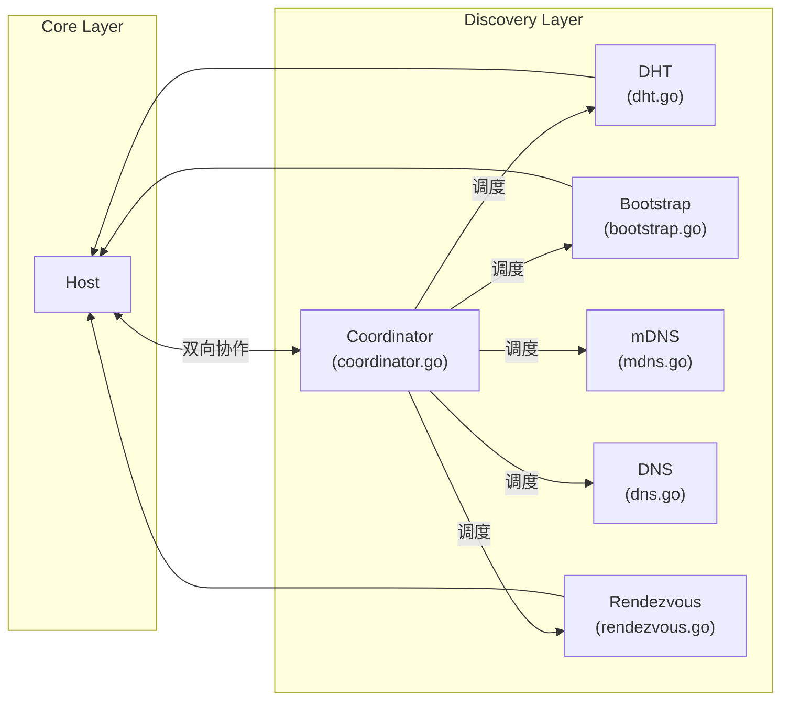

# 组件-接口全景图 (Component Interface Map)

> **版本**: v1.5.1  
> **更新日期**: 2026-01-23  
> **定位**: 可视化 DeP2P 五层软件架构组件与接口的关系

---

## 概述

本文档展示 DeP2P 所有组件与接口的映射关系，包括：
- 每个组件提供的接口（公共 + 内部）
- 每个组件依赖的接口
- 接口间的依赖关系

---

## 五层架构全景图



---

## 组件-接口映射表

### 一一对应原则

> **核心原则**：一个组件 = 一个公共接口文件 = 一个实现目录

### 提供的接口

| 架构层 | 组件 | 公共接口文件 | 实现目录 | 说明 |
|----|------|-------------|---------|------|
| **API** | Node | `node.go` | 根目录 | 顶层 API，含 HealthChecker |
| **Protocol** | Messaging | `messaging.go` | internal/protocol/messaging/ | 点对点消息 |
| **Protocol** | PubSub | `pubsub.go` | internal/protocol/pubsub/ | 发布订阅 |
| **Protocol** | Streams | `streams.go` | internal/protocol/streams/ | 流管理 |
| **Protocol** | Liveness | `liveness.go` | internal/protocol/liveness/ | 存活检测 |
| **Realm** | Realm | `realm.go` | internal/realm/ | Realm 隔离域 |
| **Core** | Host | `host.go` | internal/core/host/ | 网络主机门面 |
| **Core** | Swarm | `swarm.go` | internal/core/swarm/ | 连接池，含 BandwidthCounter, PathHealthManager |
| **Core** | Peerstore | `peerstore.go` | internal/core/peerstore/ | 节点信息存储 |
| **Core** | Identity | `identity.go` | internal/core/identity/ | 身份管理 |
| **Core** | Transport | `transport.go` | internal/core/transport/ | QUIC/TCP 传输 |
| **Core** | Security | `security.go` | internal/core/security/ | TLS/Noise 安全层 |
| **Core** | Muxer | `muxer.go` | internal/core/muxer/ | Yamux 多路复用 |
| **Core** | Upgrader | `upgrader.go` | internal/core/upgrader/ | 连接升级器 |
| **Core** | Protocol | `protocol.go` | internal/core/protocol/ | 协议注册 |
| **Core** | Metrics | `metrics.go` | internal/core/metrics/ | 度量统计 |
| **Core** | EventBus | `eventbus.go` | internal/core/eventbus/ | 事件总线 |
| **Core** | ResourceMgr | `resource.go` | internal/core/resourcemgr/ | 资源管理 |
| **Core** | ConnMgr | `connmgr.go` | internal/core/connmgr/ | 连接管理，含 JitterTolerance |
| **Core** | Relay | `relay.go` | internal/core/relay/ | ★ 统一中继（v2.0 三大职责：缓存加速 + 信令 + 保底） |
| **Core** | NAT | `nat.go` | internal/core/nat/ | NAT 穿透（外部地址发现 + 打洞），含 netreport 子模块，★ 打洞需 Relay 信令 |
| **Core** | Storage | `storage.go` | internal/core/storage/ | 存储引擎（BadgerDB） |
| **Core** | Recovery | `recovery.go` | internal/core/recovery/ | 网络恢复，含 ConnectionHealthMonitor, NetworkMonitor |
| **Core** | Reachability | `reachability.go` | internal/core/reachability/ | 可达性协调 |
| **Discovery** | Coordinator | `coordinator.go` | internal/discovery/coordinator/ | 发现协调器，含 Discovery 契约 |
| **Discovery** | DHT | `dht.go` | internal/discovery/dht/ | Kademlia DHT |
| **Discovery** | Bootstrap | `bootstrap.go` | internal/discovery/bootstrap/ | Bootstrap 发现 |
| **Discovery** | mDNS | `mdns.go` | internal/discovery/mdns/ | mDNS 发现 |
| **Discovery** | DNS | `dns.go` | internal/discovery/dns/ | DNS 发现 |
| **Discovery** | Rendezvous | `rendezvous.go` | internal/discovery/rendezvous/ | Rendezvous 发现 |

### 依赖的接口

| 架构层 | 组件 | 依赖的接口 | 说明 |
|----|------|------------------------------|------|
| **API** | Node | `Host`, `RealmManager`, `NetworkMonitor` | 依赖 Host、Realm 和网络监控 |
| **Protocol** | Messaging | `Host` | 依赖 Host 进行网络通信 |
| **Protocol** | PubSub | `Host` | 依赖 Host 进行网络通信 |
| **Protocol** | Streams | `Host` | 依赖 Host 进行流管理 |
| **Protocol** | Liveness | `Host` | 依赖 Host 发送心跳 |
| **Realm** | Realm | `Host`, `MessagingService` | 依赖 Host 和 Messaging |
| **Core** | Host | `Swarm`, `Peerstore`, `ConnManager` | Host 聚合底层组件 |
| **Core** | Swarm | `Transport`, `Upgrader`, `Peerstore` | Swarm 管理拨号和监听 |
| **Core** | Upgrader | `SecureTransport`, `Muxer` | 升级器组合安全层和多路复用 |
| **Core** | Peerstore | `Engine` (可选) | 可选依赖 Storage 进行持久化 |
| **Core** | Identity | - | 无依赖 |
| **Core** | Transport | - | 无依赖 |
| **Core** | Storage | - | 无依赖（最底层） |
| **Core** | Recovery | `Host`, `EventBus` | 依赖 Host 和事件总线 |
| **Core** | Reachability | `Host`, `Discovery` | 依赖 Host 和发现服务 |
| **Core** | Security | `Identity` | 依赖身份管理 |
| **Core** | Muxer | - | 无依赖 |
| **Core** | ConnMgr | - | 无依赖 |
| **Core** | Relay | `Host` | 依赖 Host；★ 提供 AddressBook（缓存加速层，非权威）+ SignalingChannel（打洞信令） |
| **Core** | NAT | `Host`, `Relay` | 依赖 Host；★ 打洞依赖 Relay 提供的信令通道 |
| **Discovery** | Coordinator | 各 Discovery 机制, `Reachability` | 协调 DHT, Bootstrap, mDNS；★ 发布前需 Reachability 验证 |
| **Discovery** | DHT | `Host`, `Reachability` | 依赖 Host；★ 发布地址必须经过 Reachability 验证 |
| **Discovery** | Bootstrap | `Host` | 依赖 Host 连接引导节点 |
| **Discovery** | mDNS | - | 使用 UDP 多播 |
| **Discovery** | DNS | - | 使用 DNS 解析 |
| **Discovery** | Rendezvous | `Host` | 依赖 Host 进行通信 |

---

## ★ 关键接口职责说明（v2.0 DHT 权威模型）

### NAT / Relay / Reachability / Discovery 协作

```
┌─────────────────────────────────────────────────────────────────────────────┐
│               NAT / Relay / Reachability / Discovery 协作（v2.0）            │
├─────────────────────────────────────────────────────────────────────────────┤
│                                                                             │
│  ★ v2.0 三层架构：                                                          │
│  Layer 1: DHT（★ 权威目录）— 存储签名 PeerRecord                             │
│  Layer 2: 缓存加速层 — Peerstore / MemberList / Relay 地址簿                 │
│  Layer 3: 连接策略 — 直连 → 打洞 → Relay 兜底                                │
│                                                                             │
│  地址发布链路（候选地址 → 可发布地址 → DHT）                                │
│  ────────────────────────────────────────────                               │
│                                                                             │
│    NAT.GetExternalAddr()  →  候选地址（STUN/观察地址）                      │
│              ↓                                                              │
│    Reachability.Verify()  →  验证可达性（AutoNAT/外部探测）                │
│              ↓                                                              │
│    Reachability.PublishableAddrs()  →  已验证可发布地址                    │
│              ↓                                                              │
│    DHT.Announce()  →  发布签名 PeerRecord 到 DHT（★ 权威目录）              │
│                                                                             │
│  地址发现优先级（v2.0）                                                      │
│  ─────────────────────                                                      │
│    1. Peerstore 本地缓存（最快）                                            │
│    2. MemberList 成员列表（Gossip 同步）                                    │
│    3. DHT 查询（★ 权威来源）                                                │
│    4. Relay 地址簿（缓存回退，非权威）                                      │
│                                                                             │
│  打洞信令链路（Relay 提供信令通道）                                         │
│  ─────────────────────────────────                                          │
│                                                                             │
│    NAT.HolePuncher  ← 需要信令通道 ←  Relay.SignalingChannel               │
│                                                                             │
│    打洞流程：                                                                │
│      1. 通过 Relay 连接获取信令通道                                         │
│      2. 交换打洞协调消息                                                    │
│      3. 尝试直连                                                            │
│      4. 失败则使用 Relay 作为数据兜底                                       │
│                                                                             │
│  Relay 三大职责（v2.0）                                                      │
│  ─────────────────────                                                      │
│                                                                             │
│    职责一：缓存加速层（非权威目录）                                          │
│      Relay.AddressBook.Register(id, addrs)  →  成员地址缓存                │
│      Relay.AddressBook.Query(id)            →  缓存查询（非权威）          │
│      ★ DHT 才是权威目录，Relay 地址簿是本地缓存                             │
│                                                                             │
│    职责二：打洞协调信令                                                      │
│      Relay.SignalingChannel  →  打洞协调的必要前提                         │
│                                                                             │
│    职责三：数据通信保底                                                      │
│      直连 → 打洞 → Relay 兜底（连接优先级 INV-003）                         │
│      打洞成功后保留 Relay 连接作为备份                                      │
│                                                                             │
└─────────────────────────────────────────────────────────────────────────────┘
```

---

## 接口依赖图

### 纵向依赖（架构层次）



### Core ↔ Discovery 双向协作



---

## 代码目录与接口对应

### 目录结构

```
dep2p/
├── pkg/
│   ├── interfaces/              # 公共接口（扁平结构，一一对应）
│   │   ├── doc.go
│   │   │
│   │   │  # ═══════════ API Layer 接口 ═══════════
│   │   ├── node.go              # Node 接口，含 HealthChecker
│   │   │
│   │   │  # ═══════════ Protocol Layer 接口 ═══════════
│   │   ├── messaging.go         # Messaging 接口
│   │   ├── pubsub.go            # PubSub, Topic 接口
│   │   ├── streams.go           # Streams 接口
│   │   ├── liveness.go          # Liveness 接口
│   │   │
│   │   │  # ═══════════ Realm Layer 接口 ═══════════
│   │   ├── realm.go             # Realm 接口
│   │   │
│   │   │  # ═══════════ Core Layer 接口 (18 个) ═══════════
│   │   ├── host.go              # Host 接口（门面）
│   │   ├── swarm.go             # Swarm 接口，含 BandwidthCounter, PathHealthManager
│   │   ├── peerstore.go         # Peerstore 接口
│   │   ├── identity.go          # Identity 接口
│   │   ├── transport.go         # Transport, Connection 接口
│   │   ├── security.go          # Security 接口
│   │   ├── muxer.go             # Muxer 接口
│   │   ├── upgrader.go          # Upgrader 接口
│   │   ├── protocol.go          # Protocol 接口
│   │   ├── metrics.go           # Metrics 接口
│   │   ├── eventbus.go          # EventBus 接口
│   │   ├── resource.go          # ResourceManager 接口
│   │   ├── connmgr.go           # ConnManager 接口，含 JitterTolerance
│   │   ├── relay.go             # Relay 接口
│   │   ├── nat.go               # NAT 接口
│   │   ├── storage.go           # Storage 接口（Engine）
│   │   ├── recovery.go          # Recovery 接口，含 ConnectionHealthMonitor, NetworkMonitor
│   │   ├── reachability.go      # Reachability 接口
│   │   │
│   │   │  # ═══════════ Discovery Layer 接口 (6 个) ═══════════
│   │   ├── coordinator.go       # Coordinator 接口，含 Discovery 契约
│   │   ├── dht.go               # DHT, RoutingTable 接口
│   │   ├── bootstrap.go         # Bootstrap 接口
│   │   ├── mdns.go              # mDNS 接口
│   │   ├── dns.go               # DNS 接口
│   │   └── rendezvous.go        # Rendezvous 接口
│   │
│   ├── types/                   # 公共类型
│   │   └── ...
│   │
│   └── lib/                     # 基础设施工具库
│       ├── doc.go
│       ├── crypto/              # 密码学原语（密钥、签名、PeerID）
│       ├── multiaddr/           # 多地址格式解析
│       ├── log/                 # 日志封装
│       ├── protocolids/         # 协议 ID 常量
│       └── proto/               # Protobuf 网络消息定义
│
└── internal/
    ├── protocol/                # Protocol Layer 实现
    │   ├── messaging/
    │   ├── pubsub/
    │   ├── streams/
    │   └── liveness/
    │
    ├── realm/                   # Realm Layer 实现
    │   └── ...
    │
    ├── core/                    # Core Layer 实现 (18 个一级目录)
    │   ├── host/
    │   ├── swarm/               # 含 bandwidth/, pathhealth/, dial/ 子目录
    │   ├── peerstore/
    │   ├── identity/
    │   ├── transport/
    │   ├── security/
    │   ├── muxer/
    │   ├── upgrader/
    │   ├── protocol/
    │   ├── metrics/
    │   ├── eventbus/
    │   ├── resourcemgr/
    │   ├── connmgr/             # 含 gater/, msgrate/ 子目录
    │   ├── relay/
    │   ├── nat/                 # 含 netreport/, holepunch/, stun/, upnp/, natpmp/ 子目录
    │   ├── storage/
    │   ├── recovery/            # 含 netmon/ 子目录
    │   └── reachability/        # 含 addrmgmt/ 子目录
    │
    ├── discovery/               # Discovery Layer 实现 (6 个目录)
    │   ├── coordinator/
    │   ├── dht/
    │   ├── bootstrap/
    │   ├── mdns/
    │   ├── dns/
    │   └── rendezvous/
    │
    └── debug/                   # 调试工具（非架构组件）
        └── introspect/          # HTTP 诊断服务
```

**重要说明**:
- `pkg/interfaces/` 采用**扁平结构**，不使用层前缀
- **严格一一对应**：一个接口文件 = 一个实现目录
- 子目录（如 `swarm/bandwidth/`）无独立公共接口，接口合并到父组件
- `pkg/lib/` 包含基础设施工具库，与架构组件分离

---

## 日志与指标说明

日志和指标不作为独立接口，直接使用标准库：

| 能力 | 处理方式 |
|------|----------|
| **Logging** | 直接使用标准库 `log/slog` |
| **Metrics** | 直接使用 `prometheus` |

---

## 相关文档

| 文档 | 说明 |
|------|------|
| [public_interfaces.md](public_interfaces.md) | 公共接口设计 |
| [internal_interfaces.md](internal_interfaces.md) | 内部接口设计 |
| [fx_lifecycle.md](fx_lifecycle.md) | Fx + Lifecycle 模式 |
| [../L2_structural/module_design.md](../L2_structural/module_design.md) | 模块划分 |
| [../L2_structural/layer_model.md](../L2_structural/layer_model.md) | 五层软件架构 |

---

---

## 已删除的接口文件

以下接口文件已合并到父组件，不再独立存在：

| 已删除文件 | 合并到 | 说明 |
|----------|--------|------|
| `bandwidth.go` | `swarm.go` | BandwidthCounter 是 Swarm 子能力 |
| `pathhealth.go` | `swarm.go` | PathHealthManager 是 Swarm 子能力 |
| `netmon.go` | `recovery.go` | ConnectionHealthMonitor 是 Recovery 子能力 |
| `network.go` | `connmgr.go` / `recovery.go` | JitterTolerance → connmgr，NetworkMonitor → recovery |
| `health.go` | `node.go` | HealthChecker 是 Node 能力 |
| `discovery.go` | 拆分为 6 个文件 | 严格一一对应原则 |

## 废弃的命名约定

**早期设计** 曾使用层前缀命名接口文件（如 `core_host.go`, `protocol_messaging.go`），但在实施阶段改为 **go-libp2p 风格的扁平命名**。

| 废弃命名 | 当前命名 | 接口 |
|----------|----------|------|
| `core_host.go` | `host.go` | `Host` |
| `core_identity.go` | `identity.go` | `Identity` |
| `core_transport.go` | `transport.go` | `Transport`, `Connection` |
| `protocol_messaging.go` | `messaging.go` | `MessagingService` |
| `protocol_pubsub.go` | `pubsub.go` | `PubSubService`, `Topic` |
| `discovery_dht.go` | 拆分为独立文件 | `coordinator.go`, `dht.go`, `bootstrap.go` 等 |

---

**最后更新**：2026-01-24（v2.0 DHT 权威模型对齐）  
**架构版本**：v2.0.0（DHT 权威模型 + 严格一一对应 + Discovery 拆分 + 子目录合并）
