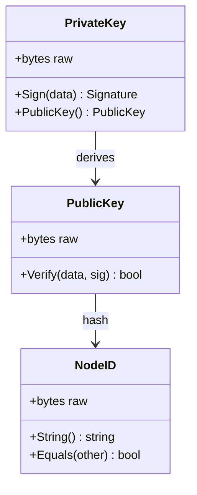
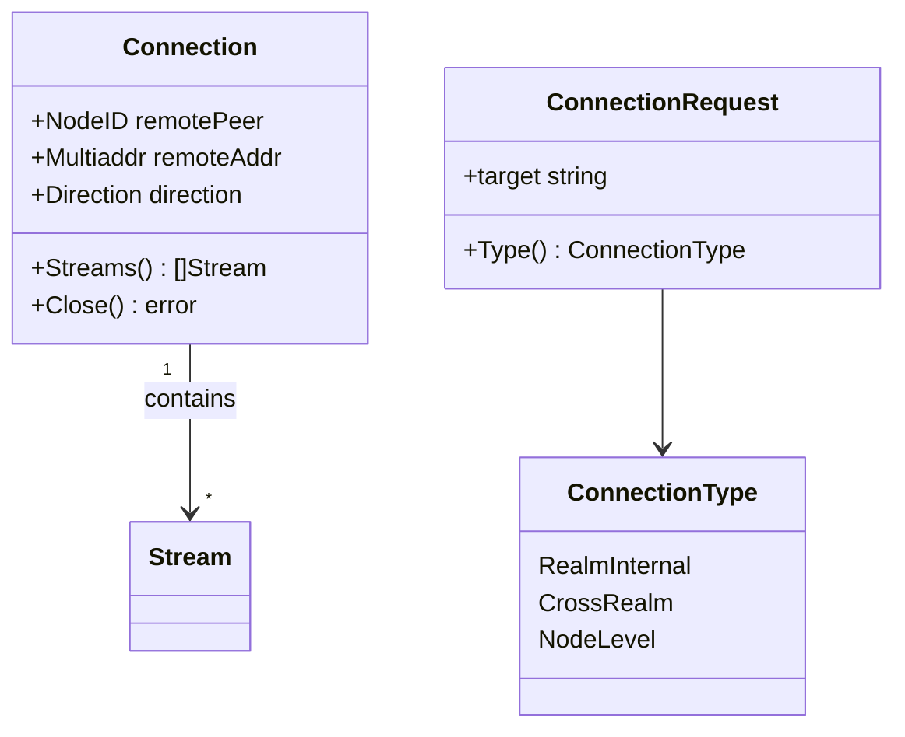
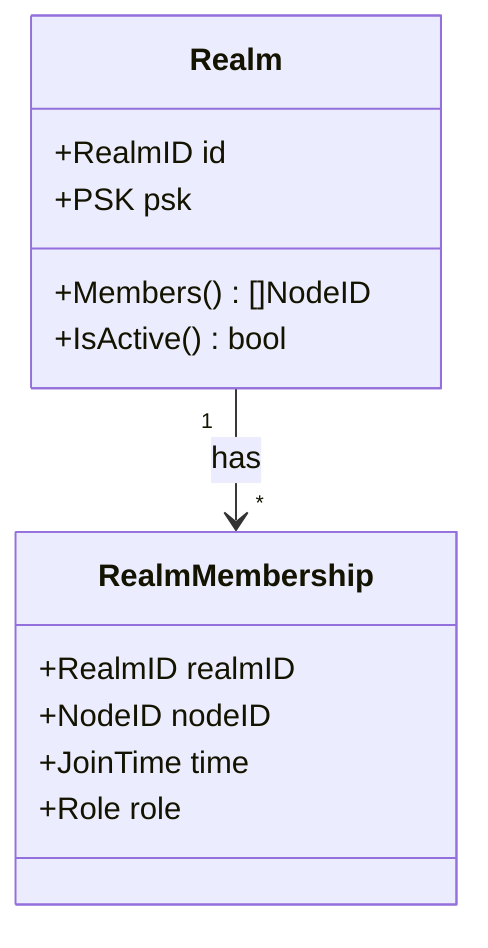
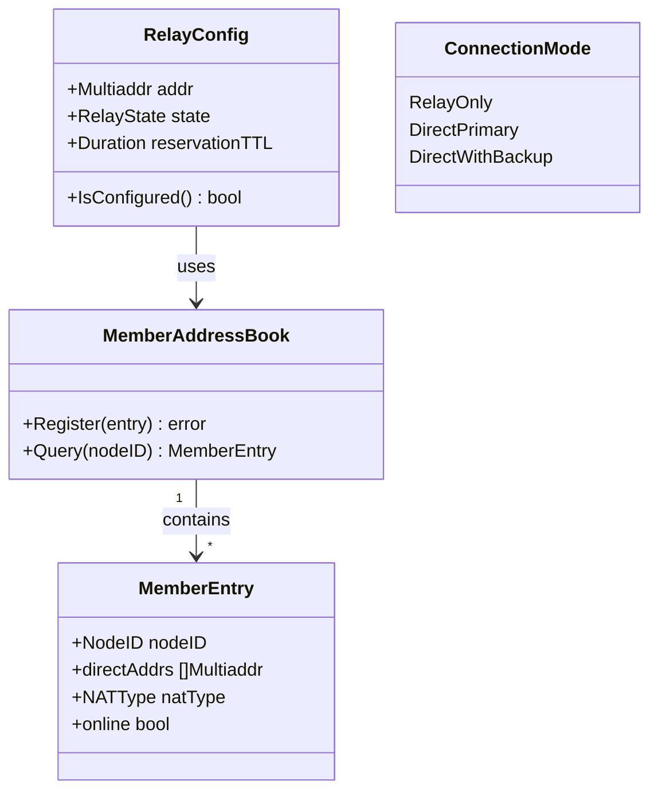
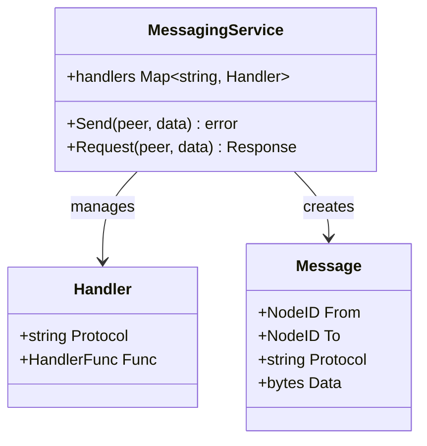
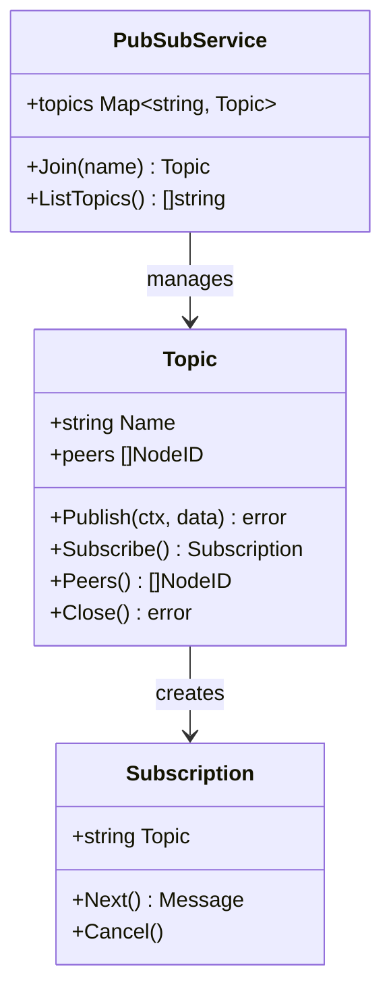

# L5: 领域模型 (Domain Models)

> 核心开发者视角：横切面的概念设计、数据模型、一致性边界

---

## 目录结构

```
L5_models/
├── README.md              # 本文件
├── identity/              # 身份领域
│   ├── README.md
│   └── nodeid_model.md    # NodeID 模型
├── connection/            # 连接领域
│   ├── README.md
│   └── connection_model.md
├── realm/                 # Realm 领域
│   ├── README.md
│   └── realm_model.md
├── relay/                 # Relay 领域
│   ├── README.md
│   └── relay_model.md
├── messaging/             # 消息领域
│   ├── README.md
│   └── messaging_model.md # Messaging 模型
└── pubsub/                # 发布订阅领域
    ├── README.md
    └── pubsub_model.md    # PubSub 模型
```

---

## L5 定位

L5 关注的是**横切面的概念设计**，而非单个组件的实现。

| 维度 | L5_models | L6_domains |
|------|-----------|------------|
| **视角** | 跨多个组件 | 单个组件 |
| **粒度** | 概念层面 | 实现层面 |
| **关注点** | 数据模型、生命周期、一致性 | 内部架构、接口、配置 |

---

## 核心领域

### 1. 身份领域 (Identity)



**核心概念**：
- **PrivateKey**：Ed25519 私钥，用于签名
- **PublicKey**：Ed25519 公钥，用于验证
- **NodeID**：公钥的 SHA256 哈希，全局唯一标识

### 2. 连接领域 (Connection)



**生命周期**：
1. 拨号/接收 → 2. 握手 → 3. 活跃 → 4. 关闭

**★ "仅 ID 连接"边界**：
- **Realm 内**：支持纯 NodeID 连接，自动地址发现
- **跨 Realm**：必须提供地址，不支持纯 NodeID

### 3. Realm 领域 (Realm)



**核心概念**：
- **Realm**：逻辑网络隔离单元
- **PSK**：预共享密钥，用于成员认证
- **RealmMembership**：节点在 Realm 中的成员关系

### 4. Relay 领域 (Relay)



**核心概念**：
- **★ 统一 Relay**：不区分控制面/数据面中继，单一概念
- **★ 三大职责 v2.0**：缓存加速层 + 打洞协调信令 + 数据通信保底（DHT 是权威目录）
- **★ MemberAddressBook**：地址簿，支持"仅 ID 连接"的地址发现
- **★ 打洞后保留**：打洞成功后保留 Relay 连接作为备份
- **显式配置**：Relay 地址需要配置（ADR-0010）

### 5. Messaging 领域 (Messaging)



**核心概念**：
- **Message**：点对点消息
- **Request/Response**：请求-响应模式
- **Handler**：消息处理器

### 6. PubSub 领域 (PubSub)



**核心概念**：
- **PubSubService**：服务入口，通过 `Join()` 返回 Topic 对象
- **Topic**：主题对象，承载发布/订阅操作，支持多主题并行
- **Subscription**：订阅句柄，用于接收消息
- **GossipSub**：基于八卦协议的消息扩散

---

## 一致性边界

| 边界 | 强一致性 | 最终一致性 |
|------|----------|-----------|
| **单节点** | 本地状态变更 | - |
| **Realm 内** | - | 成员列表、发现信息 |
| **跨 Realm** | - | 不适用（隔离） |

---

## 相关文档

- [L4: 接口契约](../L4_interfaces/)
- [L6: 模块设计](../L6_domains/)

---

**最后更新**：2026-01-23
