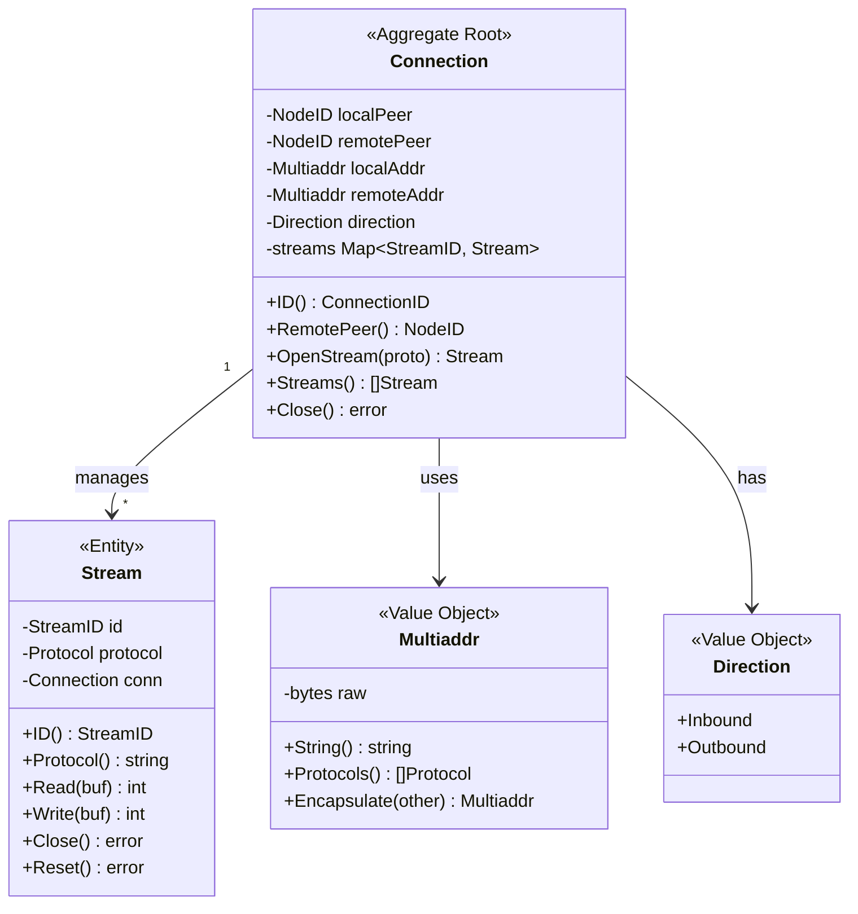
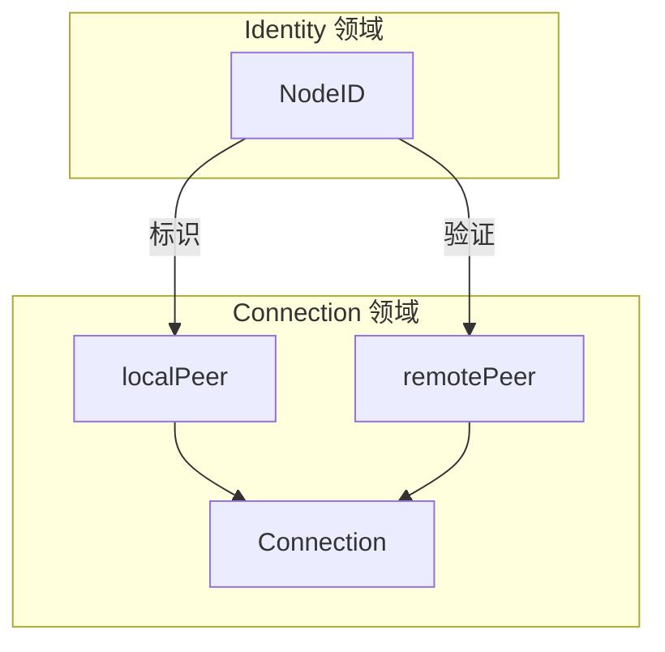
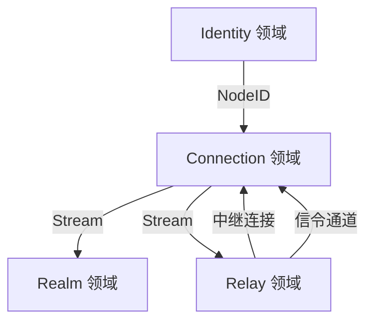

# 连接领域 (Connection Domain)

> 定义 DeP2P 的连接与流管理模型

---

## 领域边界

```
┌─────────────────────────────────────────────────────────────────────────────┐
│                          连接领域边界                                         │
├─────────────────────────────────────────────────────────────────────────────┤
│                                                                             │
│  核心职责：                                                                  │
│  • 连接生命周期管理                                                          │
│  • 流多路复用                                                                │
│  • 连接池与保护                                                              │
│                                                                             │
│  领域内实体：                                                                │
│  • Connection（聚合根）                                                      │
│  • Stream（实体）                                                            │
│  • Multiaddr、Direction（值对象）                                            │
│                                                                             │
│  领域边界：                                                                  │
│  • 不涉及传输层细节（交给 Transport 模块）                                    │
│  • 不涉及安全握手（交给 Security 模块）                                       │
│  • 关注连接的逻辑管理                                                        │
│                                                                             │
└─────────────────────────────────────────────────────────────────────────────┘
```

---

## 领域模型



---

## 核心实体

### Connection（聚合根）

Connection 是连接领域的聚合根，管理到远程节点的连接。

```
┌─────────────────────────────────────────────────────────────────┐
│  Connection - 聚合根                                             │
├─────────────────────────────────────────────────────────────────┤
│                                                                 │
│  核心属性：                                                       │
│  • localPeer     - 本地节点 ID                                  │
│  • remotePeer    - 远程节点 ID（INV-001 验证）                  │
│  • localAddr     - 本地地址                                     │
│  • remoteAddr    - 远程地址                                     │
│  • direction     - 连接方向                                     │
│  • streams       - 活跃流映射                                   │
│                                                                 │
│  不变量：                                                        │
│  • remotePeer 在握手后不可变                                     │
│  • 所有 Stream 必须属于此 Connection                             │
│  • 连接关闭时所有 Stream 自动关闭                                 │
│                                                                 │
│  核心方法：                                                       │
│  • OpenStream(proto)   - 打开新流                               │
│  • AcceptStream()      - 接受入站流                             │
│  • Streams()           - 获取所有活跃流                          │
│  • Close()             - 关闭连接                               │
│                                                                 │
└─────────────────────────────────────────────────────────────────┘
```

### Stream（实体）

Stream 是连接上的逻辑通道，提供双向读写。

```
┌─────────────────────────────────────────────────────────────────┐
│  Stream - 实体                                                   │
├─────────────────────────────────────────────────────────────────┤
│                                                                 │
│  核心属性：                                                       │
│  • id         - 流 ID（连接内唯一）                              │
│  • protocol   - 协议标识                                        │
│  • conn       - 所属连接                                        │
│                                                                 │
│  核心方法：                                                       │
│  • Read(buf)  - 读取数据                                        │
│  • Write(buf) - 写入数据                                        │
│  • Close()    - 优雅关闭                                        │
│  • Reset()    - 强制重置                                        │
│                                                                 │
│  生命周期：                                                       │
│  • 由 Connection 创建                                           │
│  • 随 Connection 关闭而关闭                                      │
│                                                                 │
└─────────────────────────────────────────────────────────────────┘
```

---

## 值对象

### Multiaddr

Multiaddr 是自描述的网络地址格式。

```
格式示例：
/ip4/192.168.1.1/udp/4001/quic-v1
/ip6/::1/udp/4001/quic-v1
/dns4/example.com/udp/4001/quic-v1

组成：
┌────────┬────────────┬────────┬─────────┬──────────┐
│ 协议1  │ 值1        │ 协议2  │ 值2     │ ...      │
├────────┼────────────┼────────┼─────────┼──────────┤
│ /ip4   │ 192.168.1.1│ /udp   │ 4001    │ /quic-v1 │
└────────┴────────────┴────────┴─────────┴──────────┘
```

### Direction

连接方向枚举：

| 值 | 说明 |
|-----|------|
| Inbound | 入站连接（被动接受） |
| Outbound | 出站连接（主动发起） |

---

## 连接与身份的关系



### INV-001 约束

```
连接建立时必须验证远程节点身份：

1. 发起连接时指定期望的 NodeID
2. TLS 握手获取远程公钥
3. 验证 SHA256(RemotePublicKey) == ExpectedNodeID
4. 验证失败则拒绝连接
```

---

## ★ "Connect 成功 = 可通信" 语义保证

```
┌─────────────────────────────────────────────────────────────────────────────┐
│                    Connect 成功的完整语义                                     │
├─────────────────────────────────────────────────────────────────────────────┤
│                                                                             │
│  用户调用 Connect() 返回成功后，必须保证：                                   │
│  ═════════════════════════════════════════════                              │
│                                                                             │
│  1. 传输层就绪                                                              │
│     • QUIC 握手完成                                                         │
│     • 安全通道建立（TLS 1.3）                                               │
│                                                                             │
│  2. 协议层就绪                                                              │
│     • 多路复用就绪                                                          │
│     • 可以打开 Stream                                                       │
│                                                                             │
│  3. 认证层就绪（Realm 内）                                                  │
│     • PSK 认证完成                                                          │
│     • 确认为 Realm 成员                                                     │
│                                                                             │
│  避免的问题：                                                                │
│  ──────────────                                                             │
│  ❌ "连接成功但无法通信"                                                    │
│  ❌ "连接成功但认证失败"                                                    │
│  ❌ "连接成功但协议协商失败"                                                │
│                                                                             │
│  ★ 这是用户语义保证，避免抽象泄漏                                           │
│                                                                             │
└─────────────────────────────────────────────────────────────────────────────┘
```

---

## 与其他领域的关系



| 关系 | 说明 |
|------|------|
| ← Identity | 使用 NodeID 标识连接双方 |
| → Realm | 为 Realm 提供流通道 |
| → Relay | 为中继提供连接 |
| ← Relay | 通过中继建立连接 |
| ← Relay | ★ Relay 连接作为打洞信令通道 |

### ★ 与 Relay 的特殊关系

```
┌─────────────────────────────────────────────────────────────────────────────┐
│                    连接与 Relay 的关系                                        │
├─────────────────────────────────────────────────────────────────────────────┤
│                                                                             │
│  连接模式：                                                                  │
│  • RelayOnly - 仅通过 Relay 通信（打洞失败/未尝试）                          │
│  • DirectPrimary - 直连为主，Relay 为备（打洞成功后）                        │
│                                                                             │
│  ★ 核心策略：打洞成功后保留 Relay 连接                                       │
│  ────────────────────────────────────────                                   │
│  • Relay 连接用于打洞协调信令通道                                           │
│  • 直连可能因网络变化断开，Relay 作为 fallback                              │
│  • 重建 Relay 连接有成本（握手、预留）                                      │
│                                                                             │
│  状态转换：                                                                  │
│  RelayOnly → [打洞成功] → DirectPrimary + RelayBackup                      │
│                              ↓ [直连断开]                                   │
│                          RelayOnly → [重试打洞]                             │
│                                                                             │
└─────────────────────────────────────────────────────────────────────────────┘
```

---

## 领域事件

| 事件 | 触发条件 | 载荷 |
|------|----------|------|
| ConnectionOpened | 连接建立成功 | ConnectionID, RemotePeer |
| ConnectionClosed | 连接关闭 | ConnectionID, Reason |
| StreamOpened | 流创建成功 | StreamID, Protocol |
| StreamClosed | 流关闭 | StreamID |
| ConnectionUpgraded | ★ 从 Relay 升级为直连 | ConnectionID, OldMode, NewMode |
| ConnectionDowngraded | ★ 从直连降级为 Relay | ConnectionID, Reason |

---

## 相关文档

| 文档 | 说明 |
|------|------|
| [connection_model.md](connection_model.md) | 连接模型详解（含 NAT 决策、网络弹性） |
| [../identity/README.md](../identity/README.md) | 身份领域 |
| [../relay/README.md](../relay/README.md) | Relay 领域（统一 Relay、打洞后保留） |
| [../../L3_behavioral/connection_flow.md](../../L3_behavioral/connection_flow.md) | 连接流程 |
| [../../L1_overview/core_concepts.md](../../L1_overview/core_concepts.md) | 核心概念（NAT 三层能力） |

---

**最后更新**：2026-01-23
