# 连接模型 (Connection Model)

> 连接生命周期、状态机、地址发现与管理策略

---

## 概述

Connection 是 DeP2P 网络通信的基础单元，封装了到远程节点的双向通道。

```
┌─────────────────────────────────────────────────────────────────────────────┐
│                          Connection 核心特性                                  │
├─────────────────────────────────────────────────────────────────────────────┤
│                                                                             │
│  • 身份绑定：每个连接绑定确定的 RemotePeer (INV-001)                          │
│  • 流多路复用：单连接支持多个并发流                                            │
│  • 双向通信：支持全双工数据传输                                               │
│  • 资源管理：自动管理生命周期和资源释放                                        │
│  • ★ 边界感知：Realm 内支持"仅 ID 连接"，跨 Realm 需要地址                   │
│                                                                             │
└─────────────────────────────────────────────────────────────────────────────┘
```

---

## ★ "仅 ID 连接"边界模型

DeP2P 的连接模型区分**Realm 内连接**和**节点级连接**，有不同的地址发现策略。

### 边界定义

```
┌─────────────────────────────────────────────────────────────────────────────┐
│                    "仅 ID 连接"的严格边界（★ 核心概念模型）                   │
├─────────────────────────────────────────────────────────────────────────────┤
│                                                                             │
│  ★ 关键认知：Realm 是业务边界，"仅 ID 连接"严格限制在 Realm 内              │
│                                                                             │
│  ═══════════════════════════════════════════════════════════════════════   │
│  Realm 内（✅ 支持"仅 ID 连接"）                                            │
│  ═══════════════════════════════════════════════════════════════════════   │
│                                                                             │
│  realm.Connect(ctx, targetNodeID)   ← ✅ 允许                               │
│                                                                             │
│  地址发现来源（v2.0 优先级）：                                               │
│  • Peerstore 本地缓存                                                       │
│  • MemberList 成员列表                                                      │
│  • DHT 查询（★ 权威来源）                                                   │
│  • Relay 地址簿（缓存回退）                                                 │
│                                                                             │
│  保底机制：                                                                  │
│  • Relay 数据转发（统一 Relay，总是可达）                                  │
│                                                                             │
│  ═══════════════════════════════════════════════════════════════════════   │
│  跨 Realm / 节点级（❌ 禁止"仅 ID 连接"）                                   │
│  ═══════════════════════════════════════════════════════════════════════   │
│                                                                             │
│  node.Connect(ctx, targetNodeID)    ← ❌ 返回 ErrAddressRequired           │
│  node.Connect(ctx, multiaddr)       ← ✅ 必须提供地址                       │
│                                                                             │
│  原因：                                                                      │
│  • 无共享的发现机制                                                         │
│  • 无共享的 Relay 保底                                                      │
│  • 无信任基础                                                               │
│                                                                             │
└─────────────────────────────────────────────────────────────────────────────┘
```

### 连接类型模型

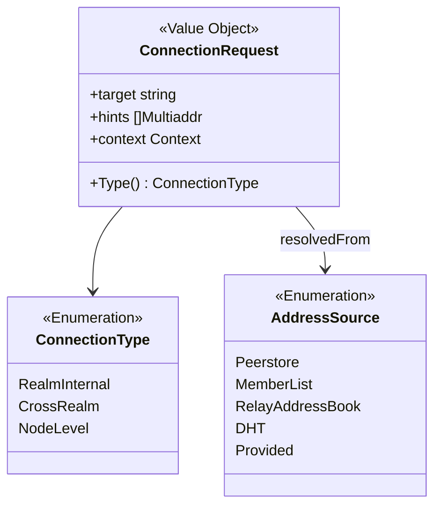

### Realm 内地址发现模型

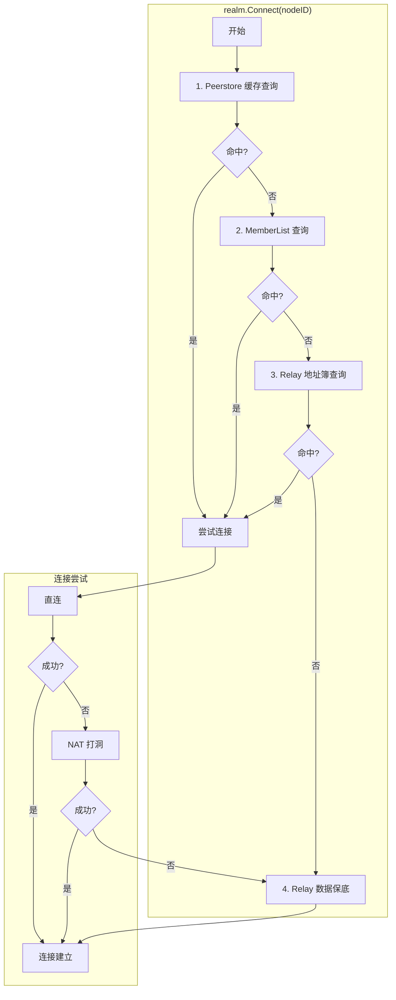

### 地址发现优先级

```
┌─────────────────────────────────────────────────────────────────────────────┐
│                    Realm 内地址发现优先级                                    │
├─────────────────────────────────────────────────────────────────────────────┤
│                                                                             │
│  优先级 1: Peerstore 本地缓存                                               │
│  ════════════════════════════                                               │
│  • 最近连接过的地址                                                        │
│  • 零网络开销                                                              │
│  • TTL 管理，避免使用过期地址                                              │
│                                                                             │
│  优先级 2: MemberList 成员列表                                              │
│  ═══════════════════════════════                                            │
│  • Realm 成员通过 Gossip 协议同步的地址                                    │
│  • 相对实时，但可能不完整                                                  │
│                                                                             │
│  优先级 3: DHT 查询（★ 权威来源）                                           │
│  ═══════════════════════════════════════                                    │
│  • 查询 Realm 作用域的 DHT                                                 │
│  • 返回签名 PeerRecord（防投毒、防伪造）                                   │
│  • ★ DHT 是权威目录，其他来源是缓存                                        │
│                                                                             │
│  优先级 4: Relay 地址簿（缓存回退）                                         │
│  ═══════════════════════════════════                                        │
│  • 向 Relay 查询目标地址（作为 DHT 本地缓存）                              │
│  • ★ Relay 地址簿是缓存，不是权威目录                                      │
│  • DHT 失败时作为回退                                                      │
│                                                                             │
└─────────────────────────────────────────────────────────────────────────────┘
```

### 连接边界不变量

| ID | 不变量 | 验证点 |
|----|--------|--------|
| CONN-INV-010 | Realm 内连接支持纯 NodeID | realm.Connect() |
| CONN-INV-011 | 跨 Realm 连接必须提供地址 | node.Connect() |
| CONN-INV-012 | Realm 内总是可达（Relay 保底） | 连接失败处理 |

---

## ★ 地址来源与验证模型

### 地址来源（多层次）

```
┌─────────────────────────────────────────────────────────────────────────────┐
│                    地址来源（多层次）                                         │
├─────────────────────────────────────────────────────────────────────────────┤
│                                                                             │
│  1. STUN/外部探测 — 获取外部地址与 NAT 类型                                 │
│     • 主动向 STUN 服务器查询                                                │
│     • 获得公网 IP:Port                                                      │
│     • 最可靠的外部地址来源                                                  │
│                                                                             │
│  2. 观察地址（Observed Address）                                            │
│     • 连接时对端告知的地址                                                  │
│     • 来源分散，可能不一致                                                  │
│     • 需要多源验证确认可靠性                                                │
│                                                                             │
│  3. 本地缓存（Peerstore）                                                   │
│     • 最近成功连接过的地址                                                  │
│     • 需要 TTL 管理（建议 5-10 分钟）                                       │
│                                                                             │
│  4. 成员同步（MemberList/Gossip）                                           │
│     • 通过 Gossip 协议同步的地址                                            │
│     • 相对实时，但可能不完整                                                │
│                                                                             │
│  5. Relay 地址簿                                                            │
│     • 向 Relay 查询目标地址                                                 │
│     • 最完整，但有网络开销                                                  │
│                                                                             │
└─────────────────────────────────────────────────────────────────────────────┘
```

### 地址状态机

```
┌─────────────────────────────────────────────────────────────────────────────┐
│                    地址状态机（候选 → 验证 → 发布）                           │
├─────────────────────────────────────────────────────────────────────────────┤
│                                                                             │
│  ┌────────────┐     ┌──────────────┐     ┌────────────┐     ┌───────────┐  │
│  │ Candidate  │────▶│  Validating  │────▶│ Reachable  │────▶│ Published │  │
│  │ (候选)     │     │  (验证中)     │     │ (可达)     │     │ (已发布)   │  │
│  └────────────┘     └──────────────┘     └────────────┘     └───────────┘  │
│        │                   │                   │                           │
│        │                   ▼                   │                           │
│        │            ┌────────────┐             │                           │
│        └───────────▶│ Unreachable│◀────────────┘                           │
│                     │ (不可达)    │                                         │
│                     └────────────┘                                         │
│                                                                             │
│  Candidate: 从 STUN/观察地址/本地获取的候选地址                             │
│  Validating: 正在通过 AutoNAT/dialback 验证可达性                          │
│  Reachable: 验证通过，外部可主动连接                                        │
│  Unreachable: 验证失败或过期，不应发布                                      │
│  Published: 已发布到 DHT，可被发现                                          │
│                                                                             │
│  ⚠️ 重要：只有 Reachable 状态的地址才应发布到 DHT                           │
│                                                                             │
└─────────────────────────────────────────────────────────────────────────────┘
```

### 地址更新触发条件

| 触发条件 | 处理方式 | 说明 |
|---------|---------|------|
| 网络接口变化 | 重新探测 + 更新发布 | 4G/WiFi 切换、IP 变更 |
| STUN 结果变化 | 更新候选 + 重新验证 | 公网地址/端口变化 |
| 观察地址变化 | 加入候选池 + 多源验证 | 对端告知的地址变更 |
| 地址验证失效 | 重新验证或移除 | 定期检测或连接失败触发 |
| Relay 预留变化 | 更新 Relay 地址 | 预留过期或重新建立 |

### 地址管理不变量

| ID | 不变量 | 验证点 |
|----|--------|--------|
| ADDR-INV-001 | 只发布可达地址到 DHT | 发布前验证 |
| ADDR-INV-002 | 观察地址需多源确认 | 地址状态转换 |
| ADDR-INV-003 | Relay 地址包含预留节点信息 | 地址格式验证 |

---

## ★ RelayCircuit 与 Connection 的关系 (v0.2.26)

根据 [ADR-0011](../../../../01_context/decisions/ADR-0011-relay-circuit-muxer.md)，RelayCircuit 实现 Connection 接口，与直连 Connection 统一管理。

### 连接类型层次

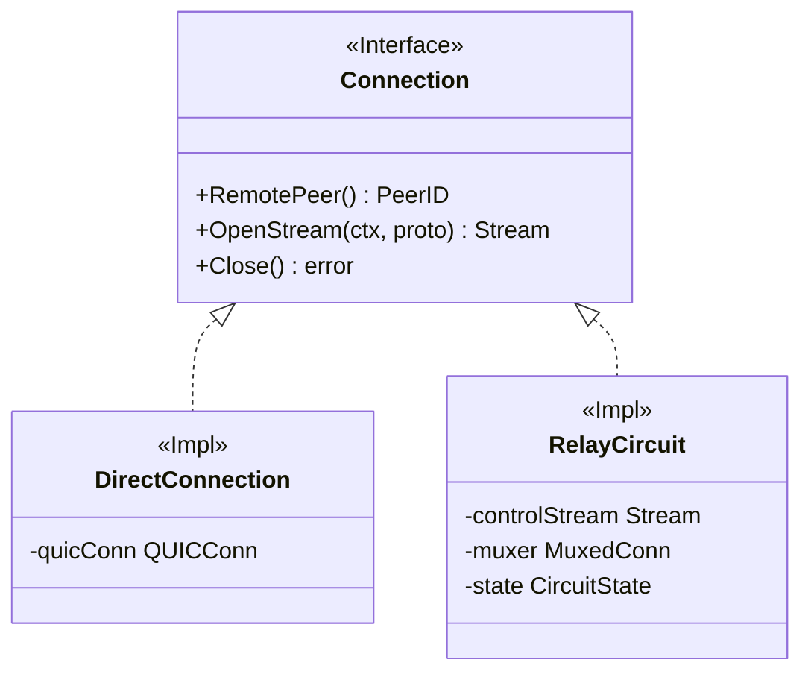

### Swarm 统一管理

```
┌─────────────────────────────────────────────────────────────────────────────────┐
│                    Swarm 连接管理（含 RelayCircuit）                              │
├─────────────────────────────────────────────────────────────────────────────────┤
│                                                                                 │
│  type Swarm struct {                                                            │
│      conns    map[PeerID][]Connection    // 直连 + RelayCircuit                │
│  }                                                                              │
│                                                                                 │
│  ConnsToPeer(peerID) → []Connection                                             │
│    • 返回所有活跃连接（直连 + 中继电路）                                        │
│    • 过滤非 Active 状态的电路                                                   │
│                                                                                 │
│  NewStream(ctx, peerID, proto) → Stream                                         │
│    • 遍历所有连接                                                               │
│    • 优先使用直连                                                               │
│    • 直连失败时回退到 RelayCircuit                                              │
│                                                                                 │
│  关键特性：                                                                      │
│  • RelayCircuit 实现 Connection 接口                                            │
│  • 上层代码无需区分直连或中继                                                   │
│  • 中继电路支持多路复用（yamux Muxer）                                          │
│                                                                                 │
└─────────────────────────────────────────────────────────────────────────────────┘
```

---

## ★ 打洞后 Relay 连接状态模型

### 连接模式

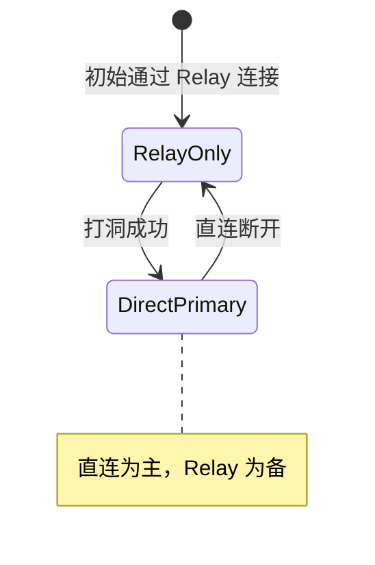

### 连接模式说明

```
┌─────────────────────────────────────────────────────────────────────────────┐
│                    ★ 打洞成功后 Relay 连接策略                                │
├─────────────────────────────────────────────────────────────────────────────┤
│                                                                             │
│  决策：✅ 保留 Relay 连接                                                   │
│                                                                             │
│  连接模式枚举：                                                              │
│  ═══════════════                                                            │
│  • RelayOnly      - 仅通过 Relay 通信（打洞失败/未尝试）                    │
│  • DirectPrimary  - 直连为主，Relay 为备（打洞成功后）                      │
│                                                                             │
│  状态转换：                                                                  │
│  ──────────                                                                 │
│  RelayOnly → [打洞成功] → DirectPrimary + RelayBackup                      │
│                              ↓ [直连断开]                                   │
│                          RelayOnly → [重试打洞]                             │
│                                                                             │
│  理由：                                                                      │
│  ──────                                                                     │
│  1. A-B 打洞成功，但 A-C、A-D... 可能仍需借助 Relay                        │
│  2. Relay 连接用于打洞协调信令通道                                          │
│  3. 直连可能因网络变化断开，Relay 作为 fallback                             │
│  4. 重建 Relay 连接有成本（握手、预留）                                     │
│                                                                             │
└─────────────────────────────────────────────────────────────────────────────┘
```

---

## ★ NAT 类型对连接决策的影响

### NAT 类型打洞决策矩阵

```
┌─────────────────────────────────────────────────────────────────────────────┐
│                    NAT 类型打洞决策矩阵                                       │
├─────────────────────────────────────────────────────────────────────────────┤
│                                                                             │
│  ┌──────────────────────────────────────────────────────────────────────┐   │
│  │  发起方 ╲ 目标方   Full Cone   Restricted   Symmetric                │   │
│  ├──────────────────────────────────────────────────────────────────────┤   │
│  │  Full Cone          直连优先    打洞优先     打洞尝试                 │   │
│  │  Restricted         打洞优先    打洞尝试     Relay                    │   │
│  │  Symmetric          打洞尝试    Relay        Relay ★                 │   │
│  └──────────────────────────────────────────────────────────────────────┘   │
│  ★ 双方都是 Symmetric NAT 时，直接使用 Relay，不浪费时间打洞              │
│                                                                             │
│  决策逻辑：                                                                  │
│  ──────────                                                                 │
│  1. 从地址簿获取目标 NAT 类型                                               │
│  2. 结合本地 NAT 类型查表决策                                               │
│  3. 若任一方为 Unknown，尝试打洞                                            │
│                                                                             │
└─────────────────────────────────────────────────────────────────────────────┘
```

### 打洞信令通道依赖

```
┌─────────────────────────────────────────────────────────────────────────────┐
│                    ★ 打洞需要信令通道（关键约束）                             │
├─────────────────────────────────────────────────────────────────────────────┤
│                                                                             │
│  打洞协调需要双方交换候选地址，这需要一个已建立的通道                       │
│                                                                             │
│  信令通道来源：                                                              │
│  • 已有的 Relay 连接（最常见）                                              │
│  • 已有的直连连接（扩展场景）                                               │
│                                                                             │
│  因此连接流程是：                                                            │
│  ──────────────────                                                         │
│  1. 先通过 Relay 建立连接（获得信令通道）                                   │
│  2. 通过信令通道协调打洞                                                    │
│  3. 打洞成功则升级为直连，保留 Relay 作为备份                               │
│  4. 打洞失败则继续使用 Relay                                                │
│                                                                             │
└─────────────────────────────────────────────────────────────────────────────┘
```

---

## ★ "Connect 成功 = 可通信" 语义保证

```
┌─────────────────────────────────────────────────────────────────────────────┐
│                    Connect 成功的完整语义                                     │
├─────────────────────────────────────────────────────────────────────────────┤
│                                                                             │
│  用户调用 Connect() 返回成功后，必须保证：                                   │
│  ═════════════════════════════════════════════                              │
│                                                                             │
│  1. 传输层就绪                                                              │
│     • QUIC/TCP 握手完成                                                     │
│     • 安全通道建立                                                          │
│                                                                             │
│  2. 协议层就绪                                                              │
│     • 多路复用就绪                                                          │
│     • 可以打开 Stream                                                       │
│                                                                             │
│  3. 认证层就绪（Realm 内）                                                  │
│     • PSK 认证完成                                                          │
│     • 确认为 Realm 成员                                                     │
│                                                                             │
│  避免的问题：                                                                │
│  ──────────────                                                             │
│  ❌ "连接成功但无法通信"                                                    │
│  ❌ "连接成功但认证失败"                                                    │
│  ❌ "连接成功但协议协商失败"                                                │
│                                                                             │
│  这是用户语义保证，避免抽象泄漏                                              │
│                                                                             │
└─────────────────────────────────────────────────────────────────────────────┘
```

---

## 聚合根设计

### Connection 聚合

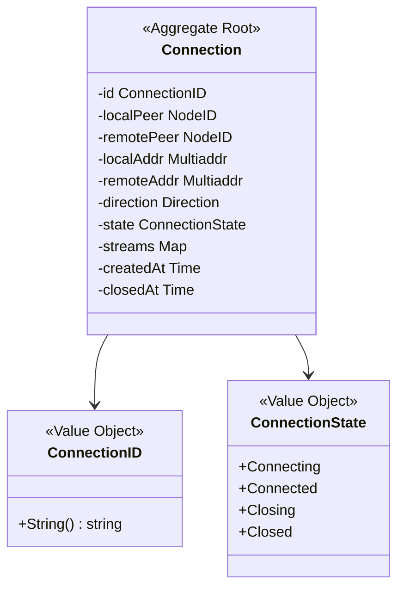

### 聚合边界

```
Connection 聚合包含：
├── Connection（聚合根）
├── Stream（实体，由 Connection 管理）
├── ConnectionID（值对象）
└── ConnectionState（值对象）

不包含：
├── Transport 细节（基础设施）
├── Security 细节（基础设施）
└── Muxer 细节（基础设施）
```

---

## 生命周期状态机

### 状态定义

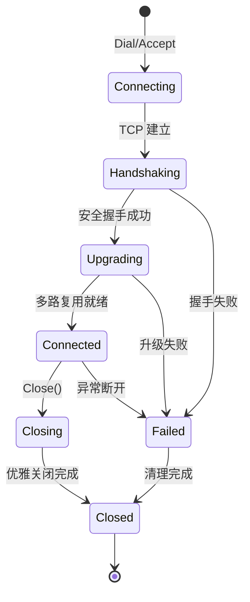

### 状态说明

| 状态 | 说明 | 允许的操作 |
|------|------|-----------|
| Connecting | 正在建立 TCP/UDP 连接 | 取消 |
| Handshaking | 正在进行安全握手 | 取消 |
| Upgrading | 正在升级多路复用 | 取消 |
| Connected | 连接就绪，可通信 | OpenStream, Close |
| Closing | 正在关闭 | 等待 |
| Closed | 已关闭 | 无 |
| Failed | 连接失败 | 无 |

### 状态转换规则

```
// 状态转换矩阵
var validTransitions = map[State][]State{
    Connecting:   {Handshaking, Failed},
    Handshaking:  {Upgrading, Failed},
    Upgrading:    {Connected, Failed},
    Connected:    {Closing, Failed},
    Closing:      {Closed},
    Failed:       {Closed},
}
```

---

## Stream 管理

### Stream 关系

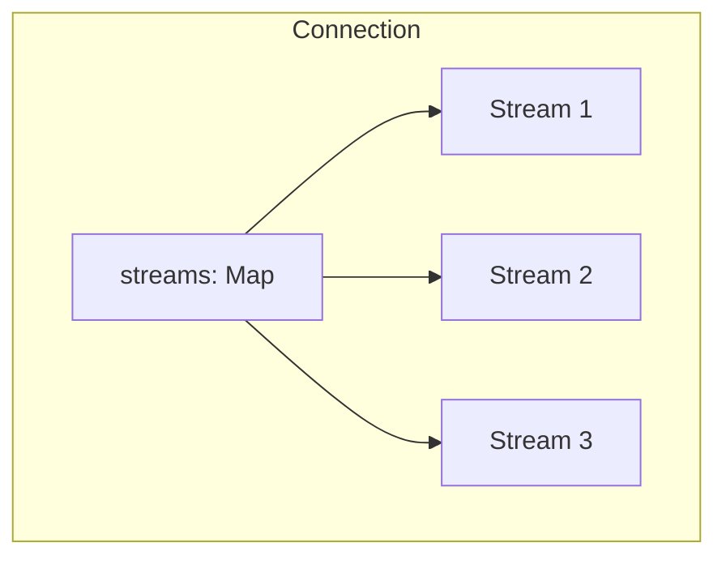

### Stream 生命周期

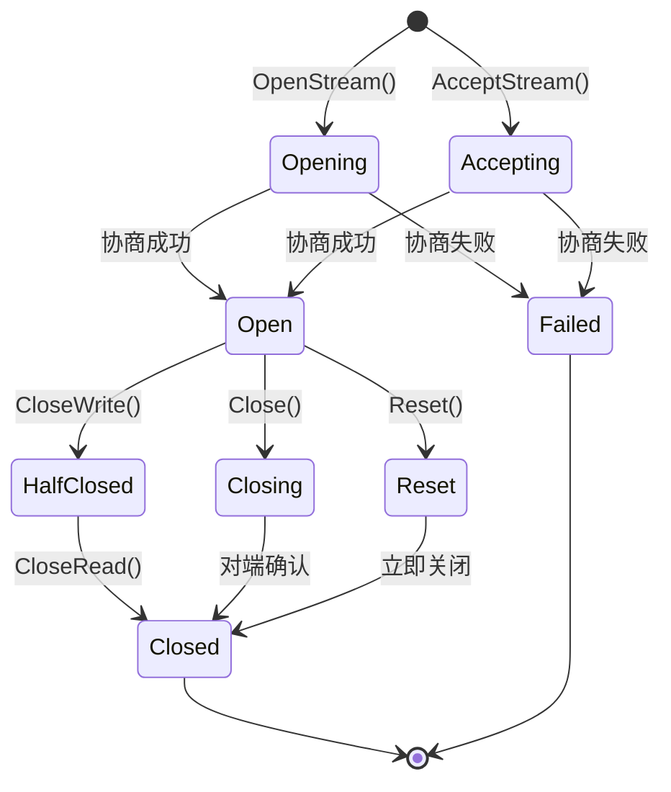

### Stream 容量限制

```
每连接流限制：
• 最大并发流：1024
• 每协议最大流：256
• 流创建速率：100/s
```

---

## 连接池管理

### 连接池结构

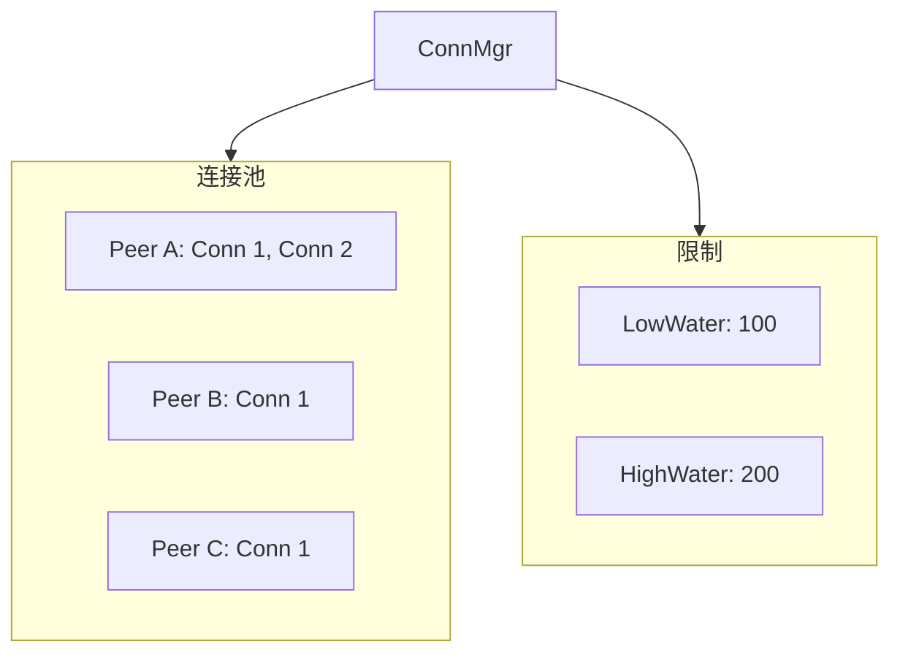

### 水位控制

```
连接数管理：

LowWater = 100   （低水位）
HighWater = 200  （高水位）

当连接数 > HighWater 时：
1. 触发 Trim 操作
2. 按优先级评分排序
3. 回收低分连接直到 <= LowWater
```

### 优先级评分

```
// 连接优先级评分因素
type Score struct {
    Tags      int       // 标签权重
    Direction Direction // 出站优先
    Age       Duration  // 年龄适中
    Streams   int       // 活跃流数
}

// 计算公式
func CalculateScore(conn Connection) int {
    score := 0
    score += conn.Tags.Sum()              // 标签加分
    if conn.Direction == Outbound {
        score += 10                        // 出站加分
    }
    if conn.StreamCount() > 0 {
        score += 20                        // 活跃加分
    }
    return score
}
```

---

## 连接保护

### 保护机制

```
// 保护连接不被回收
func (m *ConnMgr) Protect(peer NodeID, tag string) {
    // 添加保护标签
    // 带保护标签的连接不会被 Trim
}

// 取消保护
func (m *ConnMgr) Unprotect(peer NodeID, tag string) bool {
    // 移除保护标签
    // 返回是否还有其他保护
}
```

### 保护场景

| 场景 | 保护标签 | 说明 |
|------|----------|------|
| DHT 路由表 | `dht-routing` | K-bucket 中的节点 |
| Realm 成员 | `realm-member` | 同 Realm 成员 |
| 中继连接 | `relay-active` | 活跃中继 |
| 应用层 | 自定义 | 应用指定保护 |

---

## 连接门控

### Gater 接口

```
// 连接门控决策点
type Gater interface {
    // 是否允许拨号
    InterceptPeerDial(peer NodeID) bool
    
    // 是否允许拨号到特定地址
    InterceptAddrDial(peer NodeID, addr Multiaddr) bool
    
    // 是否接受入站连接
    InterceptAccept(conn net.Conn) bool
    
    // 握手后是否继续
    InterceptSecured(dir Direction, peer NodeID) bool
}
```

### 门控场景

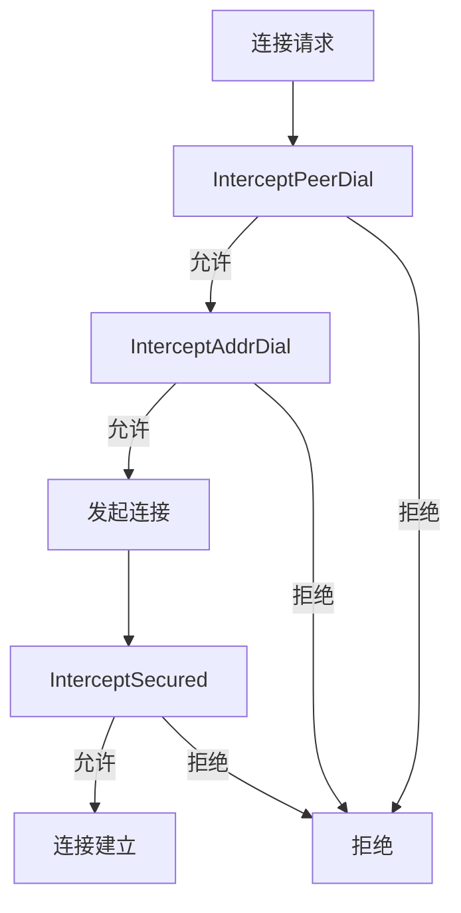

---

## 连接不变量

| ID | 不变量 | 验证点 |
|----|--------|--------|
| CONN-INV-001 | RemotePeer 握手后不可变 | 状态转换 |
| CONN-INV-002 | Stream 属于单一 Connection | Stream 创建 |
| CONN-INV-003 | 连接关闭时 Stream 全部关闭 | Close() |
| CONN-INV-004 | 保护的连接不被回收 | Trim() |

---

## 错误处理

### 连接错误

| 错误 | 原因 | 处理 |
|------|------|------|
| ErrConnectionClosed | 连接已关闭 | 重建连接 |
| ErrConnectionFailed | 连接失败 | 重试或放弃 |
| ErrPeerMismatch | NodeID 不匹配 | 拒绝连接 |
| ErrTooManyStreams | 流数超限 | 等待或关闭旧流 |

### 流错误

| 错误 | 原因 | 处理 |
|------|------|------|
| ErrStreamReset | 流被重置 | 重新打开 |
| ErrStreamClosed | 流已关闭 | 处理完成 |
| ErrProtocolNotSupported | 协议不支持 | 检查协议 |

---

## 抖动容忍 (JitterTolerance)

### 概述

网络抖动是移动网络的常态。JitterTolerance 机制确保短暂的网络波动不会导致连接状态的频繁变化。

```
┌─────────────────────────────────────────────────────────────────────────────┐
│                      JitterTolerance 核心特性                                │
├─────────────────────────────────────────────────────────────────────────────┤
│                                                                             │
│  • 容错窗口：断连后 5 秒内不触发重连                                          │
│  • 状态保持：断连后保持节点状态 30 秒                                         │
│  • 指数退避：1s → 2s → 4s → ... → 60s                                       │
│  • 最大重试：超过 5 次后放弃                                                 │
│                                                                             │
└─────────────────────────────────────────────────────────────────────────────┘
```

### 断连节点状态

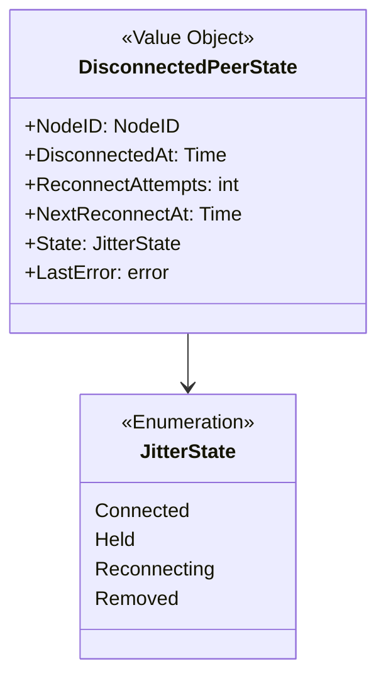

### 与连接池的集成

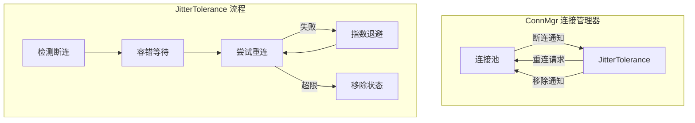

### 配置参数

| 参数 | 默认值 | 说明 |
|------|--------|------|
| `ToleranceWindow` | 5s | 断连后的容错窗口（Grace Period） |
| `StateHoldTime` | 30s | 状态保持时间 |
| `InitialReconnectDelay` | 1s | 初始重连延迟 |
| `MaxReconnectDelay` | 60s | 最大重连延迟 |
| `MaxReconnectAttempts` | 5 | 最大重连次数 |
| `BackoffMultiplier` | 2.0 | 退避乘数 |
| `JitterFactor` | ±20% | ★ 抖动因子，避免重连风暴 |

### 重连序列示例

```
实际间隔 = min(InitialDelay × Multiplier^attempt, MaxDelay) × (1 ± JitterFactor)

第 1 次：1s   × (1 ± 0.2) = 0.8s ~ 1.2s
第 2 次：2s   × (1 ± 0.2) = 1.6s ~ 2.4s
第 3 次：4s   × (1 ± 0.2) = 3.2s ~ 4.8s
第 4 次：8s   × (1 ± 0.2) = 6.4s ~ 9.6s
第 5 次：16s  × (1 ± 0.2) = 12.8s ~ 19.2s
（超过 MaxReconnectAttempts=5 后放弃）
```

### 使用场景

| 场景 | JitterTolerance 行为 |
|------|---------------------|
| 短暂信号丢失（< 5s） | 在 ToleranceWindow 内自动恢复 |
| 网络切换（4G→WiFi） | 触发重连，配合 NetworkMonitor |
| 长时间断网（> 30s） | StateHoldTime 超时，移除状态 |
| 节点永久下线 | MaxReconnectAttempts 后放弃 |

---

## 网络变化处理

### NetworkMonitor 集成

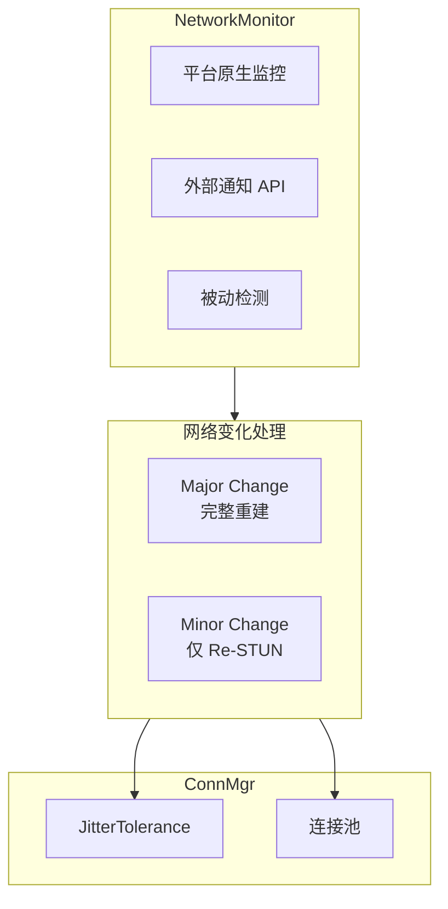

### Major Change 时的连接处理

```
Major Change 连接处理：

  1. Socket Rebind
     - 关闭旧 Socket
     - 绑定新接口
     
  2. 关闭失效连接
     - 检查连接的本地地址
     - 地址不在新接口上的连接标记为断开
     
  3. 触发 JitterTolerance
     - 断开的连接进入 Held 状态
     - 等待 ToleranceWindow 后重连
     
  4. 更新地址广播
     - Re-STUN 获取新外部地址
     - 更新 DHT 发布
     - 通知 Realm 成员
```

---

## 连接保活 (Connection Keep-Alive)

### 概述

QUIC 连接在空闲时会自动断开。为保持长连接，需要配置多层保活机制。

```
┌─────────────────────────────────────────────────────────────────────────────┐
│                          连接保活策略层次                                     │
├─────────────────────────────────────────────────────────────────────────────┤
│                                                                             │
│  Layer 1: QUIC 传输层保活 (KeepAlivePeriod) ★ 必需                          │
│  ═════════════════════════════════════════════                              │
│  • QUIC 自动发送 PING 帧防止连接超时                                         │
│  • 配置: MaxIdleTimeout / 2                                                 │
│  • 位置: internal/core/transport/quic/transport.go                          │
│                                                                             │
│  Layer 2: Liveness 心跳服务 (HeartbeatInterval) 可选                         │
│  ═════════════════════════════════════════════════                          │
│  • 应用层定期 Ping 检测节点健康                                              │
│  • 协议: /dep2p/app/<realmID>/liveness/ping/1.0.0                          │
│  • 位置: internal/protocol/liveness/service.go                              │
│                                                                             │
│  Layer 3: GossipSub 心跳 (gossipsub heartbeat)                              │
│  ═════════════════════════════════════════════                              │
│  • Mesh 成员间的控制消息                                                    │
│  • 间隔: 1 秒                                                               │
│  • 位置: internal/protocol/pubsub/gossipsub.go                              │
│                                                                             │
└─────────────────────────────────────────────────────────────────────────────┘
```

### QUIC 保活配置

| 参数 | 默认值 | 说明 |
|------|--------|------|
| `MaxIdleTimeout` | 30s | 空闲超时，超过后连接关闭 |
| `KeepAlivePeriod` | 15s | 保活间隔，自动发送 PING 帧 |

> **⚠️ 关键**：`KeepAlivePeriod` 是**必需**配置。如果未设置，连接会在
> `MaxIdleTimeout` 后断开，导致节点间通信中断。
>

### 预设配置建议

| 预设 | MaxIdleTimeout | KeepAlivePeriod | 适用场景 |
|------|----------------|-----------------|----------|
| Mobile | 2 分钟 | 60 秒 | 省电优先，移动设备 |
| Desktop | 5 分钟 | 2 分钟 | 平衡，桌面应用 |
| Server | 10 分钟 | 5 分钟 | 稳定性优先，服务器 |
| Test | 30 秒 | 15 秒 | 快速检测，测试环境 |

### 保活不变量

| ID | 不变量 | 验证点 |
|----|--------|--------|
| CONN-INV-020 | QUIC 必须配置 KeepAlivePeriod | Transport 创建 |
| CONN-INV-021 | KeepAlivePeriod < MaxIdleTimeout | 配置验证 |
| CONN-INV-022 | 保活失败触发重连而非直接移除 | 断连处理 |

---

## 相关文档

| 文档 | 说明 |
|------|------|
| [README.md](README.md) | 连接领域概述 |
| [../../L3_behavioral/connection_flow.md](../../L3_behavioral/connection_flow.md) | 连接流程（含"仅 ID 连接"边界） |
| [../../L3_behavioral/state_machines.md](../../L3_behavioral/state_machines.md) | 状态机（含 RelayCircuit 状态机） |
| [../relay/relay_model.md](../relay/relay_model.md) | Relay 模型（地址簿、RelayCircuit） |
| [ADR-0006](../../../../01_context/decisions/ADR-0006-quic-transport.md) | QUIC 传输选择 |
| [ADR-0011](../../../../01_context/decisions/ADR-0011-relay-circuit-muxer.md) | ★ 中继电路多路复用架构 |

---

**最后更新**：2026-01-27（新增 RelayCircuit 与 Connection 的关系）
