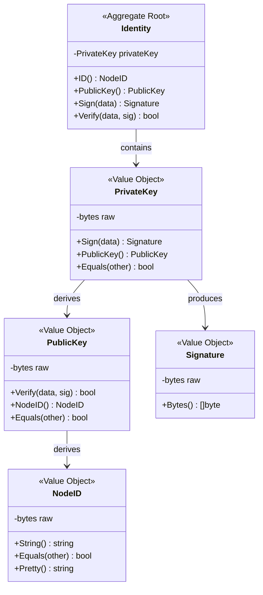
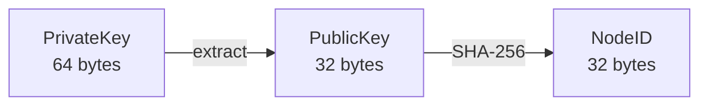
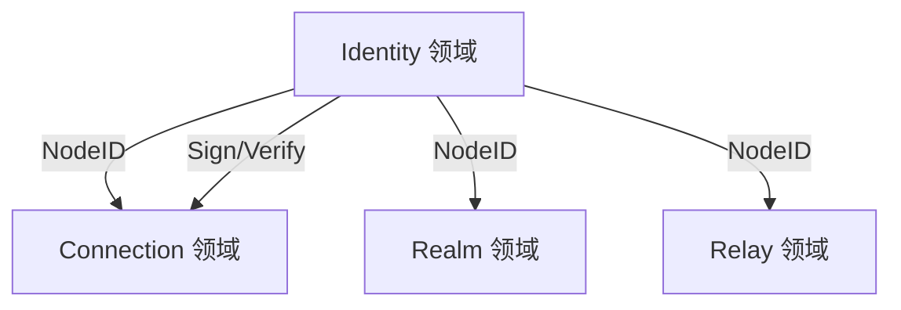

# 身份领域 (Identity Domain)

> 定义 DeP2P 的密码学身份模型

---

## 领域边界

```
┌─────────────────────────────────────────────────────────────────────────────┐
│                          身份领域边界                                         │
├─────────────────────────────────────────────────────────────────────────────┤
│                                                                             │
│  核心职责：                                                                  │
│  • 密钥对生成与管理                                                          │
│  • 节点标识派生                                                              │
│  • 签名与验证                                                                │
│                                                                             │
│  领域内实体：                                                                │
│  • Identity（聚合根）                                                        │
│  • PrivateKey、PublicKey、NodeID（值对象）                                   │
│                                                                             │
│  领域边界：                                                                  │
│  • 不涉及网络通信                                                            │
│  • 不涉及持久化（交给基础设施层）                                             │
│  • 只负责密码学运算                                                          │
│                                                                             │
└─────────────────────────────────────────────────────────────────────────────┘
```

---

## 领域模型



---

## 核心实体

### Identity（聚合根）

Identity 是身份领域的聚合根，封装完整的密钥对。

```
┌─────────────────────────────────────────────────────────────────┐
│  Identity - 聚合根                                               │
├─────────────────────────────────────────────────────────────────┤
│                                                                 │
│  不变量：                                                        │
│  • privateKey 不可变                                             │
│  • NodeID 由 PublicKey 唯一派生                                  │
│                                                                 │
│  核心方法：                                                       │
│  • ID() NodeID           - 获取节点标识                         │
│  • PublicKey() PublicKey - 获取公钥                             │
│  • Sign(data) Signature  - 签名数据                             │
│  • Verify(data, sig)     - 验证签名                             │
│                                                                 │
│  工厂方法：                                                       │
│  • Generate()            - 生成新身份                           │
│  • FromPrivateKey(key)   - 从私钥恢复                           │
│  • FromBytes(raw)        - 从字节恢复                           │
│                                                                 │
└─────────────────────────────────────────────────────────────────┘
```

### PrivateKey（值对象）

私钥用于签名操作，必须安全存储。

| 属性 | 说明 |
|------|------|
| 算法 | Ed25519 |
| 长度 | 64 字节（含公钥） |
| 安全 | 不可序列化到日志 |

### PublicKey（值对象）

公钥用于验证签名和派生 NodeID。

| 属性 | 说明 |
|------|------|
| 算法 | Ed25519 |
| 长度 | 32 字节 |
| 用途 | 验证签名、派生 NodeID |

### NodeID（值对象）

NodeID 是节点的全局唯一标识，详见 [nodeid_model.md](nodeid_model.md)。

---

## 派生关系



### 派生规则

```
PrivateKey (Ed25519, 64 bytes)
    │
    │ 提取后 32 字节
    ▼
PublicKey (32 bytes)
    │
    │ SHA-256 哈希
    ▼
NodeID (32 bytes)
    │
    │ Base58 编码
    ▼
String (可读形式)
```

---

## 领域不变量

| ID | 不变量 | 说明 |
|----|--------|------|
| ID-INV-001 | 私钥不可变 | Identity 创建后私钥不可修改 |
| ID-INV-002 | 派生确定性 | 相同私钥始终派生相同 NodeID |
| ID-INV-003 | 签名唯一性 | 相同数据 + 相同私钥 = 相同签名 |

---

## 与其他领域的关系



| 关系 | 说明 |
|------|------|
| → Connection | 提供 NodeID 用于连接验证 (INV-001) |
| → Realm | 提供 NodeID 用于成员标识 |
| → Relay | 提供 NodeID 用于中继寻址 |

---

## 领域事件

| 事件 | 触发条件 | 载荷 |
|------|----------|------|
| IdentityCreated | 新身份生成 | NodeID |
| IdentityLoaded | 身份从存储加载 | NodeID |

---

## 相关文档

| 文档 | 说明 |
|------|------|
| [nodeid_model.md](nodeid_model.md) | NodeID 模型详解 |
| [../README.md](../README.md) | L5 领域模型概述 |
| [../../L1_overview/abstractions.md](../../L1_overview/abstractions.md) | 身份对象层抽象 |

---

**最后更新**：2026-01-13
