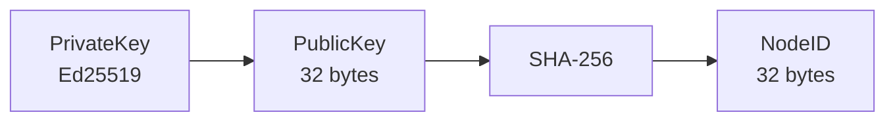
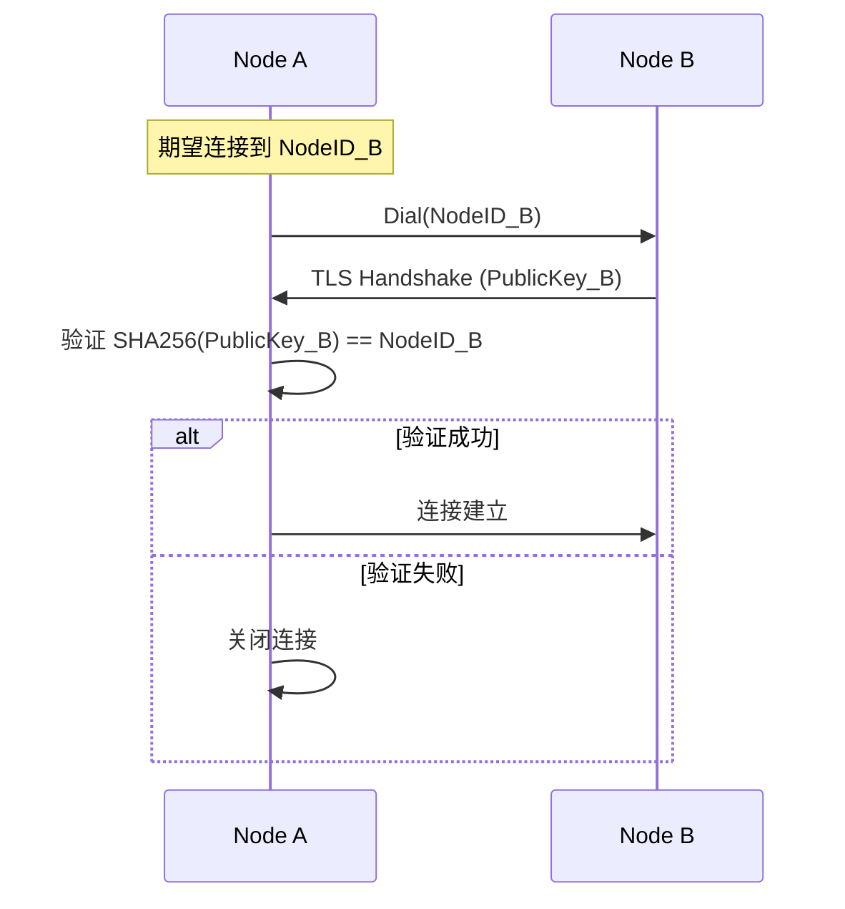
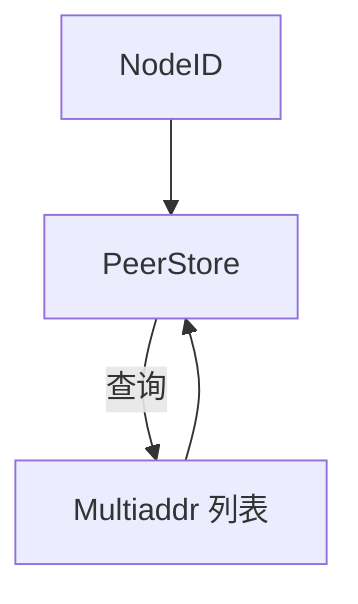

# NodeID 模型 (NodeID Model)

> 节点唯一标识的设计与实现

---

## 概述

NodeID 是 DeP2P 中节点的全局唯一标识符，由公钥派生，具有密码学保证的唯一性。

```
┌─────────────────────────────────────────────────────────────────────────────┐
│                          NodeID 特性                                         │
├─────────────────────────────────────────────────────────────────────────────┤
│                                                                             │
│  • 全局唯一：密码学保证                                                       │
│  • 不可伪造：必须持有对应私钥                                                  │
│  • 可验证：可通过公钥验证                                                     │
│  • 稳定性：同一私钥永远派生相同 NodeID                                         │
│                                                                             │
└─────────────────────────────────────────────────────────────────────────────┘
```

---

## 派生算法

### 计算流程



### 算法详解

```
输入：Ed25519 PublicKey (32 bytes)
输出：NodeID (32 bytes)

步骤：
1. raw = PublicKey.Bytes()         // 32 字节公钥
2. hash = SHA256(raw)              // 32 字节哈希
3. NodeID = hash                   // 直接使用哈希

伪代码：
func DeriveNodeID(pubKey PublicKey) NodeID {
    return NodeID(sha256.Sum256(pubKey.Bytes()))
}
```

### 选择 SHA-256 的理由

| 因素 | 说明 |
|------|------|
| 安全性 | 256 位抗碰撞强度 |
| 性能 | 硬件加速广泛支持 |
| 兼容性 | 与 libp2p 保持一致 |
| 长度 | 32 字节适合 DHT 路由 |

---

## 编码规范

### 二进制表示

```
NodeID 内部表示：

┌────────────────────────────────────────────────────────────────┐
│                        32 bytes (256 bits)                      │
├────────────────────────────────────────────────────────────────┤
│ 0x12 0xD3 0x... ... ... ... ... ... ... ... ... ... ... 0xAB   │
└────────────────────────────────────────────────────────────────┘
```

### 字符串编码

| 格式 | 用途 | 示例 |
|------|------|------|
| Base58 | 显示、日志 | `QmYwAPJzv5CZsnA625s3Xf2nemtYgPpHdWEz79ojWnPbdG` |
| Hex | 调试 | `12d3a4...` |
| Bytes | 内部传输 | `[]byte{0x12, 0xd3, ...}` |

### Base58 编码

```
特点：
• 避免混淆字符：0, O, I, l
• URL 安全
• 可读性好
• 长度：约 44 字符

编码过程：
1. 取 NodeID 原始字节
2. 添加 multihash 前缀（0x12 = SHA256, 0x20 = 32 bytes）
3. Base58btc 编码
```

---

## 值对象语义

NodeID 是不可变值对象，满足以下特性：

### 不可变性

```
// NodeID 创建后不可修改
type NodeID struct {
    raw [32]byte  // 不可变
}

// 不提供 setter 方法
// 只能通过构造函数创建
```

### 相等性

```
// 值相等而非引用相等
func (n NodeID) Equals(other NodeID) bool {
    return bytes.Equal(n.raw[:], other.raw[:])
}

// 支持作为 map key
var peers = make(map[NodeID]PeerInfo)
```

### 哈希性

```
// 实现 hash 接口，支持 map/set
func (n NodeID) Hash() uint64 {
    // 取前 8 字节作为 hash
    return binary.BigEndian.Uint64(n.raw[:8])
}
```

---

## 系统用途

### INV-001 验证

NodeID 是 INV-001（身份第一性）的核心：



### DHT 路由

```
NodeID 在 Kademlia DHT 中的用途：

1. 节点定位
   • XOR 距离计算
   • K-bucket 分配
   
2. 内容寻址
   • Key = SHA256(content)
   • 存储到 XOR 距离最近的节点

3. 路由表
   • 按 XOR 距离组织
   • 每个 bucket 存储 K 个节点
```

### 地址关联



---

## 操作接口

### 构造方法

```
// 从公钥派生
func FromPublicKey(pub PublicKey) NodeID

// 从字节恢复
func FromBytes(raw []byte) (NodeID, error)

// 从 Base58 字符串解析
func FromString(s string) (NodeID, error)
```

### 转换方法

```
// 转为字节
func (n NodeID) Bytes() []byte

// 转为 Base58 字符串（完整）
func (n NodeID) String() string

// 转为短字符串（显示用）
func (n NodeID) Pretty() string  // 返回前 6 + 后 6 字符

// 转为 Hex
func (n NodeID) Hex() string
```

### 比较方法

```
// 相等比较
func (n NodeID) Equals(other NodeID) bool

// XOR 距离（用于 DHT）
func (n NodeID) XOR(other NodeID) NodeID

// 距离比较
func (n NodeID) Closer(a, b NodeID) bool
```

---

## 安全考虑

### 碰撞抵抗

```
SHA-256 提供 128 位碰撞抵抗强度

攻击成本估算：
• 需要 2^128 次哈希运算
• 以 10^18 hash/s 计算
• 需要 10^20 年

结论：实际上不可能发生碰撞
```

### 公钥隐私

```
NodeID 是公钥的哈希，不泄露公钥本身

但注意：
• 连接握手时会交换公钥
• 公钥一旦暴露，NodeID 可被关联
• 这是设计预期，不是隐私泄露
```

---

## 与 libp2p 的兼容性

### 格式兼容

```
libp2p PeerID 格式：
• multihash 编码
• 支持多种哈希算法

DeP2P NodeID 格式：
• 固定 SHA-256
• 简化处理
• 与 libp2p 互操作时需转换
```

### 转换接口

```
// 转为 libp2p 兼容格式
func (n NodeID) ToLibp2pPeerID() peer.ID

// 从 libp2p 格式转换
func FromLibp2pPeerID(id peer.ID) (NodeID, error)
```

---

## 相关文档

| 文档 | 说明 |
|------|------|
| [README.md](README.md) | 身份领域概述 |
| [../../L1_overview/invariants.md](../../L1_overview/invariants.md) | INV-001 身份第一性 |
| [../../L4_interfaces/public_interfaces.md](../../L4_interfaces/public_interfaces.md) | 接口定义 |

---

**最后更新**：2026-01-13
