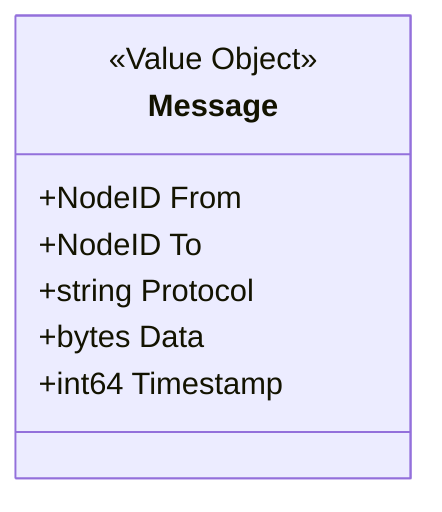
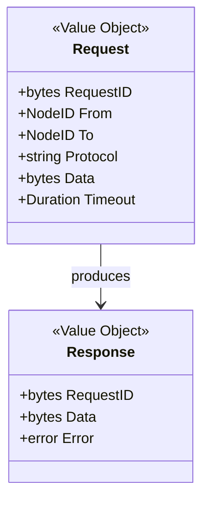

# Messaging 领域

> 点对点消息传递的领域模型设计

---

## 概述

Messaging 领域定义 DeP2P 的点对点消息传递模型，包括消息生命周期、传递语义和错误处理。

```
┌─────────────────────────────────────────────────────────────────────────────┐
│                          Messaging 领域概述                                   │
├─────────────────────────────────────────────────────────────────────────────┤
│                                                                             │
│  核心概念：                                                                  │
│  • Message       - 消息实体                                                 │
│  • Request       - 请求-响应模式                                            │
│  • Handler       - 消息处理器                                               │
│  • Protocol      - 协议标识                                                 │
│                                                                             │
│  特性：                                                                      │
│  • 点对点：一对一消息传递                                                    │
│  • 可靠性：基于流的可靠传输                                                  │
│  • 双模式：单向 Send + 请求响应 Request                                     │
│                                                                             │
└─────────────────────────────────────────────────────────────────────────────┘
```

---

## 领域边界

### 聚合边界

```
Messaging 聚合包含：
├── Message（值对象）       - 消息数据
├── Request（值对象）       - 请求数据
├── Response（值对象）      - 响应数据
├── Handler（实体）         - 注册的处理器
└── ProtocolID（值对象）    - 协议标识

不包含：
├── 底层流管理（属于 Core Layer）
├── 成员验证（属于 Realm Layer）
└── 消息持久化（不在范围内）
```

---

## 核心概念

### Message 消息



| 属性 | 类型 | 说明 |
|------|------|------|
| `From` | `NodeID` | 发送者节点 ID |
| `To` | `NodeID` | 接收者节点 ID |
| `Protocol` | `string` | 协议标识 |
| `Data` | `[]byte` | 消息数据 |
| `Timestamp` | `int64` | 发送时间戳 |

### Request/Response 请求响应



---

## 传递语义

### 单向消息 (Send)

```
语义：At-most-once（最多一次）

  • 发送后立即返回
  • 不保证送达
  • 适用场景：通知、心跳

流程：
  1. 打开到目标节点的流
  2. 写入消息数据
  3. 关闭流
  4. 返回（不等待确认）
```

### 请求响应 (Request)

```
语义：Exactly-once attempt（恰好尝试一次）

  • 发送请求，等待响应
  • 超时返回错误
  • 适用场景：RPC、查询

流程：
  1. 打开到目标节点的流
  2. 写入请求数据
  3. 等待响应
  4. 读取响应数据
  5. 关闭流
```

---

## 协议命名空间

```
Messaging 协议命名空间：

  /dep2p/app/<realmID>/msg/1.0.0      - 默认消息协议
  /dep2p/app/<realmID>/<custom>       - 自定义协议
```

---

## 相关文档

| 文档 | 说明 |
|------|------|
| [messaging_model.md](messaging_model.md) | 消息模型详解 |
| [../../L3_behavioral/messaging_flow.md](../../L3_behavioral/messaging_flow.md) | 消息流程 |
| [../../L4_interfaces/public_interfaces.md](../../L4_interfaces/public_interfaces.md) | 公共接口 |

---

**最后更新**：2026-01-13
