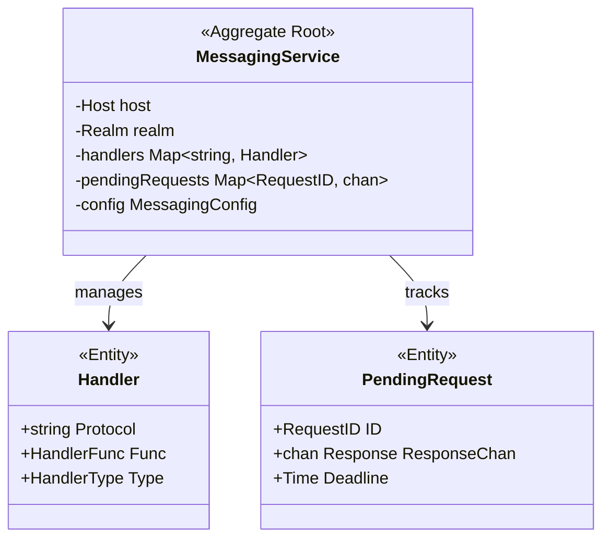
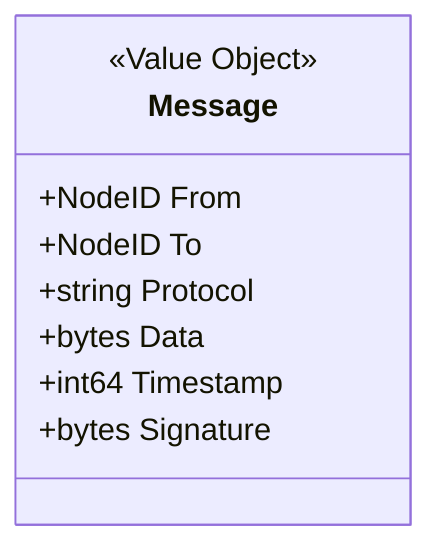
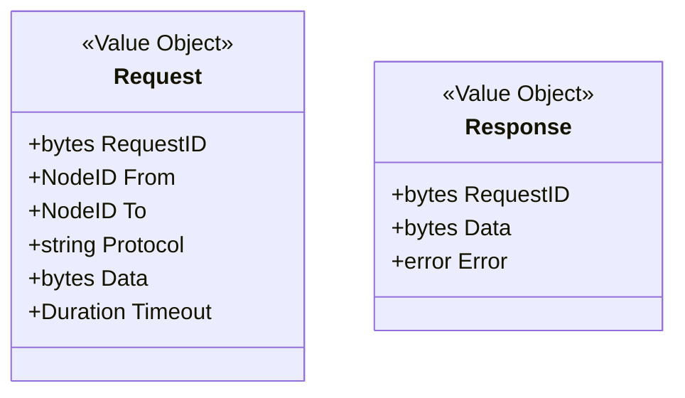
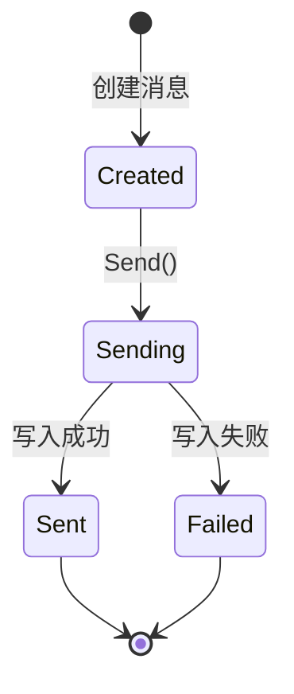
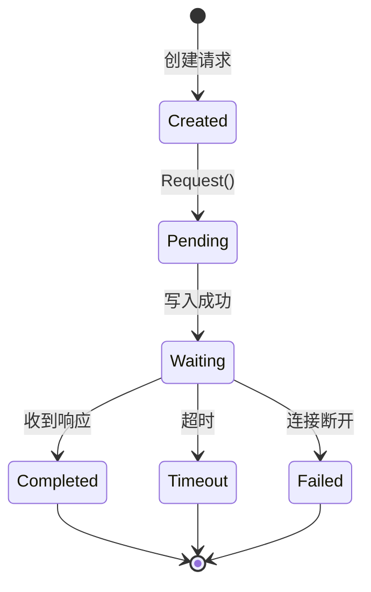
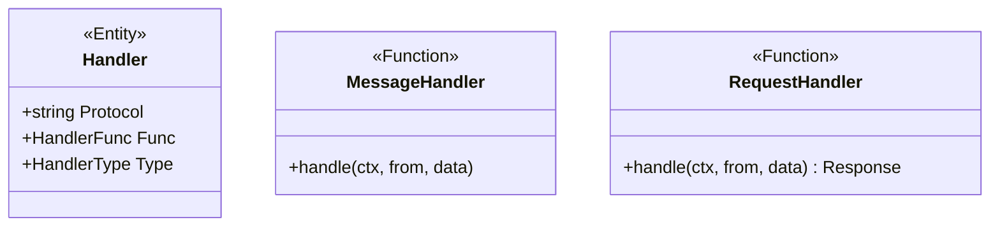
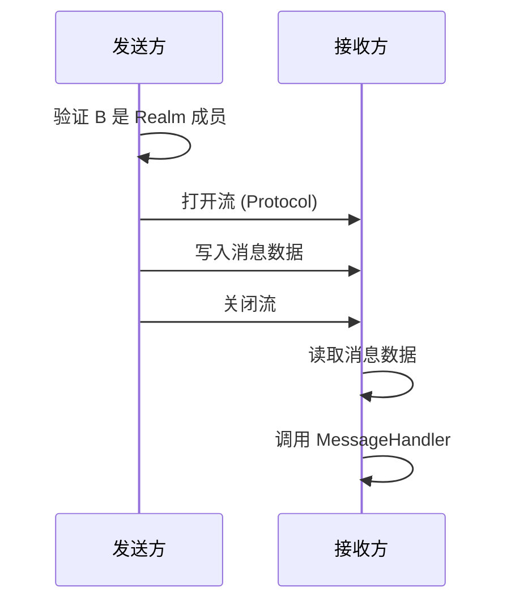
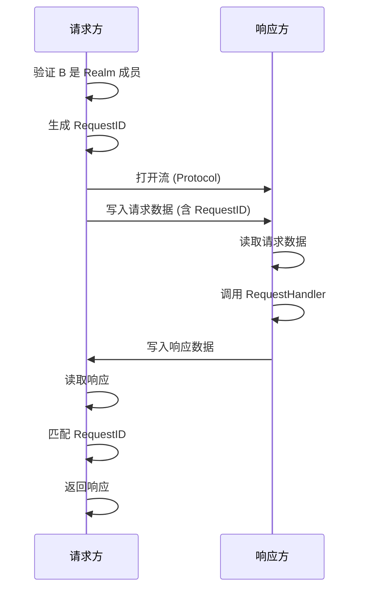

# Messaging 模型 (Messaging Model)

> 点对点消息的生命周期、传递语义与一致性规则

---

## 概述

Messaging 是 DeP2P 的点对点消息传递服务，提供单向消息和请求-响应两种模式。

```
┌─────────────────────────────────────────────────────────────────────────────┐
│                          Messaging 核心特性                                   │
├─────────────────────────────────────────────────────────────────────────────┤
│                                                                             │
│  • 点对点通信：直接在两个节点间传递消息                                       │
│  • 双模式：Send（单向）+ Request（请求响应）                                 │
│  • 协议分离：通过 Protocol ID 区分不同类型消息                               │
│  • Realm 隔离：必须在同一 Realm 内才能通信 (INV-002)                         │
│                                                                             │
└─────────────────────────────────────────────────────────────────────────────┘
```

---

## 聚合根设计

### MessagingService 聚合



### 聚合边界

```
MessagingService 聚合包含：
├── MessagingService（聚合根）
├── Handler（实体）           - 注册的消息处理器
├── PendingRequest（实体）    - 等待响应的请求
├── Message（值对象）         - 消息数据
├── Request（值对象）         - 请求数据
├── Response（值对象）        - 响应数据
└── MessagingConfig（值对象） - 配置参数

不包含：
├── Stream 管理（属于 Host）
├── 连接管理（属于 ConnMgr）
└── 成员验证（属于 Realm）
```

---

## 消息模型

### Message 值对象



### 消息结构

```
┌─────────────────────────────────────────────────────────────────────────────┐
│                          Message 结构                                        │
├─────────────────────────────────────────────────────────────────────────────┤
│                                                                             │
│  字段：                                                                      │
│  • From        NodeID    发送者 ID                                          │
│  • To          NodeID    接收者 ID                                          │
│  • Protocol    string    协议标识 (如 "/dep2p/app/{realm}/msg/1.0.0")       │
│  • Data        []byte    消息数据（应用层负责序列化）                         │
│  • Timestamp   int64     发送时间戳（Unix 毫秒）                             │
│  • Signature   []byte    可选签名                                           │
│                                                                             │
│  大小限制：                                                                  │
│  • 默认最大消息大小：1 MB                                                   │
│  • 可通过配置调整                                                            │
│                                                                             │
└─────────────────────────────────────────────────────────────────────────────┘
```

---

## 请求响应模型

### Request 值对象



### 请求 ID 生成

```
RequestID 生成规则：

  RequestID = random(16 bytes)

属性：
  • 长度：16 字节
  • 编码：Base58（显示时）
  • 唯一性：随机保证
```

---

## 生命周期

### 单向消息生命周期



### 请求响应生命周期



---

## 处理器模型

### Handler 实体



### 处理器类型

```
┌─────────────────────────────────────────────────────────────────────────────┐
│                          Handler 类型                                        │
├─────────────────────────────────────────────────────────────────────────────┤
│                                                                             │
│  MessageHandler（单向消息处理器）                                            │
│  ─────────────────────────────                                              │
│  • 签名：func(ctx, from NodeID, data []byte)                                │
│  • 无返回值                                                                  │
│  • 适用于：通知、事件                                                        │
│                                                                             │
│  RequestHandler（请求处理器）                                                 │
│  ────────────────────────────                                               │
│  • 签名：func(ctx, from NodeID, data []byte) ([]byte, error)                │
│  • 返回响应数据或错误                                                        │
│  • 适用于：RPC、查询                                                         │
│                                                                             │
└─────────────────────────────────────────────────────────────────────────────┘
```

---

## 协议流程

### Send 流程



### Request 流程



---

## 配置模型

### MessagingConfig

```
┌─────────────────────────────────────────────────────────────────────────────┐
│                          MessagingConfig                                     │
├─────────────────────────────────────────────────────────────────────────────┤
│                                                                             │
│  参数：                                                                      │
│  • MaxMessageSize     int64       最大消息大小（默认 1 MB）                  │
│  • RequestTimeout     Duration    请求超时（默认 30s）                       │
│  • MaxPendingRequests int         最大等待请求数（默认 1000）                │
│  • RetryAttempts      int         重试次数（默认 0，不重试）                 │
│                                                                             │
└─────────────────────────────────────────────────────────────────────────────┘
```

---

## 一致性规则

### Messaging 不变量

| ID | 不变量 | 验证点 |
|----|--------|--------|
| MSG-INV-001 | 消息只能发送给 Realm 成员 | Send/Request 入口 |
| MSG-INV-002 | 请求必须有唯一 RequestID | Request 创建时 |
| MSG-INV-003 | 处理器必须在使用前注册 | OnMessage/OnRequest |
| MSG-INV-004 | 超时请求必须清理资源 | 超时处理 |

### 一致性边界

```
┌─────────────────────────────────────────────────────────────────────────────┐
│                          一致性边界                                          │
├─────────────────────────────────────────────────────────────────────────────┤
│                                                                             │
│  强一致性（本地）：                                                           │
│  • 处理器注册表                                                              │
│  • 等待请求表                                                                │
│                                                                             │
│  最终一致性：                                                                │
│  • 不适用（点对点，无复制）                                                   │
│                                                                             │
│  传递保证：                                                                  │
│  • Send: At-most-once（可能丢失）                                           │
│  • Request: Exactly-once-attempt（精确尝试一次）                            │
│                                                                             │
└─────────────────────────────────────────────────────────────────────────────┘
```

---

## 错误处理

### 错误类型

| 错误 | 原因 | 处理 |
|------|------|------|
| ErrNotMember | 目标不是 Realm 成员 | 不发送，返回错误 |
| ErrConnectionFailed | 无法连接到目标 | 返回错误 |
| ErrTimeout | 请求超时 | 清理资源，返回错误 |
| ErrNoHandler | 没有对应协议的处理器 | 返回错误 |
| ErrMessageTooLarge | 消息超过大小限制 | 返回错误 |

---

## 相关文档

| 文档 | 说明 |
|------|------|
| [README.md](README.md) | Messaging 领域概述 |
| [../../L3_behavioral/messaging_flow.md](../../L3_behavioral/messaging_flow.md) | 消息流程 |
| [../../L4_interfaces/public_interfaces.md](../../L4_interfaces/public_interfaces.md) | 公共接口 |
| [../realm/realm_model.md](../realm/realm_model.md) | Realm 模型 |

---

**最后更新**：2026-01-13
