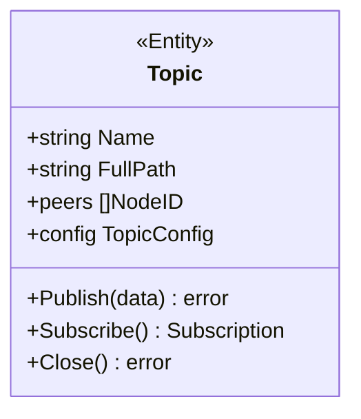
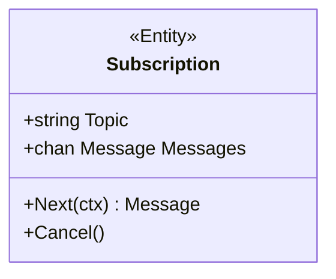

# PubSub 领域

> 发布订阅的领域模型设计

---

## 概述

PubSub 领域定义 DeP2P 的发布订阅模型，基于 GossipSub 协议实现高效的多播消息传递。

```
┌─────────────────────────────────────────────────────────────────────────────┐
│                          PubSub 领域概述                                      │
├─────────────────────────────────────────────────────────────────────────────┤
│                                                                             │
│  核心概念：                                                                  │
│  • Topic         - 主题（消息通道）                                          │
│  • Subscription  - 订阅句柄                                                 │
│  • Message       - 发布的消息                                               │
│  • Mesh          - GossipSub 网格                                           │
│                                                                             │
│  特性：                                                                      │
│  • 多播：一对多消息传递                                                      │
│  • Gossip 协议：高效的消息扩散                                               │
│  • 主题隔离：按主题组织订阅者                                                │
│                                                                             │
└─────────────────────────────────────────────────────────────────────────────┘
```

---

## 领域边界

### 聚合边界

```
PubSub 聚合包含：
├── PubSubService（聚合根） - 发布订阅服务
├── Topic（实体）           - 主题
├── Subscription（实体）    - 订阅句柄
├── Message（值对象）       - 消息
└── TopicConfig（值对象）   - 主题配置

不包含：
├── 底层网格管理（GossipSub 内部）
├── 成员验证（属于 Realm Layer）
└── 消息持久化（不在范围内）
```

---

## 核心概念

### Topic 主题



| 属性 | 类型 | 说明 |
|------|------|------|
| `Name` | `string` | 主题显示名称 |
| `FullPath` | `string` | 完整主题路径（含 RealmID） |
| `Peers` | `[]NodeID` | 主题中的节点列表 |
| `Config` | `TopicConfig` | 主题配置 |

### Subscription 订阅



---

## GossipSub 模型

### 网格结构

```
┌─────────────────────────────────────────────────────────────────────────────┐
│                          GossipSub 网格                                       │
├─────────────────────────────────────────────────────────────────────────────┤
│                                                                             │
│  每个节点在每个主题上维护：                                                   │
│                                                                             │
│  • Mesh：直接消息转发的邻居（D 个，默认 6）                                  │
│  • Fanout：非订阅时用于发布的节点（D 个）                                    │
│  • Gossip：随机八卦的节点（D_lazy 个，默认 6）                               │
│                                                                             │
│  参数：                                                                      │
│  • D = 6       目标网格大小                                                  │
│  • D_lo = 4    最小网格大小                                                  │
│  • D_hi = 12   最大网格大小                                                  │
│  • D_lazy = 6  八卦邻居数                                                    │
│                                                                             │
└─────────────────────────────────────────────────────────────────────────────┘
```

---

## 协议命名空间

```
PubSub 协议命名空间：

  /dep2p/app/<realmID>/pubsub/1.0.0         - 主题管理协议
  /dep2p/app/<realmID>/pubsub/topic/<name>  - 具体主题
```

---

## 相关文档

| 文档 | 说明 |
|------|------|
| [pubsub_model.md](pubsub_model.md) | PubSub 模型详解 |
| [../../L3_behavioral/messaging_flow.md](../../L3_behavioral/messaging_flow.md) | 消息流程 |
| [../../L4_interfaces/public_interfaces.md](../../L4_interfaces/public_interfaces.md) | 公共接口 |

---

**最后更新**：2026-01-13
