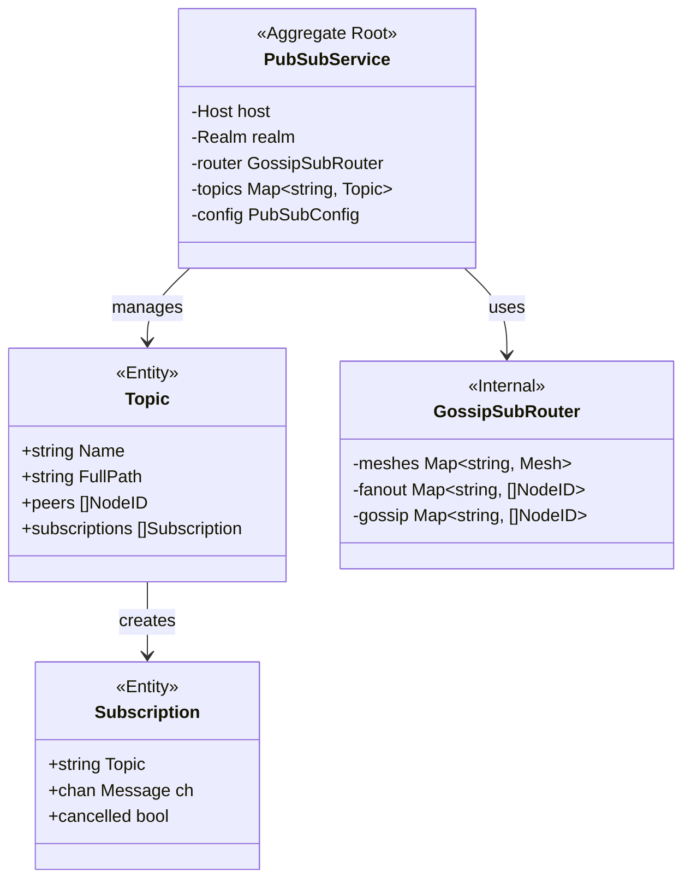
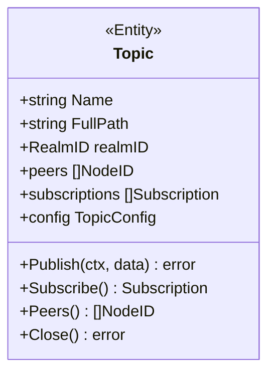
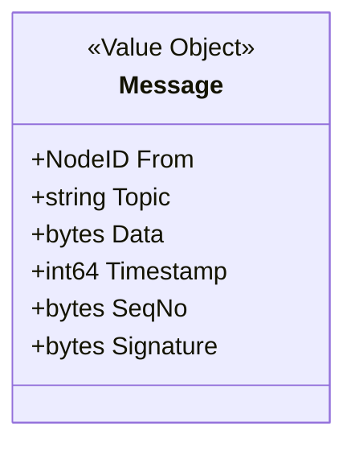
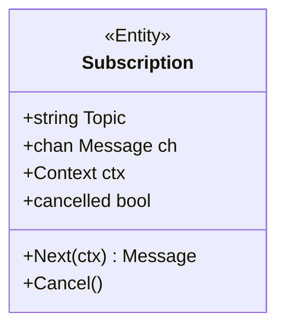
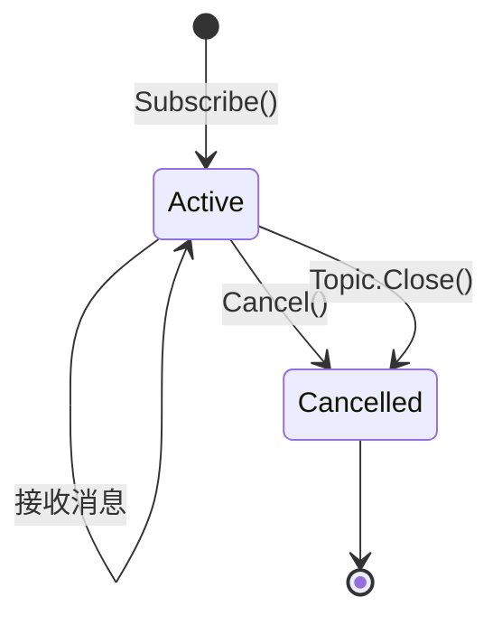
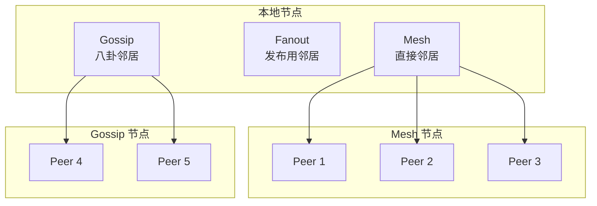
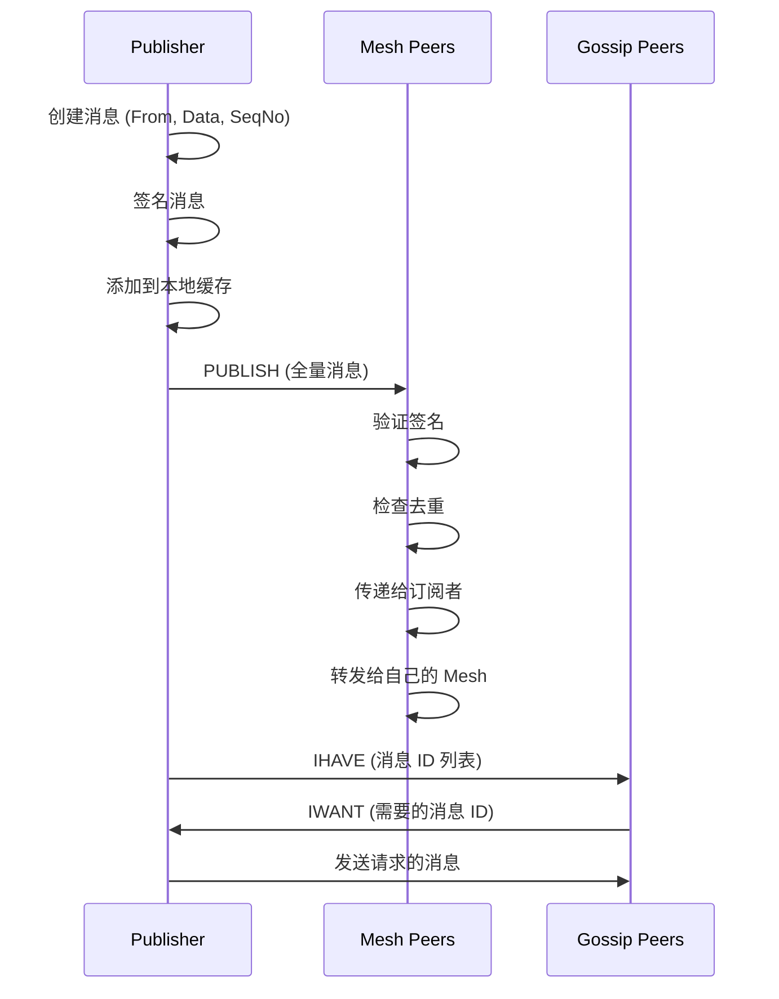
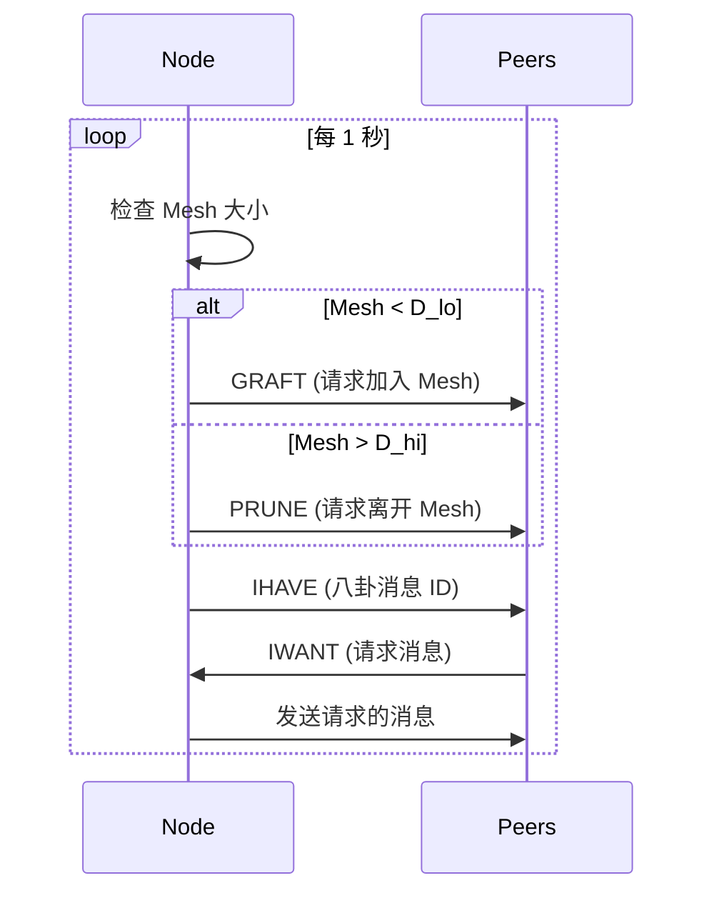
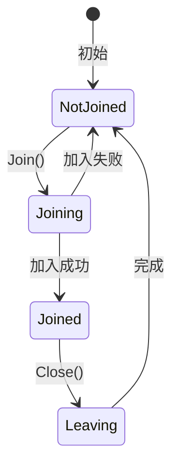

# PubSub 模型 (PubSub Model)

> 发布订阅的生命周期、GossipSub 网格与一致性规则

---

## 概述

PubSub 是 DeP2P 的发布订阅服务，基于 GossipSub 协议实现高效的多播消息传递。

```
┌─────────────────────────────────────────────────────────────────────────────┐
│                          PubSub 核心特性                                      │
├─────────────────────────────────────────────────────────────────────────────┤
│                                                                             │
│  • 多播通信：一对多消息传递                                                   │
│  • GossipSub：基于八卦协议的高效扩散                                         │
│  • 主题隔离：消息按主题组织                                                   │
│  • Realm 隔离：主题路径嵌入 RealmID (INV-002)                                │
│                                                                             │
└─────────────────────────────────────────────────────────────────────────────┘
```

---

## 聚合根设计

### PubSubService 聚合



### 聚合边界

```
PubSubService 聚合包含：
├── PubSubService（聚合根）
├── Topic（实体）           - 已加入的主题
├── Subscription（实体）    - 活跃订阅
├── Message（值对象）       - 发布的消息
└── PubSubConfig（值对象）  - 配置参数

不包含：
├── GossipSub Router 内部（协议实现细节）
├── 网格维护逻辑（协议实现细节）
└── 成员验证（属于 Realm）
```

---

## 主题模型

### Topic 实体



### 主题路径

```
┌─────────────────────────────────────────────────────────────────────────────┐
│                          Topic 路径规则                                       │
├─────────────────────────────────────────────────────────────────────────────┤
│                                                                             │
│  用户指定：topic-name                                                        │
│  完整路径：/dep2p/app/<realmID>/pubsub/topic/<topic-name>                   │
│                                                                             │
│  示例：                                                                      │
│  • 用户调用：pubsub.Join("chat")                                            │
│  • 完整路径：/dep2p/app/5FHne...abc/pubsub/topic/chat                       │
│                                                                             │
│  规则：                                                                      │
│  • RealmID 自动注入，确保 Realm 隔离                                         │
│  • 不同 Realm 的同名主题互相隔离                                             │
│                                                                             │
└─────────────────────────────────────────────────────────────────────────────┘
```

---

## 消息模型

### Message 值对象



### 消息结构

```
┌─────────────────────────────────────────────────────────────────────────────┐
│                          PubSub Message 结构                                  │
├─────────────────────────────────────────────────────────────────────────────┤
│                                                                             │
│  字段：                                                                      │
│  • From        NodeID    发送者 ID                                          │
│  • Topic       string    主题路径                                           │
│  • Data        []byte    消息数据                                           │
│  • Timestamp   int64     发送时间戳                                          │
│  • SeqNo       []byte    序列号（用于去重）                                   │
│  • Signature   []byte    发送者签名                                          │
│                                                                             │
│  去重机制：                                                                  │
│  • MessageID = SHA256(From + SeqNo)                                         │
│  • 缓存最近的 MessageID，防止重复处理                                         │
│                                                                             │
└─────────────────────────────────────────────────────────────────────────────┘
```

---

## 订阅模型

### Subscription 实体



### 订阅生命周期



---

## GossipSub 网格模型

### 网格结构



### 网格参数

```
┌─────────────────────────────────────────────────────────────────────────────┐
│                          GossipSub 参数                                       │
├─────────────────────────────────────────────────────────────────────────────┤
│                                                                             │
│  网格参数：                                                                  │
│  • D = 6          目标网格大小                                               │
│  • D_lo = 4       最小网格大小（低于此值触发 GRAFT）                         │
│  • D_hi = 12      最大网格大小（高于此值触发 PRUNE）                         │
│  • D_lazy = 6     八卦邻居数                                                │
│                                                                             │
│  时间参数：                                                                  │
│  • heartbeat = 1s           心跳间隔                                        │
│  • fanout_ttl = 60s         Fanout 过期时间                                 │
│  • mcache_window = 5        消息缓存窗口（心跳数）                           │
│  • mcache_gossip = 3        八卦窗口（心跳数）                               │
│                                                                             │
│  评分参数：                                                                  │
│  • graylist_threshold = -100  灰名单阈值                                    │
│  • opportunistic_grafting_threshold = 0                                     │
│                                                                             │
└─────────────────────────────────────────────────────────────────────────────┘
```

---

## 消息传播流程

### Publish 流程



### 心跳维护



---

## 生命周期

### Topic 生命周期



### 状态说明

| 状态 | 说明 | 允许的操作 |
|------|------|-----------|
| NotJoined | 未加入主题 | Join |
| Joining | 正在加入 | 等待 |
| Joined | 已加入 | Publish, Subscribe, Close |
| Leaving | 正在离开 | 等待 |

---

## 配置模型

### PubSubConfig

```
┌─────────────────────────────────────────────────────────────────────────────┐
│                          PubSubConfig                                        │
├─────────────────────────────────────────────────────────────────────────────┤
│                                                                             │
│  基础参数：                                                                  │
│  • MaxMessageSize     int64       最大消息大小（默认 1 MB）                  │
│  • SignMessages       bool        是否签名消息（默认 true）                  │
│  • ValidateMessages   bool        是否验证签名（默认 true）                  │
│                                                                             │
│  网格参数：                                                                  │
│  • D                  int         目标网格大小（默认 6）                     │
│  • D_lo               int         最小网格大小（默认 4）                     │
│  • D_hi               int         最大网格大小（默认 12）                    │
│  • D_lazy             int         八卦邻居数（默认 6）                       │
│                                                                             │
│  时间参数：                                                                  │
│  • HeartbeatInterval  Duration    心跳间隔（默认 1s）                        │
│  • FanoutTTL          Duration    Fanout 过期时间（默认 60s）                │
│                                                                             │
└─────────────────────────────────────────────────────────────────────────────┘
```

---

## 一致性规则

### PubSub 不变量

| ID | 不变量 | 验证点 |
|----|--------|--------|
| PS-INV-001 | 主题路径必须包含 RealmID | Join 时 |
| PS-INV-002 | 消息必须签名并验证 | Publish/接收时 |
| PS-INV-003 | 重复消息必须去重 | 接收时 |
| PS-INV-004 | 订阅取消后不再接收消息 | Cancel 后 |

### 传递语义

```
┌─────────────────────────────────────────────────────────────────────────────┐
│                          传递语义                                            │
├─────────────────────────────────────────────────────────────────────────────┤
│                                                                             │
│  传递保证：Best-effort（尽力而为）                                           │
│  ─────────────────────────────────                                          │
│  • 消息可能丢失（网络分区）                                                  │
│  • 消息可能延迟                                                              │
│  • 消息不会重复（去重机制）                                                  │
│                                                                             │
│  顺序保证：无                                                                │
│  ───────────                                                                │
│  • 来自同一节点的消息可能乱序                                                │
│  • 应用层需要自行处理顺序                                                    │
│                                                                             │
│  因果性：无                                                                  │
│  ─────────                                                                  │
│  • 不保证因果顺序                                                            │
│  • 应用层需要使用向量时钟等机制                                              │
│                                                                             │
└─────────────────────────────────────────────────────────────────────────────┘
```

---

## 错误处理

### 错误类型

| 错误 | 原因 | 处理 |
|------|------|------|
| ErrTopicNotJoined | 未加入主题就发布 | 先 Join |
| ErrMessageTooLarge | 消息超过大小限制 | 减小消息或调整配置 |
| ErrInvalidSignature | 消息签名无效 | 丢弃消息 |
| ErrDuplicateMessage | 重复消息 | 静默忽略 |
| ErrSubscriptionCancelled | 订阅已取消 | 重新订阅 |

---

## 评分机制

### 节点评分

```
┌─────────────────────────────────────────────────────────────────────────────┐
│                          节点评分                                            │
├─────────────────────────────────────────────────────────────────────────────┤
│                                                                             │
│  评分因素：                                                                  │
│  • P1: 主题消息投递率                                                        │
│  • P2: 第一次消息投递率                                                      │
│  • P3: Mesh 时间                                                             │
│  • P4: 无效消息率                                                            │
│  • P5: 应用特定分数                                                          │
│  • P6: IP 共置惩罚                                                           │
│                                                                             │
│  评分公式：                                                                  │
│  Score = P1 * w1 + P2 * w2 + P3 * w3 + P4 * w4 + P5 * w5 + P6 * w6         │
│                                                                             │
│  处罚：                                                                      │
│  • Score < -100: 加入灰名单，拒绝 GRAFT                                     │
│  • Score < 0: 减少 GRAFT 概率                                               │
│                                                                             │
└─────────────────────────────────────────────────────────────────────────────┘
```

---

## 相关文档

| 文档 | 说明 |
|------|------|
| [README.md](README.md) | PubSub 领域概述 |
| [../../L3_behavioral/messaging_flow.md](../../L3_behavioral/messaging_flow.md) | 消息流程 |
| [../../L4_interfaces/public_interfaces.md](../../L4_interfaces/public_interfaces.md) | 公共接口 |
| [../realm/realm_model.md](../realm/realm_model.md) | Realm 模型 |

---

**最后更新**：2026-01-13
