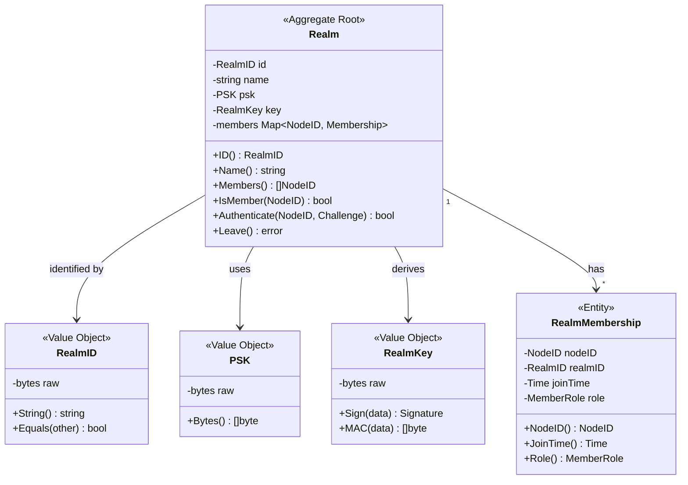
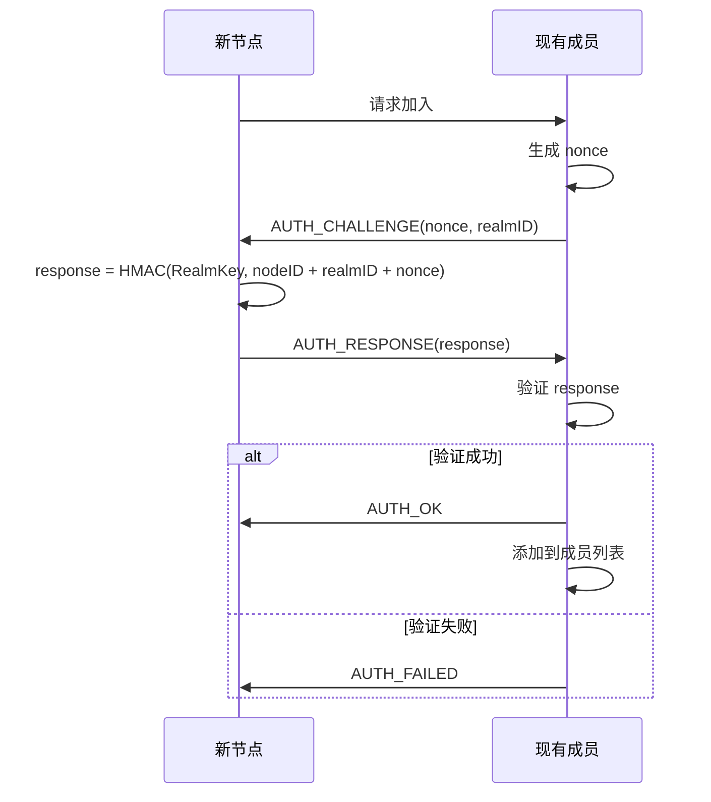
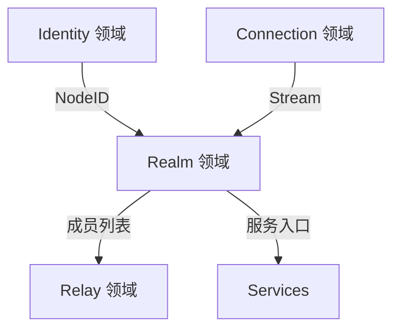

# Realm 领域 (Realm Domain)

> 定义 DeP2P 的业务隔离域模型

---

## 领域边界

```
┌─────────────────────────────────────────────────────────────────────────────┐
│                          Realm 领域边界                                       │
├─────────────────────────────────────────────────────────────────────────────┤
│                                                                             │
│  核心职责：                                                                  │
│  • 业务网络隔离                                                              │
│  • 成员资格管理                                                              │
│  • 成员认证                                                                  │
│                                                                             │
│  领域内实体：                                                                │
│  • Realm（聚合根）                                                           │
│  • RealmMembership（实体）                                                   │
│  • RealmID、PSK、RealmKey（值对象）                                          │
│                                                                             │
│  领域边界：                                                                  │
│  • 不涉及底层连接管理                                                        │
│  • 不涉及具体业务服务实现                                                    │
│  • 关注成员资格和认证逻辑                                                    │
│                                                                             │
└─────────────────────────────────────────────────────────────────────────────┘
```

---

## 领域模型



---

## 核心实体

### Realm（聚合根）

Realm 是业务隔离域的聚合根，管理成员资格和认证。

```
┌─────────────────────────────────────────────────────────────────┐
│  Realm - 聚合根                                                  │
├─────────────────────────────────────────────────────────────────┤
│                                                                 │
│  核心属性：                                                       │
│  • id         - Realm 唯一标识（从 PSK 派生）                   │
│  • name       - 显示名称                                        │
│  • psk        - 预共享密钥                                      │
│  • key        - 派生密钥（用于认证）                            │
│  • members    - 成员映射表                                      │
│                                                                 │
│  不变量：                                                        │
│  • RealmID 由 PSK 唯一确定                                      │
│  • 只有持有 PSK 的节点才能加入 (INV-002)                        │
│  • 业务 API 只对成员开放 (INV-002)                              │
│                                                                 │
│  核心方法：                                                       │
│  • Members()           - 获取成员列表                           │
│  • IsMember(NodeID)    - 检查成员资格                           │
│  • Authenticate()      - 认证成员                               │
│  • Messaging()         - 获取消息服务                           │
│  • PubSub()            - 获取发布订阅服务                       │
│  • Leave()             - 离开 Realm                             │
│                                                                 │
└─────────────────────────────────────────────────────────────────┘
```

### RealmMembership（实体）

RealmMembership 记录节点在 Realm 中的成员关系。

```
┌─────────────────────────────────────────────────────────────────┐
│  RealmMembership - 实体                                          │
├─────────────────────────────────────────────────────────────────┤
│                                                                 │
│  核心属性：                                                       │
│  • nodeID     - 成员节点 ID                                     │
│  • realmID    - 所属 Realm ID                                   │
│  • joinTime   - 加入时间                                        │
│  • role       - 成员角色                                        │
│  • lastSeen   - 最后活跃时间                                    │
│                                                                 │
│  成员角色：                                                       │
│  • Member     - 普通成员                                        │
│  • RelayProvider - 中继提供者                                   │
│                                                                 │
└─────────────────────────────────────────────────────────────────┘
```

---

## 值对象

### RealmID

RealmID 是 Realm 的唯一标识，由 PSK 派生。

```
派生算法：
RealmID = HKDF(
    salt = "dep2p-realm-id-v1",
    ikm  = PSK,
    info = SHA256(PSK),
    length = 32
)

特性：
• 长度：32 字节
• 编码：Base58（显示）
• 相同 PSK 产生相同 RealmID
• 不同 PSK 几乎不可能碰撞
```

### PSK（预共享密钥）

```
特性：
• 长度：32 字节
• 随机生成或由应用提供
• 用于派生 RealmID 和 RealmKey
• 持有 PSK 即可加入 Realm
```

### RealmKey

```
派生算法：
RealmKey = HKDF(
    salt = "dep2p-realm-key-v1",
    ikm  = PSK,
    info = "auth",
    length = 32
)

用途：
• 成员认证（MAC 计算）
• 不用于加密通信（通信由 TLS 保护）
```

---

## 成员认证

### 认证流程



### MAC 计算

```
认证 MAC 计算：

input = nodeID || realmID || nonce
mac = HMAC-SHA256(RealmKey, input)

验证：
expected = HMAC-SHA256(RealmKey, nodeID || realmID || nonce)
valid = (mac == expected)
```

---

## INV-002 约束

Realm 是 INV-002（Realm 成员资格）的核心实现：

```
┌─────────────────────────────────────────────────────────────────────────────┐
│                          INV-002: Realm 成员资格                             │
├─────────────────────────────────────────────────────────────────────────────┤
│                                                                             │
│  约束内容：                                                                  │
│  • 所有业务 API 必须验证调用方是 Realm 成员                                   │
│  • 非成员无法使用 Messaging、PubSub、Streams                                │
│                                                                             │
│  验证点：                                                                    │
│  • API 入口处检查 IsMember(caller)                                          │
│  • 消息接收时验证发送方成员资格                                               │
│  • PubSub 发布时验证发布方成员资格                                           │
│                                                                             │
└─────────────────────────────────────────────────────────────────────────────┘
```

---

## 与其他领域的关系



| 关系 | 说明 |
|------|------|
| ← Identity | 使用 NodeID 标识成员 |
| → Relay | 提供成员列表用于 Relay 地址簿 |
| ← Connection | 通过连接进行成员认证 |
| → Services | 作为 Messaging/PubSub/Streams 的入口 |

---

## 领域事件

| 事件 | 触发条件 | 载荷 |
|------|----------|------|
| RealmJoined | 成功加入 Realm | RealmID, NodeID |
| RealmLeft | 离开 Realm | RealmID, NodeID |
| MemberDiscovered | 发现新成员 | RealmID, NodeID |
| MemberLeft | 成员离开 | RealmID, NodeID |

---

## 相关文档

| 文档 | 说明 |
|------|------|
| [realm_model.md](realm_model.md) | Realm 模型详解 |
| [../identity/README.md](../identity/README.md) | 身份领域 |
| [../../L3_behavioral/realm_flow.md](../../L3_behavioral/realm_flow.md) | Realm 流程 |

---

**最后更新**：2026-01-23
