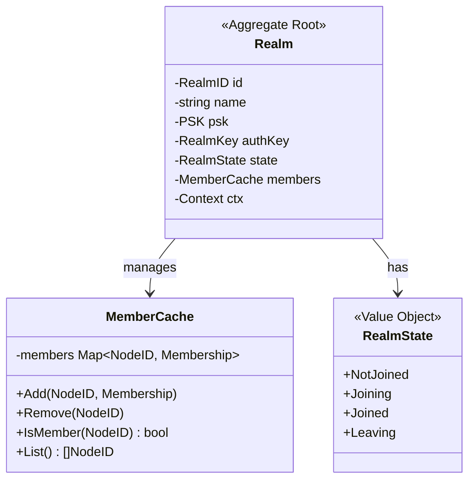
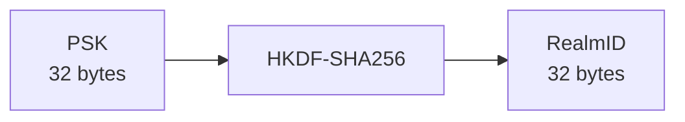
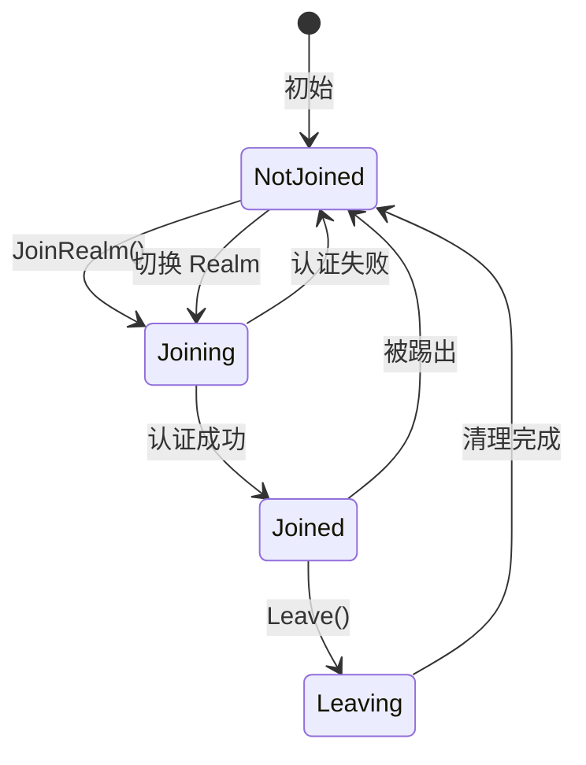
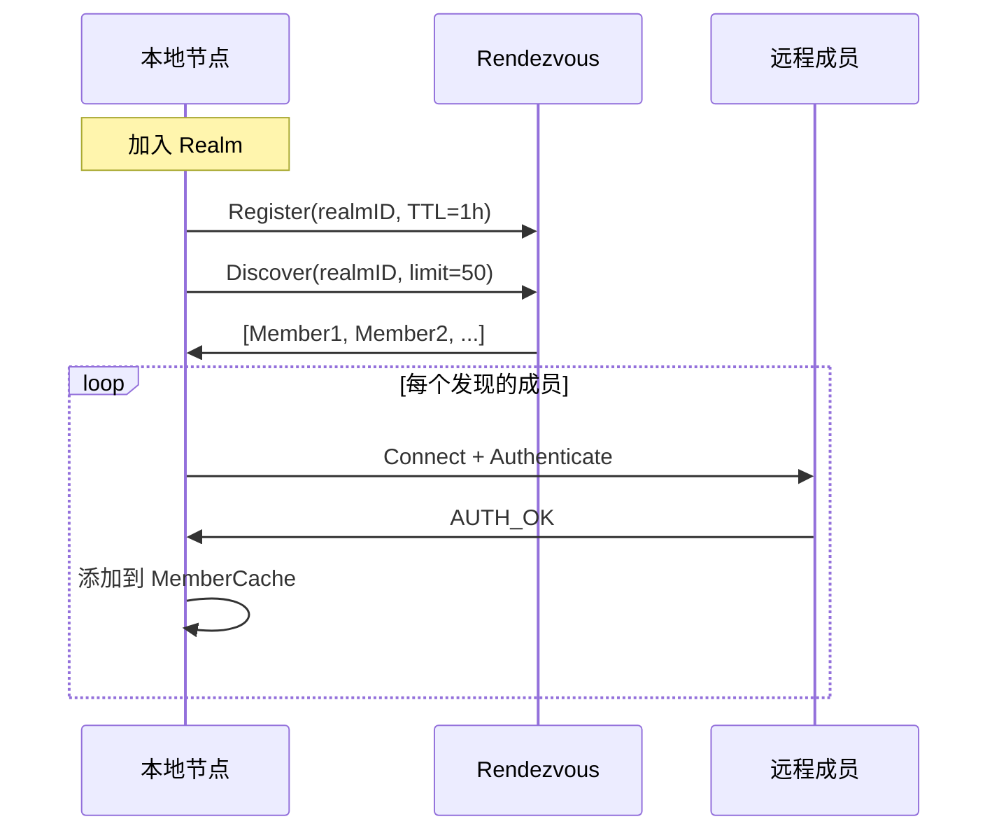
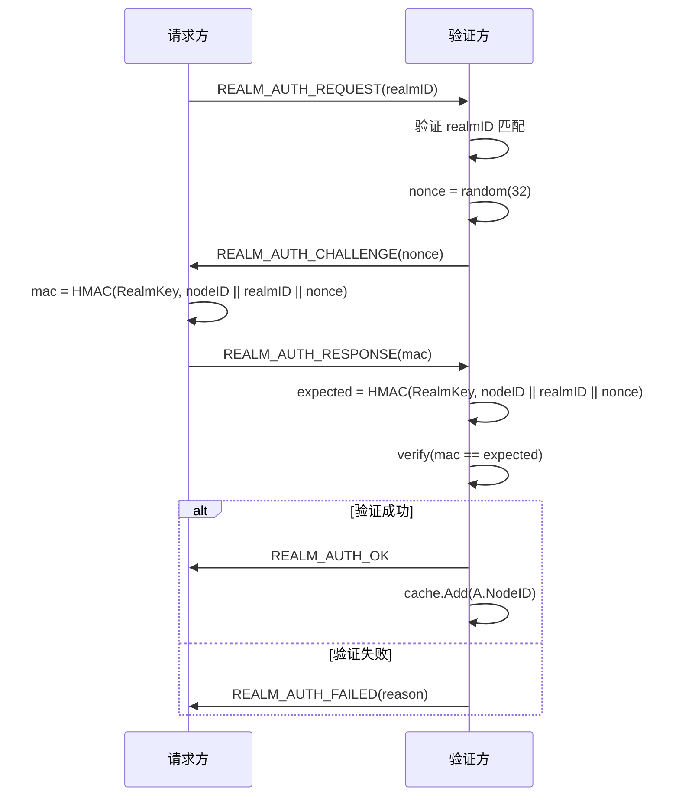

# Realm 模型 (Realm Model)

> Realm 生命周期、成员管理与一致性规则

---

## 概述

Realm 是 DeP2P 的业务隔离单元，提供逻辑网络分区能力。

```
┌─────────────────────────────────────────────────────────────────────────────┐
│                          Realm 核心特性                                       │
├─────────────────────────────────────────────────────────────────────────────┤
│                                                                             │
│  • 逻辑隔离：不同 Realm 的节点互不可见                                         │
│  • PSK 认证：持有预共享密钥才能加入                                            │
│  • 成员发现：通过 Rendezvous 发现同 Realm 成员                                │
│  • 服务入口：所有业务服务通过 Realm 访问                                       │
│                                                                             │
└─────────────────────────────────────────────────────────────────────────────┘
```

---

## 聚合根设计

### Realm 聚合



### 聚合边界

```
Realm 聚合包含：
├── Realm（聚合根）
├── RealmMembership（实体）
├── MemberCache（内部服务）
├── RealmID、PSK、RealmKey（值对象）
└── RealmState（值对象）

不包含：
├── Messaging 实现（Services 层）
├── PubSub 实现（Services 层）
├── 具体认证协议（Network 层）
└── 发现实现（Network 层）
```

---

## RealmID 派生

### 派生算法



### 详细步骤

```
// RealmID 派生
func DeriveRealmID(psk PSK) RealmID {
    salt := []byte("dep2p-realm-id-v1")
    info := sha256.Sum256(psk.Bytes())
    
    hkdf := hkdf.New(sha256.New, psk.Bytes(), salt, info[:])
    
    var realmID [32]byte
    hkdf.Read(realmID[:])
    
    return RealmID(realmID)
}

// RealmKey 派生（用于认证）
func DeriveRealmKey(psk PSK) RealmKey {
    salt := []byte("dep2p-realm-key-v1")
    info := []byte("auth")
    
    hkdf := hkdf.New(sha256.New, psk.Bytes(), salt, info)
    
    var key [32]byte
    hkdf.Read(key[:])
    
    return RealmKey(key)
}
```

### 派生关系

```
PSK (32 bytes)
├── RealmID = HKDF(salt="dep2p-realm-id-v1", info=SHA256(PSK))
└── RealmKey = HKDF(salt="dep2p-realm-key-v1", info="auth")
```

---

## 生命周期状态机

### 状态定义



### 状态说明

| 状态 | 说明 | 允许的操作 |
|------|------|-----------|
| NotJoined | 未加入任何 Realm | JoinRealm |
| Joining | 正在加入 | 取消 |
| Joined | 已加入 | Leave, 业务操作 |
| Leaving | 正在离开 | 等待 |

### 状态转换规则

```
// 状态转换
var validTransitions = map[RealmState][]RealmState{
    NotJoined: {Joining},
    Joining:   {Joined, NotJoined},
    Joined:    {Leaving, NotJoined},
    Leaving:   {NotJoined},
}
```

---

## 成员资格管理

### 成员发现



### 成员缓存

```
// MemberCache 成员缓存
type MemberCache struct {
    members sync.Map // map[NodeID]*Membership
    count   atomic.Int64
}

func (c *MemberCache) Add(id NodeID, m *Membership) {
    if _, loaded := c.members.LoadOrStore(id, m); !loaded {
        c.count.Add(1)
    }
}

func (c *MemberCache) Remove(id NodeID) {
    if _, loaded := c.members.LoadAndDelete(id); loaded {
        c.count.Add(-1)
    }
}

func (c *MemberCache) IsMember(id NodeID) bool {
    _, ok := c.members.Load(id)
    return ok
}
```

### ★ 基础设施节点排除规则

```
┌─────────────────────────────────────────────────────────────────────────────┐
│                    基础设施节点与 Realm 成员的关系                            │
├─────────────────────────────────────────────────────────────────────────────┤
│                                                                             │
│  基础设施节点定义：                                                          │
│  • Bootstrap 节点：提供 DHT 引导服务                                        │
│  • Relay 节点：提供地址发现 + 信令通道 + 数据转发                           │
│  • 两者可融合部署到同一物理节点                                              │
│                                                                             │
│  排除规则（★ 核心约束）：                                                    │
│  ════════════════════════                                                   │
│  1. 基础设施节点【不加入】Realm 成员列表（MemberCache）                      │
│  2. 基础设施节点【不参与】PubSub Mesh                                       │
│  3. 基础设施节点【可以】提供连接中转服务                                     │
│  4. 基础设施节点【可以】验证 PSK 但不获得"成员"身份                          │
│                                                                             │
│  理由：                                                                      │
│  ──────                                                                     │
│  • 职责分离：基础设施提供传输服务，不参与业务逻辑                            │
│  • 安全边界：基础设施可见消息但不参与消息处理                                │
│  • 扩展性：基础设施可服务多个 Realm 而不产生成员关系冲突                     │
│                                                                             │
│  实现方式：                                                                  │
│  ──────────                                                                 │
│  • MemberCache.Add() 检查 isInfrastructure 标志                             │
│  • GossipSub 订阅时排除基础设施节点                                         │
│                                                                             │
└─────────────────────────────────────────────────────────────────────────────┘
```

### 成员清理

```
成员清理策略：

1. 心跳超时：5 分钟无活动
2. 连接断开：立即标记离线
3. 主动离开：收到 LEAVE 消息

清理流程：
1. 标记为离线
2. 发送 MemberLeft 事件
3. 从缓存移除
```

---

## 认证流程

### 挑战-响应协议



### 双向认证

```
完整认证流程需要双向验证：

1. A 向 B 证明自己持有 PSK
2. B 向 A 证明自己持有 PSK

这确保双方都是合法成员。
```

---

## 一致性规则

### Realm 不变量

| ID | 不变量 | 验证点 |
|----|--------|--------|
| REALM-INV-001 | RealmID 由 PSK 唯一确定 | 派生时 |
| REALM-INV-002 | 只有成员可使用业务 API | API 入口 |
| REALM-INV-003 | 消息只发送给成员 | 消息发送 |
| REALM-INV-004 | 一个节点同时只属于一个 Realm | JoinRealm |
| REALM-INV-005 | ★ 基础设施节点（Bootstrap/Relay）不加入成员列表 | MemberCache |
| REALM-INV-006 | ★ 基础设施节点不参与 PubSub Mesh | GossipSub |

### 一致性边界

```
┌─────────────────────────────────────────────────────────────────────────────┐
│                          一致性边界                                          │
├─────────────────────────────────────────────────────────────────────────────┤
│                                                                             │
│  强一致性（本地）：                                                           │
│  • 本地 Realm 状态                                                          │
│  • 本地成员缓存更新                                                          │
│                                                                             │
│  最终一致性（分布式）：                                                       │
│  • 成员列表（通过发现同步）                                                   │
│  • 成员在线状态                                                              │
│                                                                             │
│  不保证一致性：                                                               │
│  • 跨 Realm 状态（不适用）                                                   │
│                                                                             │
└─────────────────────────────────────────────────────────────────────────────┘
```

---

## 命名空间

### 协议命名空间

```
Realm 相关协议使用以下命名空间：

/dep2p/realm/<realmID>/auth     - 认证协议
/dep2p/realm/<realmID>/msg      - 消息协议
/dep2p/realm/<realmID>/pubsub   - 发布订阅
/dep2p/realm/<realmID>/stream   - 流协议

其中 <realmID> 是 Base58 编码的 RealmID。
```

### Rendezvous 命名空间

```
Rendezvous 注册命名空间：

/dep2p/realm/<realmID>/discovery

用于 Realm 内成员发现。
```

---

## 错误处理

### Realm 错误

| 错误 | 原因 | 处理 |
|------|------|------|
| ErrInvalidPSK | PSK 格式错误 | 检查 PSK |
| ErrAuthFailed | 认证失败 | 重试或检查 PSK |
| ErrNotMember | 非成员调用 API | 先加入 Realm |
| ErrAlreadyJoined | 已加入其他 Realm | 先离开当前 Realm |
| ErrRealmClosed | Realm 已关闭 | 重新加入 |

---

## 相关文档

| 文档 | 说明 |
|------|------|
| [README.md](README.md) | Realm 领域概述 |
| [../../L3_behavioral/realm_flow.md](../../L3_behavioral/realm_flow.md) | Realm 流程 |
| [../../L1_overview/invariants.md](../../L1_overview/invariants.md) | INV-002 |

---

**最后更新**：2026-01-23
