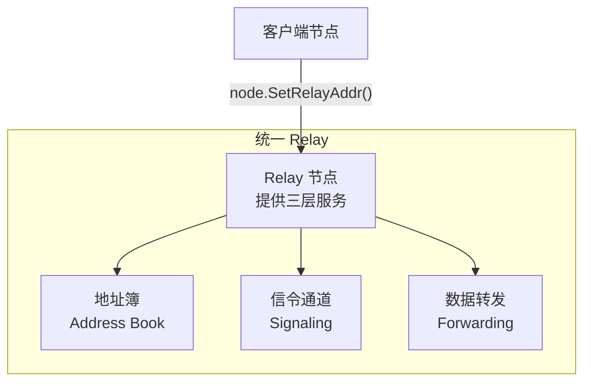
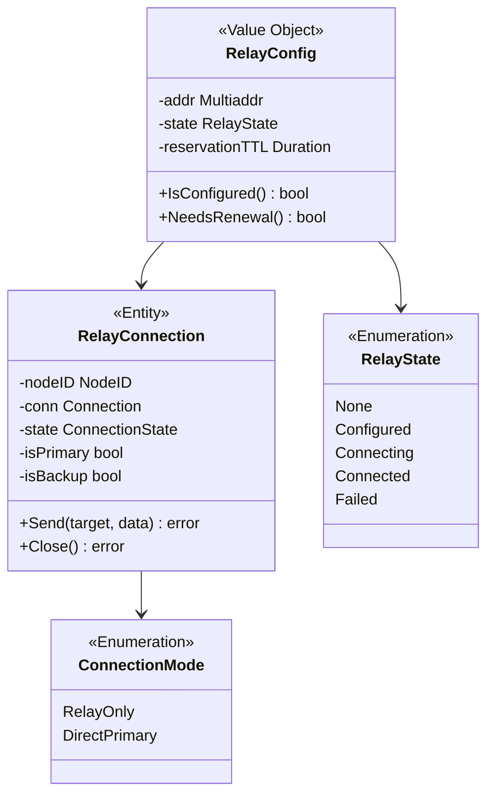
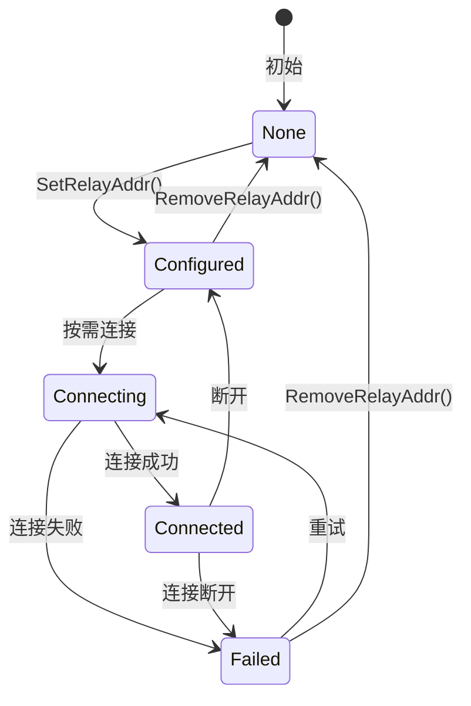
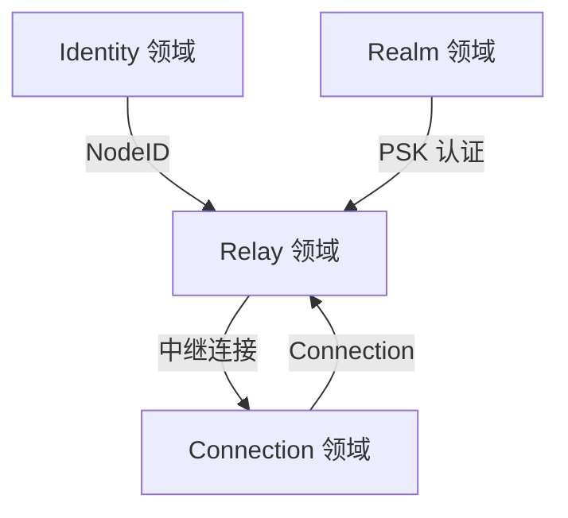

# Relay 领域 (Relay Domain)

> 定义 DeP2P 的统一中继服务模型

---

## 设计原则

```
┌─────────────────────────────────────────────────────────────────────────────┐
│                          Relay 设计原则                                      │
├─────────────────────────────────────────────────────────────────────────────┤
│                                                                             │
│  ★ 核心理念：中继是系统能力，对用户业务透明                                 │
│                                                                             │
│  • P2P 优先：直连是核心，中继是辅助                                         │
│  • 惰性连接：按需使用，直连失败才走中继                                     │
│  • 业务透明：用户业务无需关心中继，系统自动处理                             │
│  • 显式配置：Relay 地址需要配置（ADR-0010）                                 │
│  • ★ 统一设计：不区分控制面/数据面中继，只有一个 Relay 概念                 │
│  • ★ 三大职责 v2.0：缓存加速层 + 打洞协调信令 + 数据通信保底                │
│  • ★ 打洞后保留：打洞成功后保留 Relay 连接作为备份                          │
│                                                                             │
│  连接优先级：直连 → NAT 打洞 → 中继（系统自动选择）                         │
│                                                                             │
└─────────────────────────────────────────────────────────────────────────────┘
```

---

## 领域边界

```
┌─────────────────────────────────────────────────────────────────────────────┐
│                          Relay 领域边界                                      │
├─────────────────────────────────────────────────────────────────────────────┤
│                                                                             │
│  核心职责：                                                                  │
│  • 缓存加速层：维护地址簿，作为 DHT 本地缓存（非权威目录）                  │
│  • 信令通道：打洞协调的必要前提                                             │
│  • 数据通信保底：直连/打洞失败时转发数据                                   │
│  • 预留管理：TTL=1h，续租=30min                                            │
│                                                                             │
│  领域内实体：                                                                │
│  • RelayConfig（值对象）                                                    │
│  • RelayConnection（实体）                                                  │
│  • RelayState（枚举）                                                       │
│  • ConnectionMode（枚举：RelayOnly / DirectPrimary）                        │
│  • MemberAddressBook（聚合根）                                              │
│                                                                             │
│  领域边界：                                                                  │
│  • 不涉及底层传输细节                                                        │
│  • 不涉及 NAT 穿透具体实现（但提供信令通道支持）                             │
│                                                                             │
└─────────────────────────────────────────────────────────────────────────────┘
```

---

## ★ 统一 Relay 设计

DeP2P 采用**统一 Relay 架构**，不区分控制面和数据面：



### 统一 Relay 特性

| 特性 | 说明 |
|------|------|
| **三大职责 v2.0** | 缓存加速 + 信令通道 + 数据保底（DHT 是权威目录） |
| **服务范围** | 经过认证的成员 |
| **提供者** | 项目方或社区成员自愿 |
| **协议** | 所有 `/dep2p/*` 协议 |
| **认证** | 需要 PSK 成员认证 |
| **限制** | 默认不限制（可选配置） |
| **预留 TTL** | 1 小时，续租间隔 30 分钟 |
| **API 归属** | `node.*` |

### Relay 资源设计

```
┌─────────────────────────────────────────────────────────────────────────────┐
│                    统一 Relay 默认不限制                                      │
├─────────────────────────────────────────────────────────────────────────────┤
│                                                                             │
│  设计原则：                                                                  │
│  • 中继的职责是【尽可能转发】，不是【限制流量】                              │
│  • 让提供者的物理带宽成为自然上限                                            │
│  • 业务限制是业务层面的事，不是中继层面的事                                  │
│                                                                             │
│  推荐参数：                                                                  │
│  • ReservationTTL: 1h                                                       │
│  • RenewalInterval: 30min                                                   │
│  • MaxReservations: 100（默认）                                             │
│  • KeepConnection: true（打洞后保留）                                       │
│                                                                             │
│  可选配置：                                                                  │
│  • 提供者可以根据自己的资源情况【可选地】设置限制                            │
│                                                                             │
└─────────────────────────────────────────────────────────────────────────────┘
```

---

## 领域模型



---

## RelayState 状态机



### 状态说明

| 状态 | 说明 |
|------|------|
| **None** | 未配置中继 |
| **Configured** | 已配置，未连接（配置 ≠ 连接） |
| **Connecting** | 正在连接 |
| **Connected** | 已连接，可用 |
| **Failed** | 连接失败 |

---

## 配置 vs 连接

```
┌─────────────────────────────────────────────────────────────────────────────┐
│                    配置 ≠ 连接（惰性连接）                                    │
├─────────────────────────────────────────────────────────────────────────────┤
│                                                                             │
│  SetRelayAddr(addr) 做什么：                                                │
│  1. 验证地址格式                                                             │
│  2. 检查是否为自身 → 返回 ErrCannotRelayToSelf                              │
│  3. 保存配置                                                                 │
│  4. 状态 → Configured                                                        │
│  5. 【不立即连接】                                                           │
│                                                                             │
│  何时连接：                                                                  │
│  • 直连失败 + 打洞失败 → 自动连接中继                                       │
│  • 需要信令通道时 → 自动连接中继                                             │
│                                                                             │
└─────────────────────────────────────────────────────────────────────────────┘
```

---

## 与其他领域的关系



| 关系 | 说明 |
|------|------|
| ← Identity | 使用 NodeID 标识中继和目标 |
| ← Connection | 使用底层连接 |
| ← Realm | Relay 需要 PSK 成员认证 |
| → Connection | 提供中继连接和信令通道 |

---

## 领域事件

| 事件 | 触发条件 | 载荷 |
|------|----------|------|
| RelayConfigured | 配置中继 | NodeID |
| RelayRemoved | 移除中继配置 | NodeID |
| RelayConnecting | 开始连接中继 | NodeID |
| RelayConnected | 连接到中继 | NodeID |
| RelayDisconnected | 与中继断开 | NodeID |
| RelayFailed | 中继连接失败 | NodeID, Error |
| ReservationRenewed | 预留续租成功 | NodeID |
| ReservationExpired | 预留过期 | NodeID |

---

## 相关文档

| 文档 | 说明 |
|------|------|
| [relay_model.md](relay_model.md) | Relay 模型详解（统一 Relay、地址簿、预留 TTL） |
| [../realm/README.md](../realm/README.md) | Realm 领域 |
| [../../L3_behavioral/relay_flow.md](../../L3_behavioral/relay_flow.md) | Relay 流程 |
| [../../L1_overview/core_concepts.md](../../L1_overview/core_concepts.md) | 核心概念（NAT 三层能力） |

---

**最后更新**：2026-01-23
