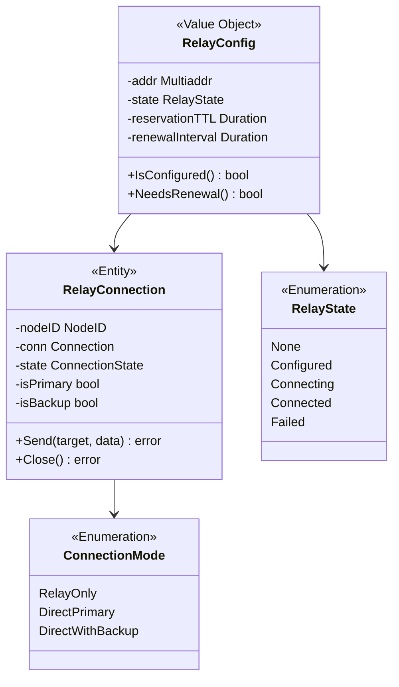
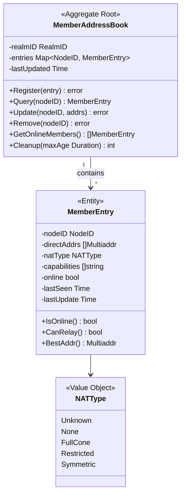
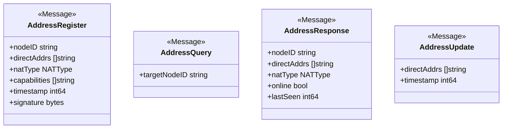
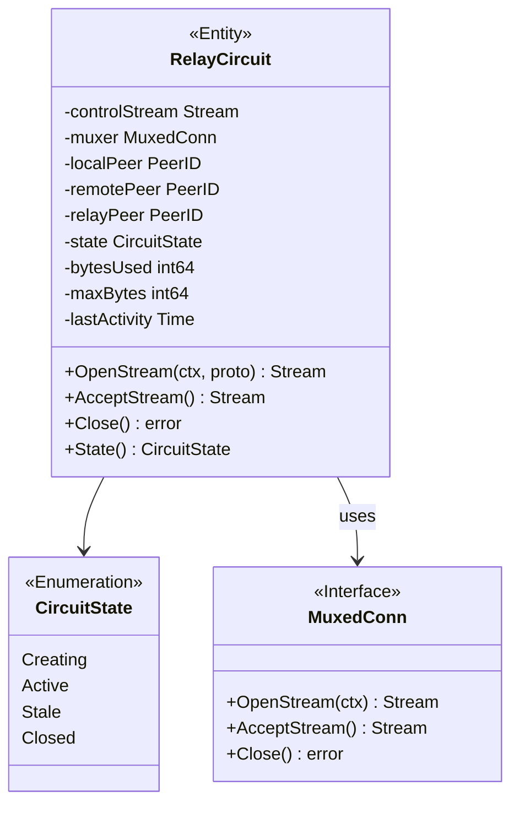
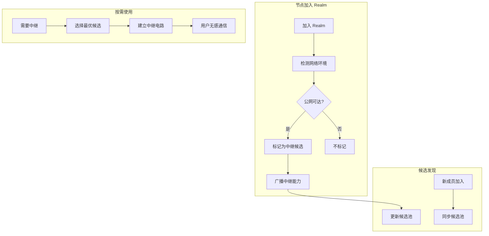
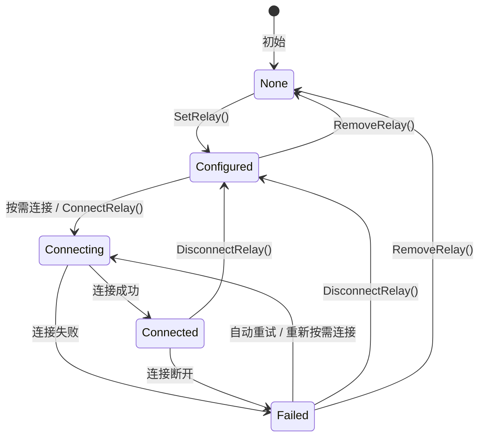
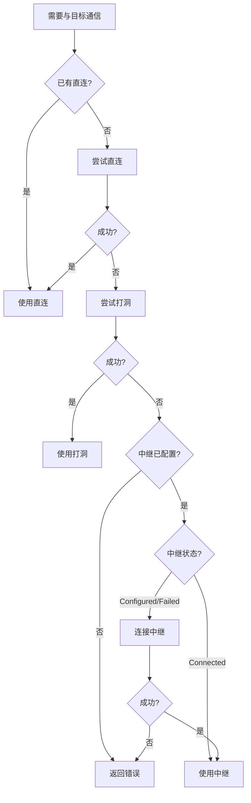

# Relay 模型 (Relay Model)

> 中继配置、生命周期、地址簿与资源限制

---

## 概述

Relay 是 DeP2P 的核心基础设施，具有**三大职责 (v2.0)**：

1. **缓存加速层**：维护地址簿，作为 DHT 本地缓存（非权威目录）
2. **打洞协调信令**：打洞协调的必要前提（来自显式配置的 Relay 连接）
3. **数据通信保底**：直连/打洞失败时作为数据转发通道

> **★ v2.0 核心原则**：DHT 是权威目录，Relay 地址簿是缓存加速层

```
┌─────────────────────────────────────────────────────────────────────────────┐
│                    ★ v2.0 三层架构（DHT 权威模型）                            │
├─────────────────────────────────────────────────────────────────────────────┤
│                                                                             │
│  ★ DHT 是权威目录，Relay 是缓存/信令/保底                                   │
│                                                                             │
│  Layer 1: DHT（★ 权威目录）— 存储签名 PeerRecord                             │
│  Layer 2: 缓存加速层 — Peerstore / MemberList / Relay 地址簿                 │
│  Layer 3: 连接策略 — 直连 → 打洞 → Relay 兜底                                │
│                                                                             │
│  ═══════════════════════════════════════════════════════════════════════   │
│  Relay 职责一：缓存加速层（非权威目录）                                      │
│  ═══════════════════════════════════════════════════════════════════════   │
│                                                                             │
│  Alice ──[查询地址]──▶ DHT（权威）/ Relay 地址簿（缓存）                    │
│                                                                             │
│  • Relay 维护连接成员的地址信息（作为 DHT 本地缓存）                       │
│  • ★ Relay 地址簿是缓存，DHT 才是权威目录                                   │
│  • 获取地址后，优先尝试直连                                                │
│                                                                             │
│  ═══════════════════════════════════════════════════════════════════════   │
│  Relay 职责二：打洞协调信令（Signaling Channel）                             │
│  ═══════════════════════════════════════════════════════════════════════   │
│                                                                             │
│  Alice ──[打洞请求]──▶ Relay ──[转发]──▶ Bob                               │
│                                                                             │
│  • Relay 连接作为打洞协调的信令通道（交换候选地址）                        │
│  • 打洞需要双方交换候选地址，信令通道是必要前提                             │
│  • 这就是为什么"先建 Relay 连接，再尝试打洞"                               │
│  • ★ 信令通道来自显式配置的 Relay（ADR-0010）                              │
│                                                                             │
│  ═══════════════════════════════════════════════════════════════════════   │
│  Relay 职责三：数据通信保底（Data Relay Fallback）                           │
│  ═══════════════════════════════════════════════════════════════════════   │
│                                                                             │
│  Alice ─────────[Relay 转发]───────── Bob                                  │
│                                                                             │
│  • 只有直连和打洞都失败时才使用 Relay 转发数据                             │
│  • 确保总是可达（真正的保底）                                              │
│                                                                             │
│  ★ 设计目标：70-80% 直连成功，Relay 不成为瓶颈                              │
│                                                                             │
└─────────────────────────────────────────────────────────────────────────────┘
```

```
┌─────────────────────────────────────────────────────────────────────────────┐
│                    核心理念：中继是"系统能力"，不是"地址类型"                 │
├─────────────────────────────────────────────────────────────────────────────┤
│                                                                             │
│  用户视角（业务透明，需配置）：                                              │
│  ══════════════════════════════                                             │
│  • 用户只需要: realm.Connect(ctx, targetNodeID)                             │
│  • 用户不需要知道连接是否走中继                                             │
│  • ★ Relay 地址需要显式配置（ADR-0010）                                     │
│  • 系统自动处理连接优化                                                     │
│                                                                             │
└─────────────────────────────────────────────────────────────────────────────┘
```

```
┌─────────────────────────────────────────────────────────────────────────────┐
│                          Relay 核心设计原则                                   │
├─────────────────────────────────────────────────────────────────────────────┤
│                                                                             │
│  • 中继透明：对用户业务完全不可见（核心原则）                               │
│  • 三大职责 v2.0：缓存加速层 + 打洞协调信令 + 数据通信保底                  │
│  • ★ DHT 是权威目录，Relay 地址簿是缓存加速层                               │
│  • P2P 优先：直连是核心，中继是辅助                                         │
│  • 惰性连接：按需使用，不预先建立                                           │
│  • ★ 显式配置（ADR-0010）：Relay 地址需要配置，不支持自动发现               │
│  • ★ 统一设计：不区分控制面/数据面中继，只有一个 Relay 概念                 │
│  • ★ 打洞后保留：打洞成功后保留 Relay 连接作为备份                          │
│                                                                             │
└─────────────────────────────────────────────────────────────────────────────┘
```

---

## 领域模型

### 模型概览



### 关键实体

#### RelayConfig（值对象）★ 统一配置

```
┌─────────────────────────────────────────────────────────────────────────────┐
│                    RelayConfig（统一配置）                                    │
├─────────────────────────────────────────────────────────────────────────────┤
│                                                                             │
│  属性：                                                                      │
│  • addr             - 中继地址（Multiaddr）                                │
│  • state            - 当前状态                                              │
│  • reservationTTL   - 预留有效期（默认 1h）                                │
│  • renewalInterval  - 续租间隔（默认 30min）                               │
│                                                                             │
│  职责：                                                                      │
│  • 管理 Node 级别的 Relay 配置                                              │
│  • 由 node.SetRelayAddr() / node.EnableRelay() 方法管理                    │
│                                                                             │
│  约束：                                                                      │
│  • Node 级别配置一个主 Relay（可选配置备用）                                │
│  • 不能配置自身为中继                                                        │
│  • 配置时不立即连接（惰性连接）                                              │
│                                                                             │
│  ★ 重要：不再区分控制面/数据面中继                                          │
│  ─────────────────────────────────────────────                              │
│  • 只有一个统一的 Relay 概念                                                │
│  • 同时提供：地址发现 + 信令通道 + 数据保底                                 │
│                                                                             │
└─────────────────────────────────────────────────────────────────────────────┘
```

### ★ 多 Relay 选择策略

```
┌─────────────────────────────────────────────────────────────────────────────┐
│                    多 Relay 场景下的选择策略                                  │
├─────────────────────────────────────────────────────────────────────────────┤
│                                                                             │
│  核心原则：发布地址时选择的 Relay = 连接时使用的 Relay                      │
│  ════════════════════════════════════════════════════                       │
│                                                                             │
│  理由：                                                                      │
│  ──────                                                                     │
│  1. DHT 发布的 Relay 地址格式：/p2p/QmRelay.../p2p-circuit/p2p/QmTarget    │
│  2. 连接方按此地址连接，必须经过指定的 Relay                                │
│  3. 目标节点只在该 Relay 上有预留，其他 Relay 无法转发                      │
│                                                                             │
│  选择 Relay 时的考量：                                                       │
│  ────────────────────                                                       │
│  1. 【延迟优化】选择 RTT 最低的 Relay                                       │
│  2. 【地理就近】选择与自己地理位置最近的 Relay                              │
│  3. 【负载均衡】避免所有节点选择同一个 Relay                                │
│  4. 【可用性】选择历史稳定性好的 Relay                                      │
│                                                                             │
│  推荐策略：                                                                  │
│  ┌─────────────────────────────────────────────────────────────────────┐   │
│  │  1. 启动时：向所有已知 Relay 发送探测包，测量 RTT                    │   │
│  │  2. 选择：RTT 最低 + 地理最近的 Relay 作为"主 Relay"                │   │
│  │  3. 预留：在主 Relay 上建立预留                                      │   │
│  │  4. 发布：在 DHT 发布主 Relay 的地址                                 │   │
│  │  5. 备份：可选在第二 Relay 建立预留（高可用场景）                    │   │
│  └─────────────────────────────────────────────────────────────────────┘   │
│                                                                             │
│  Relay 切换策略：                                                            │
│  ─────────────────                                                          │
│  • 主 Relay 故障时，切换到备用 Relay                                        │
│  • 重新在 DHT 发布新的 Relay 地址                                           │
│  • 已建立的连接继续使用旧 Relay 直到断开                                    │
│                                                                             │
└─────────────────────────────────────────────────────────────────────────────┘
```

### ★ Relay 预留 TTL 与续租

```
┌─────────────────────────────────────────────────────────────────────────────┐
│                    Relay 预留 TTL 与续租策略                                  │
├─────────────────────────────────────────────────────────────────────────────┤
│                                                                             │
│  推荐参数：                                                                  │
│  ══════════                                                                 │
│  • 预留 TTL：1 小时（3600 秒）                                              │
│  • 续租间隔：TTL / 2 = 30 分钟                                              │
│  • 续租窗口：TTL 过期前 5 分钟开始尝试                                      │
│  • 最大续租失败：3 次（之后重新建立预留）                                   │
│                                                                             │
│  续租流程：                                                                  │
│  ──────────                                                                 │
│  1. 定时器在 TTL/2 时触发续租请求                                           │
│  2. 成功 → 重置 TTL 计时器                                                  │
│  3. 失败 → 指数退避重试                                                     │
│  4. 连续失败超过阈值 → 重新建立预留                                         │
│                                                                             │
│  ⚠️ 注意：Relay 预留 TTL ≠ DHT 地址 TTL                                     │
│  • Relay 预留是服务端资源，需要更频繁维护（1h TTL）                         │
│  • DHT 地址是分布式存储，刷新成本分散（24h TTL）                            │
│                                                                             │
└─────────────────────────────────────────────────────────────────────────────┘
```

---

## ★ 地址簿领域模型（核心特性）

Relay 维护一个**成员地址簿**，这是实现"缓存加速层"的核心数据结构（注：DHT 是权威目录，地址簿是本地缓存）。

> **实现位置**：`internal/core/relay/addressbook/`  
> **接口定义**：`pkg/interfaces/addressbook.go`  
> **协议消息**：`pkg/proto/addressbook/addressbook.proto`

### 地址簿聚合



### MemberEntry 实体

```
┌─────────────────────────────────────────────────────────────────────────────┐
│                    MemberEntry（实体）                                       │
├─────────────────────────────────────────────────────────────────────────────┤
│                                                                             │
│  属性：                                                                      │
│  ─────                                                                      │
│  • nodeID       - 成员身份（公钥派生，全局唯一）                            │
│  • directAddrs  - 直连地址列表（公网可达）                                  │
│  • natType      - NAT 类型（用于打洞决策）                                  │
│  • capabilities - 能力标签（如 "can-relay"）                               │
│  • online       - 在线状态                                                  │
│  • lastSeen     - 最后活跃时间                                              │
│  • lastUpdate   - 地址最后更新时间                                          │
│                                                                             │
│  不变量：                                                                    │
│  ─────────                                                                  │
│  • nodeID 创建后不可变                                                      │
│  • directAddrs 可以为空（NAT 后节点）                                      │
│  • lastSeen 只能递增                                                        │
│                                                                             │
│  NAT 类型说明：                                                              │
│  ─────────────                                                              │
│  • Unknown    - 未知，需要探测                                              │
│  • None       - 公网直连，无 NAT                                            │
│  • FullCone   - 完全锥形，易打洞                                            │
│  • Restricted - 受限锥形，可打洞                                            │
│  • Symmetric  - 对称 NAT，难打洞，通常需要 Relay                            │
│                                                                             │
└─────────────────────────────────────────────────────────────────────────────┘
```

### 地址簿协议消息



### 协议消息说明

| 消息 | 方向 | 用途 |
|------|------|------|
| **AddressRegister** | 成员 → Relay | 成员连接 Relay 时注册自己的地址 |
| **AddressQuery** | 成员 → Relay | 查询其他成员的地址 |
| **AddressResponse** | Relay → 成员 | 返回目标成员的地址信息 |
| **AddressUpdate** | 成员 → Relay | 地址变化时主动更新 |

### 地址簿持久化

> **实际实现**：`internal/core/relay/addressbook/store_memory.go`

```
┌─────────────────────────────────────────────────────────────────────────────┐
│                    地址簿持久化模型                                          │
├─────────────────────────────────────────────────────────────────────────────┤
│                                                                             │
│  interface AddressBookStore {    // 定义于 pkg/interfaces/addressbook.go    │
│      Put(ctx, entry) error           // 存储条目                           │
│      Get(ctx, nodeID) (entry, bool, error)  // 获取条目                    │
│      Delete(ctx, nodeID) error       // 删除条目                           │
│      List(ctx) ([]MemberEntry, error) // 列出所有                          │
│      SetTTL(ctx, nodeID, ttl) error  // 设置 TTL                           │
│      CleanExpired(ctx) error         // 清理过期                           │
│      Close() error                   // 关闭存储                           │
│  }                                                                          │
│                                                                             │
│  当前实现：                                                                  │
│  • MemoryStore - 内存存储（已实现，支持 TTL 管理）                         │
│                                                                             │
│  计划实现（可选）：                                                          │
│  • BadgerStore - BadgerDB 持久化（推荐）                                   │
│  • BoltStore   - BoltDB 持久化                                             │
│                                                                             │
│  TTL 管理：                                                                  │
│  • 默认 TTL：24 小时                                                        │
│  • 在线成员：自动续期                                                       │
│  • 离线成员：超过 TTL 后清理                                               │
│                                                                             │
└─────────────────────────────────────────────────────────────────────────────┘
```

### 地址簿不变量

| ID | 不变量 | 验证点 |
|----|--------|--------|
| ADDRBOOK-INV-001 | 只有 PSK 认证成员可以注册 | Register() |
| ADDRBOOK-INV-002 | AddressRegister 需要签名 | Register() |
| ADDRBOOK-INV-003 | 查询只返回同 Realm 成员 | Query() |
| ADDRBOOK-INV-004 | 地址信息不对外暴露 | 协议边界 |

---

## ★ RelayCircuit 领域模型 (v0.2.26 新增)

根据 [ADR-0011](../../../../01_context/decisions/ADR-0011-relay-circuit-muxer.md) 定义的中继电路多路复用架构。

### 核心数据结构



### 流与电路的语义模型

```
┌─────────────────────────────────────────────────────────────────────────────────┐
│                    RelayCircuit 多路复用架构                                      │
├─────────────────────────────────────────────────────────────────────────────────┤
│                                                                                 │
│  ┌───────────────────────────────────────────────────────────────────────────┐ │
│  │  Control Channel (STOP 流)                                                │ │
│  │  • STOP 握手后保持                                                        │ │
│  │  • KeepAlive 心跳                                                         │ │
│  │  • 电路状态同步                                                           │ │
│  └───────────────────────────────────────────────────────────────────────────┘ │
│                                                                                 │
│  ┌───────────────────────────────────────────────────────────────────────────┐ │
│  │  Data Channel (yamux Muxer)                                               │ │
│  │                                                                            │ │
│  │  ┌────────────┐ ┌────────────┐ ┌────────────┐                            │ │
│  │  │  Stream 1  │ │  Stream 2  │ │  Stream N  │  ← 独立生命周期            │ │
│  │  │  (chat)    │ │  (pubsub)  │ │  (dht)     │                            │ │
│  │  └────────────┘ └────────────┘ └────────────┘                            │ │
│  │                                                                            │ │
│  │  • 每个流可以独立 CloseWrite/CloseRead                                    │ │
│  │  • 流关闭不影响电路                                                       │ │
│  │  • 可以随时 OpenStream() 创建新流                                         │ │
│  └───────────────────────────────────────────────────────────────────────────┘ │
│                                                                                 │
└─────────────────────────────────────────────────────────────────────────────────┘
```

### RelayCircuit 不变量

| ID | 不变量 | 验证点 |
|----|--------|--------|
| CIRCUIT-INV-001 | stream.Close() 不影响电路状态 | 流关闭时 |
| CIRCUIT-INV-002 | circuit.Close() 关闭所有流 | 电路关闭时 |
| CIRCUIT-INV-003 | 电路实现 Connection 接口 | Swarm 集成 |
| CIRCUIT-INV-004 | 心跳超时转为 Stale 而非直接关闭 | 状态转换 |

### 与 Swarm 的集成

```
Swarm 管理直连和中继电路：

  type Swarm struct {
      conns    map[PeerID][]Connection    // 直连
      circuits map[PeerID][]*RelayCircuit // 中继电路
  }

  ConnsToPeer(peerID) → []Connection
    ├── 直连：conns[peerID]
    └── 中继：circuits[peerID] (过滤 Active 状态)

  NewStream(ctx, peerID, proto)
    ├── 优先使用直连
    └── 回退到中继电路
```

---

## 打洞后保留 Relay 连接（★ 核心策略）

```
┌─────────────────────────────────────────────────────────────────────────────┐
│                    打洞成功后 Relay 连接策略                                  │
├─────────────────────────────────────────────────────────────────────────────┤
│                                                                             │
│  决策：✅ 保留 Relay 连接                                                   │
│                                                                             │
│  理由：                                                                      │
│  ──────                                                                     │
│  1. A-B 打洞成功，但 A-C、A-D... 可能仍需借助 Relay                        │
│  2. Relay 连接用于打洞协调信令通道                                          │
│  3. 直连可能因网络变化断开，Relay 作为 fallback                             │
│  4. 重建 Relay 连接有成本（握手、预留）                                     │
│                                                                             │
│       A ══════════ 直连 ══════════ B                                       │
│       │                            │                                        │
│       │      ┌─────────┐          │                                        │
│       └──────│  Relay  │──────────┘   ← 保留，不关闭                       │
│              └─────────┘                                                    │
│                  │                                                          │
│       C ─────────┘   打洞协调 / 数据 fallback / 其他节点连接               │
│                                                                             │
│  连接状态机：                                                                │
│  RelayOnly → [打洞成功] → DirectPrimary + RelayBackup                      │
│                              ↓ [直连断开]                                   │
│                          RelayOnly → [重试打洞]                             │
│                                                                             │
└─────────────────────────────────────────────────────────────────────────────┘
```

---

## Relay 候选模型（可选功能，未来扩展）

> ⚠️ **注意**：当前版本要求显式配置 Relay（ADR-0010），自动发现为可选的未来扩展功能。

### RelayCandidatePool

中继候选池管理多 Relay 场景下的候选节点选择。

```
┌─────────────────────────────────────────────────────────────────────────────┐
│                    RelayCandidatePool（可选实体）                             │
├─────────────────────────────────────────────────────────────────────────────┤
│                                                                             │
│  属性：                                                                      │
│  • candidates  - 中继候选列表（来自显式配置）                               │
│  • lastUpdated - 最后更新时间                                               │
│                                                                             │
│  方法：                                                                      │
│  • AddCandidate(nodeID, score)    - 添加候选                               │
│  • RemoveCandidate(nodeID)        - 移除候选                               │
│  • SelectBest() → nodeID          - 选择最优候选                           │
│  • GetAll() → []RelayCandidate    - 获取所有候选                           │
│                                                                             │
│  候选选择算法（RTT 优先）：                                                  │
│  score = latency_score * 0.5                                               │
│        + availability_score * 0.3                                          │
│        + load_score * 0.2                                                  │
│                                                                             │
└─────────────────────────────────────────────────────────────────────────────┘
```

### RelayCandidate

```
type RelayCandidate struct {
    NodeID       NodeID        // 候选节点 ID
    Addrs        []Multiaddr   // 候选节点地址
    DiscoveredAt time.Time     // 发现时间
    LastPingRTT  time.Duration // 最近一次延迟
    Score        float64       // 综合评分
    Source       CandidateSource // 来源
}

type CandidateSource int
const (
    CandidateSourceAutoDiscovery CandidateSource = iota  // 自动发现
    CandidateSourceManualConfig                           // 手动配置
    CandidateSourcePublicRelay                            // 公共中继
)
```

### 自动发现流程模型



---

## 状态模型

### RelayState 枚举

```
type RelayState int

const (
    RelayStateNone        RelayState = iota  // 未配置/自动
    RelayStateConfigured                      // 手动配置，未连接
    RelayStateConnecting                      // 正在连接
    RelayStateConnected                       // 已连接
    RelayStateFailed                          // 连接失败
)
```

### 状态机



### 状态转换说明

| 当前状态 | 事件 | 目标状态 | 说明 |
|----------|------|----------|------|
| None | `SetRelay()` | Configured | 保存配置，不连接 |
| Configured | `RemoveRelay()` | None | 移除配置 |
| Configured | 需要中继 | Connecting | 按需触发连接 |
| Configured | `ConnectRelay()` | Connecting | 手动触发连接 |
| Connecting | 成功 | Connected | 可以使用 |
| Connecting | 失败 | Failed | 记录错误 |
| Connected | `DisconnectRelay()` | Configured | 断开但保留配置 |
| Connected | 断开 | Failed | 需要重连 |
| Failed | 重试 | Connecting | 尝试恢复 |
| Failed | `RemoveRelay()` | None | 放弃 |

---

## 配置 vs 连接

### 核心原则

```
┌─────────────────────────────────────────────────────────────────────────────┐
│                    配置 ≠ 连接                                               │
├─────────────────────────────────────────────────────────────────────────────┤
│                                                                             │
│  SetRelay(addr) 做什么：                                                    │
│  ────────────────────────                                                   │
│  1. 验证地址格式                                                             │
│  2. 检查是否为自身 → 返回 ErrCannotRelayToSelf                              │
│  3. 保存配置                                                                 │
│  4. 状态 → Configured                                                        │
│  5. 【不立即连接】                                                           │
│                                                                             │
│  何时连接：                                                                  │
│  ────────────                                                               │
│  • 场景 1：向目标发消息/数据，直连失败，打洞失败 → 自动连接中继              │
│  • 场景 2：用户手动调用 ConnectRelay() → 主动连接                           │
│                                                                             │
│  为什么这样设计：                                                            │
│  ────────────────                                                           │
│  • 中继是兜底，不是常态                                                      │
│  • 避免不必要的中继连接和资源消耗                                            │
│  • 大多数情况直连或打洞会成功                                                │
│                                                                             │
└─────────────────────────────────────────────────────────────────────────────┘
```

### 连接触发流程



---

## 自身过滤

### 规则

```
┌─────────────────────────────────────────────────────────────────────────────┐
│                    自身过滤规则                                              │
├─────────────────────────────────────────────────────────────────────────────┤
│                                                                             │
│  场景                              处理                                      │
│  ────                              ────                                      │
│  node.SetRelayAddr(自身地址)      返回 ErrCannotRelayToSelf                 │
│  node.AddBootstrapPeer(自身地址)  静默忽略（方便批量配置）                   │
│                                                                             │
│  为什么中继要报错而 Bootstrap 静默忽略？                                    │
│  ─────────────────────────────────────────                                  │
│  • 中继配置通常是单个地址，配置错误应该明确报错                              │
│  • Bootstrap 通常是批量配置，包含自身是常见情况，静默忽略更友好              │
│                                                                             │
└─────────────────────────────────────────────────────────────────────────────┘
```

### 实现示例

```pseudocode
function node.SetRelayAddr(addr: Multiaddr) -> error:
    relayID = extractNodeID(addr)
    if relayID == "":
        return ErrInvalidRelayAddress
    
    // 自身过滤
    if relayID == node.ID():
        return ErrCannotRelayToSelf
    
    node.relay.addr = addr
    node.relay.state = RelayStateConfigured
    return nil
```

---

## 资源限制

### ★ 统一 Relay 资源限制

```
┌─────────────────────────────────────────────────────────────────────────────┐
│                     统一 Relay 资源限制                                      │
├─────────────────────────────────────────────────────────────────────────────┤
│                                                                             │
│  ★ 不再区分控制面/数据面中继，统一资源管理                                  │
│                                                                             │
│  认证要求：                                                                  │
│  • 需要 PSK 成员认证                                                        │
│  • 只服务经过认证的成员                                                     │
│                                                                             │
│  资源限制：【默认不限制】                                                    │
│  ─────────────────────────                                                  │
│  • 中继的职责是【尽可能转发】，不是【限制流量】                              │
│  • 让提供者的物理带宽成为自然上限                                            │
│  • 提供者可以根据自己的资源情况【可选地】设置限制                            │
│                                                                             │
│  可选配置（由提供者决定）：                                                  │
│  • MaxBandwidth: 0 = 不限（默认），> 0 = 限制                               │
│  • MaxDuration: 60s = 单次中继最大时长（可调整）                            │
│  • MaxReservations: 100 = 最大预留数（可调整）                              │
│  • IdleTimeout: 30s = 空闲超时                                              │
│                                                                             │
│  预留参数（★ 核心）：                                                       │
│  • ReservationTTL: 1h = 预留有效期                                          │
│  • RenewalInterval: 30min = 续租间隔                                        │
│  • RenewalWindow: 5min = 续租窗口                                           │
│  • MaxRenewalFailures: 3 = 最大续租失败次数                                 │
│                                                                             │
│  提供者：                                                                    │
│  • 由项目方或社区成员自愿提供                                               │
│  • 需要公网可达                                                             │
│                                                                             │
└─────────────────────────────────────────────────────────────────────────────┘
```

### Relay 配置示例

```pseudocode
// 默认配置
type RelayConfig:
    MaxBandwidth: int64           // 0 = 不限制
    MaxBandwidthPerConn: int64    // 0 = 不限制
    MaxReservations: int          // 默认 100
    MaxDuration: Duration         // 默认 60s
    IdleTimeout: Duration         // 默认 30s
    ReservationTTL: Duration      // 默认 1h
    RenewalInterval: Duration     // 默认 30min
    KeepConnection: bool          // 默认 true（打洞后保留）

// 启用 Relay 服务
node.EnableRelay(ctx)

// 如果提供者想设置限制（可选）
node.EnableRelay(ctx, RelayConfig{
    MaxBandwidth:   100 * 1024 * 1024, // 100 MB/s
    MaxReservations: 1000,              // 最多 1000 预留
})
```

---

## 协议路由

### ★ 统一路由规则

```
┌─────────────────────────────────────────────────────────────────────────────┐
│                    统一 Relay 协议路由                                        │
├─────────────────────────────────────────────────────────────────────────────┤
│                                                                             │
│  ★ 不再区分 System/Realm 路由，统一 Relay 支持所有协议                       │
│                                                                             │
│  协议前缀                          是否支持    说明                          │
│  ─────────────────────────────────────────────────────────                  │
│  /dep2p/sys/dht/*                  ✓          DHT 操作                      │
│  /dep2p/sys/holepunch/*            ✓          打洞协调（信令通道）           │
│  /dep2p/realm/{id}/*               ✓          Realm 业务                    │
│  /dep2p/app/{id}/*                 ✓          应用数据                      │
│                                                                             │
│  访问控制（通过认证，非路由）：                                               │
│  • 只有经过 PSK 认证的成员才能使用 Relay                                    │
│  • 认证在连接建立时完成，路由不做额外检查                                   │
│                                                                             │
└─────────────────────────────────────────────────────────────────────────────┘
```

### 路由实现

```pseudocode
function isProtocolAllowed(protocol: string) -> bool:
    // 统一 Relay 支持所有 DeP2P 协议
    return strings.HasPrefix(protocol, "/dep2p/")
```

---

## 错误定义

```
var (
    // 配置错误
    ErrCannotRelayToSelf     = errors.New("cannot set self as relay")
    ErrInvalidRelayAddress   = errors.New("invalid relay address")
    
    // 连接错误
    ErrRelayNotConfigured    = errors.New("relay not configured")
    ErrRelayConnectionFailed = errors.New("failed to connect relay")
    ErrRelayUnavailable      = errors.New("relay unavailable")
    ErrTargetNotConnected    = errors.New("target not connected to relay")
    
    // 协议错误
    ErrProtocolNotAllowed    = errors.New("protocol not allowed on this relay")
    ErrNotRealmMember        = errors.New("not a realm member")
    
    // 资源错误
    ErrBandwidthExceeded     = errors.New("bandwidth limit exceeded")
    ErrDurationExceeded      = errors.New("duration limit exceeded")
    ErrConnectionLimitExceeded = errors.New("connection limit exceeded")
)
```

---

## 不变量

| ID | 不变量 | 验证点 |
|----|--------|--------|
| RELAY-INV-001 | ★ 统一 Relay 同时提供地址发现、信令通道、数据保底 | 连接流程 |
| RELAY-INV-002 | Relay 需要成员认证 | 连接建立时 |
| RELAY-INV-003 | 不能配置自身为中继 | SetRelayAddr() 调用时 |
| RELAY-INV-004 | 配置不立即连接（惰性连接） | 状态机转换 |
| RELAY-INV-005 | ★ 打洞成功后保留 Relay 连接作为备份 | 连接状态机 |
| RELAY-INV-006 | ★ 发布地址时选择的 Relay = 连接时使用的 Relay | 多 Relay 场景 |
| RELAY-INV-007 | Relay 预留需要定期续租（TTL=1h，续租=30min） | 预留管理 |

---

## 相关文档

| 文档 | 说明 |
|------|------|
| [README.md](README.md) | Relay 领域概述 |
| [../../L3_behavioral/relay_flow.md](../../L3_behavioral/relay_flow.md) | Relay 流程（含地址簿流程、RelayCircuit 架构） |
| [../../L3_behavioral/state_machines.md](../../L3_behavioral/state_machines.md) | 状态机（含 RelayCircuit 状态机） |
| [../../L4_interfaces/public_interfaces.md](../../L4_interfaces/public_interfaces.md) | 公共接口 |
| [../connection/connection_model.md](../connection/connection_model.md) | 连接模型（"仅 ID 连接"边界） |
| [../../L1_overview/core_concepts.md](../../L1_overview/core_concepts.md) | 核心概念（统一 Relay、NAT 三层能力） |
| [ADR-0011](../../../../01_context/decisions/ADR-0011-relay-circuit-muxer.md) | ★ 中继电路多路复用架构 |

---

**最后更新**：2026-01-27（新增 RelayCircuit 领域模型）
