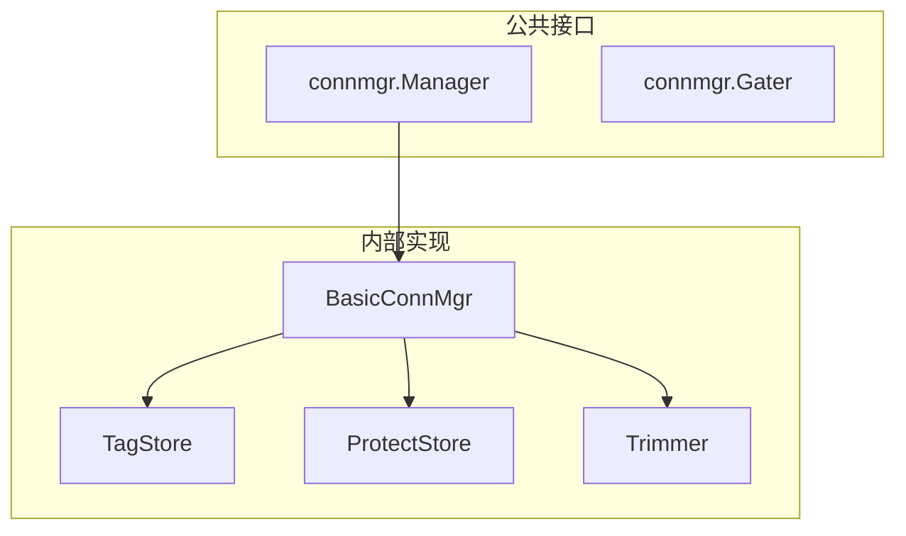

# core_connmgr 整体设计

> 模块架构与组件设计

---

## 模块架构



---

## 核心组件

### Manager

连接管理器主接口。

```
type Manager interface {
    // TagPeer 给节点添加标签
    TagPeer(peer types.NodeID, tag string, value int)
    
    // UntagPeer 移除标签
    UntagPeer(peer types.NodeID, tag string)
    
    // Protect 保护连接
    Protect(peer types.NodeID, tag string)
    
    // Unprotect 取消保护
    Unprotect(peer types.NodeID, tag string) bool
    
    // IsProtected 检查是否受保护
    IsProtected(peer types.NodeID, tag string) bool
    
    // TrimOpenConns 回收连接
    TrimOpenConns(ctx context.Context)
    
    // GetInfo 获取信息
    GetInfo() Info
}
```

### Gater

连接门控接口。

```
type Gater interface {
    // InterceptPeerDial 拦截拨号
    InterceptPeerDial(peer types.NodeID) bool
    
    // InterceptAccept 拦截入站
    InterceptAccept(conn net.Conn) bool
    
    // InterceptSecured 握手后拦截
    InterceptSecured(dir Direction, peer types.NodeID) bool
}
```

---

## 水位控制

```
┌─────────────────────────────────────────────────────────────────────────────┐
│                          水位控制机制                                        │
├─────────────────────────────────────────────────────────────────────────────┤
│                                                                             │
│  LowWater = 100                                                             │
│  HighWater = 200                                                            │
│                                                                             │
│  连接数 ≤ LowWater：不回收                                                   │
│  LowWater < 连接数 ≤ HighWater：可能回收                                     │
│  连接数 > HighWater：触发 Trim，回收至 LowWater                              │
│                                                                             │
└─────────────────────────────────────────────────────────────────────────────┘
```

---

## 优先级评分

```
func calculateScore(peer PeerInfo) int {
    score := 0
    
    // 标签权重
    for tag, value := range peer.Tags {
        score += value
    }
    
    // 方向加分
    if peer.Direction == Outbound {
        score += 10
    }
    
    // 活跃度
    if peer.StreamCount > 0 {
        score += 20
    }
    
    return score
}
```

---

## Fx 模块定义

```
var Module = fx.Module("connmgr",
    fx.Provide(
        NewManager,
        NewGater,
    ),
)
```

---

**最后更新**：2026-01-11
