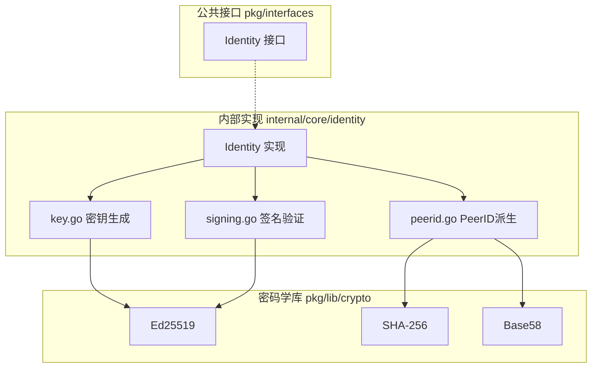
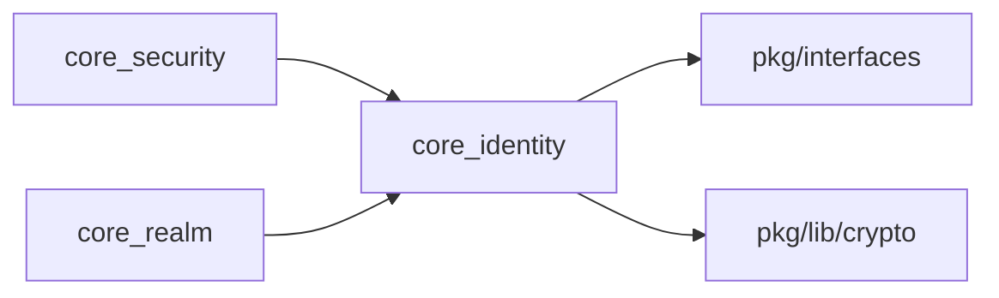

# core_identity 整体设计

> 模块架构与组件设计

---

## 模块架构



---

## 核心组件

> **NodeID 与 PeerID 的关系**：在 DeP2P 中，NodeID 是 PeerID 的类型别名（见 `pkg/types/ids.go`）。
> PeerID 采用 Base58 编码的 SHA256 公钥哈希，用于路由和身份标识的统一表示。

### Identity

主身份实现，提供身份管理能力。

```go
// internal/core/identity/identity.go

type Identity struct {
    peerID  string              // PeerID = NodeID（Base58 编码）
    privKey pkgif.PrivateKey    // 私钥接口
    pubKey  pkgif.PublicKey     // 公钥接口
}

func (i *Identity) PeerID() string
func (i *Identity) PublicKey() pkgif.PublicKey
func (i *Identity) PrivateKey() pkgif.PrivateKey
func (i *Identity) Sign(data []byte) ([]byte, error)
func (i *Identity) Verify(data, sig []byte) (bool, error)
```

### KeyManager

密钥生成与管理。

```
// 生成新密钥对
func GenerateKeyPair() (ed25519.PrivateKey, ed25519.PublicKey, error)

// 从字节恢复
func PrivateKeyFromBytes(raw []byte) (ed25519.PrivateKey, error)
```

### PeerID 派生

PeerID（= NodeID）派生逻辑。

```go
// internal/core/identity/peerid.go

// PeerID 派生：Base58(SHA256(公钥))
func PeerIDFromPublicKey(pubKey pkgif.PublicKey) (string, error) {
    raw, err := pubKey.Raw()
    if err != nil {
        return "", err
    }
    hash := sha256.Sum256(raw)
    return Base58Encode(hash[:]), nil  // Base58 字符串
}
```

---

## 对外接口

```go
// pkg/interfaces/identity.go

type Identity interface {
    // PeerID 返回节点 ID（= NodeID，从公钥派生的 Base58 字符串）
    PeerID() string
    
    // PublicKey 返回公钥
    PublicKey() PublicKey
    
    // PrivateKey 返回私钥
    PrivateKey() PrivateKey
    
    // Sign 使用私钥签名数据
    Sign(data []byte) ([]byte, error)
    
    // Verify 验证签名
    Verify(data, sig []byte) (bool, error)
}
```

---

## 依赖关系



| 依赖方向 | 模块 | 说明 |
|----------|------|------|
| 依赖 | pkg/interfaces | Identity/PublicKey/PrivateKey 接口定义 |
| 依赖 | pkg/lib/crypto | 密码学实现（Ed25519、PeerID 派生） |
| 被依赖 | core_security | 获取公钥用于 TLS |
| 被依赖 | core_realm | 成员认证签名 |

---

## Fx 模块定义

```go
// internal/core/identity/module.go

var Module = fx.Module("core_identity",
    fx.Provide(
        ProvideIdentity,  // 返回 pkgif.Identity
    ),
)

// ProvideIdentity 提供身份实例
// - 从配置加载私钥文件（如存在）
// - 否则生成新的 Ed25519 密钥对
// - 派生 PeerID 并返回 Identity 实例
func ProvideIdentity(cfg Config) (pkgif.Identity, error)
```

---

**最后更新**：2026-01-25
