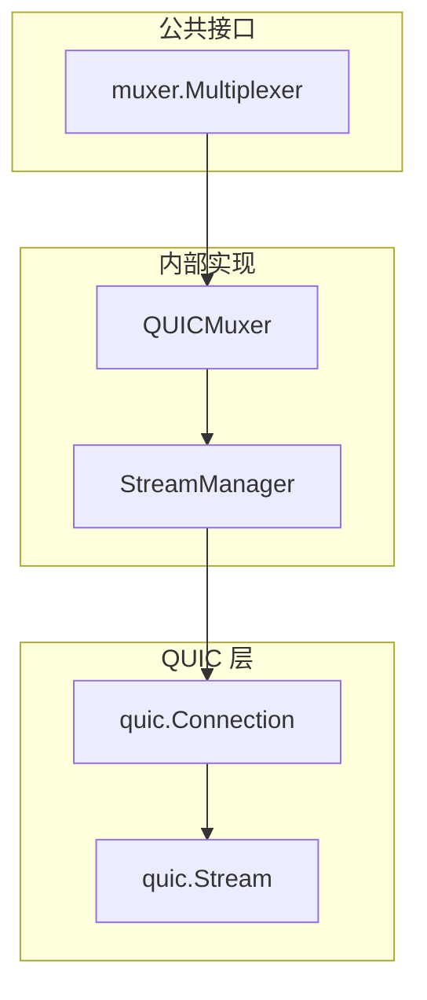
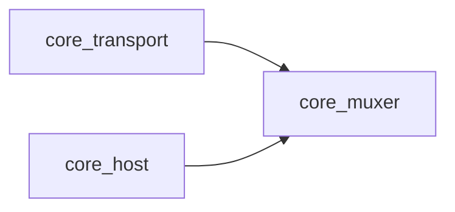

# core_muxer 整体设计

> 模块架构与组件设计

---

## 模块架构



---

## 核心组件

### Multiplexer

多路复用器接口。

```
type Multiplexer interface {
    // NewConn 包装连接为多路复用连接
    NewConn(conn net.Conn, isServer bool) (MuxedConn, error)
}
```

### MuxedConn

多路复用连接。

```
type MuxedConn interface {
    // OpenStream 打开新流
    OpenStream(ctx context.Context) (Stream, error)
    
    // AcceptStream 接受入站流
    AcceptStream() (Stream, error)
    
    // Close 关闭连接
    Close() error
    
    // IsClosed 检查是否已关闭
    IsClosed() bool
}
```

### Stream

多路复用流。

```
type Stream interface {
    io.ReadWriteCloser
    
    // Reset 强制重置流
    Reset() error
    
    // SetDeadline 设置超时
    SetDeadline(t time.Time) error
    SetReadDeadline(t time.Time) error
    SetWriteDeadline(t time.Time) error
}
```

---

## QUIC 多路复用

由于 DeP2P 使用 QUIC 作为传输层，多路复用由 QUIC 内置提供：

```
┌─────────────────────────────────────────────────────────────────────────────┐
│                          QUIC 多路复用特性                                    │
├─────────────────────────────────────────────────────────────────────────────┤
│                                                                             │
│  • 无队头阻塞：流独立，一个流阻塞不影响其他流                                  │
│  • 流量控制：连接级 + 流级双层控制                                            │
│  • 流 ID：客户端偶数，服务端奇数                                             │
│  • 流类型：双向流 + 单向流                                                   │
│                                                                             │
└─────────────────────────────────────────────────────────────────────────────┘
```

---

## 依赖关系



---

## Fx 模块定义

```
var Module = fx.Module("muxer",
    fx.Provide(
        NewMultiplexer,
        fx.Annotate(
            NewMultiplexer,
            fx.As(new(muxer.Multiplexer)),
        ),
    ),
)
```

---

**最后更新**：2026-01-11
