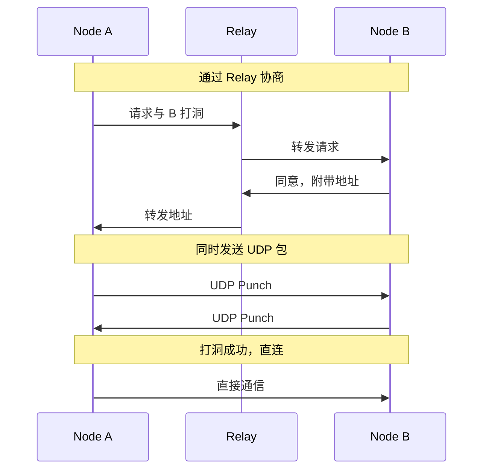

# core_nat 内部设计

> 内部结构与实现细节

---

## 内部结构

```
internal/core/nat/
├── module.go           # Fx 模块定义
├── service.go          # NAT 服务主实现
├── config.go           # 配置
├── errors.go           # 错误定义
├── autonat.go          # AutoNAT 客户端
├── autonat_server.go   # AutoNAT 服务端
├── stun/
│   ├── stun.go         # STUN 客户端（使用 pion/stun）
│   └── nattype.go      # NAT 类型检测（RFC 3489）
├── upnp/
│   └── upnp.go         # UPnP 端口映射（使用 huin/goupnp）
├── natpmp/
│   └── natpmp.go       # NAT-PMP 映射（使用 jackpal/go-nat-pmp）
├── holepunch/
│   ├── puncher.go      # UDP 打洞
│   ├── tcp_puncher.go  # TCP 打洞
│   ├── handler.go      # 协议处理器
│   └── protocol.go     # 协议消息定义
├── netreport/
│   ├── client.go       # NetReport 客户端
│   ├── report.go       # 网络报告生成
│   └── stun.go         # STUN 探测封装
└── *_test.go           # 单元测试
```

---

## ★ 候选地址 vs 可达地址（关键区分）

```
┌─────────────────────────────────────────────────────────────────────────────┐
│                    候选地址 vs 可达地址（★ 必须理解）                         │
├─────────────────────────────────────────────────────────────────────────────┤
│                                                                             │
│  候选地址（Candidate Address）                                               │
│  ═══════════════════════════════                                            │
│  • 来源：STUN 探测、UPnP 映射、Observed Address                             │
│  • 状态：未验证，可能不可达                                                  │
│  • 用途：打洞尝试、Reachability 验证输入                                    │
│  • ❌ 不能直接发布到 DHT/Relay 地址簿                                       │
│                                                                             │
│  可达地址（Verified Address）                                                │
│  ════════════════════════════════                                           │
│  • 来源：通过 Reachability/AutoNAT dialback 验证                            │
│  • 状态：经过验证，外部节点确实可达                                          │
│  • 用途：发布到 DHT、注册到 Relay 地址簿                                    │
│  • ✅ 可以对外公布                                                          │
│                                                                             │
│  地址状态流转：                                                              │
│  ──────────────                                                             │
│  Candidate → Validating → Verified → Published                              │
│      ↓           ↓                                                          │
│   (失效)      (失败)                                                        │
│                                                                             │
│  ★ 关键约束：                                                               │
│  • STUN/Observed 返回的是候选地址                                           │
│  • 必须经过 Reachability 模块验证后才能发布                                 │
│  • 直接发布候选地址会导致"不可达地址泛滥"                                   │
│                                                                             │
└─────────────────────────────────────────────────────────────────────────────┘
```

---

## STUN 实现

### 获取外部地址（★ 返回候选地址，需验证）

```pseudocode
// ★ 注意：返回的是候选地址，不能直接发布！
fn GetExternalAddr(ctx: Context) -> Result<Addr, Error> {
    // 1) 并行探测多个 STUN 服务器
    results := ProbeMultiple(ctx, primaryCount)
    if results.len() > 0 {
        // ★ 这是候选地址，需要 Reachability 验证后才能发布
        return Ok(results[0].MappedAddress)
    }

    // 2) 兜底探测：更长超时 + 更少服务器
    fallback := NewSTUNClient(servers, fallbackTimeout)
    fallbackResults := fallback.ProbeMultiple(ctx, fallbackCount)
    if fallbackResults.len() == 0 {
        return Err(ErrSTUNNoResult)
    }
    
    // ★ 同样是候选地址
    return Ok(fallbackResults[0].MappedAddress)
}
```

---

## UPnP 实现

使用 `github.com/huin/goupnp` 实现 UPnP IGD 端口映射。

### 端口映射

```go
// internal/core/nat/upnp/upnp.go

type UPnPMapper struct {
    client      IGDClient
    mappings    map[int]*Mapping
    coordinator pkgif.ReachabilityCoordinator  // 上报候选地址
}

func (u *UPnPMapper) MapPort(ctx context.Context, proto string, internal int) (int, error) {
    // 发现 UPnP 设备（IGDv1/IGDv2）
    devices, err := upnp.Discover()
    if err != nil {
        return 0, err
    }
    
    if len(devices) == 0 {
        return 0, ErrNoUPnPDevice
    }
    
    // 添加端口映射
    external := internal  // 尝试相同端口
    err = devices[0].AddPortMapping(proto, external, internal, "dep2p", 3600)
    if err != nil {
        return 0, err
    }
    
    // 上报到 Coordinator（作为候选地址）
    u.reportMappedAddressToCoordinator(proto, external)
    
    return external, nil
}

func (u *UPnPMapper) SetReachabilityCoordinator(coordinator pkgif.ReachabilityCoordinator)
```

---

## NAT-PMP 实现

使用 `github.com/jackpal/go-nat-pmp` 实现 NAT-PMP (Port Mapping Protocol)。

```go
// internal/core/nat/natpmp/natpmp.go

type NATPMPMapper struct {
    client      *natpmp.Client
    gateway     net.IP
    mappings    map[int]*Mapping
    coordinator pkgif.ReachabilityCoordinator  // 上报候选地址
}

func (n *NATPMPMapper) MapPort(ctx context.Context, proto string, internalPort int) (int, error)
func (n *NATPMPMapper) SetReachabilityCoordinator(coordinator pkgif.ReachabilityCoordinator)
```

**适用设备**：Apple Airport、部分支持 NAT-PMP 的路由器。

**映射流程**：
1. 发现默认网关（使用 `github.com/jackpal/gateway`）
2. 创建 NAT-PMP 客户端
3. 请求端口映射（支持 UDP/TCP）
4. 上报候选地址到 Coordinator

---

## AutoNAT 协议

AutoNAT 通过其他节点验证本节点的可达性（dial-back）。

### 客户端

```go
// internal/core/nat/autonat.go

type AutoNAT struct {
    host         Host
    reachability atomic.Value  // Reachability 状态
    
    // 探测配置
    probeInterval time.Duration
    minPeers      int
}

// runProbeLoop 周期性探测可达性
func (a *AutoNAT) runProbeLoop(ctx context.Context)

// GetReachability 返回当前可达性状态
func (a *AutoNAT) GetReachability() Reachability
```

### 服务端

```go
// internal/core/nat/autonat_server.go

type AutoNATServer struct {
    host Host
}

// HandleDialBackRequest 响应其他节点的 dial-back 请求
func (s *AutoNATServer) HandleDialBackRequest(ctx context.Context, req *DialBackRequest) *DialBackResponse
```

**协议流程**：
1. 客户端向 AutoNAT 服务端发送验证请求（包含候选地址）
2. 服务端尝试回连客户端的候选地址
3. 服务端返回验证结果（可达/不可达）
4. 客户端更新可达性状态

---

## Hole Punching

### ★ 打洞前置条件

```
┌─────────────────────────────────────────────────────────────────────────────┐
│                    打洞前置条件（★ 关键）                                     │
├─────────────────────────────────────────────────────────────────────────────┤
│                                                                             │
│  ⚠️ 打洞不是单机操作，需要信令通道！                                         │
│                                                                             │
│  前置条件：                                                                  │
│  ──────────                                                                 │
│  1. 信令通道已建立（通常是已建立的 Relay 连接）                              │
│  2. NAT 类型允许打洞（非双方 Symmetric NAT）                                 │
│  3. 观察地址有效（打洞窗口内，NAT 映射未超时）                               │
│                                                                             │
│  为什么需要信令通道？                                                        │
│  ─────────────────────                                                      │
│  • 双方都在 NAT 后，无法直接通信                                            │
│  • 需要交换候选地址才能尝试打洞                                              │
│  • Relay 连接作为已建立的双向通道，转发打洞协调消息                          │
│                                                                             │
│  ★ 无信令通道 = 无法打洞                                                    │
│                                                                             │
└─────────────────────────────────────────────────────────────────────────────┘
```

### 打洞流程

```pseudocode
fn DirectConnect(ctx: Context, peer: NodeID, addrs: []Multiaddr) -> Result<(), Error> {
    // ★ 前置检查：信令通道
    if !relay.IsConnected() {
        return Err(ErrNoSignalingChannel)  // 无信令通道无法打洞
    }
    
    // ★ 前置检查：NAT 类型
    myNAT := getNATType()
    peerNAT := relay.QueryAddress(peer).natType
    if myNAT == Symmetric && peerNAT == Symmetric {
        return Err(ErrSymmetricNAT)  // 双方 Symmetric NAT 无法打洞
    }
    
    // 1. 通过 Relay 信令通道协商打洞
    stream := relay.OpenSignalingStream(peer)
    
    // 2. 交换候选地址（★ 注意：是候选地址，可能不稳定）
    myAddrs := getObservedAddrs()  // 候选地址
    writeAddrs(stream, myAddrs)
    
    peerAddrs := readAddrs(stream)
    
    // 3. 同时发送包尝试打洞
    for addr in peerAddrs {
        go sendPunch(addr)
    }
    
    // 4. 等待连接建立
    select {
        case conn := <-newConnChan:
            if conn.RemotePeer() == peer {
                return Ok(())
            }
        case <-ctx.Done():
            return Err(ctx.Err())
    }
    
    return Err(ErrHolePunchFailed)
}
```

### 打洞协议



---

## 错误处理

```pseudocode
// NAT 模块错误定义
const (
    ErrNoUPnPDevice       = "nat: no UPnP device found"
    ErrHolePunchFailed    = "nat: hole punch failed"
    ErrSymmetricNAT       = "nat: symmetric NAT detected, hole punch not possible"
    ErrNoSignalingChannel = "nat: no signaling channel available for hole punch"  // ★ 新增
    ErrSTUNNoResult       = "nat: STUN probe returned no result"
    ErrCandidateExpired   = "nat: candidate address expired"  // ★ 新增
)
```

---

## 相关文档

| 文档 | 说明 |
|------|------|
| [overview.md](overview.md) | 整体设计 |
| [core_relay](../../core_relay/) | Relay 信令通道 |
| [core_reachability](../../core_reachability/) | 地址可达性验证 |

---

**最后更新**：2026-01-25
