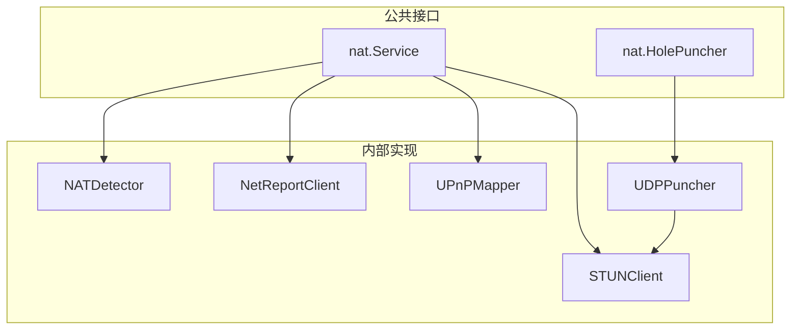
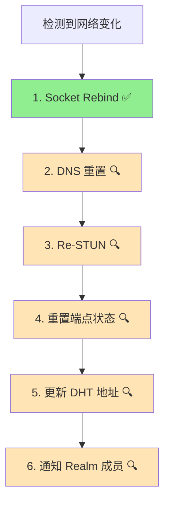

# core_nat 整体设计

> 模块架构与组件设计

---

## 模块架构



---

## 核心组件

### Service 接口

```pseudocode
interface Service {
    // GetExternalAddr 获取外部地址（★ 候选地址，需验证）
    GetExternalAddr() -> Result<Multiaddr, Error>
    
    // MapPort 映射端口
    MapPort(ctx: Context, proto: string, port: int) -> Result<int, Error>
    
    // UnmapPort 取消映射
    UnmapPort(proto: string, port: int) -> Result<(), Error>
    
    // Reachability 返回可达性
    Reachability() -> Reachability
}
```

### ★ 候选地址 vs 可发布地址

```
┌─────────────────────────────────────────────────────────────────────────────┐
│                    候选地址 vs 可发布地址（关键区分）                         │
├─────────────────────────────────────────────────────────────────────────────┤
│                                                                             │
│  GetExternalAddr() 返回的是【候选地址】：                                    │
│  • 来源：STUN 探测、UPnP 映射、观察地址                                     │
│  • 状态：未验证，可能不可达                                                  │
│  • 用途：作为打洞候选、Reachability 验证输入                                │
│                                                                             │
│  可发布地址需要经过【Reachability 验证】：                                   │
│  • 验证：通过 dialback 或 AutoNAT 确认可达性                                │
│  • 状态：Candidate → Validating → Reachable → Published                    │
│  • 用途：发布到 DHT、通知 Relay 地址簿                                      │
│                                                                             │
│  ★ 关键约束：                                                               │
│  • 不要直接发布 GetExternalAddr() 的结果                                    │
│  • 必须经过 Reachability 模块验证                                           │
│  • 观察地址（多来源）需要一致性检查                                          │
│                                                                             │
└─────────────────────────────────────────────────────────────────────────────┘
```

### HolePuncher 接口

```pseudocode
interface HolePuncher {
    // DirectConnect 尝试直连
    DirectConnect(ctx: Context, peer: NodeID, addrs: []Multiaddr) -> Result<(), Error>
    
    // HolePunch 通过信令通道协调打洞
    HolePunch(ctx: Context, peer: NodeID, signaling: SignalingChannel) -> Result<Connection, Error>
    
    // CanHolePunch 判断是否值得尝试打洞
    CanHolePunch(localNAT: NATType, remoteNAT: NATType) -> bool
}
```

### NetReport 诊断（内部依赖）

- 提供 IPv4/IPv6 连通性、NAT 类型、STUN 探测结果
- 为 Reachability 和地址发布提供依据
- STUN 探测支持多服务器与兜底重试

---

## ★ UDP vs TCP 打洞差异

```
┌─────────────────────────────────────────────────────────────────────────────┐
│                    UDP vs TCP 打洞差异                                        │
├─────────────────────────────────────────────────────────────────────────────┤
│                                                                             │
│  ⚠️ DeP2P 使用 QUIC（基于 UDP），主要讨论 UDP 打洞                           │
│                                                                             │
│  UDP 打洞：                                                                  │
│  ══════════                                                                 │
│  • 成功率较高（无连接状态）                                                  │
│  • 双方同时发包即可"打洞"                                                   │
│  • NAT 只需看到出站包即建立映射                                              │
│  • 适合 P2P 场景（QUIC、WebRTC ICE）                                        │
│                                                                             │
│  TCP 打洞：                                                                  │
│  ══════════                                                                 │
│  • 成功率较低（需要精确时序）                                                │
│  • 需要 TCP Simultaneous Open（同时打开）                                   │
│  • 实现复杂：需要绑定相同本地端口、处理 RST 等                               │
│  • 某些 NAT 不支持 TCP 打洞                                                  │
│                                                                             │
│  对比：                                                                      │
│  ┌──────────────────────────────────────────────────────────────────────┐   │
│  │       特性            UDP 打洞           TCP 打洞                    │   │
│  ├──────────────────────────────────────────────────────────────────────┤   │
│  │   成功率             较高               较低                         │   │
│  │   实现复杂度         低                 高                           │   │
│  │   时序要求           宽松               严格（需同时发 SYN）         │   │
│  │   NAT 兼容性         好                 差（部分 NAT 不支持）        │   │
│  └──────────────────────────────────────────────────────────────────────┘   │
│                                                                             │
│  ★ DeP2P 选择 QUIC-only（基于 UDP），主要考虑 UDP 打洞的高成功率            │
│                                                                             │
└─────────────────────────────────────────────────────────────────────────────┘
```

---

## ★ 打洞地址的适用条件与限制

```
┌─────────────────────────────────────────────────────────────────────────────┐
│                    打洞地址的适用条件与限制                                   │
├─────────────────────────────────────────────────────────────────────────────┤
│                                                                             │
│  ⚠️ 观察地址不一定适合打洞，需要满足以下条件：                               │
│                                                                             │
│  适用条件：                                                                  │
│  ──────────                                                                 │
│  ✅ NAT 类型为 Cone NAT（Full/Restricted/Port Restricted）                  │
│  ✅ 观察地址与打洞使用相同协议（UDP/UDP 或 TCP/TCP）                        │
│  ✅ 观察地址在打洞窗口内仍然有效                                            │
│                                                                             │
│  不适用情况：                                                                │
│  ──────────────                                                             │
│  ❌ Symmetric NAT：每个连接分配不同端口，观察地址对其他目标无效              │
│  ❌ 协议不匹配：TCP 连接获取的地址不能用于 UDP 打洞                         │
│  ❌ 地址已过期：NAT 映射超时后地址失效                                       │
│  ❌ 端口复用场景：多个应用共享端口时可能冲突                                 │
│                                                                             │
│  最佳实践：                                                                  │
│  ──────────                                                                 │
│  • 打洞前重新获取最新的外部地址                                              │
│  • 结合 NAT 类型检测判断打洞可行性                                          │
│  • Symmetric NAT 应跳过打洞直接使用 Relay                                   │
│                                                                             │
└─────────────────────────────────────────────────────────────────────────────┘
```

---

## ★ 打洞决策算法

```pseudocode
function canHolePunch(localNAT: NATType, remoteNAT: NATType) -> bool {
    // 双方都是 Symmetric NAT → 直接放弃，使用 Relay
    if localNAT == Symmetric && remoteNAT == Symmetric {
        return false
    }
    
    // 任一方是 Symmetric，成功率较低，但仍可尝试
    if localNAT == Symmetric || remoteNAT == Symmetric {
        // 对方不是 Symmetric 时仍有机会
        return remoteNAT != Symmetric || localNAT != Symmetric
    }
    
    // 其他 Cone NAT 组合，值得尝试
    return true
}

function selectConnectionStrategy(localNAT: NATType, remoteNAT: NATType) -> Strategy {
    // 优先级 1: 直连（对方公网可达）
    if remoteReachability == Public {
        return Strategy.Direct
    }
    
    // 优先级 2: 打洞（NAT 类型允许）
    if canHolePunch(localNAT, remoteNAT) {
        return Strategy.HolePunch
    }
    
    // 优先级 3: Relay 保底
    return Strategy.Relay
}
```

---

## NAT 类型

```
┌─────────────────────────────────────────────────────────────────────────────┐
│                          NAT 类型                                            │
├─────────────────────────────────────────────────────────────────────────────┤
│                                                                             │
│  Full Cone                                                                  │
│  • 映射后任意外部主机可访问                                                  │
│  • 最容易穿透                                                               │
│                                                                             │
│  Restricted Cone                                                            │
│  • 只有通信过的 IP 可访问                                                   │
│  • 需要先发送包                                                             │
│                                                                             │
│  Port Restricted Cone                                                       │
│  • 只有通信过的 IP:Port 可访问                                              │
│  • 需要先发送包到正确端口                                                   │
│                                                                             │
│  Symmetric                                                                  │
│  • 每个目标不同映射                                                         │
│  • 最难穿透，通常需要中继                                                   │
│                                                                             │
└─────────────────────────────────────────────────────────────────────────────┘
```

---

## 可达性状态

```
type Reachability int

const (
    ReachabilityUnknown  Reachability = iota
    ReachabilityPublic   // 公网可达
    ReachabilityPrivate  // NAT 后
)
```

---

## Fx 模块定义

```
var Module = fx.Module("nat",
    fx.Provide(
        NewService,
        NewHolePuncher,
    ),
)
```

---

## 网络变化处理

### Major Change 处理流程（v1.0 实现状态）



### 实现覆盖情况

| 步骤 | 实现位置 | 状态 | 说明 |
|------|----------|------|------|
| 1. Socket Rebind | `internal/core/transport/quic/rebind.go` | ✅ 已实现 | 关闭旧 socket，创建新 socket，更新地址缓存 |
| 2. DNS 重置 | - | 🔍 待定位 | 需确认 DNS resolver 重置逻辑 |
| 3. Re-STUN | `internal/core/nat/netreport/client.go` | 🔍 需确认 | NetReport 是否自动触发重新探测 |
| 4. 重置端点状态 | - | 🔍 待定位 | 需确认 Swarm/Transport 状态重置 |
| 5. 更新 DHT 地址 | - | 🔍 待定位 | 需确认 DHT 地址更新机制 |
| 6. 通知 Realm 成员 | `internal/realm/protocol/capability.go` | ✅ 已实现 | `ReBroadcast()` 方法重新广播能力 |

### 网络监控组件

```
组件结构：

  internal/core/recovery/netmon/
  ├── monitor.go           # 网络监控器（Prober + SystemWatcher）
  ├── config.go            # 配置参数（抖动容忍、退避策略）
  └── status.go            # 连接健康状态管理
  
  实现特性：
  • 系统级事件监听（平台原生）
  • 主动探测（Prober）
  • 状态机：Healthy → Degraded → Down → Recovering
  • 抖动容忍参数：
    - ErrorThreshold: 错误阈值
    - ProbeInterval: 探测间隔
    - StateChangeDebounce: 状态变化去抖
```

### 配置参数对照

| 规范参数 | 实现参数 | 位置 | 说明 |
|---------|---------|------|------|
| ToleranceWindow | StateChangeDebounce | `netmon/config.go` | 容错窗口/状态去抖 |
| StateHoldTime | - | - | 状态保持时间（未明确实现） |
| InitialReconnectDelay | InitialBackoff | `netmon/config.go` | 初始重连/退避延迟 |
| MaxReconnectDelay | MaxBackoff | `netmon/config.go` | 最大重连/退避延迟 |
| MaxReconnectAttempts | MaxRecoveryAttempts | `netmon/config.go` | 最大重连/恢复次数 |
| BackoffMultiplier | BackoffFactor | `netmon/config.go` | 退避乘数/因子 |

⚠️ **v1.0 状态**：核心网络监控已实现，Major Change 6 步流程部分覆盖，部分步骤需进一步确认和集成。

---

**最后更新**：2026-01-23
