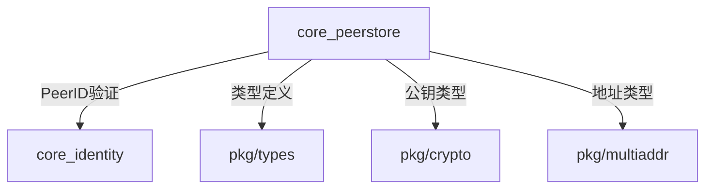
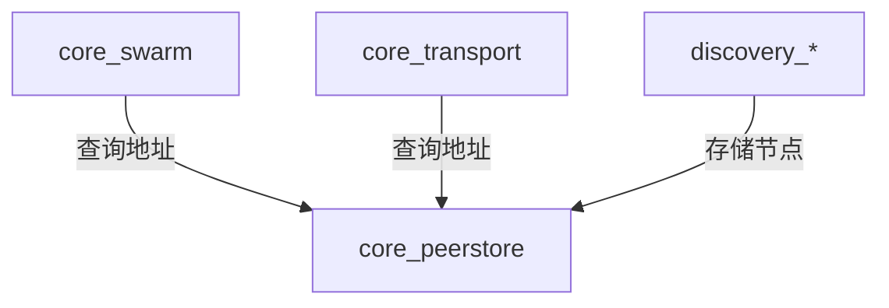

# 需求追溯

> **版本**: v1.1.0  
> **更新日期**: 2026-01-13  
> **状态**: ✅ 已完善

---

## 一、功能需求

### 1.1 地址簿 (AddrBook)

| 需求ID | 需求描述 | 优先级 | 来源 |
|--------|----------|--------|------|
| FR-AB-01 | 存储节点的多地址（Multiaddr） | P0 | 核心功能 |
| FR-AB-02 | 支持地址 TTL 管理（时间到期自动失效） | P0 | 节点发现 |
| FR-AB-03 | 支持添加地址（AddAddrs）和设置地址（SetAddrs） | P0 | 核心功能 |
| FR-AB-04 | 支持查询节点地址（Addrs） | P0 | 连接管理 |
| FR-AB-05 | 支持清除节点地址（ClearAddrs） | P0 | 节点清理 |
| FR-AB-06 | 支持地址流（AddrStream）实时推送地址更新 | P1 | 连接管理 |
| FR-AB-07 | 自动 GC 清理过期地址 | P0 | 内存管理 |
| FR-AB-08 | 地址优先级排序（连接成功的地址优先） | P1 | 连接优化 |

### 1.2 密钥簿 (KeyBook)

| 需求ID | 需求描述 | 优先级 | 来源 |
|--------|----------|--------|------|
| FR-KB-01 | 存储节点公钥（PubKey） | P0 | 身份验证 |
| FR-KB-02 | 支持添加公钥（AddPubKey） | P0 | 核心功能 |
| FR-KB-03 | 支持查询公钥（PubKey） | P0 | 身份验证 |
| FR-KB-04 | 验证 PeerID 与公钥的匹配性 | P0 | 安全性 |
| FR-KB-05 | 自动从 PeerID 提取内嵌公钥（Ed25519） | P1 | 便利性 |
| FR-KB-06 | 查询拥有密钥的节点列表（PeersWithKeys） | P1 | 节点管理 |

### 1.3 协议簿 (ProtoBook)

| 需求ID | 需求描述 | 优先级 | 来源 |
|--------|----------|--------|------|
| FR-PB-01 | 存储节点支持的协议列表 | P0 | 协议协商 |
| FR-PB-02 | 支持添加协议（AddProtocols） | P0 | 核心功能 |
| FR-PB-03 | 支持设置协议（SetProtocols，覆盖） | P0 | 核心功能 |
| FR-PB-04 | 支持查询协议（GetProtocols） | P0 | 协议协商 |
| FR-PB-05 | 支持协议能力查询（SupportsProtocols） | P0 | 协议协商 |
| FR-PB-06 | 支持移除协议（RemoveProtocols） | P1 | 协议管理 |
| FR-PB-07 | 支持首个匹配协议查询（FirstSupportedProtocol） | P1 | 协议协商 |

### 1.4 元数据簿 (MetadataBook)

| 需求ID | 需求描述 | 优先级 | 来源 |
|--------|----------|--------|------|
| FR-MB-01 | 存储节点的键值对元数据 | P0 | 扩展性 |
| FR-MB-02 | 支持存储元数据（Put） | P0 | 核心功能 |
| FR-MB-03 | 支持查询元数据（Get） | P0 | 核心功能 |
| FR-MB-04 | 支持任意类型值（interface{}） | P1 | 灵活性 |

### 1.5 整体功能

| 需求ID | 需求描述 | 优先级 | 来源 |
|--------|----------|--------|------|
| FR-PS-01 | 查询所有已知节点（Peers） | P0 | 节点管理 |
| FR-PS-02 | 查询节点完整信息（PeerInfo） | P0 | 节点管理 |
| FR-PS-03 | 支持关闭存储（Close） | P0 | 生命周期 |
| FR-PS-04 | 支持移除节点（RemovePeer） | P1 | 节点管理 |

---

## 二、非功能需求

### 2.1 性能需求

| 需求ID | 需求描述 | 目标值 | 优先级 |
|--------|----------|--------|--------|
| NFR-P-01 | 地址查询延迟 | < 1ms | P0 |
| NFR-P-02 | 密钥查询延迟 | < 1ms | P0 |
| NFR-P-03 | 协议查询延迟 | < 1ms | P0 |
| NFR-P-04 | 支持并发读写 | 无锁竞争 | P0 |
| NFR-P-05 | 内存占用 | < 10MB (1000 节点) | P1 |
| NFR-P-06 | GC 清理频率 | 每分钟 | P1 |

### 2.2 可靠性需求

| 需求ID | 需求描述 | 优先级 |
|--------|----------|--------|
| NFR-R-01 | 并发安全（线程安全） | P0 |
| NFR-R-02 | 无数据竞态（race-free） | P0 |
| NFR-R-03 | 地址过期自动清理 | P0 |
| NFR-R-04 | 优雅关闭（Close 清理资源） | P0 |

### 2.3 可维护性需求

| 需求ID | 需求描述 | 优先级 |
|--------|----------|--------|
| NFR-M-01 | 接口与实现分离（pkg/interfaces） | P0 |
| NFR-M-02 | 子簿独立模块（AddrBook, KeyBook, etc.） | P0 |
| NFR-M-03 | 完整的单元测试（覆盖率 > 80%） | P0 |
| NFR-M-04 | 清晰的 GoDoc 文档 | P0 |

### 2.4 可扩展性需求

| 需求ID | 需求描述 | 优先级 |
|--------|----------|--------|
| NFR-E-01 | 统一使用 BadgerDB 持久化存储（v1.1.0+） | P0 |
| NFR-E-02 | 支持 Metrics 统计（可选） | P2 |

---

## 三、接口需求

### 3.1 类型定义

```go
// 必须使用 pkg/types 定义的类型
- types.PeerID        // 节点 ID
- types.Multiaddr     // 多地址
- types.ProtocolID    // 协议 ID
- crypto.PubKey       // 公钥
```

### 3.2 接口契约

```go
// pkg/interfaces/peerstore.go
type Peerstore interface {
    // 地址管理
    AddAddrs(peer types.PeerID, addrs []types.Multiaddr, ttl time.Duration)
    SetAddrs(peer types.PeerID, addrs []types.Multiaddr, ttl time.Duration)
    Addrs(peer types.PeerID) []types.Multiaddr
    ClearAddrs(peer types.PeerID)
    AddrStream(ctx context.Context, peer types.PeerID) <-chan types.Multiaddr
    
    // 密钥管理
    PubKey(peer types.PeerID) (crypto.PubKey, error)
    AddPubKey(peer types.PeerID, key crypto.PubKey) error
    
    // 协议管理
    GetProtocols(peer types.PeerID) ([]types.ProtocolID, error)
    AddProtocols(peer types.PeerID, protos ...types.ProtocolID) error
    SetProtocols(peer types.PeerID, protos ...types.ProtocolID) error
    SupportsProtocols(peer types.PeerID, protos ...types.ProtocolID) ([]types.ProtocolID, error)
    
    // 元数据管理
    Get(peer types.PeerID, key string) (interface{}, error)
    Put(peer types.PeerID, key string, val interface{}) error
    
    // 节点查询
    Peers() []types.PeerID
    PeerInfo(peer types.PeerID) types.PeerInfo
    
    // 生命周期
    Close() error
}
```

---

## 四、约束与限制

### 4.1 技术约束

| 约束ID | 约束描述 | 影响 |
|--------|----------|------|
| TC-01 | 必须使用 Go 标准库 sync.RWMutex 保证并发安全 | 架构设计 |
| TC-02 | 必须使用 container/heap 实现 GC 清理 | 实现方式 |
| TC-03 | 不依赖 libp2p 包（DeP2P 是独立实现） | 第三方依赖 |
| TC-04 | 依赖 core_identity 模块（PeerID 验证） | 模块依赖 |

### 4.2 设计约束

| 约束ID | 约束描述 | 影响 |
|--------|----------|------|
| DC-01 | 遵循 DIP（依赖倒置原则） | 接口设计 |
| DC-02 | 子簿独立（AddrBook, KeyBook, ProtoBook, Metadata） | 模块划分 |
| DC-03 | 地址 TTL 常量需参考 go-libp2p | 常量定义 |

---

## 五、用例场景

### 5.1 节点发现后存储地址

```
前置条件: 通过 DHT 发现了新节点
主流程:
  1. 调用 AddAddrs(peerID, addrs, DiscoveredAddrTTL)
  2. 地址存储到 AddrBook，设置 10 分钟 TTL
  3. 10 分钟后 GC 自动清理过期地址
后置条件: 地址可通过 Addrs(peerID) 查询
```

### 5.2 连接成功后更新地址 TTL

```
前置条件: 已存储节点地址，连接成功
主流程:
  1. 调用 SetAddrs(peerID, addrs, ConnectedAddrTTL)
  2. 地址 TTL 更新为 30 分钟
  3. 连接断开后，TTL 降级为 TempAddrTTL
后置条件: 连接成功的地址优先级更高
```

### 5.3 验证节点公钥

```
前置条件: 收到节点的 Identify 消息，包含公钥
主流程:
  1. 调用 AddPubKey(peerID, pubKey)
  2. 内部验证 peerID 是否由 pubKey 派生
  3. 验证通过后存储，失败返回 ErrInvalidPublicKey
后置条件: 公钥可通过 PubKey(peerID) 查询
```

### 5.4 协议协商

```
前置条件: 节点支持多个协议
主流程:
  1. 调用 SetProtocols(peerID, ["/dep2p/sys/dht/1.0.0", "/dep2p/relay/1.0.0/hop", "/dep2p/relay/1.0.0/stop"])
  2. 存储协议列表到 ProtoBook
  3. 调用 SupportsProtocols(peerID, ["/dep2p/sys/dht/1.0.0"])
  4. 返回支持的协议列表
后置条件: 协议列表可用于后续连接
```

---

## 六、依赖关系

### 6.1 上游依赖



### 6.2 下游依赖



---

## 七、测试需求

### 7.1 单元测试

| 测试ID | 测试描述 | 优先级 |
|--------|----------|--------|
| UT-01 | 测试地址添加、查询、清除 | P0 |
| UT-02 | 测试地址 TTL 过期 | P0 |
| UT-03 | 测试 GC 清理过期地址 | P0 |
| UT-04 | 测试公钥添加、查询、验证 | P0 |
| UT-05 | 测试协议添加、查询、能力查询 | P0 |
| UT-06 | 测试元数据存储、查询 | P0 |
| UT-07 | 测试并发读写安全 | P0 |
| UT-08 | 测试竞态检测（go test -race） | P0 |

### 7.2 集成测试

| 测试ID | 测试描述 | 优先级 |
|--------|----------|--------|
| IT-01 | 测试 Fx 模块加载 | P0 |
| IT-02 | 测试与 core_identity 集成 | P0 |
| IT-03 | 测试多个子簿协同工作 | P0 |

### 7.3 覆盖率目标

- **总覆盖率**: > 80%
- **核心模块**: > 85%
- **并发测试**: 必须通过竞态检测

---

## 八、参考资料

| 资料 | 说明 |
|------|------|
| [go-libp2p peerstore](https://github.com/libp2p/go-libp2p/tree/master/p2p/host/peerstore) | 参考实现 |
| [go-libp2p core/peerstore](https://github.com/libp2p/go-libp2p/tree/master/core/peerstore) | 接口定义 |
| [DeP2P 架构文档](../../20260113-architecture-v1.1.0.md) | 架构规范 |
| [工程标准](../../../../02_constraints/engineering/standards/) | 编码规范 |

---

**最后更新**：2026-01-13
