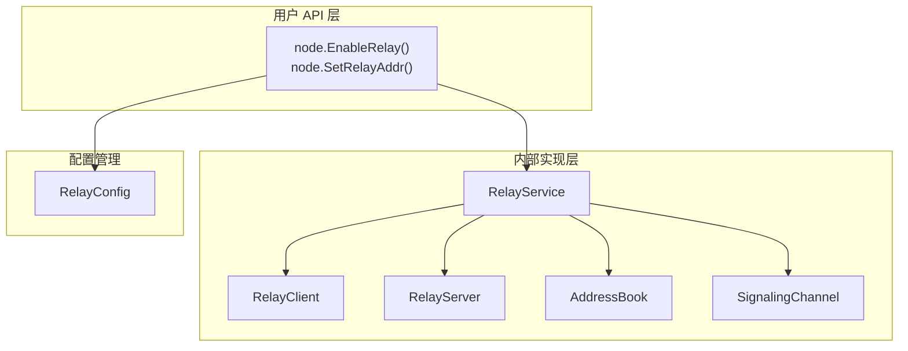
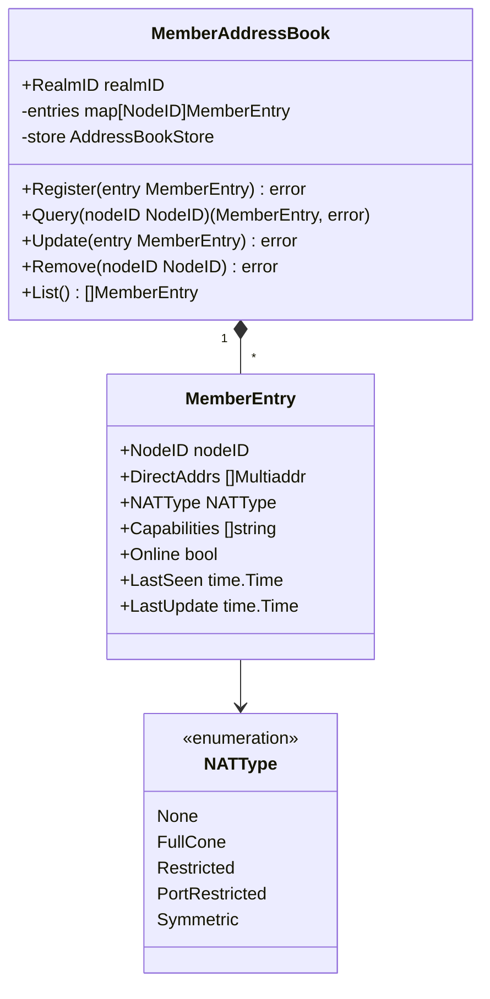
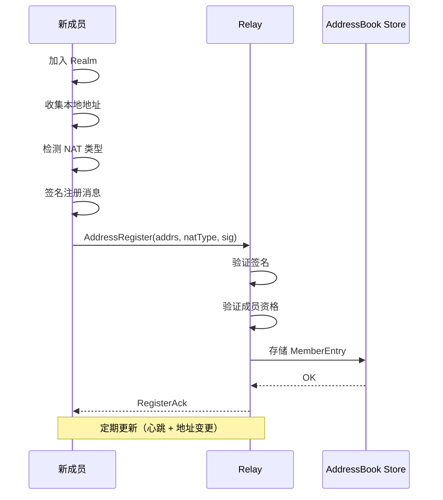
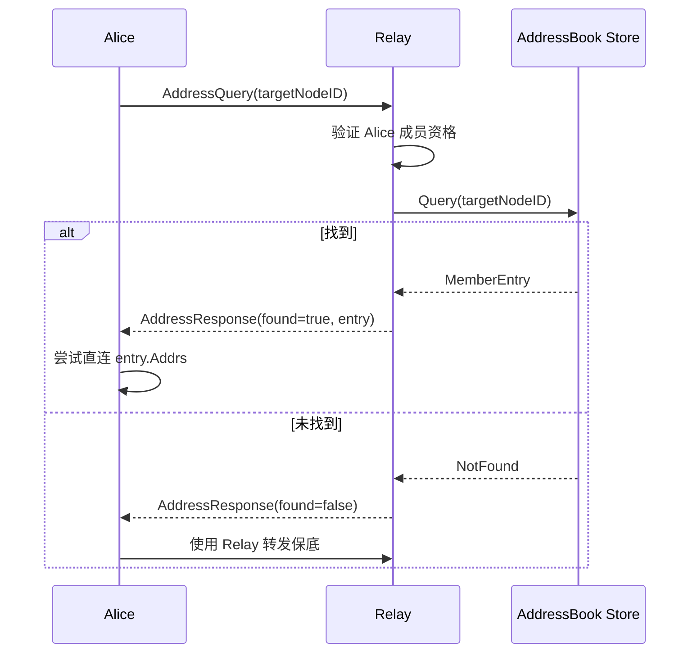

# core_relay 整体设计

> 模块架构与组件设计

---

## L3/L6 边界说明

| 本文档 (L6) | L3_behavioral |
|------------|---------------|
| RelayService/AddressBook 接口定义 | Relay 三大职责、惰性中继策略 |
| MemberEntry 数据结构 | 打洞协调时序、连接优先级 |
| 协议消息定义（AddressRegister/Query/Response） | 地址簿行为描述 |
| 持久化存储接口 | 地址更新触发条件 |

**参考**：
- Relay 行为流程参见 [L3: relay_flow.md](../../../L3_behavioral/relay_flow.md)
- 节点启动时的 Relay 配置参见 [L3: lifecycle_overview.md](../../../L3_behavioral/lifecycle_overview.md)

---

## 设计原则

```
┌─────────────────────────────────────────────────────────────────────────────┐
│                          core_relay 设计原则                                 │
├─────────────────────────────────────────────────────────────────────────────┤
│                                                                             │
│  ★ 核心理念：中继是系统能力，对用户透明                                     │
│                                                                             │
│  • P2P 优先：中继是兜底，不是常态                                           │
│  • 惰性连接：按需使用，直连失败才走中继                                     │
│  • 透明使用：用户无需关心中继，系统自动处理                                 │
│  • 显式配置：Relay 地址通过配置指定（ADR-0010），而非自动发现               │
│  • 统一设计：单一 Relay 概念，无控制面/数据面分层                           │
│  • ★ 三大职责 v2.0：缓存加速层 + 打洞协调信令 + 数据通信保底                │
│  • ★ 打洞后保留：打洞成功后保留 Relay 连接作为备份                          │
│                                                                             │
└─────────────────────────────────────────────────────────────────────────────┘
```

---

## ★ Relay 三大职责 v2.0（核心设计）

```
┌─────────────────────────────────────────────────────────────────────────────┐
│                    Relay 三大职责 v2.0（★ 核心概念）                         │
├─────────────────────────────────────────────────────────────────────────────┤
│                                                                             │
│  职责一：缓存加速层（非权威目录，DHT 是权威）                               │
│  ═══════════════════════════════════════════════                            │
│                                                                             │
│  Alice ──"Bob 地址？"──▶ Relay ──"2.2.2.2:4001"──▶ Alice ──直连──▶ Bob    │
│                                                                             │
│  • Relay 维护所有连接成员的地址信息（MemberAddressBook）                    │
│  • 成员加入 Realm 时向 Relay 注册地址                                       │
│  • 成员可查询其他成员地址，然后尝试直连                                     │
│  • 设计目标：70-80% 连接通过地址发现实现直连                                │
│                                                                             │
│  第二层：信令通道（Signaling Channel）                                      │
│  ═══════════════════════════════════════════════                            │
│                                                                             │
│  Alice ──CONNECT_REQ──▶ Relay ──转发──▶ Bob                                │
│  Alice ◀──CONNECT_RSP── Relay ◀──转发── Bob                                │
│  Alice ◀═══════════════ 打洞 ═══════════════▶ Bob                          │
│                                                                             │
│  • 打洞需要双方交换地址，但双方 NAT 后无法直接通信                          │
│  • Relay 作为已建立的双向通道，转发打洞协调消息                             │
│  • ★ 无信令通道 = 无法打洞                                                  │
│                                                                             │
│  第三层：数据通信保底（Data Relay Fallback）                                │
│  ═══════════════════════════════════════════════                            │
│                                                                             │
│  Alice ─────────[Relay 转发]───────── Bob                                   │
│                                                                             │
│  • 只有直连和打洞都失败时才使用 Relay 转发                                  │
│  • 确保 Realm 成员总是可达（真正的保底）                                    │
│  • ★ 打洞成功后保留 Relay 连接作为备份                                      │
│                                                                             │
└─────────────────────────────────────────────────────────────────────────────┘
```

---

## 模块架构



---

## 核心组件

### RelayService（统一中继服务）

```pseudocode
// 统一中继服务 - 三大职责 v2.0
interface RelayService {
    // 配置管理（通过 node.* 调用）
    SetRelayAddr(addr: Multiaddr) -> Result<(), Error>    // 配置 Relay 地址
    RemoveRelay() -> Result<(), Error>                    // 移除配置
    GetRelayAddr() -> Option<Multiaddr>                   // 获取配置
    State() -> RelayState                                 // 获取状态
    
    // 连接管理（内部自动调用）
    Connect(ctx: Context) -> Result<(), Error>            // 连接中继
    Disconnect() -> Result<(), Error>                     // 断开连接
    IsConnected() -> bool                                 // 检查连接状态
    
    // ★ 地址发现（第一层作用）
    QueryAddress(target: NodeID) -> Result<MemberEntry, Error>
    RegisterAddress(entry: MemberEntry) -> Result<(), Error>
    
    // ★ 信令通道（第二层作用）
    SendSignaling(target: NodeID, msg: SignalingMsg) -> Result<(), Error>
    OnSignaling(handler: fn(SignalingMsg))
    
    // ★ 数据转发（职责三：数据通信保底）
    DialViaRelay(ctx: Context, target: NodeID) -> Result<Connection, Error>
    
    // 成为中继
    EnableRelay(ctx: Context) -> Result<(), Error>
}
```

### RelayClient（中继客户端）

```pseudocode
// 中继客户端 - 连接到中继服务器
struct RelayClient {
    addr: Multiaddr
    conn: Connection
    state: RelayState
    addressBook: AddressBookClient     // 地址簿客户端
    signaling: SignalingClient         // 信令通道客户端
}

fn Connect(ctx: Context) -> Result<(), Error>
fn Dial(ctx: Context, target: NodeID) -> Result<Connection, Error>
fn QueryAddress(target: NodeID) -> Result<MemberEntry, Error>
fn SendSignaling(target: NodeID, msg: SignalingMsg) -> Result<(), Error>
fn Close() -> Result<(), Error>
```

### RelayServer（中继服务端）

```pseudocode
// 中继服务端 - 提供中继服务
struct RelayServer {
    addressBook: MemberAddressBook     // 地址簿（第一层）
    signaling: SignalingService        // 信令服务（第二层）
    relay: RelayTransport              // 数据转发（第三层）
    limiter: ResourceLimiter           // 资源限制
    
    // ★ Relay 预留配置
    reservationTTL: Duration           // 默认 1h
    renewalInterval: Duration          // 默认 30min
    renewalWindow: Duration            // 续期窗口 5min
    maxRenewalFailures: int            // 最大续期失败次数 3
}

fn Start(ctx: Context) -> Result<(), Error>
fn Stop() -> Result<(), Error>
fn HandleConnect(conn: Connection) -> Result<(), Error>
fn HandleAddressQuery(req: AddressQuery) -> Result<AddressResponse, Error>
fn HandleSignaling(msg: SignalingMsg) -> Result<(), Error>
```

---

## 统一 Relay 设计 (INV-003)

```
┌─────────────────────────────────────────────────────────────────────────────┐
│                          统一 Relay 设计                                     │
├─────────────────────────────────────────────────────────────────────────────┤
│                                                                             │
│  ★ 单一 Relay 概念，三大职责 v2.0：                                         │
│  ─────────────────────────────                                              │
│  1. 缓存加速层：维护成员地址簿（DHT 本地缓存），支持"仅 ID 连接"            │
│  2. 信令通道：转发打洞协调消息                                              │
│  3. 数据保底：直连/打洞失败后的通信保障                                     │
│                                                                             │
│  配置方式：显式配置（ADR-0010）                                             │
│  ─────────────────────────────                                              │
│  • node.SetRelayAddr(addr) 配置 Relay 地址                                  │
│  • 不支持自动发现，避免依赖外部服务                                         │
│                                                                             │
│  连接优先级：直连 → 打洞 → Relay（INV-003）                                 │
│  ─────────────────────────────────────────                                  │
│  • Relay 是兜底，不是常态                                                   │
│  • ★ 打洞成功后保留 Relay 连接作为备份                                      │
│                                                                             │
└─────────────────────────────────────────────────────────────────────────────┘
```

### Relay 资源管理

```
┌─────────────────────────────────────────────────────────────────────────────┐
│                    Relay 资源管理                                            │
├─────────────────────────────────────────────────────────────────────────────┤
│                                                                             │
│  预留机制（Reservation）：                                                   │
│  • TTL: 1 小时                                                              │
│  • 续期间隔: 30 分钟                                                        │
│  • 续期窗口: TTL 到期前 5 分钟                                              │
│  • 最大续期失败次数: 3                                                      │
│                                                                             │
│  资源限制（可选配置）：                                                      │
│  • 带宽: 0 = 不限（默认），> 0 = 限制                                       │
│  • 每节点并发电路数 (MaxCircuitsPerPeer): 0 = 不限（默认），> 0 = 限制       │
│  • 总电路数 (MaxCircuits): 0 = 不限（默认），> 0 = 限制                      │
│                                                                             │
│  设计原则：                                                                  │
│  • 中继的职责是【尽可能转发】，不是【限制流量】                              │
│  • 让提供者的物理带宽成为自然上限                                            │
│                                                                             │
└─────────────────────────────────────────────────────────────────────────────┘
```

---

## ★ 中继电路多路复用架构 (v0.2.26)

> 根据 [ADR-0011](../../../../01_context/decisions/ADR-0011-relay-circuit-muxer.md) 定义

### 核心数据结构

```pseudocode
// RelayCircuit 中继电路（实现 Connection 接口）
struct RelayCircuit {
    // 控制通道
    controlStream: Stream        // STOP 握手后保持
    
    // 数据通道 Muxer（关键！）
    muxer: MuxedConn            // yamux over relay stream
    
    // 电路元信息
    relayPeer: PeerID
    remotePeer: PeerID
    localPeer: PeerID
    
    // 状态
    state: CircuitState
    stateMu: RWMutex
    
    // 配额
    bytesUsed: int64
    maxBytes: int64
    deadline: Time
    
    // 心跳
    lastActivity: Time
    keepAliveTick: Ticker
}

// CircuitState 电路状态
enum CircuitState {
    Creating,   // 正在创建
    Active,     // 活跃
    Stale,      // 心跳超时
    Closed,     // 已关闭
}
```

### 流与电路的语义

```
┌─────────────────────────────────────────────────────────────────────────────────┐
│                    流与电路的正确语义                                             │
├─────────────────────────────────────────────────────────────────────────────────┤
│                                                                                 │
│  1. stream.CloseWrite() → 只影响该流，电路不变                                  │
│  2. stream.Close() → 只影响该流，可继续 OpenStream()                            │
│  3. circuit.Close() → 关闭所有流，从 Swarm 移除                                 │
│                                                                                 │
│  电路关闭条件：                                                                  │
│  • 显式调用 circuit.Close()                                                     │
│  • 配额耗尽（MaxBytes/MaxDuration）                                             │
│  • 心跳超时（连续 N 次无响应）                                                  │
│  • Relay Server 主动关闭 / 底层网络故障                                         │
│                                                                                 │
└─────────────────────────────────────────────────────────────────────────────────┘
```

### 实现要点

```pseudocode
// Client 端创建电路
fn Connect(ctx: Context, target: PeerID) -> Result<RelayCircuit, Error> {
    // ... STOP 握手 ...
    
    // 创建流到 net.Conn 的适配器
    netConn := newStreamNetConn(stream)
    
    // 创建 yamux muxer（关键！）
    transport := muxer.NewTransport()
    muxedConn := transport.NewConn(netConn, false /* isClient */, nil)
    
    circuit := NewRelayCircuit(stream, muxedConn, localPeer, target, relayPeer)
    return circuit
}

// Server 端处理 STOP
fn HandleStopConnect(stream: Stream) {
    // ... STOP 握手 ...
    
    // 握手后创建 muxer
    netConn := newStreamNetConn(stream)
    transport := muxer.NewTransport()
    muxedConn := transport.NewConn(netConn, true /* isServer */, nil)
    
    circuit := NewRelayCircuit(stream, muxedConn, localPeer, remotePeer, relayPeer)
    
    // 注册到 Swarm
    swarm.AddInboundConnection(circuit)
    
    // 启动流接受循环
    go circuit.AcceptStreamLoop(host)
}
```

### 修复清单状态

| Phase | 任务 | 状态 |
|-------|------|------|
| 1.1 | 修复 MaxCircuitsPerPeer=0 导致 CONNECT 全部失败 | ✅ |
| 1.2 | 定义 RelayCircuit 结构 | ✅ |
| 1.3 | Client.Connect 返回 RelayCircuit | ✅ |
| 1.4 | Server 端 HandleStopConnect 创建 RelayCircuit | ✅ |
| 1.5 | Swarm 管理 RelayCircuit | □ |
| 2.x | 生命周期管理（心跳、配额） | □ |

### 角色可组合性

```
┌─────────────────────────────────────────────────────────────────────────────┐
│                    角色可组合性                                              │
├─────────────────────────────────────────────────────────────────────────────┤
│                                                                             │
│  一个节点可以同时是：                                                        │
│  ✓ Bootstrap 节点                                                           │
│  ✓ Relay 节点（能力融合：Bootstrap + Relay）                                │
│  ✓ 普通业务节点                                                              │
│                                                                             │
│  架构保证：                                                                  │
│  • 各角色组件完全独立                                                        │
│  • 不存在互斥或冲突                                                          │
│  • 资源隔离，互不影响                                                        │
│                                                                             │
│  ★ 基础设施节点规则：                                                       │
│  • Bootstrap/Relay 节点不加入 Realm 成员列表                                │
│  • 不参与 PubSub 消息网格                                                   │
│  • 只提供基础设施服务                                                        │
│                                                                             │
└─────────────────────────────────────────────────────────────────────────────┘
```

---

## 惰性连接实现

### 配置流程

```pseudocode
// node.SetRelayAddr() 实现
fn SetRelayAddr(addr: Multiaddr) -> Result<(), Error> {
    relayID := extractNodeID(addr)
    
    // 验证
    if relayID == "" {
        return Err(ErrInvalidRelayAddress)
    }
    
    // 自身过滤
    if relayID == self.ID() {
        return Err(ErrCannotRelayToSelf)
    }
    
    // 替换旧配置
    if self.relay.state == RelayStateConnected {
        self.relay.client.Close()
    }
    
    // 保存配置（不连接）
    self.relay.addr = addr
    self.relay.state = RelayStateConfigured
    return Ok(())
}
```

### 按需连接流程

```pseudocode
// 内部连接优先级逻辑（INV-003）
fn dialWithPriority(ctx: Context, target: NodeID) -> Result<Connection, Error> {
    // 1. 尝试已有连接
    if conn := getExistingConnection(target); conn != nil {
        return Ok(conn)
    }
    
    // 2. 尝试直连
    if conn := dialDirect(ctx, target); conn.is_ok() {
        return conn
    }
    
    // 3. 尝试打洞（需要信令通道）
    if relay.IsConnected() {
        // ★ 通过 Relay 获取对方地址
        entry := relay.QueryAddress(target)
        if entry.is_ok() && canHolePunch(self.natType, entry.natType) {
            // ★ 通过 Relay 信令通道协调打洞
            conn := dialHolePunch(ctx, target, relay)
            if conn.is_ok() {
                // ★ 打洞成功后保留 Relay 连接作为备份
                return conn
            }
        }
    }
    
    // 4. 尝试中继（如果配置了）
    if relay == nil || !relay.IsConfigured() {
        return Err(ErrCannotConnect)
    }
    
    // 按需连接中继
    if relay.state != RelayStateConnected {
        if err := relay.Connect(ctx); err != nil {
            return Err(ErrRelayConnectionFailed)
        }
    }
    
    return relay.Dial(ctx, target)
}

// NAT 类型打洞决策
fn canHolePunch(localNAT: NATType, remoteNAT: NATType) -> bool {
    // 对称 NAT 对 对称 NAT：不可打洞
    if localNAT == Symmetric && remoteNAT == Symmetric {
        return false
    }
    // 其他组合：可以尝试打洞
    return true
}
```

---

## 连接决策

```pseudocode
// 获取配置的 Relay（统一）
fn getRelay() -> Option<RelayClient> {
    if self.relay.IsConfigured() {
        return Some(self.relay.client)
    }
    return None
}

// 连接成功语义保证（"Connect 成功 = 可通信"）
fn ensureCommunicable(conn: Connection) -> Result<(), Error> {
    // 1. 传输层：连接已建立
    // 2. 协议层：协议协商完成
    // 3. 应用层：Realm 认证通过（如适用）
    return Ok(())
}
```

---

## 状态管理

```
type RelayState int

const (
    RelayStateNone        RelayState = iota  // 未配置
    RelayStateConfigured                      // 已配置，未连接
    RelayStateConnecting                      // 正在连接
    RelayStateConnected                       // 已连接
    RelayStateFailed                          // 连接失败
)

// 状态转换
func (c *RelayClient) transition(from, to RelayState) error {
    // 验证转换合法性
    if !isValidTransition(from, to) {
        return ErrInvalidStateTransition
    }
    c.state = to
    return nil
}
```

---

## Fx 模块定义

```pseudocode
Module = FxModule("relay",
    Provide(
        NewRelayService,
        NewRelayClient,
        NewRelayServer,
        NewAddressBook,
        NewSignalingService,
    ),
    
    Invoke(fn(lc: Lifecycle, relay: RelayService) {
        lc.Append(Hook{
            OnStart: fn(ctx: Context) -> Result<(), Error> {
                // 中继服务不在启动时自动连接
                // 按需连接（惰性连接）
                return Ok(())
            },
            OnStop: fn(ctx: Context) -> Result<(), Error> {
                relay.Disconnect()
                return Ok(())
            },
        })
    }),
)
```

---

## ★ 地址簿模块设计（AddressBook）

### 数据模型



### 地址发布/查询协议

```pseudocode
// AddressRegister - 成员向 Relay 注册地址
struct AddressRegister {
    nodeID: NodeID
    addrs: []Multiaddr
    natType: NATType
    capabilities: []string
    signature: []byte        // 签名验证身份
}

// AddressQuery - 查询成员地址
struct AddressQuery {
    targetNodeID: NodeID
    requestorID: NodeID
}

// AddressResponse - 返回查询结果
struct AddressResponse {
    found: bool
    entry: MemberEntry       // found=true 时有效
    error: string            // found=false 时的原因
}

// AddressUpdate - 地址变更推送
struct AddressUpdate {
    nodeID: NodeID
    newAddrs: []Multiaddr
    oldAddrs: []Multiaddr
    updateType: UpdateType   // Added/Removed/Changed
}
```

### 地址注册流程



### 地址查询流程



### 持久化存储接口

```pseudocode
// AddressBookStore - 地址簿持久化接口
interface AddressBookStore {
    // CRUD 操作
    Put(nodeID: NodeID, entry: MemberEntry) -> Result<(), Error>
    Get(nodeID: NodeID) -> Result<Option<MemberEntry>, Error>
    Delete(nodeID: NodeID) -> Result<(), Error>
    List() -> Result<[]MemberEntry, Error>
    
    // 批量操作
    PutBatch(entries: []MemberEntry) -> Result<(), Error>
    
    // TTL 管理
    SetTTL(nodeID: NodeID, ttl: Duration) -> Result<(), Error>
    CleanExpired() -> Result<(), Error>
    
    // 生命周期
    Close() -> Result<(), Error>
}

// 实现选项
// - MemoryStore     : 内存存储（重启丢失）
// - BadgerStore     : Badger KV 存储
// - BoltStore       : BoltDB 存储
```

---

## 相关文档

### L3 行为文档

| 文档 | 说明 |
|------|------|
| [L3: lifecycle_overview.md](../../../L3_behavioral/lifecycle_overview.md) | ★ 节点生命周期横切面（Relay 配置时机） |
| [L3: relay_flow.md](../../../L3_behavioral/relay_flow.md) | Relay 行为流程 |
| [L3: connection_flow.md](../../../L3_behavioral/connection_flow.md) | 连接流程（惰性中继策略） |

### L6 内部文档

| 文档 | 说明 |
|------|------|
| [internals.md](internals.md) | 内部实现细节 |
| [../requirements/requirements.md](../requirements/requirements.md) | 需求追溯 |

### 领域模型与 ADR

| 文档 | 说明 |
|------|------|
| [L5: relay_model.md](../../../L5_models/relay/relay_model.md) | Relay 领域模型 |
| [ADR-0010](../../../../01_context/decisions/ADR-0010-relay-explicit-config.md) | Relay 显式配置 |
| [ADR-0011](../../../../01_context/decisions/ADR-0011-relay-circuit-muxer.md) | ★ 中继电路多路复用架构 |

---

**最后更新**：2026-01-27（添加中继电路多路复用架构章节）
