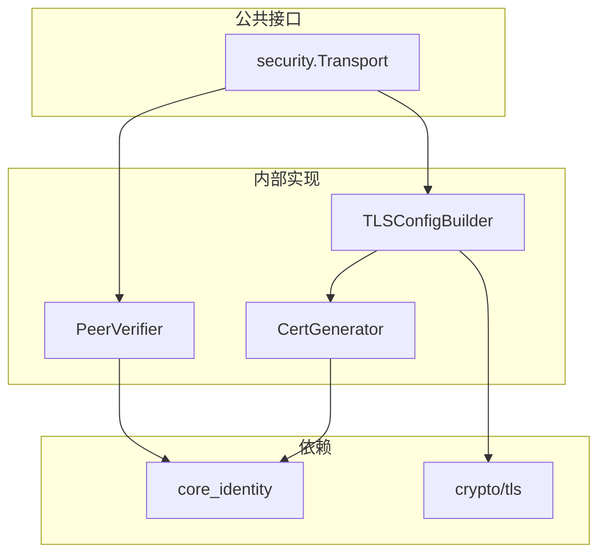
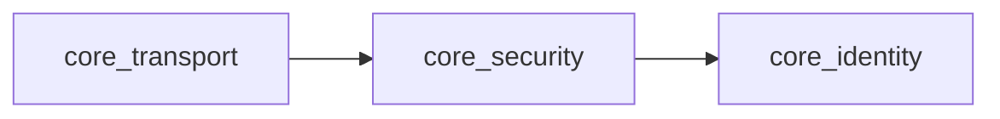

# core_security 整体设计

> 模块架构与组件设计

---

## 模块架构



---

## 核心组件

### SecurityTransport

安全传输主实现。

```
type securityTransport struct {
    identity   identity.Service
    cert       *tls.Certificate
    serverConf *tls.Config
    clientConf *tls.Config
}

func (s *securityTransport) TLSServerConfig() *tls.Config
func (s *securityTransport) TLSClientConfig(expectedPeer types.NodeID) *tls.Config
```

### CertGenerator

证书生成器。

```
func GenerateCert(identity identity.Service) (*tls.Certificate, error) {
    // 1. 创建自签名证书
    // 2. 将公钥嵌入证书扩展
    // 3. 使用私钥签名
}
```

### PeerVerifier

对端身份验证。

```
func VerifyPeer(cert *x509.Certificate, expected types.NodeID) error {
    // 1. 从证书扩展提取公钥
    // 2. 计算 NodeID
    // 3. 验证匹配
}
```

---

## 对外接口

```
// internal/core/security/interface.go

type Transport interface {
    // TLSServerConfig 返回服务端 TLS 配置
    TLSServerConfig() *tls.Config
    
    // TLSClientConfig 返回客户端 TLS 配置
    // 包含对端验证逻辑
    TLSClientConfig(expectedPeer types.NodeID) *tls.Config
}
```

---

## 依赖关系



---

## TLS 配置

```
// 服务端配置
serverConfig := &tls.Config{
    Certificates:       []tls.Certificate{*cert},
    ClientAuth:         tls.RequireAnyClientCert,
    InsecureSkipVerify: true, // 自定义验证
    VerifyPeerCertificate: verifyPeerCert,
    MinVersion:         tls.VersionTLS13,
    NextProtos:         []string{"dep2p"},
}

// 客户端配置
clientConfig := &tls.Config{
    Certificates:       []tls.Certificate{*cert},
    InsecureSkipVerify: true, // 自定义验证
    VerifyPeerCertificate: func(certs [][]byte, _ [][]*x509.Certificate) error {
        return verifyExpectedPeer(certs, expectedPeer)
    },
    MinVersion: tls.VersionTLS13,
    NextProtos: []string{"dep2p"},
}
```

---

**最后更新**：2026-01-11
