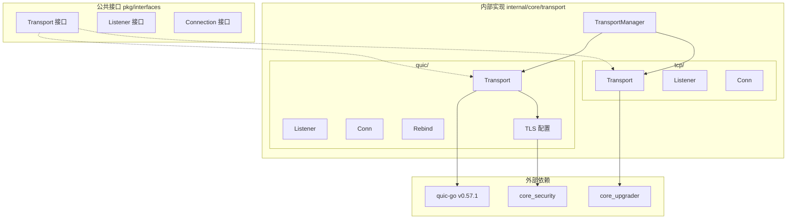
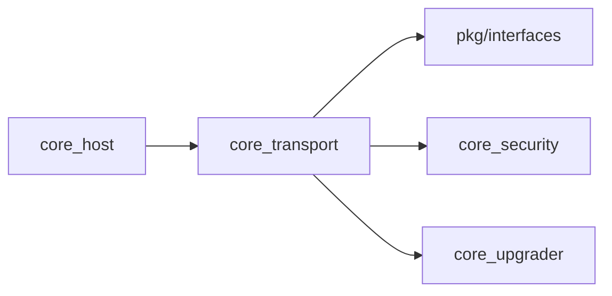

# core_transport 整体设计

> 模块架构与组件设计

---

## 模块架构



---

## 核心组件

### TransportManager

传输管理器，统一管理多种传输协议（QUIC + TCP）。

```go
// internal/core/transport/module.go

type TransportManager struct {
    config     Config
    localPeer  types.PeerID
    identity   pkgif.Identity
    upgrader   pkgif.Upgrader
    transports []pkgif.Transport  // QUIC + TCP
}

// GetTransports 获取所有传输
func (tm *TransportManager) GetTransports() []pkgif.Transport

// Rebind 重新绑定所有支持 Rebind 的传输
// 在网络变化时（如 4G→WiFi）调用
func (tm *TransportManager) Rebind(ctx context.Context) error

// Close 关闭所有传输
func (tm *TransportManager) Close() error
```

**配置**:

```go
type Config struct {
    EnableQUIC      bool          // QUIC 开关（默认启用）
    EnableTCP       bool          // TCP 开关（默认启用）
    EnableWebSocket bool          // WebSocket 开关（默认禁用）
    
    QUICMaxIdleTimeout time.Duration  // QUIC 空闲超时（默认 2 分钟）
    QUICMaxStreams     int            // QUIC 最大流数（默认 1024）
    
    TCPTimeout  time.Duration  // TCP 超时（默认 10 秒）
    DialTimeout time.Duration  // 拨号超时（默认 30 秒）
}
```

### QUICTransport

QUIC 传输层实现，使用 `quic-go` 库。

> QUIC 自带 TLS 1.3 加密和流多路复用，无需 Upgrader。

```go
// internal/core/transport/quic/transport.go

type Transport struct {
    localPeer types.PeerID
    identity  pkgif.Identity
    
    serverTLS *tls.Config  // 从 Identity 生成
    clientTLS *tls.Config
    config    *quic.Config
    
    listeners sync.Map     // 活跃监听器
}

func (t *Transport) Listen(laddr types.Multiaddr) (pkgif.Listener, error)
func (t *Transport) Dial(ctx context.Context, raddr types.Multiaddr, p types.PeerID) (pkgif.Connection, error)
func (t *Transport) Protocols() []types.ProtocolID
func (t *Transport) Rebind(ctx context.Context) error  // 网络切换支持
func (t *Transport) Close() error
```

### TCPTransport

TCP 传输层实现，需要 Upgrader 进行安全握手和多路复用。

```go
// internal/core/transport/tcp/transport.go

type Transport struct {
    localPeer types.PeerID
    upgrader  pkgif.Upgrader  // 安全握手 + yamux
    
    listeners sync.Map
}

func (t *Transport) Listen(laddr types.Multiaddr) (pkgif.Listener, error)
func (t *Transport) Dial(ctx context.Context, raddr types.Multiaddr, p types.PeerID) (pkgif.Connection, error)
func (t *Transport) Protocols() []types.ProtocolID
func (t *Transport) Close() error
```

**TCP 升级流程**:

```
原始 TCP 连接
      │
      ▼
Upgrader.Upgrade()
      │
      ├─► multistream-select 协商安全协议
      │         │
      │         ▼
      ├─► TLS/Noise 安全握手
      │         │
      │         ▼
      ├─► multistream-select 协商多路复用器
      │         │
      │         ▼
      └─► yamux 多路复用设置
              │
              ▼
       UpgradedConn（安全 + 多路复用）
```

### Listener

监听入站连接。

```go
type Listener interface {
    Accept() (Connection, error)
    Addr() net.Addr
    Multiaddr() types.Multiaddr
    Close() error
}
```

### Connection

连接封装，支持流多路复用。

```go
type Connection interface {
    LocalPeer() types.PeerID
    RemotePeer() types.PeerID
    LocalMultiaddr() types.Multiaddr
    RemoteMultiaddr() types.Multiaddr
    
    NewStream(ctx context.Context) (Stream, error)
    AcceptStream() (Stream, error)
    
    Close() error
}
```

---

## Rebind 支持

当网络接口变化时（如 4G→WiFi 切换），需要重新绑定 socket。

```go
// internal/core/transport/quic/rebind.go

// Rebind 重新绑定 QUIC 连接
// 
// 触发条件：
//  - 网络接口变化（IP 地址变更）
//  - 4G ↔ WiFi 切换
//  - VPN 连接/断开
//
// 实现原理：
//  - 使用 quic-go 的 Rebind 支持
//  - 迁移现有连接到新网络接口
func (t *Transport) Rebind(ctx context.Context) error
```

---

## 对外接口

```go
// pkg/interfaces/transport.go

type Transport interface {
    // Dial 拨号连接到远程节点
    Dial(ctx context.Context, raddr types.Multiaddr, p types.PeerID) (Connection, error)
    
    // Listen 在指定地址监听
    Listen(laddr types.Multiaddr) (Listener, error)
    
    // Protocols 返回支持的协议 ID
    Protocols() []types.ProtocolID
    
    // Close 关闭传输层
    Close() error
}
```

---

## 依赖关系



| 依赖方向 | 模块 | 说明 |
|----------|------|------|
| 依赖 | pkg/interfaces | Transport/Listener/Connection 接口 |
| 依赖 | core_security | TLS 配置（QUIC 用） |
| 依赖 | core_upgrader | 连接升级（TCP 用） |
| 被依赖 | core_host | 连接管理 |

---

## QUIC 配置

```go
// 默认 QUIC 配置
config := &quic.Config{
    MaxIdleTimeout:     2 * time.Minute,   // 防止频繁断连
    KeepAlivePeriod:    20 * time.Second,  // 客户端 Keep-Alive
    MaxIncomingStreams: 1024,
    EnableDatagrams:    true,
    Allow0RTT:          true,              // 支持 0-RTT 快速重连
}
```

---

## Fx 模块定义

```go
// internal/core/transport/module.go

var Module = fx.Module("transport",
    fx.Provide(
        ProvideConfig,
        ProvideTransports,
    ),
    fx.Invoke(registerLifecycle),
)

// ProvideTransports 提供 TransportManager 和 Transport 列表
func ProvideTransports(cfg Config, identity pkgif.Identity, upgrader pkgif.Upgrader) TransportOutput
```

---

**最后更新**：2026-01-25
