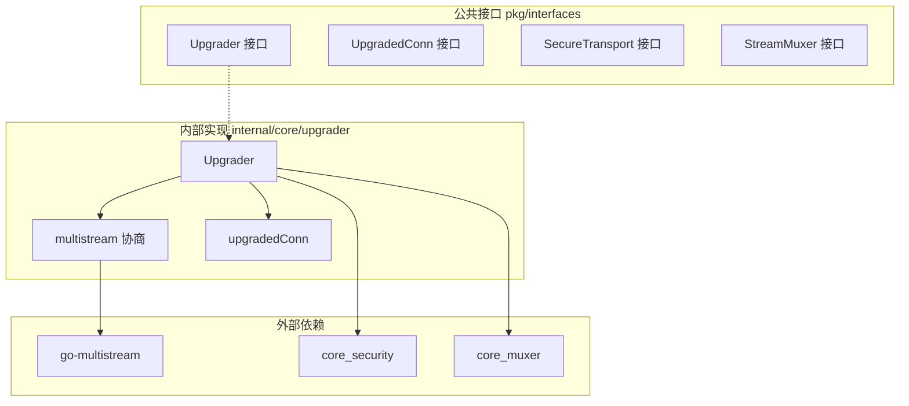
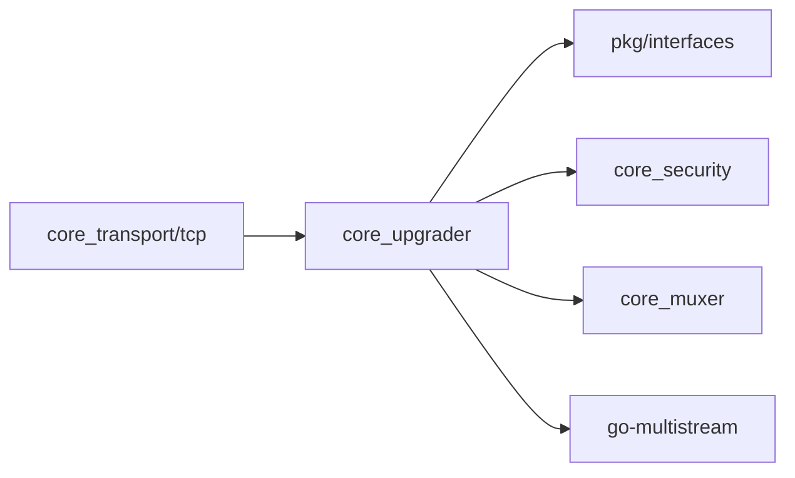

# core_upgrader 整体设计

> 模块架构与组件设计

---

## 模块架构



---

## 核心概念

### 什么是 Upgrader？

Upgrader 负责将**原始 TCP 连接**升级为**安全、多路复用的 P2P 连接**。

> **注意**: QUIC 连接自带 TLS 1.3 加密和流多路复用，会跳过 Upgrader 流程。

升级过程包括：
1. **协议协商** — 使用 multistream-select 协商安全协议和多路复用器
2. **安全握手** — TLS/Noise 握手，建立加密通道，验证对端身份
3. **多路复用设置** — 在加密通道上建立 yamux 多路复用

---

## 核心组件

### Upgrader

连接升级器主实现。

```go
// internal/core/upgrader/upgrader.go

type Upgrader struct {
    identity pkgif.Identity           // 本地身份（用于握手）
    
    securityTransports []pkgif.SecureTransport  // 安全传输列表（按优先级）
    streamMuxers       []pkgif.StreamMuxer      // 多路复用器列表（按优先级）
    
    resourceMgr pkgif.ResourceManager  // 资源管理器（可选）
}

// Upgrade 升级连接
func (u *Upgrader) Upgrade(
    ctx context.Context,
    conn net.Conn,
    dir pkgif.Direction,
    remotePeer types.PeerID,
) (pkgif.UpgradedConn, error)
```

### upgradedConn

升级后的连接封装，组合了安全连接和多路复用连接。

```go
// internal/core/upgrader/conn.go

type upgradedConn struct {
    pkgif.MuxedConn                    // 嵌入多路复用连接
    
    secConn       pkgif.SecureConn     // 安全连接（用于访问 PeerID）
    securityProto types.ProtocolID     // 使用的安全协议
    muxerID       string               // 使用的多路复用器
    connScope     pkgif.ConnManagementScope  // 资源范围
}

func (c *upgradedConn) LocalPeer() types.PeerID
func (c *upgradedConn) RemotePeer() types.PeerID
func (c *upgradedConn) Security() types.ProtocolID  // 如 "/tls/1.0.0"
func (c *upgradedConn) Muxer() string               // 如 "/yamux/1.0.0"
```

### multistream 协商

使用 `go-multistream` 库进行协议协商。

```go
// internal/core/upgrader/multistream.go

// negotiateSecurity 协商安全协议
// 服务端: MultistreamMuxer.Negotiate() — 从客户端提议中选择
// 客户端: SelectOneOf() — 提议协议列表
func (u *Upgrader) negotiateSecurity(ctx context.Context, conn net.Conn, isServer bool) (pkgif.SecureTransport, error)

// negotiateMuxer 协商多路复用器
func (u *Upgrader) negotiateMuxer(ctx context.Context, conn net.Conn, isServer bool) (pkgif.StreamMuxer, error)
```

---

## 升级流程

```
完整升级流程
═══════════════════════════════════════════════════════════════════

  ┌──────────────┐
  │   net.Conn   │   原始 TCP 连接
  └──────┬───────┘
         │
         ▼
  ┌──────────────────────────────────────────────────────────────┐
  │  1. 申请连接资源（ResourceManager）                          │
  │     - OpenConnection(dir, usefd, endpoint)                   │
  │     - 如果资源不足，拒绝连接                                 │
  └──────────────────────────────────────────────────────────────┘
         │
         ▼
  ┌──────────────────────────────────────────────────────────────┐
  │  2. multistream-select 协商安全协议                          │
  │                                                              │
  │     客户端                    服务端                         │
  │     ────────                  ────────                       │
  │     /multistream/1.0.0  ──►                                  │
  │                         ◄──  /multistream/1.0.0              │
  │     /tls/1.0.0          ──►                                  │
  │     /noise              ──►                                  │
  │                         ◄──  /tls/1.0.0 (选择)               │
  └──────────────────────────────────────────────────────────────┘
         │
         ▼
  ┌──────────────────────────────────────────────────────────────┐
  │  3. 安全握手                                                 │
  │                                                              │
  │     TLS 模式:                                                │
  │     - 标准 TLS 1.3 握手                                      │
  │     - 证书中嵌入 PeerID                                      │
  │                                                              │
  │     Noise 模式:                                              │
  │     - IK 模式握手（已知对端公钥时）                          │
  │     - XX 模式握手（未知对端公钥时）                          │
  │                                                              │
  │     握手后: 验证对端 PeerID                                  │
  └──────────────────────────────────────────────────────────────┘
         │
         ▼
  ┌──────────────────────────────────────────────────────────────┐
  │  4. 设置远程 PeerID（ResourceManager）                       │
  │     - connScope.SetPeer(remotePeerID)                        │
  │     - 用于资源追踪和限制                                     │
  └──────────────────────────────────────────────────────────────┘
         │
         ▼
  ┌──────────────────────────────────────────────────────────────┐
  │  5. multistream-select 协商多路复用器                        │
  │                                                              │
  │     客户端                    服务端                         │
  │     ────────                  ────────                       │
  │     /multistream/1.0.0  ──►                                  │
  │                         ◄──  /multistream/1.0.0              │
  │     /yamux/1.0.0        ──►                                  │
  │                         ◄──  /yamux/1.0.0 (选择)             │
  └──────────────────────────────────────────────────────────────┘
         │
         ▼
  ┌──────────────────────────────────────────────────────────────┐
  │  6. yamux 多路复用设置                                       │
  │     - muxer.NewConn(secConn, isServer, peerScope)            │
  │     - 建立流多路复用能力                                     │
  └──────────────────────────────────────────────────────────────┘
         │
         ▼
  ┌──────────────┐
  │ UpgradedConn │   安全 + 多路复用
  └──────────────┘
```

---

## QUIC 连接处理

QUIC 连接自带 TLS 1.3 加密和原生流多路复用，会跳过升级流程：

```go
func (u *Upgrader) Upgrade(...) (pkgif.UpgradedConn, error) {
    // 检测 QUIC 连接
    if isQUICConn(conn) {
        // QUIC 已经是"升级后"的状态，直接封装
        return wrapQUICConn(conn, u.resourceMgr, remotePeer)
    }
    
    // TCP 连接走完整升级流程...
}

// quicUpgradedConn QUIC 升级连接
type quicUpgradedConn struct {
    pkgif.Connection
}

func (c *quicUpgradedConn) Security() types.ProtocolID {
    return types.ProtocolID("/quic/tls/1.3")
}

func (c *quicUpgradedConn) Muxer() string {
    return "/quic/muxer/1.0"
}
```

---

## 对外接口

```go
// pkg/interfaces/upgrader.go

type Upgrader interface {
    // Upgrade 升级连接
    //
    // 参数：
    //  - ctx: 上下文（用于超时控制）
    //  - conn: 原始网络连接
    //  - dir: 连接方向（Inbound/Outbound）
    //  - remotePeer: 远程节点 ID（Outbound 必须提供）
    //
    // 返回：
    //  - UpgradedConn: 升级后的连接
    //  - error: 协商失败、握手失败等
    Upgrade(ctx context.Context, conn net.Conn, dir Direction, 
            remotePeer types.PeerID) (UpgradedConn, error)
}

type UpgradedConn interface {
    MuxedConn  // 多路复用连接
    
    LocalPeer() types.PeerID       // 本地节点 ID
    RemotePeer() types.PeerID      // 远端节点 ID
    Security() types.ProtocolID    // 安全协议（如 "/tls/1.0.0"）
    Muxer() string                 // 多路复用器（如 "/yamux/1.0.0"）
}
```

---

## 依赖关系



| 依赖方向 | 模块 | 说明 |
|----------|------|------|
| 依赖 | pkg/interfaces | Upgrader/UpgradedConn/SecureTransport/StreamMuxer 接口 |
| 依赖 | core_security | TLS/Noise 安全传输实现 |
| 依赖 | core_muxer | yamux 多路复用器实现 |
| 依赖 | go-multistream | 协议协商库 |
| 被依赖 | core_transport (TCP) | TCP 连接升级 |

---

## Fx 模块定义

```go
// internal/core/upgrader/module.go

var Module = fx.Module("upgrader",
    fx.Provide(
        ProvideUpgrader,
    ),
)

// Params Upgrader 依赖参数
type Params struct {
    fx.In
    
    Identity   pkgif.Identity
    Security   pkgif.SecureTransport
    Muxer      pkgif.StreamMuxer
    UnifiedCfg *config.Config `optional:"true"`
}

// ProvideUpgrader 提供 Upgrader
func ProvideUpgrader(params Params) (pkgif.Upgrader, error) {
    cfg := ConfigFromUnified(params.UnifiedCfg, params.Security, params.Muxer)
    return New(params.Identity, cfg)
}
```

---

## 配置

```go
// internal/core/upgrader/config.go

type Config struct {
    // SecurityTransports 安全传输列表（按优先级排序）
    SecurityTransports []pkgif.SecureTransport
    
    // StreamMuxers 流多路复用器列表（按优先级排序）
    StreamMuxers []pkgif.StreamMuxer
    
    // ResourceManager 资源管理器（可选）
    ResourceManager pkgif.ResourceManager
    
    // NegotiateTimeout 协议协商超时时间（默认 60s）
    NegotiateTimeout time.Duration
    
    // HandshakeTimeout 握手超时时间（默认 30s）
    HandshakeTimeout time.Duration
}
```

---

## 错误处理

```go
// internal/core/upgrader/errors.go

var (
    ErrNilIdentity         = errors.New("upgrader: identity is nil")
    ErrNoSecurityTransport = errors.New("upgrader: no security transport configured")
    ErrNoStreamMuxer       = errors.New("upgrader: no stream muxer configured")
    ErrNoPeerID            = errors.New("upgrader: peer ID required for outbound")
    ErrSecurityNegotiation = errors.New("upgrader: security negotiation failed")
    ErrMuxerNegotiation    = errors.New("upgrader: muxer negotiation failed")
    ErrHandshakeFailed     = errors.New("upgrader: handshake failed")
    ErrPeerMismatch        = errors.New("upgrader: peer ID mismatch")
)
```

---

**最后更新**：2026-01-25
