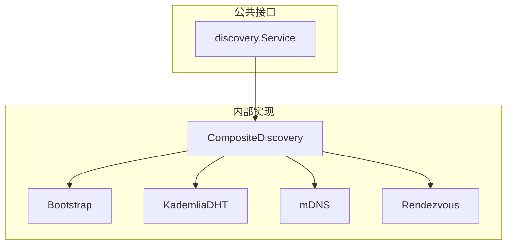

# core_discovery 整体设计

> 模块架构与组件设计

---

## L3/L6 边界说明

| 本文档 (L6) | L3_behavioral |
|------------|---------------|
| Bootstrap 接口定义、配置结构 | Bootstrap 连接流程、发现优先级 |
| DHT 接口定义、K-Bucket 参数 | DHT 入网时序、发布时机 |
| mDNS 接口定义 | mDNS 与 Bootstrap 独立性说明 |
| Rendezvous 接口定义 | Realm 成员发现行为 |

**参考**：
- 发现行为流程参见 [L3: discovery_flow.md](../../../L3_behavioral/discovery_flow.md)
- 节点启动时的发现时序参见 [L3: lifecycle_overview.md](../../../L3_behavioral/lifecycle_overview.md)

---

## 模块架构



---

## 核心组件

### Bootstrap

Bootstrap 用于广域网入口和 DHT 引导。

```
type Bootstrap interface {
    // AddPeer 添加引导节点（自身会静默忽略）
    AddPeer(addr Multiaddr) error
    
    // RemovePeer 移除引导节点
    RemovePeer(id NodeID)
    
    // Peers 获取引导节点列表
    Peers() []Multiaddr
    
    // Connect 连接所有引导节点（并行）
    Connect(ctx context.Context) error
}
```

**设计原则**：
- 与 mDNS 完全独立，可单独开关
- 只需要 System Bootstrap，不需要 Realm Bootstrap
- 全部并行连接，DeP2P 内部管理
- 自身过滤：包含自身时静默忽略

### Bootstrap 节点特殊能力

成为 Bootstrap 节点时，具备以下**特殊能力**：

```
// Bootstrap 节点配置
type BootstrapConfig struct {
    // 大容量存储（不受 K-bucket 限制）
    MaxNodes         int           // 建议 10000+
    PersistPath      string        // 持久化路径
    
    // 存活探测
    ProbeEnabled     bool          // 启用探测
    ProbeInterval    time.Duration // 探测间隔
    MaxProbeFailures int           // 最大失败次数
    
    // 主动发现
    DiscoveryEnabled  bool          // 启用主动发现
    DiscoveryInterval time.Duration // 发现间隔
    
    // 响应策略
    ReturnCount      int           // 返回节点数
    PreferRecent     bool          // 优先活跃节点
}
```

**为什么需要特殊能力**：
- 普通节点只维护 K-bucket，Bootstrap 需要存储数万节点
- Bootstrap 返回的节点必须是活跃的，否则新节点无法入网

### Service 接口

```
type Service interface {
    // FindPeers 查找节点
    FindPeers(ctx context.Context, ns string, opts ...Option) (<-chan PeerInfo, error)
    
    // Advertise 公告自己
    Advertise(ctx context.Context, ns string, opts ...Option) (time.Duration, error)
}
```

### DHT

Kademlia 分布式哈希表实现。

```
type DHT interface {
    Service
    
    // FindPeer 查找特定节点
    FindPeer(ctx context.Context, id types.NodeID) (PeerInfo, error)
    
    // PutValue 存储值
    PutValue(ctx context.Context, key string, value []byte) error
    
    // GetValue 获取值
    GetValue(ctx context.Context, key string) ([]byte, error)
}
```

### mDNS

局域网发现。

```
type MDNS interface {
    // Start 启动服务
    Start() error
    
    // Close 关闭服务
    Close() error
    
    // RegisterNotifee 注册通知
    RegisterNotifee(Notifee)
}
```

**与 Bootstrap 独立性**：
- mDNS 用于局域网，Bootstrap 用于广域网
- 两者可以独立开关，互不依赖

### Rendezvous

命名空间发现，用于 Realm 成员发现。

```
type Rendezvous interface {
    Service
    
    // Register 注册到命名空间
    Register(ctx context.Context, ns string, ttl time.Duration) error
    
    // Unregister 注销
    Unregister(ctx context.Context, ns string) error
    
    // Discover 发现节点
    Discover(ctx context.Context, ns string, limit int) ([]PeerInfo, error)
}
```

---

## 发现策略

```
┌─────────────────────────────────────────────────────────────────────────────┐
│                          发现策略                                            │
├─────────────────────────────────────────────────────────────────────────────┤
│                                                                             │
│  启动发现：                                                                  │
│  • Bootstrap（广域网入口）- 可选                                            │
│  • mDNS（局域网）- 可选                                                     │
│  • 两者独立，可单独开关                                                      │
│                                                                             │
│  运行时发现优先级（v2.0 DHT 权威模型）：                                     │
│  1. 本地地址簿（最近成功连接）                                              │
│  2. mDNS（局域网，最快）                                                    │
│  3. ★ DHT（权威目录，签名 PeerRecord）                                      │
│  4. Relay 地址簿（缓存回退，非权威）                                        │
│  5. Rendezvous（命名空间，精确）                                            │
│                                                                             │
│  组合发现：                                                                  │
│  • 并行查询所有来源                                                         │
│  • 合并去重结果                                                             │
│  • 按延迟排序                                                               │
│                                                                             │
└─────────────────────────────────────────────────────────────────────────────┘
```

---

## ★ Relay 地址簿查询

```
┌─────────────────────────────────────────────────────────────────────────────┐
│                    Relay 地址簿查询                                           │
├─────────────────────────────────────────────────────────────────────────────┤
│                                                                             │
│  v2.0：DHT 是权威目录，Relay 地址簿是缓存加速层（参见讨论文档 §9）           │
│                                                                             │
│  ★ 前置条件（ADR-0010 显式配置）：                                          │
│  ─────────────────────────────────                                          │
│  • 必须通过 node.SetRelayAddr() 显式配置 Relay 地址                         │
│  • 仅查询已配置的 Relay，不支持自动发现 Relay                               │
│  • 未配置 Relay 时，此发现源不可用                                          │
│                                                                             │
│  查询流程：                                                                  │
│  ──────────                                                                 │
│  1. 检查 Relay 是否已配置并连接                                             │
│  2. 本地缓存未命中                                                          │
│  3. 向已配置的 Relay 发送 AddressQuery 消息                                 │
│  4. Relay 返回目标节点的地址信息                                            │
│  5. 优先尝试直连获得的地址                                                  │
│  6. 直连失败则使用 Relay 转发（保底）                                       │
│                                                                             │
│  Relay 地址簿内容：                                                          │
│  ──────────────────                                                         │
│  • NodeID — 成员身份                                                        │
│  • DirectAddrs — 直连地址（公网可达）                                      │
│  • NATType — NAT 类型（用于打洞决策）                                      │
│  • Online — 在线状态                                                        │
│  • LastSeen — 最后活跃时间                                                  │
│                                                                             │
│  协议消息：                                                                  │
│  ──────────                                                                 │
│  • AddressQuery — 查询其他节点的地址                                        │
│  • AddressResponse — 返回目标节点的地址信息                                │
│                                                                             │
│  优先级说明（v2.0 DHT 权威模型）：                                          │
│  ───────────────────────────────                                            │
│  • ★ DHT 是权威目录（优先级 3）：返回签名 PeerRecord，防伪造/防投毒        │
│  • Relay 地址簿是缓存（优先级 4）：DHT 失败时的回退                         │
│  • 保底作用：地址查询全部失败时仍可通过 Relay 转发数据                     │
│                                                                             │
└─────────────────────────────────────────────────────────────────────────────┘
```

---

## Bootstrap 与 mDNS 独立性

```
┌─────────────────────────────────────────────────────────────────────────────┐
│                    发现机制独立性                                             │
├─────────────────────────────────────────────────────────────────────────────┤
│                                                                             │
│  Bootstrap（广域网入口）           mDNS（局域网发现）                        │
│  ─────────────────────            ─────────────────                         │
│  • 范围：互联网                    • 范围：局域网                            │
│  • 依赖：预配置地址                • 依赖：本地广播                          │
│  • 场景：跨网络                    • 场景：同一网络内                        │
│                                                                             │
│  独立开关组合：                                                              │
│  • 只开 mDNS：局域网内纯 P2P                                                │
│  • 只开 Bootstrap：广域网发现                                               │
│  • 都开：局域网优先，广域网兜底（推荐）                                     │
│  • 都关：必须手动指定地址                                                    │
│                                                                             │
└─────────────────────────────────────────────────────────────────────────────┘
```

---

## Fx 模块定义

```
var Module = fx.Module("discovery",
    fx.Provide(
        NewBootstrap,
        NewDHT,
        NewMDNS,
        NewRendezvous,
        NewCompositeService,
    ),
    
    fx.Invoke(func(lc fx.Lifecycle, cfg Config, boot *Bootstrap, mdns *MDNS) {
        lc.Append(fx.Hook{
            OnStart: func(ctx context.Context) error {
                // 根据配置启动
                if cfg.EnableBootstrap {
                    boot.Connect(ctx)
                }
                if cfg.EnableMDNS {
                    mdns.Start()
                }
                return nil
            },
        })
    }),
)
```

---

---

## ★ DHT 接口（v2.0）

> 详见 [DHT-Realm 架构重构方案](../../../../_discussions/20260126-dht-realm-architecture-redesign.md)

```go
// DHT Key 设计（v2.0）
const (
    // Node 级 Key: /dep2p/v2/node/<NodeID>
    NodeKeyPrefix = "/dep2p/v2/node/"
    
    // Realm 成员发现 Key（Provider Record）: /dep2p/v2/realm/<H(RealmID)>/members
    RealmMembersKeyFmt = "/dep2p/v2/realm/%s/members"
    
    // Realm 成员地址 Key: /dep2p/v2/realm/<H(RealmID)>/peer/<NodeID>
    RealmPeerKeyFmt = "/dep2p/v2/realm/%s/peer/%s"
)

// SignedPeerRecord 结构（Node 级发布）
type SignedPeerRecord struct {
    NodeID       string   `json:"node_id"`
    RelayAddrs   []string `json:"relay_addrs"`   // Relay 地址（稳定，始终发布）
    DirectAddrs  []string `json:"direct_addrs"`  // 直连地址（可达时发布）
    NATType      string   `json:"nat_type"`
    Reachability string   `json:"reachability"`
    Capabilities []string `json:"capabilities"`  // 节点能力
    Seq          uint64   `json:"seq"`
    Signature    []byte   `json:"signature"`
}

// SignedRealmPeerRecord 结构（Realm 成员地址发布）
type SignedRealmPeerRecord struct {
    SignedPeerRecord
    RealmID string `json:"realm_id"` // ★ 包含 RealmID
}

// DHT 接口（v2.0 重构）
type DHT interface {
    // Node 级发布
    PublishNodeRecord(ctx context.Context, record *SignedPeerRecord) error
    FindNodeRecord(ctx context.Context, nodeID string) (*SignedPeerRecord, error)
    
    // Realm 成员发现（Provider Record）
    ProvideRealmMembership(ctx context.Context, realmID string) error
    FindRealmMembers(ctx context.Context, realmID string) ([]peer.ID, error)
    
    // Realm 成员地址查询
    PublishRealmPeerRecord(ctx context.Context, realmID string, record *SignedRealmPeerRecord) error
    FindRealmPeerRecord(ctx context.Context, realmID, nodeID string) (*SignedRealmPeerRecord, error)
}
```

> **设计说明**：DHT 架构参见 [L3: lifecycle_overview.md §2](../../../L3_behavioral/lifecycle_overview.md#2-dht-架构v20-重构)

---

## 相关文档

### L3 行为文档

| 文档 | 说明 |
|------|------|
| [L3: lifecycle_overview.md](../../../L3_behavioral/lifecycle_overview.md) | ★ 节点生命周期横切面（DHT 入网时序） |
| [L3: discovery_flow.md](../../../L3_behavioral/discovery_flow.md) | 发现流程行为 |

### ADR

| 文档 | 说明 |
|------|------|
| [ADR-0008](../../../../01_context/decisions/ADR-0008-discovery-strategy.md) | 发现策略 ADR |
| [ADR-0009](../../../../01_context/decisions/ADR-0009-bootstrap-simplified.md) | Bootstrap 极简配置 ADR |

---

**最后更新**：2026-01-26（对齐 DHT-Realm 架构重构方案）
