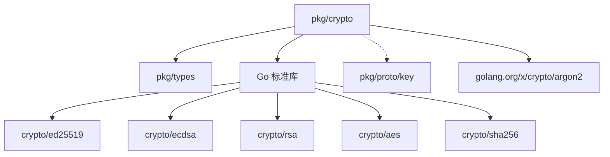

# Pkg Crypto 模块

> **版本**: v1.1.0  
> **更新日期**: 2026-01-13  
> **定位**: 密码学工具包

---

## 模块概述

pkg_crypto 提供 DeP2P 的密码学功能，包括密钥生成、签名验证、序列化和安全存储。

| 属性 | 值 |
|------|-----|
| **架构层** | Level 0（基础工具包） |
| **代码位置** | `pkg/crypto/` |
| **Fx 模块** | 无（工具包，直接调用） |
| **状态** | ✅ 已实现（覆盖率 83.0%） |
| **依赖** | pkg/types |

---

## 核心职责

```
┌─────────────────────────────────────────────────────────────────────────────┐
│                        pkg_crypto 职责                                       │
├─────────────────────────────────────────────────────────────────────────────┤
│                                                                             │
│  1. 密钥管理                                                                │
│     • Ed25519/Secp256k1/ECDSA/RSA 密钥生成                                  │
│     • 密钥序列化/反序列化                                                   │
│     • 密钥存储（加密）                                                      │
│                                                                             │
│  2. 签名验证                                                                │
│     • 数字签名生成                                                          │
│     • 签名验证                                                              │
│     • 签名记录（SignedRecord）                                              │
│                                                                             │
│  3. PeerID 派生                                                             │
│     • 从公钥派生 PeerID                                                     │
│     • 公钥哈希计算                                                          │
│     • PeerID 验证                                                           │
│                                                                             │
│  4. 安全特性                                                                │
│     • 常量时间比较                                                          │
│     • 密钥加密存储（AES-GCM + Argon2id）                                    │
│     • 安全内存清零                                                          │
│                                                                             │
└─────────────────────────────────────────────────────────────────────────────┘
```

---

## 支持的密钥类型

| 类型 | 枚举值 | 公钥大小 | 私钥大小 | 签名大小 | 说明 |
|------|--------|----------|----------|----------|------|
| Ed25519 | 2 | 32 字节 | 64 字节 | 64 字节 | 默认推荐 |
| Secp256k1 | 3 | 33 字节 | 32 字节 | 64 字节 | 区块链兼容 |
| ECDSA (P-256) | 4 | 33 字节 | 32 字节 | 64 字节 | NIST 标准 |
| RSA | 1 | 变长 | 变长 | 变长 | 传统兼容 |

**KeyType 值与 `pkg/proto/key/key.proto` 完全对齐**。

---

## 核心接口

```go
// 密钥接口
type Key interface {
    Raw() ([]byte, error)
    Type() KeyType
    Equals(Key) bool
}

type PublicKey interface {
    Key
    Verify(data, sig []byte) (bool, error)
}

type PrivateKey interface {
    Key
    Sign(data []byte) ([]byte, error)
    GetPublic() PublicKey
}

// 密钥存储接口
type Keystore interface {
    Has(id string) (bool, error)
    Put(id string, key PrivateKey) error
    Get(id string) (PrivateKey, error)
    Delete(id string) error
    List() ([]string, error)
}
```

---

## 使用示例

### 密钥生成

```go
import "github.com/dep2p/go-dep2p/pkg/crypto"

// 生成 Ed25519 密钥对（推荐）
priv, pub, err := crypto.GenerateKeyPair(crypto.KeyTypeEd25519)

// 生成 Secp256k1 密钥对
priv, pub, err := crypto.GenerateKeyPair(crypto.KeyTypeSecp256k1)
```

### 签名和验证

```go
// 签名
data := []byte("message to sign")
sig, err := crypto.Sign(priv, data)

// 验证
valid, err := crypto.Verify(pub, data, sig)
```

### PeerID 派生

```go
// 从公钥派生 PeerID
peerID, err := crypto.PeerIDFromPublicKey(pub)
fmt.Println(peerID) // 12D3KooW...

// 验证 PeerID
valid, err := crypto.VerifyPeerID(pub, peerID)
```

### 密钥存储

```go
// 创建加密存储
ks, err := crypto.NewFSKeystore("/path/to/keys", []byte("password"))

// 存储密钥
err = ks.Put("node-key", priv)

// 获取密钥
priv, err := ks.Get("node-key")
```

---

## 文件结构

```
pkg/crypto/
├── doc.go              # 包文档
├── README.md           # 使用说明
├── key.go              # 核心接口和工厂
├── errors.go           # 错误定义
├── ed25519.go          # Ed25519 实现
├── secp256k1.go        # Secp256k1 实现（纯 Go）
├── ecdsa.go            # ECDSA 实现
├── rsa.go              # RSA 实现
├── signature.go        # 签名结构
├── marshal.go          # Protobuf 序列化
├── peerid.go           # PeerID 派生
├── keystore.go         # 密钥存储
├── key_test.go         # 密钥测试
├── ed25519_test.go     # Ed25519 测试
├── secp256k1_test.go   # Secp256k1 测试
├── ecdsa_test.go       # ECDSA 测试
├── rsa_test.go         # RSA 测试
├── signature_test.go   # 签名测试
├── marshal_test.go     # 序列化测试
├── peerid_test.go      # PeerID 测试
└── keystore_test.go    # 存储测试
```

---

## 安全特性

| 特性 | 实现 | 说明 |
|------|------|------|
| 常量时间比较 | ✅ | 防止时序攻击 |
| 加密存储 | ✅ | AES-GCM + Argon2id |
| 安全清零 | ✅ | 敏感数据清除 |
| CSPRNG | ✅ | 加密安全随机源 |

---

## 与约束规范的对齐

| 规范文档 | 对齐状态 |
|----------|----------|
| [密钥格式规范](../../../02_constraints/protocol/L1_identity/key_format.md) | ✅ 完全对齐 |
| [签名规范](../../../02_constraints/protocol/L1_identity/signature.md) | ✅ 完全对齐 |
| [pkg/proto/key/key.proto](../../../../pkg/proto/key/key.proto) | ✅ KeyType 值一致 |

---

## 测试覆盖率

```
coverage: 83.0% of statements
```

| 组件 | 覆盖率 | 状态 |
|------|--------|------|
| Ed25519 | ✅ | 高覆盖 |
| Secp256k1 | ✅ | 高覆盖 |
| ECDSA | ✅ | 高覆盖 |
| RSA | ✅ | 高覆盖 |
| 序列化 | ✅ | 高覆盖 |
| 密钥存储 | ✅ | 高覆盖 |

---

## 依赖关系



**外部依赖**：
- `golang.org/x/crypto/argon2` - 密钥派生

**无外部密码学库依赖**（Secp256k1 纯 Go 实现）。

---

## 实施状态

| 步骤 | 状态 | 说明 |
|------|------|------|
| Step 1: 设计审查 | ✅ | 已审查约束规范 |
| Step 2: 接口定义 | N/A | 工具包无需接口 |
| Step 3: 测试先行 | ✅ | 测试骨架完成 |
| Step 4: 核心实现 | ✅ | 所有密钥类型已实现 |
| Step 5: 测试通过 | ✅ | 覆盖率 83.0% |
| Step 6: 集成验证 | ✅ | 与 pkg/types 集成测试通过 |
| Step 7: 设计复盘 | ✅ | 实现与规范一致 |
| Step 8: 文档更新 | ✅ | README 和 GoDoc 完成 |

---

## 相关文档

| 文档 | 说明 |
|------|------|
| [requirements/requirements.md](requirements/requirements.md) | 需求说明 |
| [design/overview.md](design/overview.md) | 设计概述 |
| [design/internals.md](design/internals.md) | 内部实现 |
| [coding/guidelines.md](coding/guidelines.md) | 编码指南 |
| [testing/strategy.md](testing/strategy.md) | 测试策略 |
| [pkg/crypto/README.md](../../../../pkg/crypto/README.md) | 代码包说明 |
| [pkg_design.md](../../../02_constraints/engineering/standards/pkg_design.md) | pkg 层设计原则 |

---

**最后更新**：2026-01-13
