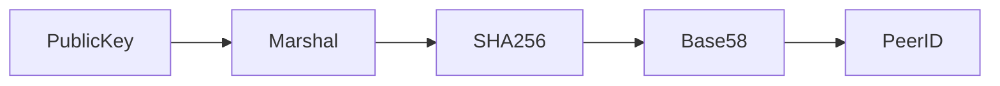

# pkg_crypto 设计概述

> **版本**: v1.1.0  
> **更新日期**: 2026-01-13

---

## 设计目标

pkg_crypto 的设计目标是提供一个**安全、高效、易用**的密码学工具包，支持 DeP2P 的身份验证和数据安全需求。

### 核心原则

1. **安全第一**：防止常见密码学攻击
2. **零依赖**：减少外部密码学库依赖
3. **接口统一**：所有密钥类型统一接口
4. **直接调用**：工具包模式，无需依赖注入

---

## 架构设计

### 整体架构

```
┌─────────────────────────────────────────────────────────────────────────────┐
│                        pkg_crypto 架构                                       │
├─────────────────────────────────────────────────────────────────────────────┤
│                                                                             │
│  ┌────────────────────────────────────────────────────────────────────┐     │
│  │                        工厂函数层                                   │     │
│  │  GenerateKeyPair / Sign / Verify / Marshal / Unmarshal           │     │
│  └────────────────────────────────────────────────────────────────────┘     │
│                                    │                                        │
│                                    ↓                                        │
│  ┌────────────────────────────────────────────────────────────────────┐     │
│  │                        接口抽象层                                   │     │
│  │  Key / PublicKey / PrivateKey / Keystore                          │     │
│  └────────────────────────────────────────────────────────────────────┘     │
│                                    │                                        │
│           ┌────────────────────────┼────────────────────────┐               │
│           ↓                        ↓                        ↓               │
│  ┌──────────────┐        ┌──────────────┐        ┌──────────────┐          │
│  │  Ed25519Impl │        │ Secp256k1Impl│        │  ECDSA/RSA   │          │
│  │              │        │  (纯 Go 实现) │        │  (标准库)    │          │
│  └──────────────┘        └──────────────┘        └──────────────┘          │
│                                                                             │
└─────────────────────────────────────────────────────────────────────────────┘
```

### 模块划分

```
pkg/crypto/
├── [核心接口]
│   ├── key.go          - Key / PublicKey / PrivateKey 接口
│   └── errors.go       - 错误定义
│
├── [密钥实现]
│   ├── ed25519.go      - Ed25519 实现
│   ├── secp256k1.go    - Secp256k1 实现（纯 Go）
│   ├── ecdsa.go        - ECDSA 实现
│   └── rsa.go          - RSA 实现
│
├── [扩展功能]
│   ├── signature.go    - 签名记录和信封
│   ├── marshal.go      - 序列化
│   ├── peerid.go       - PeerID 派生
│   └── keystore.go     - 密钥存储
│
└── [测试]
    └── *_test.go       - 单元测试
```

---

## 接口设计

### Key 接口层次

```go
// 基础接口
type Key interface {
    Raw() ([]byte, error)    // 原始字节
    Type() KeyType           // 密钥类型
    Equals(Key) bool         // 相等比较
}

// 公钥接口
type PublicKey interface {
    Key
    Verify(data, sig []byte) (bool, error)
}

// 私钥接口
type PrivateKey interface {
    Key
    Sign(data []byte) ([]byte, error)
    GetPublic() PublicKey
}
```

**设计说明**：
- 使用接口实现多态，支持多种密钥类型
- `Equals()` 使用常量时间比较，防止时序攻击
- `Raw()` 返回拷贝，防止外部修改

---

## 密钥类型设计

### KeyType 枚举

```go
type KeyType int

const (
    KeyTypeUnspecified KeyType = 0
    KeyTypeRSA        KeyType = 1
    KeyTypeEd25519    KeyType = 2  // 默认推荐
    KeyTypeSecp256k1  KeyType = 3
    KeyTypeECDSA      KeyType = 4
)
```

**与 Protobuf 对齐**：枚举值与 `pkg/proto/key/key.proto` 完全一致。

### 密钥实现对比

| 密钥类型 | 优点 | 缺点 | 使用场景 |
|---------|------|------|----------|
| **Ed25519** | 快速、安全、密钥小 | - | 默认推荐 |
| **Secp256k1** | 区块链兼容 | 签名验证稍慢 | 与区块链互操作 |
| **ECDSA** | NIST 标准 | - | 企业兼容 |
| **RSA** | 传统兼容 | 密钥大、慢 | 遗留系统 |

---

## 序列化设计

### 序列化格式

```
┌─────────────────────────────────────────────────────────┐
│  Type:   uint8 (KeyType)                                │
│  Length: uint32 (大端序)                                 │
│  Data:   密钥数据                                        │
└─────────────────────────────────────────────────────────┘
```

**特点**：
- 简单高效
- 与 Protobuf 兼容
- 支持流式解析

---

## PeerID 派生

### 派生算法

```
PeerID = Base58(SHA256(MarshalPublicKey(pub)))
```

**流程**：



**说明**：
- SHA256 提供固定长度哈希
- Base58 提供人类可读的字符串
- 避免 0/O/I/l 等易混淆字符

---

## 密钥存储设计

### 文件格式

```
┌────────────────────────────────────────────────────────┐
│  Magic:     "DEP2P-KEY"  (9 bytes)                     │
│  Version:   uint8                                       │
│  Type:      uint8 (KeyType)                            │
│  Encrypted: uint8 (0=否, 1=是)                          │
│  Data:      密钥数据或加密数据                           │
└────────────────────────────────────────────────────────┘
```

### 加密存储

```
加密数据格式：
┌────────────────────────────────────────────────────────┐
│  Salt:       16 bytes                                   │
│  Nonce:      12 bytes                                   │
│  Ciphertext: 变长（AES-GCM 加密）                       │
└────────────────────────────────────────────────────────┘
```

**加密算法**：
- **密钥派生**：Argon2id（时间成本=1, 内存=64MB, 并行=4）
- **对称加密**：AES-256-GCM
- **文件权限**：0600（仅所有者读写）

---

## 安全设计

### 防御措施

| 攻击类型 | 防御措施 | 实现 |
|---------|---------|------|
| 时序攻击 | 常量时间比较 | `subtle.ConstantTimeCompare` |
| 密钥泄露 | 加密存储 | AES-GCM + Argon2id |
| 内存残留 | 安全清零 | `SecureZero()` |
| 弱随机数 | CSPRNG | `crypto/rand.Reader` |

### 常量时间比较

```go
func KeyEqual(k1, k2 Key) bool {
    if k1.Type() != k2.Type() {
        return false
    }
    
    b1, err1 := k1.Raw()
    b2, err2 := k2.Raw()
    
    if err1 != nil || err2 != nil {
        return false
    }
    
    return subtle.ConstantTimeCompare(b1, b2) == 1
}
```

---

## 性能优化

### 纯 Go Secp256k1

**为什么不使用 cgo**：
- 避免编译复杂度
- 减少外部依赖
- 提高可移植性

**实现方式**：
- 手工实现椭圆曲线点运算
- 使用双加算法（Double-and-Add）
- 标量乘法优化

### 性能基准

| 操作 | Ed25519 | Secp256k1 | ECDSA | RSA |
|------|---------|-----------|-------|-----|
| 生成 | ~0.1ms | ~10ms | ~5ms | ~100ms |
| 签名 | ~0.05ms | ~2ms | ~1ms | ~5ms |
| 验证 | ~0.1ms | ~5ms | ~2ms | ~1ms |

---

## 错误处理

### 错误分类

```go
// 密钥错误
var (
    ErrBadKeyType       = errors.New("invalid or unsupported key type")
    ErrInvalidKeySize   = errors.New("invalid key size")
    ErrInvalidPublicKey = errors.New("invalid public key")
)

// 存储错误
var (
    ErrKeyNotFound      = errors.New("key not found")
    ErrKeyExists        = errors.New("key already exists")
    ErrInvalidPassword  = errors.New("invalid password")
)
```

**原则**：
- 使用预定义错误常量
- 避免泄露敏感信息
- 提供清晰的错误上下文

---

## 测试策略

### 测试覆盖

- ✅ 单元测试：每个密钥类型
- ✅ 边界测试：无效输入处理
- ✅ 集成测试：与 pkg/types 集成
- ✅ 基准测试：性能验证

### 确定性测试

```go
// 使用固定随机源进行测试
seed := make([]byte, 64)
for i := range seed {
    seed[i] = byte(i)
}

reader := bytes.NewReader(seed)
priv1, _, _ := GenerateKeyPairWithReader(KeyTypeEd25519, reader)
```

---

## 相关文档

- [internals.md](internals.md) - 内部实现细节
- [requirements/requirements.md](../requirements/requirements.md) - 需求说明
- [coding/guidelines.md](../coding/guidelines.md) - 编码指南

---

**最后更新**：2026-01-13
