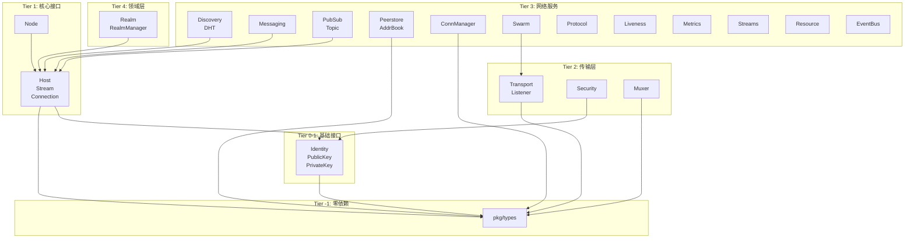

# Pkg Interfaces 模块

> **版本**: v1.1.0  
> **更新日期**: 2026-01-13  
> **定位**: 系统组件抽象接口

---

## 模块概述

pkg_interfaces 定义 DeP2P 所有系统组件的抽象接口，为 internal/ 层实现提供契约定义。

| 属性 | 值 |
|------|-----|
| **架构层** | Level 0（基础接口包） |
| **代码位置** | `pkg/interfaces/` |
| **Fx 模块** | 无（接口定义） |
| **状态** | ✅ 已实现 |
| **依赖** | pkg/types |

---

## 核心职责

```
┌─────────────────────────────────────────────────────────────────────────────┐
│                        pkg_interfaces 职责                                   │
├─────────────────────────────────────────────────────────────────────────────┤
│                                                                             │
│  1. 系统组件契约定义                                                          │
│     • 定义接口方法签名                                                       │
│     • 定义接口行为规范                                                       │
│     • 供 internal/ 层实现                                                    │
│                                                                             │
│  2. 依赖倒置实现                                                             │
│     • 高层依赖抽象（接口）                                                   │
│     • 低层实现接口                                                           │
│     • 运行时注入（Fx）                                                       │
│                                                                             │
│  3. 测试支持                                                                 │
│     • 提供 Mock 实现                                                         │
│     • 允许单元测试隔离                                                       │
│     • 支持接口替换                                                           │
│                                                                             │
└─────────────────────────────────────────────────────────────────────────────┘
```

---

## 接口分层（Tier 架构）



---

## 接口目录

### Tier -1: 零依赖基础类型（P0-01）

| 包 | 说明 |
|------|------|
| **pkg/types** | PeerID, RealmID, Multiaddr 等基础类型 |

### Tier 0-1: 基础接口

| 接口 | 文件 | 说明 |
|------|------|------|
| **Identity** | identity.go | 节点身份管理 |
| **PublicKey** | identity.go | 公钥接口 |
| **PrivateKey** | identity.go | 私钥接口 |

### Tier 1: 核心接口

| 接口 | 文件 | 说明 |
|------|------|------|
| **Node** | node.go | 顶层 API 入口 |
| **Host** | host.go | P2P 主机核心 |
| **Stream** | host.go | 双向流 |
| **Connection** | transport.go | 连接抽象 |

### Tier 2: 传输层

| 接口 | 文件 | 说明 |
|------|------|------|
| **Transport** | transport.go | 传输协议抽象 |
| **Listener** | transport.go | 监听器 |
| **Security** | security.go | 安全握手 |
| **Muxer** | muxer.go | 流多路复用 |

### Tier 3: 网络服务

| 接口 | 文件 | 说明 |
|------|------|------|
| **Discovery** | discovery.go | 节点发现 |
| **DHT** | discovery.go | 分布式哈希表 |
| **Messaging** | messaging.go | 消息服务 |
| **PubSub** | pubsub.go | 发布订阅 |
| **Topic** | pubsub.go | 主题 |
| **Peerstore** | peerstore.go | 节点存储 |
| **AddrBook** | peerstore.go | 地址簿 |
| **ConnManager** | connmgr.go | 连接管理 |
| **Swarm** | swarm.go | 连接池管理 |
| **Protocol** | protocol.go | 协议路由 |
| **Liveness** | liveness.go | 存活检测 |
| **Metrics** | metrics.go | 监控指标 |
| **Streams** | streams.go | 流管理 |
| **Resource** | resource.go | 资源管理 |
| **EventBus** | eventbus.go | 事件总线 |

### Tier 4: 领域层

| 接口 | 文件 | 说明 |
|------|------|------|
| **Realm** | realm.go | Realm 隔离域 |
| **RealmManager** | realm.go | Realm 管理器 |

---

## 使用方式

### 接口定义（pkg/interfaces）

```go
package interfaces

// Host P2P 主机接口
type Host interface {
    ID() string
    Connect(ctx context.Context, peerID string, addrs []string) error
    NewStream(ctx context.Context, peerID string, protocols ...string) (Stream, error)
    // ...
}
```

### 接口实现（internal/core）

```go
package host

import pkgif "github.com/dep2p/go-dep2p/pkg/interfaces"

type hostImpl struct {
    id string
    // ...
}

// 编译时验证
var _ pkgif.Host = (*hostImpl)(nil)

func (h *hostImpl) ID() string {
    return h.id
}
```

### 使用接口（应用层）

```go
package main

import "github.com/dep2p/go-dep2p/pkg/interfaces"

func sendMessage(host interfaces.Host, peerID string) error {
    stream, err := host.NewStream(ctx, peerID, "/my/proto/1.0.0")
    if err != nil {
        return err
    }
    defer stream.Close()
    
    _, err = stream.Write([]byte("hello"))
    return err
}
```

---

## 测试策略

### Mock 实现

每个接口提供 Mock 实现用于测试：

```go
// MockHost 模拟 Host 接口
type MockHost struct {
    id string
}

func NewMockHost(id string) *MockHost {
    return &MockHost{id: id}
}

func (m *MockHost) ID() string {
    return m.id
}

// 在测试中使用
func TestMyFeature(t *testing.T) {
    host := NewMockHost("test-peer")
    // ... 使用 mock
}
```

---

## 接口统计

| 类别 | 数量 |
|------|------|
| 接口定义文件 | 20 |
| 接口数量 | 60+ |
| 测试文件 | 9 |
| Mock 实现 | 9 |
| 测试用例 | 42 |

---

## 与 go-libp2p 兼容性

### 兼容接口

| DeP2P 接口 | libp2p 接口 | 兼容性 |
|-----------|-------------|--------|
| Host | core/host.Host | ✅ 核心方法兼容 |
| Transport | core/transport.Transport | ✅ 兼容 |
| Security | core/sec.SecureTransport | ✅ 兼容 |
| Muxer | core/mux.Muxer | ✅ 兼容 |
| Peerstore | core/peerstore.Peerstore | ✅ 兼容 |
| Discovery | core/discovery.Discovery | ✅ 兼容 |

### DeP2P 特有接口

| 接口 | 用途 |
|------|------|
| **Realm** | 业务隔离单元 |
| **RealmManager** | Realm 生命周期管理 |

---

## 实施状态

| 步骤 | 状态 | 说明 |
|------|------|------|
| Step 1: 设计审查 | ✅ | 参考架构 v1.1.0 和 go-libp2p |
| Step 2: 接口定义 | ✅ | 20 个接口文件，60+ 接口 |
| Step 3: 测试先行 | ✅ | 9 个测试文件，42 个测试 |
| Step 4: 核心实现 | ✅ | 接口定义完整 |
| Step 5: 测试通过 | ✅ | 100% 通过率 |
| Step 6: 集成验证 | ✅ | 与 pkg/types 集成成功 |
| Step 7: 设计复盘 | ✅ | 架构对齐，无循环依赖 |
| Step 8: 文档更新 | ✅ | L6_domains 完整 |

---

## 相关文档

| 文档 | 说明 |
|------|------|
| [requirements/requirements.md](requirements/requirements.md) | 接口需求说明 |
| [design/overview.md](design/overview.md) | 设计概述 |
| [design/tier_structure.md](design/tier_structure.md) | 分层结构详解 |
| [coding/guidelines.md](coding/guidelines.md) | 接口设计指南 |
| [testing/strategy.md](testing/strategy.md) | 测试策略 |
| [pkg/interfaces/README.md](../../../../pkg/interfaces/README.md) | 代码包说明 |

---

**最后更新**：2026-01-13
