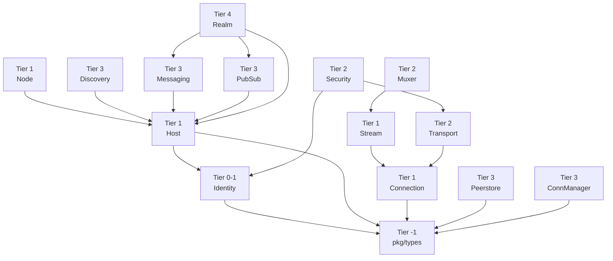

# pkg_interfaces 分层结构

> **版本**: v1.1.0  
> **更新日期**: 2026-01-13

---

## Tier 分层详解

### Tier -1: 零依赖类型层

**包**：`pkg/types`

**说明**：纯数据类型，无任何依赖

| 类型 | 说明 |
|------|------|
| PeerID | 节点唯一标识 |
| RealmID | Realm 唯一标识 |
| Multiaddr | 多地址类型 |
| KeyType | 密钥类型枚举 |
| Direction | 连接方向 |
| ... | 其他基础类型 |

**特点**：
- ✅ 零外部依赖
- ✅ 可被所有层使用
- ✅ 只包含数据定义，无行为

---

### Tier 0-1: 基础接口层

**接口**：
- `Identity` - 节点身份
- `PublicKey` - 公钥
- `PrivateKey` - 私钥

**依赖**：
```
identity → pkg/types
```

**说明**：密码学身份是所有安全功能的基础

---

### Tier 1: 核心接口层

**接口**：
- `Node` - 顶层 API 入口
- `Host` - P2P 主机核心
- `Stream` - 双向流
- `Connection` - 连接抽象

**依赖**：
```
host → identity, types
node → host, types
```

**说明**：核心抽象，提供最基本的 P2P 通信能力

---

### Tier 2: 传输层

**接口**：
- `Transport` - 传输协议抽象
- `Listener` - 监听器
- `Security` - 安全握手
- `Muxer` - 流多路复用

**依赖**：
```
transport → connection, types
security → identity, transport
muxer → stream, types
```

**说明**：抽象不同的传输协议（QUIC, TCP, WebSocket）

---

### Tier 3: 网络服务层

**接口**：
- `Discovery` - 节点发现
- `DHT` - 分布式哈希表
- `Messaging` - 消息服务
- `PubSub` - 发布订阅
- `Peerstore` - 节点存储
- `ConnManager` - 连接管理
- `Swarm` - 连接池
- `Protocol` - 协议路由
- `Liveness` - 存活检测
- `Metrics` - 监控指标
- ... 其他服务

**依赖**：
```
discovery → host, types
messaging → host, types
pubsub → host, types
peerstore → types
connmgr → types
...
```

**说明**：提供各种网络服务功能

---

### Tier 4: 领域层

**接口**：
- `Realm` - Realm 隔离域
- `RealmManager` - Realm 管理器

**依赖**：
```
realm → host, messaging, pubsub, discovery, types
```

**说明**：DeP2P 特有的业务隔离机制

---

## 依赖关系图



---

## 接口分组

### 核心接口组

**入口接口**：
- Node - 用户入口
- Host - 主机核心

**通信接口**：
- Stream - 流通信
- Connection - 连接抽象

### 传输接口组

**传输协议**：
- Transport - QUIC/TCP/WebSocket 抽象
- Listener - 监听器

**安全与复用**：
- Security - TLS/Noise 安全握手
- Muxer - yamux/mplex 流复用

### 服务接口组

**发现服务**：
- Discovery - 节点发现协调器
- DHT - Kademlia 分布式哈希表

**消息服务**：
- Messaging - 请求/响应模式
- PubSub - 发布订阅模式
- Topic - 主题管理

**基础设施**：
- Peerstore - 节点信息存储
- ConnManager - 连接生命周期管理
- Swarm - 连接池管理
- Protocol - 协议路由

**辅助服务**：
- Liveness - 存活检测
- Metrics - 监控指标
- Streams - 流管理
- Resource - 资源限制
- EventBus - 事件总线

### Realm 接口组

**Realm 管理**：
- Realm - 隔离域对象
- RealmManager - Realm 生命周期

---

## 循环依赖检测

### 检测方法

```bash
# 检查依赖树
go list -deps ./pkg/interfaces/... | sort | uniq

# 检查是否有循环
go mod graph | grep interfaces
```

### 预防措施

1. **严格分层**：下层不能导入上层
2. **接口分离**：相互依赖的接口放在同一文件
3. **类型前置**：共享类型放在 pkg/types

---

## 相关文档

- [overview.md](overview.md) - 设计概述
- [../requirements/requirements.md](../requirements/requirements.md) - 需求说明

---

**最后更新**：2026-01-13
