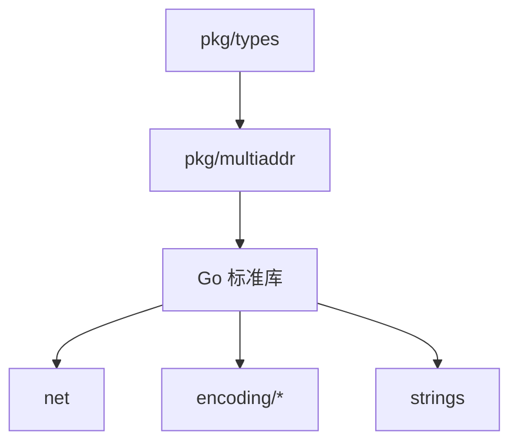

# Pkg Multiaddr 模块

> **版本**: v1.1.0  
> **更新日期**: 2026-01-13  
> **定位**: 多地址工具包

---

## 模块概述

pkg_multiaddr 提供 DeP2P 的多地址（Multiaddr）实现，支持自描述的网络地址格式。

| 属性 | 值 |
|------|-----|
| **架构层** | Level 0（基础工具包） |
| **代码位置** | `pkg/multiaddr/` |
| **Fx 模块** | 无（工具包，直接调用） |
| **状态** | ✅ 已实现（覆盖率 82.2%） |
| **依赖** | 无（仅标准库） |

---

## 核心职责

```
┌─────────────────────────────────────────────────────────────────────────────┐
│                        pkg_multiaddr 职责                                    │
├─────────────────────────────────────────────────────────────────────────────┤
│                                                                             │
│  1. 协议定义                                                                │
│     • 标准协议代码（与 multiformats 对齐）                                   │
│     • 协议注册表                                                            │
│     • 协议查找                                                              │
│                                                                             │
│  2. 地址编解码                                                              │
│     • 字符串 <-> 二进制转换                                                  │
│     • Varint 编解码                                                         │
│     • 协议特定的 Transcoder                                                 │
│                                                                             │
│  3. 地址操作                                                                │
│     • 封装/解封装                                                           │
│     • 协议值提取                                                            │
│     • P2P 组件处理                                                          │
│                                                                             │
│  4. 网络转换                                                                │
│     • net.TCPAddr <-> Multiaddr                                            │
│     • net.UDPAddr <-> Multiaddr                                            │
│     • 地址过滤和去重                                                        │
│                                                                             │
└─────────────────────────────────────────────────────────────────────────────┘
```

---

## 地址格式

### 字符串格式

```
格式：/protocol/value/protocol/value/...

示例：
  /ip4/127.0.0.1/tcp/4001
  /ip6/::1/tcp/8080
  /ip4/192.168.1.1/udp/4001/quic-v1
  /ip4/1.2.3.4/tcp/4001/p2p/QmYyQSo1c1Ym7orWxLYvCrM2EmxFTANf8wXmmE7DWjhx5N
  /dns/example.com/tcp/443/wss
```

### 二进制格式

```
┌──────────────────────────────────────────────────────┐
│  Protocol 1:                                          │
│    Varint: 协议代码                                   │
│    Varint: 数据长度（仅变长协议）                      │
│    Bytes:  协议数据                                   │
│  Protocol 2:                                          │
│    ...                                                │
└──────────────────────────────────────────────────────┘
```

---

## 核心接口

```go
type Multiaddr interface {
    Bytes() []byte
    String() string
    Equal(Multiaddr) bool
    Protocols() []Protocol
    Encapsulate(Multiaddr) Multiaddr
    Decapsulate(Multiaddr) Multiaddr
    ValueForProtocol(code int) (string, error)
    ToTCPAddr() (*net.TCPAddr, error)
    ToUDPAddr() (*net.UDPAddr, error)
}

type Protocol struct {
    Name       string
    Code       int
    VCode      []byte
    Size       int
    Path       bool
    Transcoder Transcoder
}
```

---

## 使用示例

### 基础操作

```go
// 创建
ma, _ := multiaddr.NewMultiaddr("/ip4/127.0.0.1/tcp/4001")

// 字符串/字节转换
str := ma.String()
bytes := ma.Bytes()

// 相等比较
ma2, _ := multiaddr.NewMultiaddr("/ip4/127.0.0.1/tcp/4001")
equal := ma.Equal(ma2) // true
```

### 地址组合

```go
// 封装
base, _ := multiaddr.NewMultiaddr("/ip4/127.0.0.1/tcp/4001")
p2p, _ := multiaddr.NewMultiaddr("/p2p/QmYyQ...")
full := base.Encapsulate(p2p)

// 解封装
transport := full.Decapsulate(p2p)
```

### 协议操作

```go
// 获取协议值
ip, _ := ma.ValueForProtocol(multiaddr.P_IP4)
port, _ := ma.ValueForProtocol(multiaddr.P_TCP)

// 检查协议
hasTCP := multiaddr.HasProtocol(ma, multiaddr.P_TCP)
```

### 网络转换

```go
// 多地址 -> TCP 地址
tcpAddr, _ := ma.ToTCPAddr()

// TCP 地址 -> 多地址
ma, _ := multiaddr.FromTCPAddr(tcpAddr)
```

---

## 文件结构

```
pkg/multiaddr/
├── [核心]
│   ├── multiaddr.go    - 接口和实现
│   ├── errors.go       - 错误定义
│   └── doc.go          - 包文档
│
├── [协议]
│   ├── protocols.go    - 协议定义
│   └── transcoder.go   - 编解码器
│
├── [编解码]
│   ├── codec.go        - 字符串/二进制转换
│   └── varint.go       - Varint 编解码
│
├── [工具]
│   ├── convert.go      - 网络地址转换
│   └── util.go         - 工具函数
│
└── [测试]
    └── *_test.go       - 单元测试（82.2% 覆盖率）
```

---

## 协议对齐

### 与 multiformats/multicodec 对齐

| 协议 | DeP2P 代码 | multiformats 代码 | 状态 |
|------|-----------|------------------|------|
| ip4 | 0x0004 | 0x0004 | ✅ |
| ip6 | 0x0029 | 0x0029 | ✅ |
| tcp | 0x0006 | 0x0006 | ✅ |
| udp | 0x0111 | 0x0111 | ✅ |
| quic-v1 | 0x01CD | 0x01CD | ✅ |
| p2p | 0x01A5 | 0x01A5 | ✅ |
| ws | 0x01DD | 0x01DD | ✅ |
| wss | 0x01DE | 0x01DE | ✅ |
| dns | 0x0035 | 0x0035 | ✅ |

**完全对齐，无差异** ✅

---

## 测试覆盖率

```
coverage: 82.2% of statements
```

| 组件 | 覆盖率 | 状态 |
|------|--------|------|
| multiaddr.go | ✅ | 高覆盖 |
| protocols.go | ✅ | 高覆盖 |
| codec.go | ✅ | 高覆盖 |
| transcoder.go | ✅ | 高覆盖 |
| varint.go | ✅ | 高覆盖 |
| convert.go | ✅ | 高覆盖 |
| util.go | ✅ | 高覆盖 |

---

## 依赖关系



**外部依赖**：无（仅标准库）

---

## 实施状态

| 步骤 | 状态 | 说明 |
|------|------|------|
| Step 1: 设计审查 | ✅ | 已审查 multiformats 规范 |
| Step 2: 接口定义 | N/A | 工具包无需接口 |
| Step 3: 测试先行 | ✅ | 测试骨架完成 |
| Step 4: 核心实现 | ✅ | 所有组件已实现 |
| Step 5: 测试通过 | ✅ | 覆盖率 82.2% |
| Step 6: 集成验证 | ✅ | 与 pkg/types 集成通过 |
| Step 7: 设计复盘 | ✅ | 协议代码对齐验证 |
| Step 8: 文档更新 | ✅ | README 和 L6_domains 完成 |

---

## 相关文档

| 文档 | 说明 |
|------|------|
| [requirements/requirements.md](requirements/requirements.md) | 需求说明 |
| [design/overview.md](design/overview.md) | 设计概述 |
| [design/internals.md](design/internals.md) | 内部实现 |
| [coding/guidelines.md](coding/guidelines.md) | 编码指南 |
| [testing/strategy.md](testing/strategy.md) | 测试策略 |
| [pkg/multiaddr/README.md](../../../../pkg/multiaddr/README.md) | 代码包说明 |

---

**最后更新**：2026-01-13
