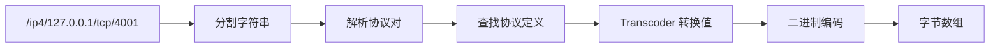

# pkg_multiaddr 设计概述

> **版本**: v1.1.0  
> **更新日期**: 2026-01-13

---

## 设计目标

pkg_multiaddr 的设计目标是提供一个**标准兼容、高性能、易用**的多地址工具包。

### 核心原则

1. **标准对齐**：与 multiformats/multicodec 完全对齐
2. **二进制兼容**：与 go-multiaddr 二进制格式兼容
3. **接口清晰**：统一的 Multiaddr 接口
4. **直接调用**：工具包模式，无需依赖注入

---

## 架构设计

### 整体架构

```
┌─────────────────────────────────────────────────────────────────────────────┐
│                        pkg_multiaddr 架构                                    │
├─────────────────────────────────────────────────────────────────────────────┤
│                                                                             │
│  ┌────────────────────────────────────────────────────────────────────┐     │
│  │                        用户接口层                                   │     │
│  │  NewMultiaddr / FromTCPAddr / Split / Join                        │     │
│  └────────────────────────────────────────────────────────────────────┘     │
│                                    │                                        │
│                                    ↓                                        │
│  ┌────────────────────────────────────────────────────────────────────┐     │
│  │                        核心类型层                                   │     │
│  │  Multiaddr 接口 / Protocol 结构                                    │     │
│  └────────────────────────────────────────────────────────────────────┘     │
│                                    │                                        │
│           ┌────────────────────────┼────────────────────────┐               │
│           ↓                        ↓                        ↓               │
│  ┌──────────────┐        ┌──────────────┐        ┌──────────────┐          │
│  │  协议层       │        │  编解码层     │        │  工具层       │          │
│  │  protocols   │        │ codec/varint │        │  util/convert│          │
│  └──────────────┘        └──────────────┘        └──────────────┘          │
│           │                        │                        │               │
│           └────────────────────────┴────────────────────────┘               │
│                                    │                                        │
│                                    ↓                                        │
│  ┌────────────────────────────────────────────────────────────────────┐     │
│  │                        Transcoder 层                                │     │
│  │  IP4/IP6/Port/DNS/P2P/Onion/Garlic Transcoders                    │     │
│  └────────────────────────────────────────────────────────────────────┘     │
│                                                                             │
└─────────────────────────────────────────────────────────────────────────────┘
```

---

## 核心接口设计

### Multiaddr 接口

```go
type Multiaddr interface {
    // 基础方法
    Bytes() []byte
    String() string
    Equal(Multiaddr) bool
    
    // 协议方法
    Protocols() []Protocol
    ValueForProtocol(code int) (string, error)
    
    // 操作方法
    Encapsulate(Multiaddr) Multiaddr
    Decapsulate(Multiaddr) Multiaddr
    
    // 转换方法
    ToTCPAddr() (*net.TCPAddr, error)
    ToUDPAddr() (*net.UDPAddr, error)
}
```

**设计说明**：
- 接口最小化，只包含核心方法
- Bytes() 返回共享字节，避免拷贝
- Equal() 使用字节比较，高效
- 转换方法直接集成，避免类型断言

---

## 模块划分

### 协议层（protocols.go）

**职责**：
- 定义所有协议常量
- 维护协议注册表
- 提供协议查找功能

```go
// 协议定义
const (
    P_IP4 = 0x0004
    P_TCP = 0x0006
    // ...
)

// 协议查找
func ProtocolWithCode(code int) Protocol
func ProtocolWithName(name string) Protocol
```

**协议注册表**：
- 双索引：按代码和按名称
- 预计算 VCode（varint 编码）
- 关联 Transcoder

---

### 编解码层（codec.go + varint.go）

**codec.go 职责**：
- 字符串 -> 二进制
- 二进制 -> 字符串
- 格式验证

**varint.go 职责**：
- Varint 编码/解码
- 协议代码转换
- 长度前缀处理

**编码算法**：

```
String -> Bytes:
  1. 分割字符串为 /proto/value 对
  2. 查找协议定义
  3. 写入协议代码（varint）
  4. 使用 Transcoder 转换值
  5. 写入长度前缀（变长协议）
  6. 写入值字节

Bytes -> String:
  1. 读取协议代码（varint）
  2. 查找协议定义
  3. 读取长度前缀（变长协议）
  4. 读取值字节
  5. 使用 Transcoder 转换为字符串
  6. 组装字符串
```

---

### Transcoder 层（transcoder.go）

**职责**：为每个协议提供专用的编解码器

| Transcoder | 协议 | 功能 |
|-----------|------|------|
| TranscoderIP4 | IP4 | net.IP 解析 |
| TranscoderIP6 | IP6 | net.IP 解析 |
| TranscoderPort | TCP/UDP/SCTP | 端口号解析 |
| TranscoderDNS | DNS/* | 域名验证 |
| TranscoderP2P | P2P | PeerID 处理 |
| TranscoderOnion | Onion | Base32 + 端口 |
| TranscoderGarlic | Garlic | Base32 I2P 地址 |

**Transcoder 接口**：

```go
type Transcoder interface {
    StringToBytes(string) ([]byte, error)
    BytesToString([]byte) (string, error)
    ValidateBytes([]byte) error
}
```

---

### 工具层（util.go + convert.go）

**util.go**：
- Split/Join：P2P 地址处理
- FilterAddrs：地址过滤
- UniqueAddrs：去重
- Has*Multiaddr：协议检查便捷函数

**convert.go**：
- FromTCPAddr/FromUDPAddr
- ToTCPAddr/ToUDPAddr
- FromNetAddr

---

## 数据流

### 字符串解析流程



### 二进制解析流程


---

## 关键设计决策

### 1. 接口 vs 具体类型

**决策**：使用接口 + 私有实现

**理由**：
- ✅ 灵活性：未来可替换实现
- ✅ 测试友好：易于 mock
- ✅ 类型安全：不能直接操作内部字节

### 2. 二进制存储

**决策**：内部存储二进制格式

**理由**：
- ✅ 紧凑：比字符串小
- ✅ 高效：Bytes() 无需转换
- ✅ 兼容：与 go-multiaddr 一致

### 3. 协议注册表

**决策**：双索引注册表（代码 + 名称）

**理由**：
- ✅ 快速查找：O(1) 时间
- ✅ 双向查询：支持两种查找方式
- ✅ 预计算：VCode 预先编码

### 4. Transcoder 模式

**决策**：每个协议独立 Transcoder

**理由**：
- ✅ 职责单一：每个 transcoder 只处理一种协议
- ✅ 可扩展：新协议只需添加 transcoder
- ✅ 可测试：独立测试每个 transcoder

---

## 性能优化

### 1. VCode 预计算

```go
protoIP4 = Protocol{
    Code:  P_IP4,
    VCode: codeToVarint(P_IP4), // 预计算
    // ...
}
```

**效果**：避免每次编码时重复计算 varint

### 2. 字节共享

```go
func (m *multiaddr) Bytes() []byte {
    return m.bytes // 直接返回，不拷贝
}
```

**效果**：Bytes() 操作几乎零开销（~2.5ns）

### 3. 协议查找优化

```go
var protocols = map[int]Protocol{...}      // O(1) 按代码
var protocolsByName = map[string]Protocol{...}  // O(1) 按名称
```

**效果**：协议查找 ~12-19ns

---

## 错误处理

### 错误分类

```go
// 通用错误
var (
    ErrInvalidMultiaddr = errors.New("invalid multiaddr")
    ErrInvalidProtocol  = errors.New("invalid protocol")
    ErrUnmarshalFailed  = errors.New("failed to unmarshal multiaddr")
)

// Varint 错误
var (
    ErrVarintOverflow = errors.New("varint: value overflows")
    ErrVarintTooShort = errors.New("varint: buffer too short")
)
```

**原则**：
- 使用预定义错误常量
- 提供清晰的错误消息
- 避免泄露内部细节

---

## 相关文档

- [internals.md](internals.md) - 内部实现细节
- [requirements/requirements.md](../requirements/requirements.md) - 需求说明
- [coding/guidelines.md](../coding/guidelines.md) - 编码指南

---

**最后更新**：2026-01-13
