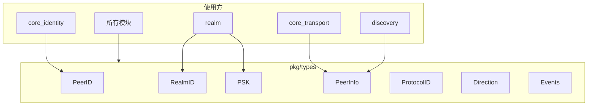

# pkg_types 整体设计

> 模块架构与类型设计

---

## 模块架构



---

## 核心类型

### PeerID

节点唯一标识（Base58 编码字符串）。

```go
type PeerID string

func (id PeerID) String() string
func (id PeerID) ShortString() string      // 前 8 字符 + "..."
func (id PeerID) Bytes() []byte
func (id PeerID) IsEmpty() bool
func (id PeerID) Validate() error
func (id PeerID) Equal(other PeerID) bool

func ParsePeerID(s string) (PeerID, error)
func PeerIDFromBytes(b []byte) (PeerID, error)
func PeerIDFromPublicKey(pubKey []byte) (PeerID, error)
```

### RealmID

Realm 唯一标识（从 PSK 派生）。

```go
type RealmID string

func (r RealmID) String() string
func (r RealmID) IsEmpty() bool
func (r RealmID) Bytes() []byte

func RealmIDFromPSK(psk PSK) RealmID
```

### PSK

预共享密钥（32 字节）。

```go
type PSK []byte

const PSKLength = 32

func (p PSK) IsEmpty() bool
func (p PSK) Len() int
func (p PSK) Equal(other PSK) bool    // 常量时间比较
func (p PSK) DeriveRealmID() RealmID
// 不实现 String()，避免意外打印

func GeneratePSK() PSK
func PSKFromBytes(b []byte) (PSK, error)
func PSKFromHex(s string) (PSK, error)
```

### RealmKey

Realm 密钥（PSK 的固定数组版本）。

```go
type RealmKey [32]byte

func (k RealmKey) IsEmpty() bool
func (k RealmKey) Bytes() []byte
func (k RealmKey) ToPSK() PSK

func GenerateRealmKey() RealmKey
func RealmKeyFromBytes(b []byte) (RealmKey, error)
func DeriveRealmKeyFromName(name string) RealmKey  // 仅用于测试
```

### ProtocolID

协议标识符。

```go
type ProtocolID string

func (p ProtocolID) String() string
func (p ProtocolID) IsEmpty() bool
func (p ProtocolID) Version() string
func (p ProtocolID) Name() string
func (p ProtocolID) IsSystem() bool     // /dep2p/sys/*
func (p ProtocolID) IsRealm() bool      // /dep2p/realm/*
func (p ProtocolID) IsApp() bool        // /dep2p/app/*
func (p ProtocolID) RealmID() string

func BuildRealmProtocolID(realmID, protocol, version string) ProtocolID
func BuildAppProtocolID(realmID, protocol, version string) ProtocolID
```

### PeerInfo / AddrInfo

节点信息。

```go
type PeerInfo struct {
    ID           PeerID
    Addrs        []Multiaddr
    Source       DiscoverySource
    DiscoveredAt time.Time
}

type AddrInfo struct {
    ID    PeerID
    Addrs []Multiaddr
}

func NewPeerInfo(id PeerID, addrs []Multiaddr) PeerInfo
func NewAddrInfo(id PeerID, addrs []Multiaddr) AddrInfo
```

---

## 枚举类型

```go
// 方向
type Direction int
const (
    DirUnknown Direction = iota
    DirInbound
    DirOutbound
)

// 连接状态
type Connectedness int
const (
    NotConnected Connectedness = iota
    Connected
    CanConnect
    CannotConnect
)

// 可达性
type Reachability int
const (
    ReachabilityUnknown Reachability = iota
    ReachabilityPublic
    ReachabilityPrivate
)

// NAT 类型
type NATType int
const (
    NATTypeUnknown NATType = iota
    NATTypeNone
    NATTypeFullCone
    NATTypeRestrictedCone
    NATTypePortRestricted
    NATTypeSymmetric
)

// 密钥类型
type KeyType int
const (
    KeyTypeUnknown KeyType = iota
    KeyTypeEd25519
    KeyTypeECDSA
    KeyTypeRSA
    KeyTypeSecp256k1
)

// 优先级
type Priority int
const (
    PriorityLow Priority = iota
    PriorityNormal
    PriorityHigh
    PriorityCritical
)
```

---

## 类型设计原则

```
┌─────────────────────────────────────────────────────────────────────────────┐
│                          类型设计原则                                        │
├─────────────────────────────────────────────────────────────────────────────┤
│                                                                             │
│  1. 不可变性                                                                │
│     • 类型创建后尽量不可修改                                                │
│     • 使用值类型而非指针                                                    │
│                                                                             │
│  2. 可比较性                                                                │
│     • 实现 Equal 方法                                                       │
│     • 支持作为 map key                                                      │
│                                                                             │
│  3. 可序列化                                                                │
│     • 实现 TextMarshaler/Unmarshaler                                       │
│     • 支持 JSON 序列化                                                      │
│                                                                             │
│  4. 安全性                                                                  │
│     • 敏感类型（PSK）不实现 String                                          │
│     • 避免意外泄露                                                          │
│     • PSK 使用常量时间比较                                                  │
│                                                                             │
│  5. 零依赖                                                                  │
│     • 仅依赖 Go 标准库                                                      │
│     • 不依赖任何其他 dep2p 内部包                                           │
│                                                                             │
└─────────────────────────────────────────────────────────────────────────────┘
```

---

## 文件组织

```
pkg/types/
├── doc.go              # 包文档
├── README.md           # 模块说明
│
├── ══════ 基础类型 ══════
├── ids.go              # PeerID, RealmID, PSK, RealmKey, StreamID
├── enums.go            # KeyType, Direction, NATType, Connectedness...
├── protocol.go         # ProtocolID, 协议常量
├── base58.go           # Base58 编解码
├── multiaddr.go        # Multiaddr 多地址
├── errors.go           # 公共错误
│
├── ══════ 网络类型 ══════
├── connection.go       # ConnInfo, ConnStat, ConnScope
├── stream.go           # StreamInfo, StreamStat, StreamScope
├── discovery.go        # PeerInfo, AddrInfo
│
├── ══════ 业务类型 ══════
├── realm.go            # RealmInfo, RealmConfig, RealmMember
│
├── ══════ 事件类型 ══════
├── events.go           # 所有事件类型
│
└── ══════ 测试文件 ══════
    ├── *_test.go       # 各类型测试
```

---

## 依赖关系


pkg_types 是最底层的模块，不依赖任何其他 dep2p 内部包。

---

**最后更新**：2026-01-13
