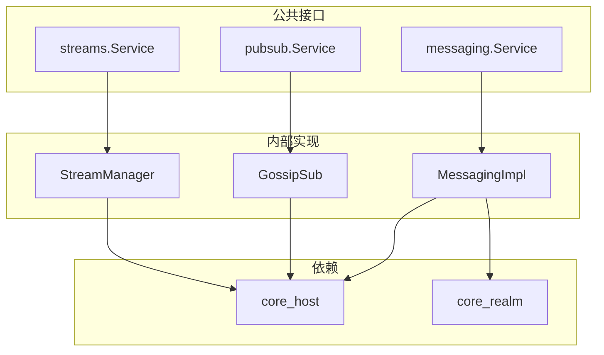

# core_messaging 整体设计

> 模块架构与组件设计

---

## 模块架构



---

## 核心组件

### Messaging 接口

```
type Service interface {
    // Send 发送单向消息
    Send(ctx context.Context, peer types.NodeID, proto string, data []byte) error
    
    // Request 发送请求等待响应
    Request(ctx context.Context, peer types.NodeID, proto string, data []byte) ([]byte, error)
    
    // OnMessage 注册单向消息处理器
    OnMessage(proto string, handler MessageHandler)
    
    // OnRequest 注册请求处理器
    OnRequest(proto string, handler RequestHandler)
}
```

### PubSub 接口

```
type Service interface {
    // Join 加入主题
    Join(topic string) (Topic, error)
    
    // Publish 发布消息（快捷方法）
    Publish(ctx context.Context, topic string, data []byte) error
    
    // Subscribe 订阅主题（快捷方法）
    Subscribe(topic string) (Subscription, error)
}

type Topic interface {
    Name() string
    Publish(ctx context.Context, data []byte) error
    Subscribe() (Subscription, error)
    Close() error
}

type Subscription interface {
    Next(ctx context.Context) (*Message, error)
    Cancel()
}
```

### Streams 接口

```
type Service interface {
    // Open 打开到目标节点的流
    Open(ctx context.Context, peer types.NodeID, proto string) (Stream, error)
    
    // SetHandler 设置协议处理器
    SetHandler(proto string, handler StreamHandler)
}
```

---

## GossipSub 配置

```
var gossipSubParams = pubsub.GossipSubParams{
    D:                         6,
    Dlo:                       4,
    Dhi:                       12,
    HeartbeatInterval:         1 * time.Second,
    HistoryLength:             5,
    HistoryGossip:             3,
}
```

---

## Fx 模块定义

```
var Module = fx.Module("messaging",
    fx.Provide(
        NewMessagingService,
        NewPubSubService,
        NewStreamsService,
    ),
)
```

---

**最后更新**：2026-01-11
